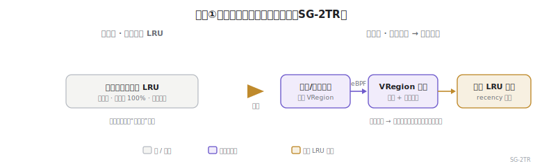
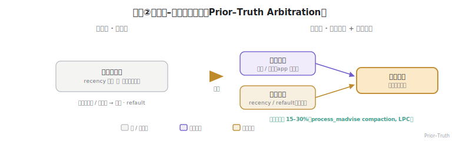
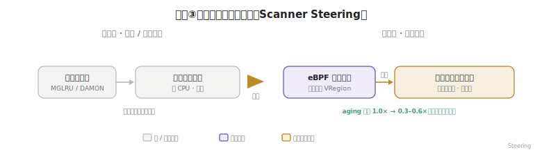
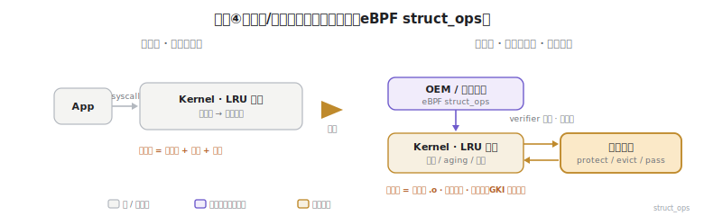

# A16b 附录 · 创新点与架构总结（汇报 / 专利 / 论文用）

> **一句话定位**：本篇是 [A16b · eBPF 可编程回收策略](A16b-eBPF可编程回收策略-Android.md) 的**结构化提炼**——把"核心问题与技术挑战"和"创新方向"凝练成可直接用于**汇报 / 专利 / 论文**的条目，每个方向配 before/after 架构示意图、优势数据与特征清单。
>
> 🧭 **正文出处**：论证与来源见 A16b 各小节（§3.1 struct_ops / §3.2 Android 加载模型 / §3.3 上游研究 / **§3.4 两级冷热**）。本篇不重复论证，只做条目化收口。
> ⚠️ **数据纪律**：下列指标**除显式标注【实测】外，一律为【设想 / 示意 KPI，待实测】**——它们标定的是"应当测量的指标"，数值给的是合理假设区间，不构成现状声明。
> 🌡️ **成熟度**：创新方向①–③为**设计 / 研究级设想**（语义×LRU 的 eBPF 融合公开未见实现）；承载底座④（eBPF-for-mm 系列）在上游为 **RFC、无一进主线**，`sched_ext` 是唯一已落地近邻；在 Android 上即便落地也只会是 **OEM/Google 随 GKI 下发的杠杆**，非第三方/App 可注入。

---

## 1. 核心问题与技术挑战

**核心问题（一句话）**：在 Agent 叠加负载下，内核基于"访问近因"的一刀切 LRU **既看不见应用语义、又无法低成本且可部署地替换**，导致冷热判决失准、回收伤及前台体验。

| # | 挑战（凝练） | 属性 | 一句话描述 |
|---|---|---|---|
| C1 | **语义缺失** | 准确性 | 内核 LRU 仅凭 recency 近似冷热，看不见应用/框架语义，对"已知为冷 / 必须保护"的页判断不准。 |
| C2 | **热路径开销** | 可负担性 | 在全地址空间**逐页**运行可编程判决，mm 热路径开销可能吃掉回收收益。 |
| C3 | **策略硬编码** | 可演化性 | 回收策略写死在内核，换策略需改内核 / 重编 / 重启，无法按机型、场景快速迭代下发。 |
| C4 | **语义–物理鸿沟** | 可映射性 | 应用"模块"语义活在对象/分配器空间，内核回收活在物理页/VMA，无稳定映射则语义碎在页间。 |
| C5 | **负载叠加** | 适应性 | Agent 任务叠加在传统前后台负载之上，"前台热/后台冷"启发式失效，冷热更快、更结构化。 |

---

## 2. 创新方向（4 个架构）

### 方向一 · 语义引导的两级回收架构（Semantic-Guided Two-Tier Reclaim, **SG-2TR**）— 主创新

> **架构变化**：扁平的"全地址空间逐页 LRU" → "应用/框架语义在 **VRegion** 粗排并剪枝候选 → 内核页面级 LRU 在候选内精排"。直击 **C1 + C2**。

**优势数据（示意）**

| 指标 | 基线（纯页面 LRU） | 改造后（SG-2TR） | 备注 |
|---|---|---|---|
| 每轮判决触达页数（扫描覆盖） | 100% | 10–30% | 设想：剪枝率 70–90% |
| 单位回收 CPU 成本 | 1.0× | 0.4–0.6× | 设想 |
| 冤杀热页（误回收）率 | 基线 | −30~50% | 设想 |
| 后台 app 切回延迟 | 基线 | −10~25% | 设想 |

**架构特征 → 优势**
- 语义粗排先剪枝 → **逐页可编程判决变得可负担**（C2）
- 语义作先验、recency 作精排 → **引入应用知识而不丢内核真值**（C1）
- 复用内核 LRU 做精排 → **不重写 mm 机制，增量可落地**

### 方向二 · 先验–真值双层校正（Prior–Truth Arbitration）

> **架构变化**：单信号判决（仅 recency，或纯语义立即回收、无纠偏）→ "语义先验定偏置 + 页面 recency/refault 定真值 → 合成判决"。直击 **C1**，并防止语义误判引发 refault 颠簸。

**优势数据**

| 指标 | 基线 | 改造后 | 备注 |
|---|---|---|---|
| refault 率（vs 纯语义立即回收） | 纯语义基线 | −40~60% | 设想：真值纠偏 |
| 少杀进程 | lmkd 撞顶基线 | **少杀 15–30%** | **【实测】** process_madvise compaction（LPC） |
| 语义保护命中率 | — | 目标 >90% | 设想 |

**架构特征 → 优势**
- 语义只作偏置、不作终判 → **杜绝语义误判引发的 refault 颠簸**
- 两层可独立演化 → 语义层换标注、内核层换 LRU 互不破坏
- 退化安全：语义缺位时**自动回退纯页面 LRU**

### 方向三 · 语义定向主动扫描（Scanner Steering）

> **架构变化**：主动扫描器扫"全地址空间 / 按频率分区" → "eBPF 语义策略指定候选 VRegion，扫描器只走语义热点"。把扫描能耗收敛到热点，呼应 [A16a](A16a-LRU主动扫描.md) 的能耗约束。

**优势数据（示意）**

| 指标 | 基线（全局/频率扫描） | 改造后（语义定向） | 备注 |
|---|---|---|---|
| aging / 采样 CPU·能耗 | 1.0× | 0.3–0.6× | 设想：只扫热点区 |
| 同等能耗下冷热视图命中 | 基线 | 更高 | 设想 |
| 续航影响（扫描占比） | 基线 | 显著下降 | 设想 |

**架构特征 → 优势**
- 策略不仅判"回收谁"还定"扫哪片" → **把扫描能耗收敛到语义热点**（终端续航刚需）
- 与方向一同源（共享 VRegion） → **一套语义，既定扫描又定回收**

### 方向四 · 机制/策略解耦的可编程回收（eBPF `struct_ops`）— 承载底座

> **架构变化**：策略硬编码在内核（改策略 = 改内核 + 重编 + 重启）→ 内核保留 LRU 机制，策略经 eBPF `struct_ops` 由 verifier 校验后加载、热下发、不重启。直击 **C3**。

**优势数据（示意）**

| 指标 | 基线（硬编码） | 改造后（可编程） | 备注 |
|---|---|---|---|
| 策略迭代周期 | 周~版本级（改内核+重启） | 分钟级（热下发） | 机制质变 |
| 内核基线分叉 | 每策略一分支 | 0（GKI 不变） | 设想 |
| 单机型可用策略数 | 1（内核默认） | N（按场景热切） | 设想 |

**架构特征 → 优势**
- verifier 安全沙箱 → **内核敢接受不可信自定义逻辑而不崩**（vs 内核模块）
- 不改基线、不重启、可热插拔 → **在 GKI 之上按机型差异化下发**（C3）
- 已有先例 `sched_ext`（调度，6.12 入主线） → **路径已验证，延伸到 mm**

---

## 3. 诚实声明（建议随条目一并保留）

- **成熟度**：方向①–③为**设计/研究级设想**；承载底座④（eBPF-for-mm 系列）在上游仍是 **RFC、无一进主线**，`sched_ext` 是唯一已落地的近邻先例；在 **Android** 上 eBPF 现仅用于网络/tracing/GPU，**未用于内存回收**，已落地的冷热进步是 **MGLRU（更好的*固定*策略，不可编程）**。
- **数据**：仅"**少杀 15–30%**"为实测（process_madvise application compaction，LPC）；其余均为**设想/示意 KPI**，标定的是"该测哪些指标"，数值待实测填实。
- **关键开放问题（C4）**：语义→VMA→页 的**稳定映射**需分配器配合（arena-per-module / 区间打标）；多方语义标注并存时的**冲突仲裁**尚无框架。详见 [A16b §3.4 / §6](A16b-eBPF可编程回收策略-Android.md)。

## 4. 来源与承接

- 论证与一手来源：**[A16b · eBPF 可编程回收策略](A16b-eBPF可编程回收策略-Android.md)**（§3 机制本体、§9 来源）
- 关键实测锚点：[Android application compaction（LPC）](https://lpc.events/event/4/contributions/404/attachments/326/550/Handling_memory_pressure_on_Android.pdf)、[MADV_COLD/PAGEOUT（LWN 790123）](https://lwn.net/Articles/790123/)
- 已落地先例：[sched_ext 入 Linux 6.12（Phoronix）](https://www.phoronix.com/news/Linux-6.12-Lands-sched-ext)
- 相邻篇：[A16a 主动扫描](A16a-LRU主动扫描.md)、[A05 冷热识别的演进](../foundations/A05-冷热识别的演进.md)、[A16d 压缩 IP 边际建模](A16d-压缩IP边际建模.md)

> **图例**：灰 = 旧/被动；紫 = 应用语义层；橙 = 内核 LRU 机制。4 张 SVG 位于 `foundations/assets/a16b-arch{1-4}-*.svg`，PPT 安全（无 CSS 变量 / marker，可直接插入幻灯片）。
