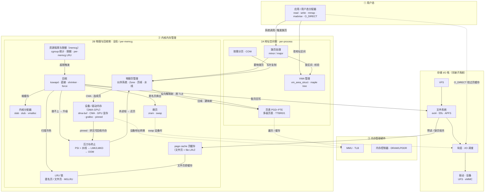

# 内存系统总览

> 本文是整个知识库的**地基文档**：梳理终端设备"内存系统"必须包含的组件、它们的层级，以及**子项之间的配合关系**。
> 这套骨架是 Android / HarmonyOS / iOS **共有**的，各平台调研即"往每一层的格子里填各家实现"，因此本文也是跨平台对照的**模板**（见 §6）。
>
> 范围界定：本仓是**内存方向**。**存储 I/O 栈**（文件系统 / 块层）的内部实现（日志、extent、GC、I/O 调度算法）属**范围外**；但它与内存系统的**交界接口**（page cache、回写、预读、文件 mmap 缺页、direct I/O、swap 后端）是内存话题，**纳入本文**。

## 1. 整体架构（含存储 I/O 交界）与配合关系

四层（① 用户态 / ② 内核内存管理 / ③ 内存管理硬件 / ④ 存储层级），其中 ② 再分 **2A 地址空间侧**（"该映射成什么"）与 **2B 物理与回收侧**（"先踢谁"）。**存储 I/O 栈**是并排的**邻接子系统**，与内存系统在 **page cache** 与 **swap** 两处交界。

下图同时表达**结构（分组）**与**配合关系（带标签的边）**。实线 = 正向数据 / 控制流；虚线 = 旁路或硬件遍历（`O_DIRECT` 绕过、页表↔MMU、swap 落盘）。


<details>
<summary>上图的 Mermaid 源码（可编辑；支持 Mermaid 的查看器会自动渲染）</summary>



</details>

> **2A↔2B 一句话**：VMA / 页表回答"这段虚拟地址*该不该*映射、映射成*什么*"；LRU / 回收回答"物理页紧张时*先踢谁*"。两侧通过**缺页**（按需建页表）与**回收**（拆页表、写回 / 换出）耦合。
> **内存↔存储 一句话**：`page cache` 脚踏两只船——*物理上是内存*（占页、挂 file LRU、靠回写被回收），*功能上是文件系统的缓存*；`direct I/O` 的定义就是*绕过*它。

## 2. 子项清单：职责与主要配合

### 第 1 层 · 用户态

| 子项 | 职责 | 主要配合 |
|---|---|---|
| 进程地址空间布局 | 代码段 / 数据段 / 堆(`brk`) / 映射区(mmap) / 栈 / 内核区 | 段增长 → 改 VMA(2A)；首次访问 → 缺页(2A) |
| 用户态分配器（scudo / jemalloc / libmalloc） | `malloc`/`free`：向内核要内存再切小块 | 要内存 → `brk`/`mmap`(2A)；释放 → `madvise(DONTNEED/FREE)` → 回收(2B) |
| 内存系统调用（mmap·brk·mprotect·**madvise**·mlock） | 用户态进入内核内存管理的入口 | 改 VMA(2A)；`madvise(PAGEOUT/COLD/FREE)` 直达回收(2B) |
| 内存度量（VSS / RSS / **PSS** / USS） | 占用观测（`/proc/<pid>/smaps` 等） | 读取自页表 + page 归属统计(2A/2B) |

### 第 2 层 · 内核内存管理 — 2A 地址空间侧（"该映射成什么"）

| 子项 | 职责 | 主要配合 |
|---|---|---|
| **页表 PGD~PTE** | 多级页表（ARM64：PGD→PUD→PMD→PTE；用户 `TTBR0_EL1`、内核 `TTBR1_EL1`）的分配 / 填充 / 拆除 | ← 物理页(2B) 回填建映射；← 回收(2B) 反向解除映射；↔ **MMU/TLB(3)** 遍历与缓存；← COW 复制。**跨层**：格式由硬件定义、MMU 遍历，管理在内核 |
| **VMA 管理** | `vm_area_struct`：区间范围 / 权限 / 后备文件（Linux 6.1+ **maple tree**） | ← 系统调用 改区间；→ 缺页 提供校验依据；`munmap` → 拆页表 + 可能回收。与页表区别：VMA 是"*应该*怎么映射"，页表是"*当前实际*的映射" |
| **缺页处理 page fault** | minor（页在内存，补映射） / major（需 I/O 读入） | ← CPU 异常；→ 查 VMA 校验；匿名页 → 伙伴系统(2B) 要零页；文件页 → page cache 命中 / 经 FS 读入；最后 → 建页表 |
| **按需分页 · COW** | 首次访问才分配物理页；`fork`/Zygote 后共享只读、写时复制 | → 缺页 → 物理页(2B) → 页表。是 2A↔2B 的核心纽带 |

### 第 2 层 · 内核内存管理 — 2B 物理与回收侧（"先踢谁"）

| 子项 | 职责 | 主要配合 |
|---|---|---|
| **物理页管理**（伙伴系统 / Zone / 页帧 / **水线** watermark） | 按页帧（常见 4KB；iOS/Apple 芯片 **16KB**）分配释放物理内存；min/low/high 水线触发回收 | → 供页给 缺页 / 内核分配器 / page cache / 设备内存；← 回收 / 杀进程 还页；**水线触及 → 唤醒 kswapd / 直接回收**（压力感知的另一来源） |
| **内核分配器**（slab / slub / vmalloc） | 内核对象级分配（`kmalloc`） | ← 底层向伙伴系统要页；← **shrinker** 回收 slab 缓存 |
| **设备 / 驱动内存**（DMA · GPU · 多媒体） | 终端上的"隐形大户"：GPU 显存 / 图形缓冲 `gralloc` / **dma-buf**(原 ION 堆) / **CMA** 物理连续内存 / 相机 · 视频编解码缓冲 | ← 物理页 / CMA 供页；↔ **IOMMU/SMMU · DMA**(3) 设备地址转换；← 驱动 / HAL 申请。**多为 pinned 不可换出、不走普通 LRU 回收**，常单独计量（dmabuf / GPU），占用挤压可回收内存 → 加剧压力与终止 |
| **LRU 链**（anon / file，**MGLRU**） | 给页排冷热：anon / file 各 active/inactive + unevictable | ← page cache(文件页) 与 匿名页 入链；→ 回收 据此选页。Android 已默认启用 MGLRU |
| **page cache 页缓存** | 文件数据在内存中的常驻形态（即"文件页"） | ↔ **FS** 预读 / 回写；↔ 用户态 buffered 读写；↔ 缺页 文件 mmap 共享；↔ LRU / 回收（干净页丢、脏页回写）。**内存↔存储的主交界** |
| **回收**（kswapd / 直接 / shrinker / **force**） | 紧张时腾页 | → 扫 LRU 选页；文件干净页丢、脏页 → **回写 FS**；匿名页 → **换出 swap/zram**；→ 反向解页表(2A) + 刷 TLB(3)；→ 调 shrinker 缩 slab。触发源：水位 / 分配失败 / PSI / **memcg 超限**。强制 / 主动：`memory.reclaim`、`/proc/<pid>/reclaim` |
| **换页**（zram / swap） | 匿名页换出后端：压缩进 zram（留内存）或换出 swap 设备（落存储栈） | ← 回收 换出；→ 换入时触发 major 缺页读回；↔ 块层(swap 设备时) |
| **资源隔离与限额**（memcg / cgroup） | 按 cgroup 对一组进程做内存**统计 + 限额**（`memory.max`/`high`），持 per-memcg LRU | → 超限触发本组回收 / OOM（回收的**作用域容器**）；Android 用它分前台 / 后台 App。**只管"配额边界"，不负责全局杀进程** |
| **压力与终止**（PSI + 水线 / LMK · LMKD / OOM） | 感知全局内存压力并决策终止（独立于上面的限额） | ← **PSI** 量化停顿 + 内核**水线**(watermark) 双重感知；回收跟不上 → **LMK / LMKD**(Android，用户态) / **Jetsam**(iOS) 按优先级杀后台 → 释放其页表 / 匿名页 / page cache / 设备内存 → 还页；仍不足 → 内核 **OOM Killer** 兜底 |
| 共享与去重 | 跨进程共享、相同页合并 | ashmem / ION / **dma-buf** / memfd（↔ 设备）；KSM 合并；THP 大页（↔ 页表 / TLB） |


### 第 3 层 · 内存管理硬件

| 子项 | 职责 | 主要配合 |
|---|---|---|
| **MMU · TLB** | 遍历页表做虚实转换；TLB 缓存结果；`TTBR` 指向当前进程页表 | ↔ 页表(2A)；切换 / 解映射 → 刷 TLB（TLB shootdown）↔ 调度 / 回收 |
| 内存控制器 · DRAM | 调度 DRAM 访问、刷新 | 承载主存(④) |
| IOMMU / SMMU · DMA | 外设地址转换与直接内存访问 | ↔ CMA / dma-buf(2B) |

### 第 4 层 · 存储层级

`寄存器 → 缓存 L1/L2/L3(SRAM) → 主存 DRAM/LPDDR → 闪存 UFS/eMMC`；越往上越快 / 小 / 贵 / 易失。靠**局部性原理**有效。闪存作为 **swap / 文件后端**与 page cache / 换页交互；移动端匿名页多走 zram（不落盘）。

### 邻接子系统 · 存储 I/O 栈

> 内部实现范围外；下表只列**与内存系统的交界配合**。

| 子项 | 职责 | 与内存系统的配合 |
|---|---|---|
| VFS | 统一文件接口，路由到具体 FS | read/write/mmap 经它进入 |
| 文件系统（ext4 / f2fs / APFS） | 磁盘布局与读写 | ↔ **page cache** 提供 / 接收页；← 缺页 文件页读入；direct I/O 直读写 |
| 块层 · I/O 调度 | 合并 / 排序 I/O 请求 | ← 回写下发；↔ swap 设备；← `O_DIRECT` 直达 |
| 驱动 · 设备（UFS / eMMC） | 实际存储介质 | 持久化后端 |


## 3. 配合关系：典型路径（端到端数据流）

把上面的"主要配合"串成可追踪的流程——这是配合关系最直观的体现：

1. **缓冲文件读 `read()`**：APP → VFS → FS → 查 page cache；**命中**直接拷回用户；**未命中** → readahead → 块层 → 设备 → 填 page cache(file LRU) → 拷回。
2. **缓冲文件写 `write()`**：APP → 写入 page cache 并置**脏**(file LRU)；累计超 `vm.dirty_ratio` 或周期 → flusher / kswapd **writeback** → FS → 块层 → 设备。
3. **匿名缺页**：访问匿名页 → CPU 异常 → 缺页(2A) → 查 VMA → 伙伴系统(2B) 分配零页 → 建页表 → 重执行（minor）。
4. **文件 mmap 缺页**：访问映射区 → 缺页 → VMA → page cache 命中？命中建映射；未命中经 FS 读入 page cache → 建页表（多进程共享同一文件页）。
5. **内存回收**：水位低 / 分配失败 / PSI / memcg 超限 → kswapd 或直接回收 → 扫 LRU（inactive 优先）→ 文件干净页丢、脏页回写 FS；匿名页换出 zram → 反向解页表 + 刷 TLB → 还页给伙伴系统。
6. **压力升级 / OOM**：回收跟不上 → PSI 升高 → LMKD / Jetsam 按优先级杀后台 App → 释放其全部页（page cache / 匿名页 / 页表）→ 仍不足 → 内核 OOM Killer。
7. **Direct I/O**：`open(O_DIRECT)` → read/write → VFS → FS → 块层 → 设备，**绕过 page cache**，数据在用户缓冲与设备间直传（自管对齐 / 缓存一致性）。
8. **换入 swap-in**：访问已换出的匿名页 → major 缺页 → 从 zram / swap 读回 → 建页表。

## 4. 配合关系：触发 / 依赖速查表

| 源 | 目标 | 关系 |
|---|---|---|
| 缺页 | 物理页(伙伴系统) | 要页（匿名零页 / 文件页） |
| 物理页 | 页表 | 回填、建立虚实映射 |
| COW | 物理页 / 页表 | 写时复制并改映射 |
| 回收 | 页表 | 反向解除映射 + 刷 TLB |
| 回收 | LRU | 扫描冷热、选victim |
| 回收 | FS（经 page cache） | 脏页回写 |
| 回收 | 换页(zram/swap) | 匿名页换出 |
| 回收 | shrinker / slab | 缩可回收缓存 |
| FS | page cache | 预读 / 缺页填充 |
| page cache | LRU | 文件页即 file LRU 成员 |
| memcg | 回收 | 超限触发 + 限定作用域 |
| PSI | LMKD / Jetsam | 压力信号驱动杀进程 |
| LMKD / OOM | 物理页 | 杀进程释放其页 |
| 页表 | MMU / TLB | 被遍历 / 缓存 / 失效刷新 |
| `madvise` | 回收 / VMA | `PAGEOUT/COLD/FREE` 触发回收；`DONTNEED` 解映射 |
| CMA / dma-buf | DMA / 设备 | 提供物理连续内存 |
| 设备 / 驱动内存 | 物理页 / CMA | 申请大块，多 pinned 不可回收 |
| 设备 / 驱动内存 | 压力与终止 | 占用挤压可回收内存 → 加剧回收 / 触发杀进程 |
| 水线 watermark | 回收(kswapd) | 触及 low/min → 唤醒 / 直接回收 |
| `O_DIRECT` | 块层 / 设备 | 绕过 page cache 直传 |

## 5. 最小必须集 vs 增强机制

- **最小必须集**（任何带 MMU 的现代 OS 都绕不开）：地址空间 + 页表 / MMU、物理页管理 + 分配器、缺页 + 回收、用户态分配器、page cache（buffered I/O 的基础）。
- **增强机制**（严格说可选，但 Android / HarmonyOS / iOS 几乎都有，须覆盖）：zram、KSM、cgroup/memcg、CMA、dma-buf / GPU 显存等**设备内存**、LMKD / Jetsam、MGLRU、THP、direct I/O。

## 6. 作为平台对照模板

后续每个平台文档沿用本文层级，逐格填"各家实现 + 来源"。建议目录：

```
foundations/
  00-内存系统总览.md        ← 本文（架构 + 子项 + 配合关系 + 对照模板）
platforms/
  android/   harmonyos/   ios/    ← 每平台按四层 / 2A-2B / 交界填实现
advanced/                          ← 先进内存研究综述
```

### 跨平台术语对照（避免混用，持续补充）

| 概念 | Android (Linux) | iOS / Darwin | HarmonyOS | 待核实 |
|---|---|---|---|---|
| 低内存杀进程 | LMK → **LMKD**（用户态，基于 PSI） | **Jetsam**（memorystatus） | 待补 | 各自优先级模型 |
| 页大小 | 4KB（部分设备 16KB 迁移中） | **16KB**（Apple 芯片） | 待补 | — |
| 匿名页换出后端 | **zram**（不落盘） | 压缩内存 compressor | 待补 | 是否落盘 |
| 用户态分配器 | **Scudo** | libmalloc（nano / magazine） | 待补 | — |
| 主力文件系统 | **f2fs** / ext4 | **APFS** | 待补 | 对 page cache / 回写的影响 |
| 用户可见 swap | zram（默认） | 无（仅压缩内存） | 待补 | — |

## 7. 待补充 / 来源

> 本仓约定：调研内容需标注来源（论文 / 官方文档 / 源码链接）以便追溯核验。以下为待补引用与核实点。

- [ ] 各子项源码锚点与内核版本：`mm/memory.c`（缺页）、`mm/vmscan.c`（回收/LRU）、`mm/mmap.c`+`mm/maple_tree`（VMA）、`mm/filemap.c`（page cache）、`mm/page_alloc.c`（伙伴系统）
- [ ] MGLRU、maple tree 引入的内核版本与 Android（AOSP / GKI）采用情况
- [ ] dirty 阈值（`vm.dirty_ratio` / `dirty_background_ratio`）与 flusher 线程在移动端的实际配置
- [ ] iOS 16KB 页、Jetsam 优先级模型、compressed memory 的官方依据
- [ ] HarmonyOS 各项机制（内核基座、回收 / 杀进程 / 文件系统）填表
- [ ] `madvise` 各 `MADV_*` 在 Android（ART / Zygote）的实际用法来源
- [ ] direct I/O 在移动端的使用场景（数据库 / 多媒体）与对齐约束
- [ ] **设备 / 驱动内存**（GPU 显存、dma-buf / ION、gralloc、相机 / 编解码）的占用量级、计量方式（`dmabuf`、gpu meminfo、`/proc/meminfo` 的 unreclaimable）与可回收性，各平台对照
```
