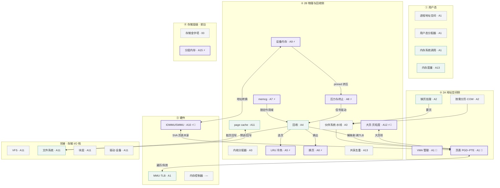

# 内存管理连载 · 规划与文章结构

> 本文是本系列的**索引 + 写作规范**（spec）：固化文章路线图、模块地图、两类文章结构模板、目录命名约定与来源策略。
> 新增 / 续写文章前先对照本文。配套总览见 [00-内存系统总览](00-内存系统总览.md)。

## 1. 模块层级与演进 / 篇幅地图

下图按四层架构分组各子模块，**按演进速度着色**（稳定薄 / 中等 / 演进厚），标注 ⚡演进热点 与 🔗对演进强耦合的稳定模块，并把每个子模块映射到对应文章编号。


<details>
<summary>上图的 Mermaid 源码（含模块间依赖边；支持 Mermaid 的查看器可渲染）</summary>



</details>

## 2. 连载路线图（阅读顺序 = 写作顺序）

| # | 标题 | 覆盖子模块 | 篇幅 / 演进 | 来源方向 |
|---|---|---|---|---|
| 00 | 内存系统总览 ✅ | 四层骨架 + 配合关系（索引 / 对照模板） | — | — |
| **A1** | 地址空间与虚实转换 | VMA·页表·MMU/TLB·TTBR·用户态分配器·mmap/madvise | **演进厚 🔗** | 内核 `mm/`、ARM ARM、LWN(maple tree / per-VMA lock) |
| A2 | 缺页与按需分页 | page fault(minor/major)·COW·Zygote 共享 | 中等（稳定） | `mm/memory.c`、AOSP Zygote |
| A3 | 物理页分配 | 伙伴系统·Zone·水线·slab/slub·compaction | 稳定薄 | `mm/page_alloc.c`、slub 文档 |
| A4 | 回收总论 | kswapd·直接回收·shrinker·回写路径·触发源 | 中等 | `mm/vmscan.c`、内核 Documentation |
| **A5** | 冷热识别的演进 | active/inactive → refault/workingset → MGLRU → DAMON | **演进厚 ⚡**（可拆 2 篇） | LWN(MGLRU)、内核 Doc、AOSP GKI、DAMON |
| A6 | 压缩与换页 | zram·zswap·zsmalloc·不落盘·写回 | **演进厚 ⚡** | 内核 zram/zswap 文档、AOSP、LWN |
| A7 | cgroup / memcg | v1→v2·max/high/min·per-memcg·memory.reclaim | **演进厚 ⚡** | `cgroup-v2.rst`、LWN、AOSP |
| A8 | 压力与低内存终止 | PSI·watermark·LMK→LMKD·Jetsam·OOM | **演进厚 ⚡** | PSI 文档/LWN、AOSP lmkd、XNU memorystatus |
| **A9** | 设备内存全景 | GPU·gralloc·dma-buf(ION)·CMA·pinned·secure heap·计量 | **演进厚 ⚡** | dma-buf 文档、AOSP dmabuf heaps、厂商 GPU |
| **A10** | IOMMU/SMMU 与 DMA | 设备虚拟地址·页表共享·SVA·安全隔离·↔页表 | **演进厚 ⚡🔗** | 内核 iommu 文档、ARM SMMU spec、LWN(SVA) |
| A11 | page cache 与回写 | buffered·readahead·dirty 阈值·folio 化·O_DIRECT | 中—厚 ⚡(folio) | `mm/filemap.c`、LWN(folios)、f2fs/APFS |
| **A12** | 大页与页粒度 | THP → folios → 16KB 页·TLB 覆盖·shattering | **演进厚 ⚡🔗** | LWN(large folios)、Apple/Android 16KB |
| A13 | 内存度量与排障 | VSS/RSS/PSS/USS·smaps·meminfo·dmabuf/gpu 计量·KSM/memfd | 中等（实战） | 内核 proc 文档、Android `dumpsys meminfo` |
| A14 | 平台对照 | Android / HarmonyOS / iOS 沿 00 模板逐格填 | 综合（可拆 3 篇） | AOSP、OpenHarmony、Apple/XNU |
| A15 | 前沿 · 先进内存 | CXL·分层内存 tiered·far memory·硬件压缩 | 演进厚 ⚡（开放连载） | 论文、LWN、CXL spec |
| A16 | 前沿 · Agent 时代内存负载 | 三特征（异构/增长/冷热）× 系统/芯片协同 · 总论 + A16a–i | 演进厚 ⚡（开放连载） | 论文、LWN、内核文档、厂商 |

## 3. 篇幅与演进权重原则

- **稳定薄**：教科书级、多年少变（伙伴系统、slab、COW、基础系统调用）→ 讲清设计动机即止。
- **中等**：偶有大改（回收路径、page cache、文件系统交界）→ 单篇适度展开。
- **演进厚**：长期 + 未来持续演进（LRU/MGLRU、设备内存、IOMMU/SVA、folios/大页、PSI 与杀进程、压缩换页）→ 拆多篇 / 带「历史→现状→趋势」。
- **关键细化（耦合度也决定篇幅）**：模块本体稳定、但与演进热点深度耦合的，也按"演进厚"写。典型是 **A1 的页表**——本体稳定，却深度纠缠 IOMMU/SVA(A10)、folios/大页(A12)、per-VMA lock，故加厚。

## 4. 文章结构模板

**通用文件头**（沿用 00 的轻量风格，不引入工程化）：
> 标题 + 一句话定位 ｜ 📍对应总览（链到 00 的层 / 格）｜ 🧭阅读前置（建议先读的 A#）｜ 🌡️演进分级（薄 / 中 / 厚 + ⚡🔗）｜ 文末「来源与延伸」带链接。

### 模板一 · 总论型（00、A4 这类统揽一层 / 一个子系统）
1. 定位与范围（读完能回答什么）
2. 心智模型（一图 / 一段的骨架）
3. 子项清单：职责 + 主要配合（表格）
4. 端到端路径（典型数据流串联）
5. 触发 / 依赖速查
6. 最小必须集 vs 增强机制
7. 各平台对照入口
8. 来源与待核实

### 模板二 · 子模块深潜型（A5/A6/A9/A10/A12 等）
1. 一句话定位 + 在地图上的位置（链 00 与相邻模块）
2. 它解决什么问题（没有它会怎样）
3. 机制本体：当前怎么做（结构 / 关键路径 / 数据结构）
4. **历史：为什么演变成今天这样**（旧方案→痛点→改进）← 演进篇重点
5. 现状与平台差异（Android / iOS / HarmonyOS 横切）
6. **趋势与未解问题**（未来往哪走）← 演进篇重点
7. 配合与依赖（跨层耦合，尤其 🔗）
8. 实测 / 观测点（怎么看到它、调它的旋钮）
9. 来源与延伸阅读

> 对 **A1 这种"稳定但强耦合"** 的篇：用模板二，但压缩 §4/§6，把 §7 配合与依赖扩成主体。

## 5. 目录与命名约定

```
foundations/
  00-内存系统总览.md          ← 架构骨架 + 对照模板
  01-连载规划与文章结构.md     ← 本文（索引 + 写作规范）
  A01-地址空间与虚实转换.md    ← 核心机制系列 A1–A13
  A02-… A13-…
  assets/*.svg                ← 手绘图（CSS 变量 + 明暗双主题）
platforms/                              ← A14 平台对照（沿 00 四层逐格填实现 + 来源）
  A14-Android-内存实现.md
  A14-HarmonyOS-内存实现.md
  A14-iOS-Darwin-内存实现.md
advanced/                               ← A15 先进内存研究综述（开放连载）
  A15-前沿-先进内存.md                   （总览）
  A15b-DAMON与分层内存实践.md            （DAMON 深潜）
  A15c-移动端分层内存与内存压缩前沿.md   （移动端视角）
  A16-前沿-Agent时代内存负载.md          ← A16 家族总论（三特征 × 系统/芯片二维地图）
  A16a-LRU主动扫描.md                    （系统·冷热）
  A16b-XVM-eBPF的LRU主动感知优化.md      （系统·冷热）
  A16c-异构压缩CDSD.md                   （系统·增长）
  A16d-压缩IP边际建模.md                 （系统·增长）
  A16e-IOMMU统一内存与异构PF-LRU.md      （芯片·异构）
  A16f-端侧KV-Cache管理方案.md           （芯片+系统·异构+增长）
  A16g-DRAM-PIM异构协同管理.md           （芯片·异构）
  A16h-STT-SOT-MRAM多级缓存方案.md       （芯片·增长）
  A16i-端侧UFS-HBF增强.md                （芯片·增长）
```

## 6. 来源策略（边写边查证）

每篇正文写作时即做核实，文末「来源与延伸」列链接。权威源优先级：

1. **内核源码 / `Documentation/`**（机制的事实基准）
2. **LWN.net**（演进脉络、引入版本、设计动机）
3. **平台官方**：AOSP / Apple Developer · XNU / OpenHarmony
4. **学术**：论文、会议（OSDI/SOSP/ATC/ASPLOS 等）
5. 其他二手资料仅作旁证

跨平台对比时**区分各平台术语**（如 LMKD vs Jetsam、zram vs compressed memory），避免混用。

## 7. 进度看板

- [x] 00 内存系统总览
- [x] 01 连载规划与文章结构（本文）
- [x] A01 地址空间与虚实转换
- [x] A02 缺页与按需分页
- [x] A03 物理页分配
- [x] A04 回收总论
- [x] A05 冷热识别的演进
- [x] A06 压缩与换页
- [x] A07 cgroup / memcg
- [x] A08 压力与低内存终止
- [x] A09 设备内存全景
- [x] A10 IOMMU/SMMU 与 DMA
- [x] A11 page cache 与回写
- [x] A12 大页与页粒度
- [x] A13 内存度量与排障
- [x] A14 平台对照 · Android（[platforms/A14-Android-内存实现.md](../platforms/A14-Android-内存实现.md)）
- [x] A14 平台对照 · HarmonyOS（[platforms/A14-HarmonyOS-内存实现.md](../platforms/A14-HarmonyOS-内存实现.md)）
- [x] A14 平台对照 · iOS / Darwin（[platforms/A14-iOS-Darwin-内存实现.md](../platforms/A14-iOS-Darwin-内存实现.md)）
- [x] A15 前沿 · 先进内存（[advanced/A15-前沿-先进内存.md](../advanced/A15-前沿-先进内存.md)）
- [x] A15b 前沿 · DAMON 与分层内存实践（[advanced/A15b-DAMON与分层内存实践.md](../advanced/A15b-DAMON与分层内存实践.md)）
- [x] A15c 前沿 · 移动端分层内存与内存压缩（[advanced/A15c-移动端分层内存与内存压缩前沿.md](../advanced/A15c-移动端分层内存与内存压缩前沿.md)）

**A16 家族 · 前沿 · Agent 时代内存负载（三特征 × 系统/芯片协同，开放连载）**

- [ ] A16 总论 · Agent 时代内存负载 + 二维地图（`advanced/A16-前沿-Agent时代内存负载.md`）
- [x] A16a 系统·冷热 · LRU 主动扫描（[advanced/A16a-LRU主动扫描.md](../advanced/A16a-LRU主动扫描.md)）
- [ ] A16b 系统·冷热 · 基于 XVM(eBPF) 的 LRU 主动感知优化
- [ ] A16c 系统·增长 · 异构压缩 CDSD
- [ ] A16d 系统·增长 · 压缩 IP 边际建模
- [ ] A16e 芯片·异构 · IOMMU 统一内存 + 异构 Page Fault / LRU
- [ ] A16f 芯片+系统·异构+增长 · 端侧 KV Cache 管理方案
- [ ] A16g 芯片·异构 · DRAM、PIM 异构协同管理
- [ ] A16h 芯片·增长 · STT/SOT-MRAM 多级缓存方案
- [ ] A16i 芯片·增长 · 端侧 UFS–HBF 增强
