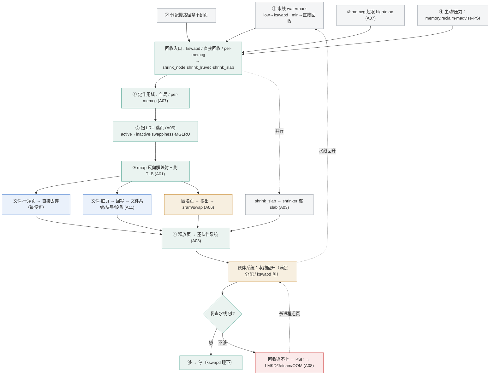

# A04 · 回收总论

> **一句话定位**：当物理内存紧张时，内核如何系统性地"腾页"——谁来发起（后台 kswapd / 同步直接回收 / slab 的 shrinker）、怎么选页、把页还回伙伴系统之前要做哪些事、以及哪些信号会触发这一切。
>
> 📍 **对应总览**：[00 总览](00-内存系统总览.md) 的「2B 物理与回收侧」中央一格——回收是把 LRU、换页、page cache、memcg、压力终止这些子项**串起来工作**的调度中枢。
> 🧭 **阅读前置**：先读 [00 总览](00-内存系统总览.md)、[A03 物理页分配](A03-物理页分配.md)（水线 / 伙伴系统）、[A01 地址空间与虚实转换](A01-地址空间与虚实转换.md)（页表 / TLB，回收要反向解映射）。
> 🌡️ **演进分级**：**中等**——回收主路径多年稳定，但触发与选页两端（[A05 LRU/MGLRU](A05-冷热识别的演进.md)、[A08 PSI 压力](A08-压力与低内存终止.md)、[A07 memcg](A07-cgroup-memcg.md) 的主动回收）持续演进。本篇是**总论**：把细节指向各专篇，只讲骨架与配合。

---

## 1. 定位与范围（读完能回答什么）

按需分页（[A02](A02-缺页与按需分页.md)）让系统可以"承诺"超过物理量的内存（overcommit），代价是早晚要**把页拿回来**。回收就是这件事的执行机构。读完本篇你应能回答：

- 回收由**谁**发起：后台的 **kswapd**、同步的**直接回收（direct reclaim）**、以及专管可回收缓存的 **shrinker**，三者分工是什么；
- 回收的**主路径**：从扫 LRU 选页，到文件页 / 匿名页的不同去向，再到把页还给伙伴系统，中间经过哪些步骤；
- 哪些**信号**会触发回收（水线 / 分配失败 / PSI / memcg 超限）；
- 用户态如何**主动 / 强制**触发回收（`memory.reclaim`、`/proc/<pid>/reclaim`、`madvise`）。

本篇**不展开**冷热判定（[A05](A05-冷热识别的演进.md)）、换出后端（[A06](A06-压缩与换页.md)）、作用域限额（[A07](A07-cgroup-memcg.md)）、压力升级到杀进程（[A08](A08-压力与低内存终止.md)）、脏页回写细节（[A11](A11-page-cache与回写.md)）——这些是各自专篇的主体。

## 2. 心智模型

把回收想成一个**带三个入口的腾页流水线**，核心实现集中在内核 `mm/vmscan.c`：

```
        触发源                  发起者                 主路径（vmscan）              归宿
  ┌──────────────┐      ┌────────────────┐    ┌────────────────────────┐
  │ 水线 low/min │─────▶│ kswapd（后台） │    │ 扫 LRU → 选 victim 页  │
  │ 分配失败     │─────▶│ 直接回收(同步) │───▶│  ├ 文件干净页 → 直接丢   │──▶ 还页给
  │ PSI 压力     │      │                │    │  ├ 文件脏页   → 回写 FS  │    伙伴系统
  │ memcg 超限   │─────▶│ 主动/强制回收  │    │  └ 匿名页     → 换出     │    (free)
  └──────────────┘      └────────────────┘    │  反向解页表 + 刷 TLB     │
                         shrinker ───────────▶ │ slab 等可回收缓存 → 缩   │
                                               └────────────────────────┘
```

一句话：**触发源说"该腾了"，发起者决定"谁来腾"，主路径决定"先腾谁、腾去哪"，最后页回到伙伴系统的空闲链表。** 注意 LRU 上的页（匿名页 + 文件页）和 slab 缓存走**两条平行的回收路**——前者由 vmscan 扫 LRU，后者由各子系统注册的 shrinker 负责。

下图把"触发 → 选页 → 解映射 → 三路处置 → 还页 → 兜底升级"的完整路径与各环节依赖的子系统画在一起：



<details>
<summary>上图的 Mermaid 源码</summary>



</details>

## 3. 子项清单：职责与主要配合

| 子项 | 职责 | 主要配合 |
|---|---|---|
| **kswapd（后台回收）** | 每个 NUMA node 一个内核线程（`kswapd0…`）。空闲跌破 **low 水线**被唤醒，**异步**回收直到回到 **high 水线**再睡 | ← 水线触发（[A03](A03-物理页分配.md)）；→ 走 vmscan 主路径；目标是让分配者**尽量不必**自己回收 |
| **直接回收（direct reclaim）** | 分配走到慢路径、空闲在 **min 水线**之下时，**申请内存的那个线程自己同步回收**再继续分配 | ← `__alloc_pages` 慢路径；→ 同一条 vmscan 主路径。**会阻塞调用者**，是应用卡顿的常见来源，PSI 把这段停顿量化（[A08](A08-压力与低内存终止.md)） |
| **shrinker（缩可回收缓存）** | 回收 **LRU 之外**的可回收内核缓存：dentry/inode 缓存、各文件系统与驱动缓存、部分 GPU/DMA 缓存等。每个注册 `count_objects()`（报有多少可回收）+ `scan_objects()`（实际回收） | ← vmscan 在回收 LRU 同时按比例调用；← memcg / NUMA node 维度可定向（`/sys/kernel/shrinker` 可观测） |
| **vmscan 主路径** | 扫 LRU、按冷热选 victim、分流处置、还页 | → [LRU/MGLRU](A05-冷热识别的演进.md) 取冷页；→ [page cache 回写](A11-page-cache与回写.md)；→ [换页](A06-压缩与换页.md)；→ 反向解页表 + 刷 TLB（[A01](A01-地址空间与虚实转换.md)） |
| **主动 / 强制回收** | 用户态显式驱动腾页，不等内核自发 | `memory.reclaim`（per-memcg，[A07](A07-cgroup-memcg.md)）、`/proc/<pid>/reclaim`（per-process）、`madvise(PAGEOUT/COLD)`（per-region，[A01](A01-地址空间与虚实转换.md) §3.5） |

## 4. 端到端路径（一次典型回收）

以"空闲跌破 low 水线"为例，把主路径走一遍（对应 [00 §3](00-内存系统总览.md#3-配合关系典型路径端到端数据流) 第 5 条）：

1. **唤醒**：伙伴系统分配时发现空闲低于 **low 水线** → 唤醒本 node 的 **kswapd**；若继续跌破 **min 水线**，分配线程自己进入**直接回收**。
2. **选页**：vmscan 扫 LRU，优先从 **inactive 链**取冷页（"先踢谁"的判据是 LRU 冷热，见 [A05](A05-冷热识别的演进.md)）。同时按比例调用各 **shrinker** 缩 slab 等缓存。
3. **分流处置**：
   - **文件干净页**：内容与后备文件一致 → **直接丢弃**，最省（不需 I/O）；
   - **文件脏页**：先**回写**到文件系统再回收（[A11](A11-page-cache与回写.md)）；回收路径通常只触发回写、把页留给 flusher / 下一轮；
   - **匿名页**：无后备文件 → 必须**换出**——移动端压进 zram（不落盘），或写到 swap 设备（[A06](A06-压缩与换页.md)）。
4. **解除映射**：页可能被多个进程的页表项映射，回收前必须**反向映射（rmap）**找到所有 PTE、逐一**解除映射并刷 TLB**（[A01](A01-地址空间与虚实转换.md) §3.4）——这是回收相对昂贵的一步。
5. **还页**：页彻底无人引用后**释放回伙伴系统**空闲链表，供后续分配。kswapd 持续到 **high 水线**才停；直接回收满足本次分配即返回。
6. **跟不上则升级**：若回收速度赶不上分配，PSI 压力升高 → 交给[压力与低内存终止](A08-压力与低内存终止.md)（LMKD / Jetsam → OOM）按优先级杀进程一次性还回大量页。

## 5. 触发 · 依赖速查

| 触发源 | 发起者 | 路径要点 | 细看 |
|---|---|---|---|
| 空闲 < **low 水线** | kswapd（异步） | 后台回收到 high 水线 | [A03](A03-物理页分配.md) |
| 空闲 < **min 水线** / 分配慢路径失败 | **直接回收**（同步，阻塞分配者） | 当场腾够再分配 | [A03](A03-物理页分配.md) |
| **PSI** memory 压力升高 | 反映回收吃力，驱动升级决策 | 量化停顿 → LMKD/Jetsam | [A08](A08-压力与低内存终止.md) |
| **memcg 超 high/max** | 本 memcg 范围内回收 / OOM | 限定**作用域**，只回收本组 | [A07](A07-cgroup-memcg.md) |
| `echo N > memory.reclaim` | 用户态主动（per-memcg，5.19+） | 不够则返回 `-EAGAIN` | [A07](A07-cgroup-memcg.md) |
| `echo N > /proc/<pid>/reclaim` | 用户态主动（per-process） | 按 anon/file/all 回收某进程 | 本篇 §6 |
| `madvise(PAGEOUT/COLD/FREE)` | 应用主动（per-region） | 直达回收 / 解映射 | [A01](A01-地址空间与虚实转换.md) |

## 6. 最小必须集 vs 增强机制

- **最小必须集**（任何带 MMU、支持 overcommit 的现代 OS 都绕不开）：
  - **kswapd + 直接回收**这对"后台 / 同步"组合——前者尽量提前腾页、后者兜底；
  - **vmscan 主路径**：扫 LRU、分流（丢弃 / 回写 / 换出）、反向解映射 + 刷 TLB、还页；
  - **shrinker**：没有它，dentry/inode 等 slab 缓存无法在压力下退让。

- **增强 / 主动机制**（可选，但终端上几乎都用）：
  - **`memory.reclaim`**：cgroup v2 的 per-memcg 主动回收接口，**Linux 5.19 引入**；写入目标字节数（如 `echo 1G > memory.reclaim`）即对该 memcg 触发回收，可带 `swappiness=` 参数（`swappiness=max` 偏向只回匿名页），回收不足返回 `-EAGAIN`。用于用户态"主动回收器"持续探测、维持工作集估计（[A07](A07-cgroup-memcg.md)）。
  - **`/proc/<pid>/reclaim`**：per-process 主动回收。Android/厂商内核的常用形态是向该文件写 **`1`=文件页 / `2`=匿名页 / `3`=全部**，把某进程的页主动回收（脏页 / 匿名页会先回写或换出，**内容不丢**，下次访问 major 缺页读回）。其思路源自上游的 per-process reclaim 提案（[LWN 2013](https://lwn.net/Articles/545668/)），但**不是主线标准接口**，各内核取值与可用性有差异（待核实：当前 AOSP/GKI 的确切语义与机型覆盖）。
  - **MGLRU**：把第 2 步"选页"换成更省的多代 LRU——属选页侧增强，见 [A05](A05-冷热识别的演进.md)。

## 7. 各平台对照入口

回收**主路径**（kswapd / direct / shrinker / vmscan）是 Linux 内核共有的，因此 **Android 与 HarmonyOS（Linux 基座）基本一致**，差异主要在**外缘**：触发与升级策略（[A08](A08-压力与低内存终止.md) 的 LMKD vs Jetsam）、换出后端（[A06](A06-压缩与换页.md) zram vs 压缩内存）、选页算法（[A05](A05-冷热识别的演进.md) MGLRU 启用情况）、作用域（[A07](A07-cgroup-memcg.md) 前后台分组 + `memory.reclaim`）。

| 维度 | Android (Linux) | iOS / Darwin | HarmonyOS |
|---|---|---|---|
| 回收主路径 | kswapd + 直接回收 + shrinker（vmscan） | XNU 自有 pageout / compressor 路径，非 vmscan | Linux 基座，同 Android（待核实定制项） |
| 主动回收接口 | `memory.reclaim`(5.19+) / `/proc/<pid>/reclaim` / `madvise` | 由 memorystatus / VM 子系统内部管理 | 待补 |
| 升级到杀进程 | PSI → **LMKD** → OOM | **Jetsam**（memorystatus） | 待补 |

> XNU 的回收语义与 Linux 不同（compressor + memorystatus），其 per-process 主动回收的对应能力见 [A08](A08-压力与低内存终止.md) / [A14 · iOS/Darwin 平台对照](../platforms/A14-iOS-Darwin-内存实现.md)。

## 8. 来源与延伸阅读

- 回收主路径（kswapd / 直接回收 / 选页）：内核源码 `mm/vmscan.c`；[Overview of Memory Reclaim in the Current Upstream Kernel (Vlastimil Babka, LPC)](https://lpc.events/event/11/contributions/896/attachments/793/1493/slides-r2.pdf)
- kswapd vs 直接回收 / 水线：[Linux Swapping FAQ (Oracle Linux Blog)](https://blogs.oracle.com/linux/linux-swapping-faq)、[Tuning the memory management subsystem (openSUSE Leap)](https://doc.opensuse.org/documentation/leap/tuning/html/book-tuning/cha-tuning-memory.html)
- shrinker 机制：[mm: introduce shrinker sysfs interface (LWN)](https://lwn.net/Articles/891542/)、[Shrinker Debugfs Interface (kernel docs)](https://docs.kernel.org/admin-guide/mm/shrinker_debugfs.html)
- `memory.reclaim`（5.19 引入、`swappiness=`、`-EAGAIN`）：[Control Group v2 (kernel docs)](https://docs.kernel.org/admin-guide/cgroup-v2.html)、[per-memcg proactive reclaim patch (LKML)](https://lkml.iu.edu/2204.2/07567.html)、[Linux 5.19 (kernelnewbies)](https://kernelnewbies.org/Linux_5.19)
- `/proc/<pid>/reclaim` / per-process reclaim：[Avoiding game-score loss with per-process reclaim (LWN)](https://lwn.net/Articles/545668/)、[mm: Per process reclaim (LWN)](https://lwn.net/Articles/544319/)
- 内核源码锚点：`mm/vmscan.c`（回收主路径 / kswapd / shrink_lruvec / shrink_slab）、`mm/page_alloc.c`（水线与慢路径触发直接回收）、`mm/rmap.c`（反向映射解除）

> **待核实 / 待补**：当前 AOSP / GKI 内核 `/proc/<pid>/reclaim` 的确切取值语义（1/2/3 含义是否随版本变化）与机型覆盖；HarmonyOS 对回收路径的定制项；XNU compressor/memorystatus 与 Linux vmscan 的逐项对应（见 [A08](A08-压力与低内存终止.md) / [A14 · iOS/Darwin 平台对照](../platforms/A14-iOS-Darwin-内存实现.md)）。
