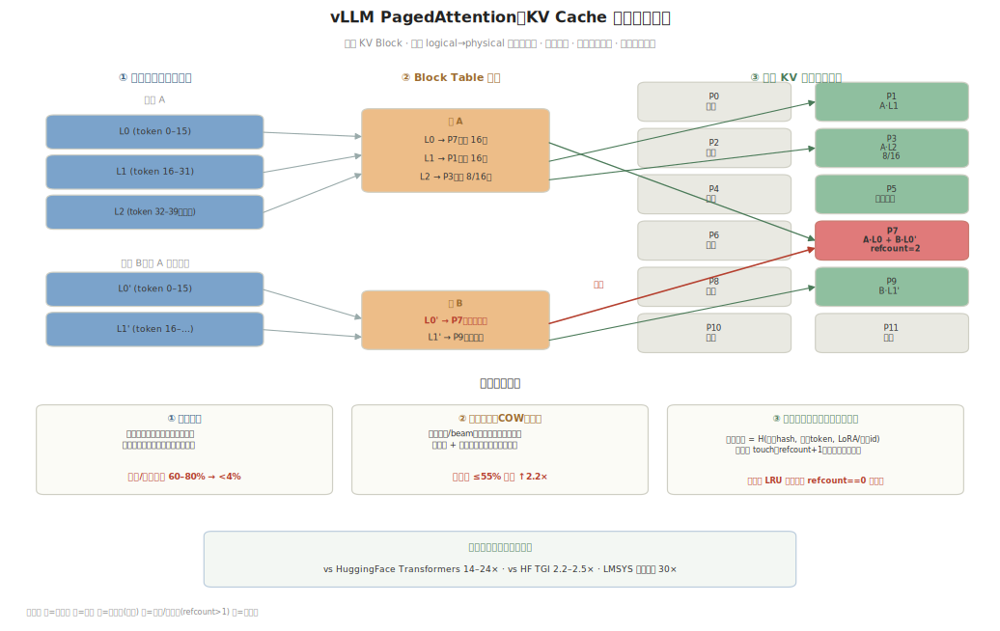
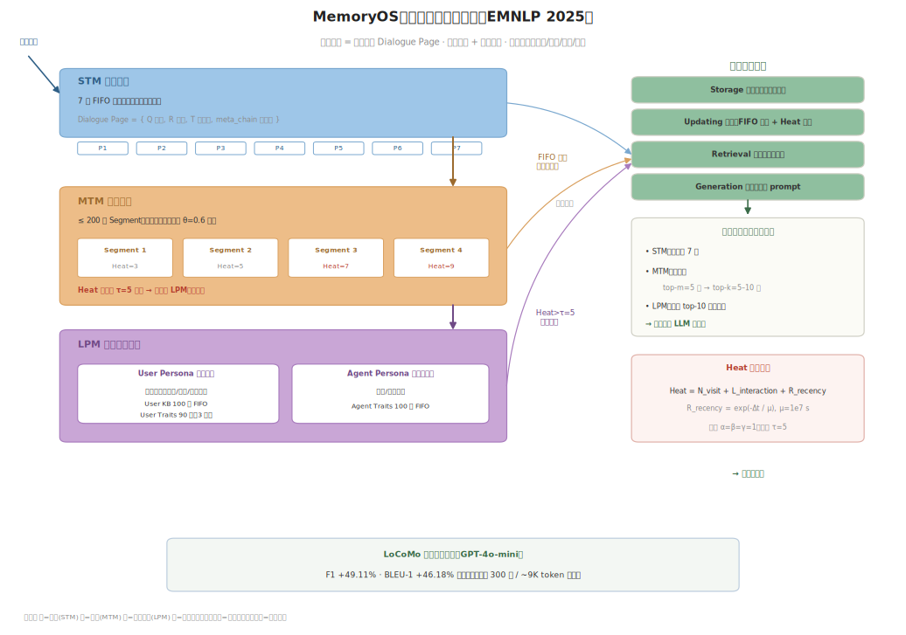

# Two Case Studies, Structurally Dissected: KV Cache Management (PagedAttention) and the Memory System (MemoryOS)

> This document picks one public, verifiable, layer-by-layer dissectable real system for each of "KV cache management" and "the agent memory system," draws its architecture diagram, and breaks down its internal structure. It is the concrete-landing companion to [on-device-kv-cache-management](on-device-kv-cache-management-EN.md) (storage/tiering layer) and [on-device-agent-memory-system](on-device-agent-memory-system-EN.md) (memory-system layer).
>
> Key insight: the two are the *same idea (an OS for memory) realized at different time scales* — PagedAttention manages "activation-state KV" (milliseconds / per token), MemoryOS manages "semantic memory" (per session / per turn); MemOS's `MemCube` is exactly what joins the two layers.

---

## Case A — KV Cache Management: vLLM PagedAttention

**Core idea.** Bring the operating system's **virtual-memory paging** to the KV cache. The traditional approach reserves one contiguous slab of GPU memory per request (sized to `max_len`), wasting **60–80%** to internal fragmentation and over-reservation. PagedAttention splits the KV cache into fixed-size blocks, allocates on demand, and uses a block table for a "logical→physical" mapping, cutting waste to **<4%** (only the last block is half-filled) [vLLM].



*Figure A. PagedAttention's three-column structure: ① a request's logical blocks → ② block-table mapping → ③ physical KV block pool; the bottom shows the three mechanisms (on-demand allocation / copy-on-write sharing / automatic prefix caching). Reproduction script: [assets/pagedattention-arch.py](assets/pagedattention-arch.py).*

### Structure, layer by layer

| Component | Role | Key parameter |
|---|---|---|
| **KV Block** | Stores K/V for a fixed number of tokens | Default 16 tokens/block (vLLM `block_size=16`) |
| **Logical Block** | Contiguous block in the sequence's view | Strictly ordered within a sequence |
| **Physical Block** | Actual block in GPU memory | May be non-contiguous, shareable across requests |
| **Block Table** | Logical→physical map + last-block fill count | One per request, append-only |
| **Block Manager** | Allocates/frees physical blocks on demand | Maintains a free-block pool |
| **Free Queue** | Free + reusable block pool | Doubly-linked list, LRU-ordered |

### Three key mechanisms

1. **On-demand allocation** — a physical block is allocated only when generation reaches a new block, so waste occurs only in the **last block** (half-filled), hence <4% [vLLM].
2. **Copy-on-write (COW) sharing** — for parallel sampling / beam search, multiple sequences share the same prefix's physical block; the block table points to one physical block plus a **reference count**, copying only when a sequence writes to a shared block. Complex sampling saves up to **55%** memory and lifts throughput up to **2.2×** [vLLM].
3. **Automatic prefix caching (cross-request reuse)** — the most intricate part:
   - **Block hash chain**: `hash = H(parent_block_hash, block_tokens, extra ids such as LoRA/image)`; including the parent means the hash matches only when the **entire prefix is identical**, naturally preventing "position-shift" mismatches.
   - **Hit**: a new request first calls `get_computed_blocks()`, hashing the prompt block by block; a matched physical block is "touched" (refcount +1, removed from the free queue so it cannot be evicted).
   - **Eviction**: free blocks ride an **LRU doubly-linked queue**; a block is evictable only when `refcount==0`; on request completion blocks return in **reverse order** (the last block, holding a longer prefix, is positioned for earlier eviction since long prefixes are less likely to match future requests).

### Measured numbers

| Dimension | Value | Source |
|---|---|---|
| GPU-memory waste | 60–80% → <4% | [vLLM] |
| Parallel-sampling memory saved | ≤55% | [vLLM] |
| Throughput vs HF Transformers | 14–24× (single) / 8.5–15× (3 parallel) | [vLLM] |
| Throughput vs HF TGI | 2.2–2.5× (single) / 3.3–3.5× (3 parallel) | [vLLM] |
| LMSYS production | up to 30×, 50% fewer GPUs at equal traffic | [vLLM] |

> On-device mapping: llama.cpp's `llama_kv_cache` (cells + seq_id sets + `llama_kv_cache_seq_cp` prefix sharing + defragmentation) is the mobile-side implementation of the same idea, corresponding to MemOS's **activation memory** layer.

---

## Case B — Memory System: MemoryOS (EMNLP 2025 Oral)

**Core idea.** Bring the OS's **tiered storage + paging** to agent memory. The smallest unit is not a token but one complete Q&A turn (a Dialogue Page); the time scale is per session. On LoCoMo it gains F1 **+49.11%** and BLEU-1 **+46.18%** (GPT-4o-mini) [MemoryOS].



*Figure B. MemoryOS's three-tier storage spine (STM→MTM→LPM, sedimenting/promoting downward) + the four modules on the right (Storage/Updating/Retrieval/Generation) + retrieval recall and the Heat formula. Reproduction script: [assets/memoryos-arch.py](assets/memoryos-arch.py).*

### Structure, layer by layer

| Tier | Structure | Capacity / rule |
|---|---|---|
| **STM (short-term)** | FIFO queue of Dialogue Pages = `{Q, R, T, meta_chain}` | **7 pages**, oldest evicted when full |
| **MTM (mid-term)** | Same-topic pages grouped into Segments by similarity **θ=0.6** | **≤200 segments**, each scored by Heat |
| **LPM (long-term persona)** | User Persona + Agent Persona | User KB 100-entry FIFO; User Traits **90 dims** (3 categories); Agent Traits 100-entry FIFO |

### Four modules = three data flows

| Module | Responsibility | Key rule |
|---|---|---|
| **Storage** | Three-tier hierarchical organization | STM / MTM / LPM |
| **Updating** | Write + promote | STM→MTM: FIFO + topic chain; MTM→LPM: Heat>τ=5 segment paging |
| **Retrieval** | Three-tier recall | STM: all pages; MTM: two-stage (top-m=5 segments → top-k=5–10 pages); LPM: top-10 per category |
| **Generation** | Assemble the prompt | Merge three-tier recall, then feed the LLM |

### Heat promotion formula (decides which mid-term memories "page" into long-term persona)

```
Heat(segment) = α·N_visit + β·L_interaction + γ·R_recency      (α = β = γ = 1)
              = retrieval count + pages in segment + exp(-Δt / 1e7)
promote when: Heat > τ (= 5)
```

This mirrors the OS rule where "access frequency + residency + recency" decides whether a page stays resident — **hot memories sediment upward into the persona, cold ones decay over time**.

---

## Structural isomorphism of the two cases

Overlay the two diagrams and they are **the same architecture instantiated at different layers**:

| Dimension | PagedAttention | MemoryOS |
|---|---|---|
| Object managed | Activation-state KV (attention intermediate state) | Semantic memory (facts / persona) |
| Smallest unit | KV Block (16 tokens) | Dialogue Page (one Q&A) |
| Time scale | Milliseconds / per token | Session / per turn |
| OS analogy | Virtual-memory **paging** | Tiered storage + **paging** |
| Eviction basis | LRU + reference count | Heat (frequency+volume+recency) + FIFO |
| Reuse mechanism | Prefix-block hash sharing | Topic-segment merge + persona sedimentation |

**Conclusion.** MemOS's `MemCube` formally joins these two layers — its **activation memory IS the KV-cache layer (what PagedAttention manages)** and its **plaintext memory IS the semantic-memory layer (what MemoryOS manages)**, with a defined "promote/demote" between them (hot plaintext memory → injected as KV). So "KV management" and "the memory system" are not two separate things architecturally, but the **lower layer (activation/KV)** and the **upper layer (semantic/persona)** of one memory hierarchy.

## References

1. **vLLM / PagedAttention** — Kwon et al., 2023. "Efficient Memory Management for Large Language Model Serving with PagedAttention." SOSP 2023. Blog: https://vllm.ai/blog/2023-06-20-vllm ; prefix-caching design: https://docs.vllm.ai/en/latest/design/prefix_caching/
2. **MemoryOS** — Kang et al., 2025. "Memory OS of AI Agent." arXiv 2506.06326, EMNLP 2025 Oral. https://arxiv.org/abs/2506.06326 ; code: https://github.com/BAI-LAB/MemoryOS ; local copy: [sources/on-device-agent-memory-system/memoryos-2506.06326.md](sources/on-device-agent-memory-system/memoryos-2506.06326.md)
3. **MemOS (MemCube, unifying both layers)** — Li et al., 2025. "MemOS: A Memory OS for AI System." arXiv 2507.03724. https://arxiv.org/abs/2507.03724 ; local copy: [sources/on-device-agent-memory-system/memos-2507.03724.md](sources/on-device-agent-memory-system/memos-2507.03724.md)
4. **llama.cpp KV cache (on-device mapping)** — ggml-org/llama.cpp. https://github.com/ggml-org/llama.cpp
