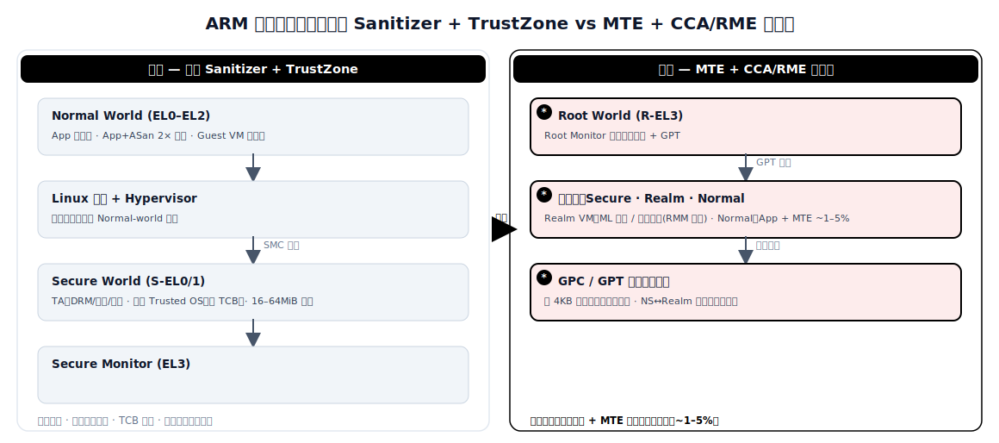

# ARM 内存安全与机密计算：CCA 与 MTE

> 本文对比了**原始方案**（纯软件内存安全检测 + TrustZone 隔离）与**演进方案**（硬件内存标签 MTE + 基于 Realm 的机密计算 CCA/RME）在 ARM 平台上的应用。资料来源涵盖学术文献（IEEE S&P、USENIX Security、SysTEX、arxiv）及工业界文档（Google Android、ARM），时间跨度 2023–2026 年。

## 1. 范围与方法

**领域定义。** ARM 架构终端设备（智能手机、平板、边缘 AI 加速器）上的内存安全保障与机密计算。本文覆盖两条正在融合的硬件扩展路线：Memory Tagging Extension（MTE）用于空间/时序内存安全检测，Confidential Computing Architecture（CCA）及 Realm Management Extension（RME）用于硬件强制的工作负载隔离——尤其面向端侧 ML 模型保护。

**"原始"与"演进"的含义。** *原始方案*依赖软件插桩实现内存安全（AddressSanitizer、MemorySanitizer、GWP-ASan），并以 TrustZone 作为唯一的硬件 TEE 提供隔离。*演进方案*引入硬件级内存标签（ARMv8.5-A MTE），以极低运行时开销捕获 use-after-free 和缓冲区溢出；同时引入四世界隔离架构（ARMv9 RME），用可动态分配的 Realm 替代原有的 Secure/Non-secure 二元划分，承载机密虚拟机和端侧 ML 推理。

**资料来源。** 14 篇主要文献：5 篇学术论文（IEEE S&P 2025、USENIX Security 2023、SysTEX 2025、arxiv 2024–2026），4 份工业界文档（Android AOSP、ARM 开发者文档），3 项基准测试研究（MTE 实测性能、TikTag 推测执行攻击），2 份架构规范（ARM CCA、RME 系统架构）。

## 2. 问题背景

**系统需要做什么。** 保护移动与边缘设备免受内存损坏利用（缓冲区溢出、use-after-free、类型混淆），并为敏感工作负载提供硬件隔离——特别是端侧 ML 模型，其权重和训练数据即使面对宿主 OS 和 hypervisor 也需保持机密。

**为什么这个领域越来越难。** 内存安全缺陷约占 Android、Chrome 和微软产品高危漏洞的 70% [Google Security Blog 2024, Chromium Security]。原生 C/C++ 代码占 Android 平台代码的 70% 以上、约 50% 的 Play Store 应用也包含原生代码，全量重写为 Rust 不切实际。与此同时，TrustZone 的 Secure/Non-secure 二元模型将安全世界限制在单一厂商控制的 TEE 中，内存预算有限（OP-TEE 通常为 16–64 MiB），可信基（TCB）攻击面日益增大。

**为什么原始方案不再够用。** ASan 带来约 2 倍 CPU 和约 2 倍内存开销，无法部署到量产环境。TrustZone 限制第三方开发者访问，不支持机密虚拟机，无法抵御 hypervisor 被攻陷的情况。端侧 ML 推理既需要运行时的内存安全，又需要模型权重的隔离保护——纯软件工具链和 TrustZone 均无法同时满足。

## 3. 具体问题与瓶颈证据

1. **软件检测工具开销过高，无法上线** — ASan 带来约 2 倍 CPU 和约 2 倍内存开销；HWASan 将内存开销降至约 15%，但 CPU 开销相当。两者均无法在电池受限的移动设备上随 release 构建发布 [Android AOSP ASan 文档]。

2. **内存安全缺陷主导 CVE 格局** — 2019 年 Android 76% 的漏洞为内存安全问题。即便 Google 推行 Safe Coding 将新代码转向 Rust/Kotlin，2024 年内存安全缺陷仍占 Android CVE 的 24%，且业界被利用的 0-day 中超过 80% 属于内存安全问题 [Google Security Blog 2024]。

3. **TrustZone 二元模型限制开发者访问与隔离粒度** — 安全世界内存有限（如 Kinibi 限制每个 TA 为 1 MiB），TEE 厂商通过严格验证门控第三方应用部署，所有 TA 共享同一 Trusted OS，其缺陷危及全部租户 [Aster/arxiv 2407.16694, ReZone/arxiv 2203.01025]。

4. **TrustZone 无法抵御 hypervisor 被攻陷** — 在 TrustZone 架构中，Normal-world hypervisor 管理所有非安全内存；hypervisor 一旦被利用，所有 Guest VM 均暴露。CCA 的 Realm 世界明确设计为即使 hypervisor 被攻陷也无法读写 Realm 内存 [ARM CCA 规范, SHELTER/USENIX Security 2023]。

5. **端侧 ML 模型缺乏硬件级机密保护** — Normal world 中的模型权重和推理数据对宿主 OS 可读，存在模型提取和成员推断攻击风险。TrustZone 受限的内存无法容纳完整 ML 模型（如 GPT-2 177 MiB、TinyLlama 1,169 MiB）[arxiv 2504.08508]。

### 瓶颈证据

| 场景 | 原始方案 | 实测代价 / 缺口 | 来源 |
|---|---|---|---|
| ASan 在 Android 上（量产环境） | 软件插桩 | ~2 倍 CPU、~2 倍内存开销 | [Android AOSP] |
| HWASan 在 Android 上 | 硬件辅助插桩 | ~2 倍 CPU、15% 内存开销 | [Android AOSP] |
| Android CVE（2019 年） | C/C++ 代码库 | 76% 为内存安全缺陷 | [Google Security Blog] |
| TrustZone TA 内存 | OP-TEE / Kinibi | 每个 TA 1 MiB（Kinibi），总计 16–64 MiB | [Aster] |
| TinyLlama-1.1B 放入 TrustZone | 安全世界托管 | 无法容纳 1,169 MiB 模型 | [arxiv 2504.08508] |
| 业界被利用的 0-day | C/C++ 代码 | >80% 为内存安全问题 | [Prossimo/memorysafety.org] |

## 4. 架构对比：原始 vs 演进



*图：原始方案与演进方案的架构对照（详细文本版见下方 ASCII 图）。*

**原始方案 — 软件 Sanitizer + TrustZone**

```
    +----------------------------------------------------+
    |              Normal World (EL0/EL1/EL2)            |
    |                                                    |
    |  +-------------+  +-------------+  +------------+ |
    |  | 应用 (C/C++)|  | 应用 + ASan |  | Guest VM   | |
    |  | (无安全保护) |  | (2 倍开销)  |  | (无隔离)   | |
    |  +-------------+  +-------------+  +------------+ |
    |         |                |               |         |
    |  +----------------------------------------------+  |
    |  |          Linux 内核 + Hypervisor              |  |
    |  |   （可完全访问所有 Normal-world 内存）         |  |
    |  +----------------------------------------------+  |
    +----------------------------------------------------+
                         |  SMC 调用
                         v
    +----------------------------------------------------+
    |             Secure World (S-EL0/S-EL1)             |
    |                                                    |
    |  +----------+  +----------+  +----------+          |
    |  | TA (DRM) |  | TA (密钥)|  | TA (支付)|          |
    |  | (1 MiB)  |  | (1 MiB)  |  | (1 MiB)  |          |
    |  +----------+  +----------+  +----------+          |
    |        共享 Trusted OS（较大 TCB）                  |
    |      16–64 MiB 安全 DRAM（静态分区）                |
    +----------------------------------------------------+
    |              Secure Monitor (EL3)                  |
    +----------------------------------------------------+
```

*原始方案：Secure/Non-secure 二元划分。ASan 提供内存安全（仅开发阶段）。TrustZone 提供隔离，但内存静态分配、TCB 共享、开发者受厂商门控。*

**演进方案 — MTE + CCA/RME 四世界架构**

```
    +------------------------------------------------------+
    |               * Root World (R-EL3)                    |
    |    * Root Monitor（管理世界切换 + GPT）                |
    +------------------------------------------------------+
           |              |              |
           v              v              v
    +-----------+  +--------------+  +-------------------+
    | Secure    |  | * Realm      |  | Normal World      |
    | World     |  |   World      |  |                   |
    | (S-EL0/1) |  | * (R-EL0/1/2)|  | (EL0/EL1/EL2)    |
    |           |  |              |  |                   |
    | TA        |  | * Realm VM 1 |  | +---------------+ |
    | (遗留     |  | *（ML 模型   |  | | 应用 + * MTE  | |
    |  兼容)    |  | *  推理）    |  | |（硬件标签     | |
    |           |  | *            |  | | ~1-5% 开销）  | |
    |           |  | * Realm VM 2 |  | +---------------+ |
    |           |  | *（机密      |  | +---------------+ |
    |           |  | *  工作负载）|  | | Guest VM      | |
    |           |  |              |  | |（* MTE 感知）  | |
    +-----------+  | * RMM 管理   |  | +---------------+ |
                   | * 隔离       |  |                   |
                   +--------------+  +-------------------+
                          |
    +------------------------------------------------------+
    | * Granule Protection Check (GPC) — 每核硬件单元       |
    | * Granule Protection Table (GPT) — 每 4KB 粒度        |
    |   将每个物理页映射到四个世界之一                       |
    | * 动态分配：NS ↔ Realm 运行时切换                     |
    +------------------------------------------------------+
```

*演进方案：四个安全世界，通过 GPT/GPC 实现硬件强制隔离。MTE 在 Normal world 以低开销提供内存标签。Realm 承载机密 VM 和 ML 工作负载，内存动态分配。新增/变更元素以 `*` 标注。*

## 5. 演进方案的优势与尚未解决的问题

### 为什么演进方案有效

- **可上线的内存安全保障** — MTE ASYNC 模式在典型负载下仅增加约 1–5% CPU 开销（对比 ASan 的 2 倍），使始终开启的内存标签得以部署到量产 Android。Android 12+ 已为安全关键守护进程启用 MTE ASYNC，包括 `system_server`、`zygote64`、蓝牙和 NFC HAL [Android AOSP MTE, arxiv 2601.11786]。

- **硬件级 ML 模型机密保护** — CCA Realm 保护模型权重和推理数据不被宿主 OS 和 hypervisor 访问，推理开销最高 22%，覆盖从 AlexNet（9 MiB）到 TinyLlama-1.1B（1,169 MiB）的多种模型，并使成员推断攻击成功率平均降低 8.3% [arxiv 2504.08508]。

- **第三方开发者可自主创建隔离环境** — 不同于 TrustZone 的厂商门控安全世界，任何开发者均可实例化 Realm，无需 TEE 厂商审批。Realm 内存以 4 KiB 粒度从 NS→Realm PAS 动态分配，消除了 16–64 MiB 的静态限制 [ARM RME 规范, SHELTER/USENIX Security 2023]。

- **抵御 hypervisor 攻陷** — RME 的 Granule Protection Check 确保即使 hypervisor 被攻陷也无法访问 Realm 内存；Realm Management Monitor（RMM）是极简固件（约 1 万行代码），在 Realm 和 NS 世界之间进行中介，可信基远小于 TrustZone 的 Trusted OS [ARM CCA 架构, virtCCA/arxiv 2306.11011]。

### 尚未解决的问题

- **MTE 标签空间仅 4 位（16 个值）** — 概率性检测意味着随机标签约有 1/16（6.25%）的碰撞漏检，16 字节粒度内的溢出不可见。Scudo+MTE 在 Juliet 测试套件中未能检测到 24.32% 的堆缓冲区溢出 [NanoTag/arxiv 2509.22027]。

- **推测执行可泄露 MTE 标签** — TikTag 攻击（IEEE S&P 2025）证明可在 4 秒内以 >95% 成功率通过推测执行侧信道泄露 MTE 标签，使攻击者能绕过 Chrome 和 Linux 内核中的 MTE 防护 [TikTag/arxiv 2406.08719]。

- **CCA Realm 启动开销显著** — Realm 创建带来 867–1,902% 的启动开销和 644–3,521% 的终止开销（随 VM 大小增长），因 RMM 页面委托机制，使短暂 Realm 创建不适用于延迟敏感场景 [arxiv 2504.08508]。

- **MTE 性能高度依赖微架构** — 在 Pixel 8 Performance 核上，MTE SYNC 在存储密集型基准测试（456.hmmer）上导致最高 6.64 倍减速；Big 核上 ASYNC 模式在 gcc 上仍有 1.82 倍开销。同一 SoC 上不同核心类型间性能差异达 3–5 倍 [arxiv 2601.11786]。

- **GPU/NPU 不在 MTE 和 CCA 覆盖范围内** — MTE 标签仅作用于 CPU 内存访问；GPU/NPU 内存操作完全绕过标签机制。CVE-2025-0072 演示了通过 Mali GPU 绕过 MTE 的攻击，且当前 CCA Realm 缺乏异构加速器支持 [CVE-2025-0072, arxiv 2408.11601]。

## 6. 对比表

| 维度 | 原始方案（ASan + TrustZone） | 演进方案（MTE + CCA/RME） | 改进幅度 | 来源 |
|---|---|---|---|---|
| 内存安全 CPU 开销 | ~2 倍（ASan）、~2 倍（HWASan） | 1–5%（MTE ASYNC）、8–56%（MTE SYNC） | ASYNC 模式降低 20–100 倍 | [Android AOSP, arxiv 2601.11786] |
| 内存安全 内存开销 | ~2 倍（ASan）、~15%（HWASan） | ~3% 标签存储（4 位 / 16 字节） | 较 ASan 降低 5–40 倍 | [Android AOSP, ARM MTE 规范] |
| 缺陷检测覆盖率 | ~98.66% 堆溢出（ASan） | ~75.68% 堆溢出（MTE/Scudo） | −23%（概率性折衷） | [NanoTag/arxiv 2509.22027] |
| 隔离粒度 | 2 个世界（Secure / Non-secure） | 4 个世界（Root / Realm / Secure / NS） | 每工作负载独立 Realm 隔离 | [ARM RME 规范] |
| 安全内存分配 | 静态 16–64 MiB（TrustZone） | 动态 4 KiB 粒度（Realm PAS） | 弹性分配，无固定上限 | [ARM CCA 规范, SHELTER] |
| ML 推理开销（机密模式） | 不适用（TZ 无法容纳模型） | ≤22% 推理开销（CCA Realm） | 使端侧机密 ML 成为可能 | [arxiv 2504.08508] |
| 开发者接入 TEE | 厂商门控，需 TA 签名 | 任何开发者可创建 Realm | 开放生态 | [Aster/arxiv 2407.16694] |
| 抗 hypervisor 攻陷能力 | 无（hypervisor 可见所有 NS 内存） | Realm 内存对 hypervisor 不可访问 | 新增安全属性 | [ARM CCA 规范] |
| 成员推断攻击防御 | 无硬件保护 | 攻击成功率降低 8.3% | 新增隐私属性 | [arxiv 2504.08508] |
| 量产部署状态 | ASan：仅开发阶段；TZ：ARMv6 起已量产 | MTE：Pixel 8+（可选开启）；CCA：FVP 仿真阶段 | MTE 已量产，CCA 尚在验证 | [Android AOSP, ARM] |

## 7. 一词概括

**硬件强固（Hardware-fortified）。**

从软件插桩 + 二元世界隔离到硬件内存标签 + 四世界机密计算的演进，代表了一次根本性转变：安全与隔离的执行从软件叠加层（高开销、仅开发阶段、厂商门控）下沉到硅片级原语（低开销、可量产部署、开发者可达）。

## 8. 开放问题

- **CCA 何时登陆量产芯片？** ARM CCA 评测目前依赖 FVP（固定虚拟平台）仿真；真实硅片的性能（缓存效应、内存带宽、功耗）尚不可知。Cortex-X5/A730 核心实现了 RME，但截至 2026 年中尚无发货 SoC 启用完整 CCA Realm 支持。

- **MTE 的 4 位标签空间能否在不破坏 ABI 的前提下扩展？** 16 种可能标签限制了检测概率；NanoTag（字节粒度溢出检测）等方案已提出但需修改分配器。未来 MTE v2 若采用更大标签空间，将显著提升确定性检测能力。

- **CCA Realm 如何与异构加速器（GPU、NPU、DSP）交互？** 当前 CCA 仅保护 CPU 可访问的内存。端侧 ML 越来越多使用 NPU/GPU 做推理；将 GPT 隔离扩展到加速器内存总线是一个待解决的架构挑战 [arxiv 2408.11601]。

- **TikTag 类推测执行攻击是否会迫使 MTE 引入推测标签检查隔离？** ARM 当前的缓解指导仅限于软件层面的规避方案。硬件层面的修复（抑制推测标签检查的副作用）将增加流水线复杂度，可能提高 MTE 开销。

- **Realm 启动开销能否降低以支持短暂微 Realm？** 当前 867–1,902% 的启动开销使得按请求创建 Realm 不现实。Realm 池化、预热 Realm 镜像或支持热替换的持久 Realm 等技术可望摊薄该成本。

- **始终开启 MTE 对移动设备的功耗和热量影响如何？** MTE ASYNC 开销基准测量的是 CPU 周期而非电池消耗或热节流。Pixel 8/9 全局启用 MTE 的量产功耗数据尚未公开。

## 9. 参考文献

1. **[arxiv 2504.08508]** "An Early Experience with Confidential Computing Architecture for On-Device Model Protection," SysTEX 2025. https://arxiv.org/abs/2504.08508
2. **[arxiv 2601.11786]** "ARM MTE Performance in Practice (Extended Version)," Noh et al., UT Austin, 2026. https://arxiv.org/abs/2601.11786
3. **[TikTag/arxiv 2406.08719]** "TikTag: Breaking ARM's Memory Tagging Extension with Speculative Execution," Kim et al., IEEE S&P 2025. https://arxiv.org/abs/2406.08719
4. **[Android AOSP MTE]** "Arm Memory Tagging Extension," Android 开源项目. https://source.android.com/docs/security/test/memory-safety/arm-mte
5. **[Android AOSP ASan]** "AddressSanitizer," Android 开源项目. https://source.android.com/docs/security/test/asan
6. **[Google Security Blog 2024]** "Eliminating Memory Safety Vulnerabilities at the Source," Google 在线安全博客, 2024 年 9 月. https://security.googleblog.com/2024/09/eliminating-memory-safety-vulnerabilities-Android.html
7. **[NanoTag/arxiv 2509.22027]** "NanoTag: Systems Support for Efficient Byte-Granular Overflow Detection on ARM MTE," 2025. https://arxiv.org/abs/2509.22027
8. **[SHELTER/USENIX Security 2023]** "SHELTER: Extending Arm CCA with Isolation in User Space," Zhang et al., USENIX Security 2023. https://www.usenix.org/conference/usenixsecurity23/presentation/zhang-yiming
9. **[Aster/arxiv 2407.16694]** "Aster: Fixing the Android TEE Ecosystem with Arm CCA," 2024. https://arxiv.org/abs/2407.16694
10. **[virtCCA/arxiv 2306.11011]** "virtCCA: Virtualized Arm Confidential Compute Architecture with TrustZone," 2023. https://arxiv.org/abs/2306.11011
11. **[ARM CCA]** "Arm Confidential Compute Architecture," Arm 公司. https://www.arm.com/architecture/security-features/arm-confidential-compute-architecture
12. **[ARM RME 规范]** "Realm Management Extension System Architecture," Arm 公司. 文档编号 DEN0129.
13. **[CVE-2025-0072]** "Critical Vulnerability in Arm Mali GPU Allows MTE Bypass," CyberPress, 2025.
14. **[Prossimo]** "What is Memory Safety and Why Does It Matter?," memorysafety.org. https://www.memorysafety.org/docs/memory-safety/
