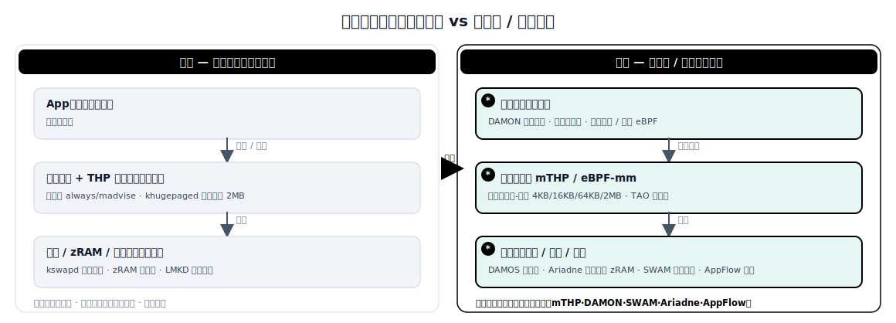

# On-Device Programmable / Adaptive Memory Management

> This document compares the *original* approach to on-device (phone, tablet, laptop, edge board) OS memory management — fixed, built-in, one-size-fits-all in-kernel policies: all-or-nothing THP, fixed LMKD/oom_adj thresholds, static kswapd watermarks — with the *evolved* approach: programmable, access-aware, workload-adaptive policies: multi-size THP ("mTHP"), DAMON/DAMOS access-monitoring-driven reclaim and huge-page promotion, programmable reclaim/compaction thresholds, and eBPF-style hooks as the *mechanism* for runtime-customizable memory policy. It surveys 2021–2026 progress from the kernel community (LWN, LPC, LSFMMBPF) and academia (MobiCom, SOSP, USENIX ATC, arXiv), anchored on the real Android phenomenon where mTHP allocation success drops from ~50% to below 10% after two hours of runtime.

## 1. Scope and method

**Domain definition.** Making **OS-level memory management policy programmable and adaptive** on resource-constrained terminal devices — specifically huge-page / large-folio allocation, page reclaim, low-memory killing (LMKD), and compressed-swap (zRAM) thresholds. The focus is not a single app but how the OS shifts from "fixed built-in policy" to policy that is tunable per-device / per-app / per-foreground-background state.

**What "original" and "evolved" mean here.** The *original* solution is the static, kernel-compiled, system-wide policy set: THP with only `always`/`madvise`/`never` and greedy 2 MB promotion, LMKD killing with fixed PSI/oom_adj thresholds, kswapd reclaiming at static watermarks, and zRAM compressing every anonymous page identically. The *evolved* solution is a set of techniques that make these policy surfaces **programmable, access-aware, and adaptive** — multi-size THP (mTHP, picking 16 KB–2 MB per region), DAMON/DAMOS driving reclaim and huge-page promotion from low-overhead sampling, hotness-aware zRAM compression, and eBPF-style hooks as the mechanism for "runtime-customizable memory policy."

**Sources.** 14 primary sources: kernel-community coverage and conferences (LWN mTHP/DAMON, LPC 2024 OPPO large folios, LPC 2024 programmable MM, OSS NA 2025 Self-Driving DAMON), on-device systems papers (MobiCom 2023 SWAM, MobiCom 2026 AppFlow, arXiv 2025 Ariadne), mechanism work (eBPF-mm, cachebpf, FetchBPF, PageFlex), and Android documentation (LMKD/PSI). Types span maintainer write-ups, peer-reviewed mobile systems papers, conference slides, and official docs. The mechanism papers are server-born; we cite them only as the *means* of making policy programmable, flag their server origin in one line, and pivot to the on-device mapping.

## 2. Problem background

**What the system needs to do.** On every page fault and every memory-pressure event the phone/edge OS must decide which page size to allocate (4 KB / 16 KB / 64 KB / 2 MB), which pages to reclaim, when and which background process to kill, and what to compress into zRAM — on a device with only 4–16 GB of physical RAM, while keeping the foreground UI smooth (60/120 Hz, an 8.3–16.7 ms per-frame budget).

**Why this domain becomes hard.** Unlike servers, terminals have no terabyte DRAM to spare; memory runs under chronic pressure. Devices stay up for **hours to days**, fragmenting physical memory badly. Huge pages cut TLB misses and improve energy efficiency, but cost memory to internal fragmentation and trigger synchronous compaction stalls once memory is fragmented — and prolonged phone runtime is exactly what exhausts contiguous physical memory. A fixed LMKD threshold either kills too late (jank) or too early (slow cold relaunch).

**Why the original solution is no longer enough.** mTHP control on Android is still **system-wide** (via sysfs); it cannot adapt to the device's real-time fragmentation state or to an app's foreground/background status. Allocation success drops from ~50% to below 10% after two hours, and "the kernel is not yet at the point where mTHPs can be used automatically" [LWN-mTHP]. Fixed LMKD kills background apps in order under pressure, forcing repeated cold reloads; the legacy swap+OOMK combination can invoke 6.5× more OOM kills than an adaptive scheme [SWAM]. The lesson: policy must be rewritable **at runtime, per device/workload**, not hard-coded at compile time.

## 3. Specific problems and bottleneck evidence

1. **All-or-nothing / system-wide THP fails after long runtime** — mTHP (Linux 6.8+) adds 16 KB–512 KB intermediate sizes, but the toggle is still system-wide. On Android, mTHP allocation succeeds ~50% of the time after 1 hour, but **the failure rate exceeds 90% after 2 hours** — memory is fully fragmented and huge pages are no longer available [LWN-mTHP, OPPO-LPC].

2. **Fragmentation-induced stalls and access-blind reclaim** — Fixed kswapd watermarks and synchronous compaction amplify latency under fragmentation; without hotness information, reclaim evicts hot pages. DAMON supplies access hotness at **under 1% of one CPU** while sampling 70 GB every 5 ms, and the proactive reclaim it drives **saves 32% memory at just 1.91% runtime overhead** on ZRAM [DAMON-Reclaim, DAMON-LWN]. Fixed policy has no such information.

3. **Fixed LMKD/OOM thresholds cause wrong kills and frequent cold starts** — LMKD triggers kills on fixed PSI thresholds (partial-stall default 200 ms on low-RAM devices, 70 ms on high-end, 700 ms complete-stall) [Android-LMKD]. The legacy swap+OOMK combo over-kills under pressure; SWAM's adaptive scheme cuts **OOM kills by 6.5×**, with 36% faster app launch and 41% faster response [SWAM].

4. **zRAM compresses cold and hot alike, slowing relaunch** — Android zRAM applies one compression policy to all anonymous pages, the main cause of slow relaunch and high CPU. Hotness-aware, size-adaptive Ariadne cuts **relaunch latency by 50%** and compression/decompression **CPU by 15%** versus state-of-the-art zRAM [Ariadne].

5. **Cold launch of large apps lacks programmable prefetch/reclaim coordination** — For GB-scale on-device apps (including local LLM/VLM), ~97.2% of cold-launch I/O is predictable static data, yet 79% of DRAM I/O bandwidth sits idle. AppFlow's memory scheduling cuts **cold-launch latency by up to 66.5%** (2 s→690 ms), direct reclaims by 67.9%, and LMK events by 33.7% [AppFlow].

### Bottleneck evidence

| Scenario | Metric | Value | Source |
|---|---|---|---|
| mTHP on Android after 2 h runtime | Allocation success rate | < 10% (down from ~50%) | [LWN-mTHP] |
| DAMON monitoring 70 GB / every 5 ms | Monitoring CPU overhead | < 1% of one CPU | [DAMON-LWN] |
| DAMON proactive reclaim (ZRAM, v5.12) | Memory saving / runtime overhead | 32% saved / 1.91% overhead | [DAMON-Reclaim] |
| Legacy swap+OOMK vs SWAM (mobile) | OOM kill invocations | 6.5× higher (legacy) | [SWAM] |
| Android zRAM vs Ariadne (Pixel 7) | Relaunch latency | −50% | [Ariadne] |
| Fixed preloading vs AppFlow (GB-scale app) | Cold-launch latency | −66.5% (2 s→690 ms) | [AppFlow] |

## 4. Architectures: original vs evolved



*Figure: original vs evolved architecture at a glance (the detailed ASCII version follows below).*

**Original — Fixed Built-in On-Device Memory Policies**

```
    +-------------------+
    |  App (fg/bg)      |
    |  (no policy input,|
    |   fg/bg ignored)  |
    +-------------------+
            |
            | page fault / pressure
            v
    +-------------------+       +--------------------+
    |  Page Fault       | ----> |  THP Decision      |
    |  Handler          |promote|  (system-wide      |
    |  (kernel, fixed)  |       |   always/madvise)  |
    +-------------------+       +--------------------+
            |                           |
            | allocate                  | greedily promote 2 MB
            v                           v
    +-------------------+       +--------------------+
    |  Buddy Allocator  |       |  khugepaged        |
    |  (4 KB default)   |       |  (background scan, |
    |                   |       |   fixed interval)   |
    +-------------------+       +--------------------+
            |                           |
            v                           v
    +----------------------------------------------+
    |  Reclaim / Swap / Kill (global fixed policy) |
    |  kswapd reclaim at fixed watermarks          |
    |  zRAM one-size compression (cold==hot)       |
    |  LMKD kill at fixed PSI/oom_adj thresholds   |
    +----------------------------------------------+
            |
            | memory pressure
            v
    +-------------------+
    |  Kill background  |
    |  App (fixed order)|
    +-------------------+
```

*Original: every policy is compiled in and system-wide. THP is system-wide and greedy, reclaim/zRAM/kill thresholds are fixed, foreground/background is ignored. Long runtime fragments memory, breaking huge pages and misplacing kills.*

**Evolved — Programmable / Access-Aware On-Device Memory Policies**

```
    +-------------------+       +------------------------+
    |  App (fg/bg)      |       | * Userspace Policy     |
    |  (fg/bg state     | state |   Manager              |
    |   fed to policy)  | ----> |   (DAMON hotness       |
    +-------------------+       |    sampling, per-app)  |
            |                   +------------------------+
            | page fault / pressure     |
            v                           | * push policy / load eBPF
    +-------------------+               v
    | * Hookable Page   | <---- +------------------------+
    |   Fault Handler   | size  | * Page Size Selector   |
    |   (kernel +       |       |   (per-region cost-    |
    |    policy dispatch)|      |    benefit:            |
    +-------------------+       |    4KB/16KB/64KB/2MB)  |
            |                   +------------------------+
            | allocate          (mTHP / eBPF-mm)
            v
    +-------------------+       +------------------------+
    |  Buddy Allocator  |       | * Adaptive Compaction  |
    |  (multi-size +    | <---- |   Trigger              |
    |   dual LRU lists) |trigger|   (per fragmentation/  |
    +-------------------+       |    watermark; reserve) |
            |                   (TAO: order-4, reserve 15%)
            v
    +----------------------------------------------+
    | * Access-Aware Reclaim / Swap / Kill         |
    |   DAMOS: pageout/hugepage/lru_prio by hotness |
    |   * hot/cold-split zRAM (Ariadne)            |
    |   * adaptive LMKD (SWAM: defer by hotness)   |
    +----------------------------------------------+
            |
            | memory pressure
            v
    +-------------------+       +------------------------+
    | * Programmable     | <--- | * Reclaim Policy       |
    |   Reclaim/Schedule |verdict|   (PROTECT/EVICT/PASS  |
    |   (kswapd + policy/|      |    + cold-launch       |
    |    AppFlow prefetch)|     |    prefetch coordination)|
    +-------------------+       +------------------------+
```

*Evolved: programmable, access-aware policy points are inserted at the page-fault, allocation, and reclaim/zRAM/kill paths (new/changed marked `*`). The userspace manager gets access hotness from low-overhead DAMON sampling and is aware of app foreground/background state, pushing policy or loading eBPF per device/workload; mTHP picks size per region, TAO uses a reservation and dual LRU to keep huge pages available, and DAMOS/Ariadne/SWAM/AppFlow make reclaim, compression, killing, and prefetch adapt to the workload.*

## 5. Why the evolved solution helps, and what it still doesn't solve

### Why the evolved solution helps

- **System-wide THP fails over long runtime** — mTHP picks 16 KB–2 MB **per region** instead of one system-wide setting; with TAO setting the size to order-4 (64 KB) and reserving 15% of physical memory for mTHP-only allocations, success goes from "<10% after 2 h" back to a stable **>50%**, and dual LRU lists (one for base pages, one for large folios) keep huge pages available [LWN-mTHP, OPPO-LPC].

- **Fragmentation stalls and access-blind reclaim** — DAMON supplies hotness at <1% of one CPU; DAMOS then only `pageout`s cold regions and only `hugepage`-promotes hot ones, with proactive reclaim **saving 32% memory at 1.91% overhead** on ZRAM [DAMON-Reclaim]; eBPF-mm further uses DAMON hot-region info to pick page size (4 KB/64 KB/2 MB) in the fault path [eBPF-mm].

- **Fixed LMKD/OOM thresholds cause wrong kills** — SWAM integrates swap and killing and defers/targets kills by data hotness, cutting **OOM kills by 6.5×** with 36% faster launch and 41% faster response [SWAM].

- **One-size-fits-all zRAM compression** — Ariadne separates hot (uncompressed, in DRAM) / warm (compressed in zpool) / cold (moved to flash) and uses large compression chunks for cold data, small for hot, cutting **relaunch latency by 50% and compression/decompression CPU by 15%** [Ariadne].

- **No prefetch/reclaim coordination at cold launch** — AppFlow exploits "97.2% of cold-launch I/O is predictable, 79% of DRAM I/O bandwidth idle" to schedule memory and prefetch, cutting **cold-launch latency by up to 66.5%, direct reclaims by 67.9%, LMK events by 33.7%, and preserving 1.85× more background apps** [AppFlow].

### What it still doesn't solve

- **Fault/reclaim eBPF hooks are not upstream** — eBPF-mm, cachebpf, FetchBPF, and PageFlex are mostly research prototypes as of mid-2025; the fault and reclaim hooks are not in mainline. On-device, the genuinely usable programmable surface is currently mainline DAMOS plus userspace LMKD (PSI), not arbitrary eBPF [eBPF-mm, PageFlex, LSFMMBPF].

- **Sampling-driven policy needs workload stability** — DAMON sampling must re-profile across phase changes and bursts; frequent foreground/background switching on phones is exactly such a bursty scenario and may erode some of the gains [DAMON-Reclaim].

- **eBPF verifier constraints limit policy complexity** — The BPF verifier enforces bounded loops and limited stack depth; complex hotness prediction or ML inside the policy is hard to implement directly on-device, requiring maps / BPF-to-BPF workarounds.

- **Multiple policy points interfere, and power budget data is missing** — Size selection, DAMOS reclaim, zRAM compression, and LMKD killing acting at once can interact pathologically (e.g. a just-promoted huge page split and reclaimed immediately); and the **sustained sampling/compression/prefetch power draw** most critical on terminals has no published battery-impact data.

## 6. Comparison table

| Dimension | Original (fixed built-in policy) | Evolved (programmable / adaptive policy) | Improvement | Source |
|---|---|---|---|---|
| Huge-page control granularity | System-wide (always/madvise/never, greedy 2 MB) | Per-region 16 KB–2 MB (mTHP / eBPF-mm size selection) | Region-level vs system-level | [LWN-mTHP, eBPF-mm] |
| mTHP success rate after 2 h runtime | < 10% (fragmented out) | > 50% (TAO order-4 + 15% reserve) | from <10% back to >50% | [LWN-mTHP, OPPO-LPC] |
| Access-awareness of reclaim | None (fixed kswapd watermarks) | DAMOS reclaim by hotness, 32% memory saved | +32% memory saving at 1.91% overhead | [DAMON-Reclaim] |
| Monitoring / sampling overhead | N/A (no sampling) | < 1% of one CPU (70 GB / 5 ms) | near-zero overhead | [DAMON-LWN] |
| OOM kill frequency (mobile) | Baseline (fixed swap+OOMK) | Adaptive integration, 6.5× fewer | −6.5×, 36% faster launch, 41% faster response | [SWAM] |
| zRAM relaunch latency | Baseline (one-size compression) | Hot/cold split + size-adaptive | −50%, CPU −15% | [Ariadne] |
| GB-scale app cold-launch latency | Baseline (fixed preloading) | Coordinated prefetch/reclaim scheduling | −66.5% (2 s→690 ms) | [AppFlow] |
| Policy deployment (mechanism) | Patch kernel + reboot (months) | Runtime push/load (DAMOS sysfs / eBPF, seconds) | months → seconds, <1% app slowdown (tradeoff: hooks not upstream) | [PageFlex, LSFMMBPF] |

## 7. One-word characterization

**Adaptive** (自适应) — On-device memory management shifts from compile-time-fixed, system-wide one-size policy to policy that self-adjusts at runtime by access hotness, by the device's fragmentation state, and by an app's foreground/background status: mTHP restores huge-page success from <10% back to >50% after two hours, DAMOS saves 32% memory at <1% of one CPU in sampling overhead, and adaptive killing/compression cut OOM kills by 6.5× and relaunch latency by 50%. The enabling mechanism is "Programmable" — opening the policy surface to runtime-loadable programs — but on terminals the payoff is being adaptive.

## 8. Open questions and caveats

- **Upstream path for programmable memory hooks on-device** — DAMOS is in mainline, but generic eBPF hooks for fault-path size selection, page-cache eviction, and reclaim are not merged; when and in what restricted form Android GKI will open these surfaces is unclear [LSFMMBPF, eBPF-mm].
- **Power/battery cost of adaptive policy** — Continuous DAMON sampling, hot/cold-split compression, and cold-launch prefetch all consume CPU/IO; existing papers report throughput/latency wins but rarely **sustained power and thermal** data on real battery devices.
- **Long-horizon fragmentation control** — TAO's reservation/dual-LRU works at the hours scale, but huge-page availability after days of continuous runtime and many fg/bg switches lacks long-run measurement [OPPO-LPC].
- **Coordination across policy points** — Size selection, reclaim, compression, killing, and prefetch each adapt independently with no unified coordination; no published on-device work handles "multi-hook / multi-policy joint optimization" to avoid mutual sabotage.
- **Cross-device and cross-vendor portability** — Most numbers come from specific devices (Pixel 7, OPPO production phones); low-end eMMC + small-RAM devices may differ more, and there is no standard for auto-adapting mTHP/DAMOS config to a device tier.
- **Benchmark representativeness** — On-device workloads (camera, gaming, local LLMs, background sync) vary wildly in access pattern; most evaluations cover only a few apps, leaving production long-tail workloads unverified.

## 9. References

### On-device anchor: mTHP / large folios (50% → <10% fragmentation)
1. **[LWN-mTHP]** — Corbet J., 2024. "Two talks on multi-size transparent huge page performance." LWN.net. URL: https://lwn.net/Articles/974826/ . Local copy: [sources/android-mthp.md](sources/android-mthp.md)
2. **[OPPO-LPC]** — Song B., Han C., Liu H. (OPPO), Singh K., Zhao Y. (Google), 2024. "Product practices of large folios on millions of OPPO Android phones." Linux Plumbers Conference 2024, Android MC. URL: https://lpc.events/event/18/contributions/1705/
3. **mTHP for anonymous memory** — Roberts R. et al., 2024. LWN.net. URL: https://lwn.net/Articles/954094/
4. **mTHP swap-in for zRAM-like swapfile** — Song B. et al., 2024. LWN.net / LKML v5 series. URL: https://lwn.net/Articles/983531/

### DAMON / DAMOS (access-aware, adaptive, mainline)
5. **[DAMON-LWN]** — Corbet J., 2021. "Using DAMON for proactive reclaim." LWN.net. URL: https://lwn.net/Articles/863753/ . Local copy: [sources/damon-damos.md](sources/damon-damos.md)
6. **[DAMON-Reclaim]** — Park S.J., 2021. "Introduce DAMON-based Proactive Reclamation" + DAMON Project docs (32% saving / 1.91% overhead). URL: https://lwn.net/Articles/858682/ ; https://damonitor.github.io/
7. **Self-Driving DAMON/S** — Park S.J., 2025. "Controlled and Automated Access-aware Efficient Systems." OSS NA 2025. URL: https://static.sched.com/hosted_files/ossna2025/16/damon_ossna25.pdf

### On-device adaptive killing / swapping / launch
8. **[SWAM]** — Lim G., Kang D., Ham M.J., Eom Y.I., 2023. "SWAM: Revisiting Swap and OOMK for Improving Application Responsiveness on Mobile Devices." MobiCom 2023. arXiv 2306.08345. URL: https://arxiv.org/abs/2306.08345
9. **[Ariadne]** — Liang Y., Shen A., Xue C.J. et al., 2025. "Ariadne: A Hotness-Aware and Size-Adaptive Compressed Swap Technique for Fast Application Relaunch on Mobile Devices." arXiv 2502.12826. URL: https://arxiv.org/abs/2502.12826
10. **[AppFlow]** — Li X., Liu S., Guo B. et al., 2026. "AppFlow: Memory Scheduling for Cold Launch of Large Apps on Mobile and Vehicle Systems." MobiCom 2026. arXiv 2603.17259. URL: https://arxiv.org/abs/2603.17259
11. **[Android-LMKD]** — Android Open Source Project. "Low memory killer daemon (lmkd)" (PSI thresholds: 200 ms low-RAM / 70 ms high-end / 700 ms complete-stall). URL: https://source.android.com/docs/core/perf/lmkd

### Programmable mechanism (server-born, mapped to on-device)
12. **[eBPF-mm]** — Mores K., Psomadakis S., Goumas G. (NTUA), 2024. "eBPF-mm: Userspace-guided memory management in Linux with eBPF." ACM SRC@MICRO'24. arXiv 2409.11220. URL: https://arxiv.org/abs/2409.11220 . Local copy: [sources/ebpf-mm.md](sources/ebpf-mm.md)
13. **cachebpf** — Zussman T., Zarkadas I. et al. (Columbia, IBM), 2025. "Cache is King: Smart Page Eviction with eBPF." arXiv 2502.02750. URL: https://arxiv.org/abs/2502.02750
14. **FetchBPF** — Cao X. et al., 2024. "FetchBPF: Customizable Prefetching Policies in Linux with eBPF." USENIX ATC 2024. URL: https://www.usenix.org/conference/atc24/presentation/cao
15. **PageFlex** — Yelam A. et al. (Google, UCSD, UW), 2025. "PageFlex: Flexible and Efficient User-space Delegation of Linux Paging Policies with eBPF." USENIX ATC 2025. URL: https://www.usenix.org/conference/atc25/presentation/yelam
16. **[LSFMMBPF]** — Skarlatos D., Zhao K. (CMU), 2024. "Towards Programmable Memory Management with eBPF." LPC 2024. URL: https://lpc.events/event/18/contributions/1932/
