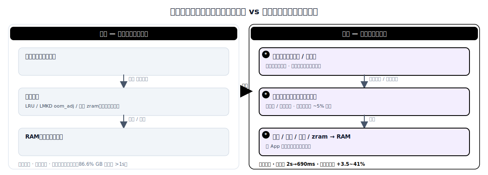

# 端云协同内存管理：千人千面的场景化冷热精准识别

> 面向终端设备的「端云协同内存管理」技术领域调研：端侧「小脑」（轻量、个性化的小模型）+ 云侧「大脑」（大模型/训练器）协同，把通用、设备本地的冷热策略，升级为按用户、按场景（「千人千面」）预测哪些 App 与页面是热是冷。本文对比*原始方案*（设备本地通用策略：LRU、LMKD oom_adj、固定 zram）与*演进方案*（端云协同 + 个性化场景化冷热识别 + 云侧学习并下发策略）。是本 N+1 调研集中端侧 KV Cache、分级内存、带宽等主题的姊妹篇。

## 1. 范围与方法

**领域界定。** 资源受限终端（手机、平板、PC、边缘板卡）上的内存管理，其中*「什么留在 RAM 里热着、什么压缩/换出、什么预取」*这一决策按每个用户、每个使用场景做出，并借助云侧协同。这里的「冷热」既含粗粒度（哪个 App/进程常驻 vs 被冻结/杀掉），也含细粒度（哪些页面预取、回收或放入 zram）。

**「原始」与「演进」的含义。** *原始方案*是**设备本地的通用策略**：操作系统按最近访问时间和静态重要性分数决定淘汰（Linux/Android LRU、LMKD 的 `oom_adj_score`、kswapd），内存扩展是用户手选的固定大小（如 Samsung RAM Plus 的 2/4/6/8 GB zram）。所有用户一套规则。*演进方案*是**端云协同的个性化内存管理**：端侧小模型从*该用户*的实时场景预测冷热并驱动预取/回收/常驻；云侧大模型聚合全舰队场景模式、训练个性化策略、向每个用户下发专属适配器（adapter）；并用「智能请求」门控，仅在端侧不确定时才联系云侧，原始行为数据留在设备上。

**来源与主要族系。** 16 个主要来源，分三族：(a) 端云协同 ML 系统与个性化——Walle（OSDI'22）、DCCL（KDD'21）、LSC4Rec（KDD'25）、两篇 2025 年端侧 SLM/云侧 LLM 综述；(b) 端侧内存管理机制——Android LMKD、缓存应用冻结器、AppFlow、ElasticZRAM、Samsung RAM Plus；(c) 端侧使用预测及其开销——DeepApp、Microsoft 预测/预取、Kleio（ML 页热度先例）、端侧行为日志开销。类型涵盖同行评审系统/ML 论文、OS 文档与厂商资料。

## 2. 问题背景

**系统要做什么。** 在 RAM 有界且共享的设备上（扣除 OS 后常常不足 4–8 GB 可用），把*这个*用户即将要用的 App 和页面恰好留在内存里、其余压缩或换出、并预取即将到来的——让启动「秒开」、且系统永不杀错对象。

**为什么这件事难。** 冷热是因人、因场景而异的：通勤者早 8 点的工作集和玩家晚 9 点的截然不同，所以单一固定规则对多数用户都会预测错。而要做这个决策的设备本身**数据少、标签少、算力紧**——它只看得到自己一段短的、非独立同分布的历史。同时内存正是那个稀缺资源，任何预测器都必须便宜到能跑在它要去解救的那台设备上。

**为什么原始方案不再够用。** GB 级 App（端侧 LLM、富媒体编辑器）叠加重度多任务，意味着一次淘汰错误就是数秒级的冷启动；**86.6% 的 GB 级冷启动已经越过了 1 秒的可用性悬崖** [AppFlow]。一套对所有用户相同的静态策略，给不出当下负载所要求的按用户、按场景的精度（「千人千面」）。

## 3. 具体问题与瓶颈证据

### 具体问题

1. **通用策略对每个用户的工作集预测错** —— LRU/LMKD 按最近访问与静态重要性分数淘汰，而非按用户是谁、处于什么场景，于是错误的 App 被冻结/杀掉、再启动即冷启动；86.6% 的 GB 级冷启动越过 1 秒悬崖 [AppFlow]。
2. **静态、手动的内存配置不感知场景** —— Samsung RAM Plus 让*用户*一次性手选一个固定 zram 大小（2/4/6/8 GB），从不随当下场景或该用户习惯自适应 [Samsung RAM Plus]。
3. **端侧学习器数据/算力/标签匮乏** —— 单台设备只有自己一段短的、非 IID 历史与有限算力，无法独立训练出强的个性化冷热预测器 [DCCL；端侧 SLM/云侧 LLM 综述]。
4. **常态化的云端协助代价高且侵犯隐私** —— 每次决策都上传原始行为、调用云模型，既费带宽/电量又暴露隐私；云端推理单样本成本约为端侧小模型的 70 倍（0.10082 s vs 0.00143 s）[LSC4Rec]。

### 瓶颈证据

| 症状 | 数值 | 来源 |
|---|---|---|
| GB 级冷启动越过 1 秒悬崖的比例 | 86.6% | [AppFlow] |
| 冷启动延迟：通用 → 预测驱动 | 2 s → 690 ms（−66.5%） | [AppFlow] |
| 单样本推理成本：端侧 vs 云侧 | 0.00143 s vs 0.10082 s（约 70×） | [LSC4Rec] |
| 端云个性化（千人千面）带来的精度增益 | +3.52% 至 +41.32% | [DCCL] |
| 更多 App 缓存在 RAM → 更少冷启动 | 最高 30% | [缓存应用冻结器] |

*证据解读：* 瓶颈不在 RAM 容量，而在*决策质量*。当「常驻/淘汰/预取」决策是通用的，86.6% 的大 App 启动越过 1 秒悬崖；当它由预测驱动且个性化时，同样的启动降到 690 ms，且每次决策成本仍比一次云端往返低约 70 倍——所以收益来自一个更好、更便宜、按用户的决策，而非更多内存。

## 4. 架构：原始方案 vs 演进方案



*图：原始方案与演进方案的架构对照（详细文本版见下方 ASCII 图）。*

**原始方案 —— 设备本地通用冷热策略**

```
      用户行为（仅本地）
              |
              v   观察（最近访问 / oom_adj）
   +----------------------------------+
   |  设备                            |
   |   +--------------------------+   |
   |   | 通用策略                 |   |   所有人一套规则
   |   | LRU / LMKD oom_adj /     |   |
   |   | 固定 zram 大小           |   |
   |   +-----------+--------------+   |
   |               | 淘汰 / 常驻      |
   |               v                  |
   |   +--------------------------+   |
   |   |  RAM（有界、共享）       |   |
   |   +--------------------------+   |
   +----------------------------------+
   云侧：不参与。无个性化，无跨用户学习。
```

*原始：设备按最近访问与静态重要性分数决定常驻/淘汰；每个用户一套规则，云侧不参与。*

**演进方案 —— 端云协同的个性化场景冷热**

```
      用户行为（留在设备上）
              |
              v  * 本地抽取场景特征
   +-----------------------------------+   * 下发按用户的策略 / 适配器
   |  设备（小脑）                     | <---------------------------------+
   |   +---------------------------+   |                                   |
   |   | * 个性化小模型            |   |     +-----------------------------+--+
   |   |   场景冷热预测器          |   |     |  云侧（大脑）                  |
   |   +-----------+---------------+   |     |  * 大模型 / 训练器              |
   |   * 预测      | 驱动              |     |  * 聚合全舰队场景               |
   |               v                   |     |    (MetaPatch / 蒸馏)           |
   |   +---------------------------+   |     +-----------------------------+--+
   |   | 预取 / 回收 / 常驻 /      |   |   * 智能请求                      ^
   |   | zram（按 App、按页面）    |   |------------------------------------+
   |   +-----------+---------------+   |   仅在不确定时上传；
   |               v                   |   原始行为保持私有
   |   +---------------------------+   |
   |   |  RAM（有界、共享）        |   |
   |   +---------------------------+   |
   +-----------------------------------+
```

*演进：端侧小模型从该用户的实时场景预测冷热并驱动预取/回收/常驻；云侧聚合全舰队场景、训练个性化策略、下发按用户的适配器；智能请求门控仅在端侧不确定时才联系云侧。新增/变更部分以 `*` 标记。*

## 5. 演进方案为何有效，又还没解决什么

### 为何有效

- **通用策略对每个用户的工作集预测错** —— 用个性化、场景感知的预测器取代最近访问/oom_adj，使常驻/淘汰/预取决策贴合*这个*用户；预测驱动的调度把 GB 冷启动延迟从 2 s 降到 690 ms（−66.5%），并把 95% 的启动维持在 1 s 内 [AppFlow]。
- **静态、手动的内存配置不感知场景** —— 云侧学习的策略按场景自动自适应，取代用户手选的固定 zram 大小，免去一次性手动设定 [Samsung RAM Plus 基线；DCCL]。
- **端侧学习器数据/算力/标签匮乏** —— 云侧聚合全舰队场景、蒸馏出一个强的共享骨干，每台设备只需按用户做小幅 patch（MetaPatch），较「仅端侧」或「仅云侧」训练高 +3.52% 至 +41.32% [DCCL]。
- **常态化云端协助代价高且侵犯隐私** —— 智能请求门控仅在端云分歧超阈值时才联系云侧，在仅 5% 请求频率下取得峰值 +36.66% NDCG@5，且原始行为留在设备上 [LSC4Rec]。

### 还没解决什么

- **个性化冷启动** —— 全新用户或从未见过的场景，本地无历史、舰队也暂无匹配，系统只能退回通用策略，直到积累够信号 [DCCL；端侧 SLM/云侧 LLM 综述]。
- **预测器自身的端侧占用** —— 按用户的模型、其特征、以及行为日志，会在它要解救的那台设备上消耗 RAM、flash 与电量；目前没有内存策略模型的端侧占用预算公开，行为日志本身也耗存储 [端侧 SLM/云侧 LLM 综述；行为日志开销研究]。
- **行为特征的隐私与合规** —— 即便有智能请求，场景特征与上传的增量仍是个人数据；内存策略闭环的加密、纯端侧模式、用户可见的同意机制都未定义。
- **缺乏标准的 OS 策略下发接口** —— Android/iOS 的内存子系统（LMKD、zram、PSI）无法被一个按用户的云侧策略编程；落地需要尚不存在的 OS/厂商配合。
- **过时与多数偏置** —— 用户习惯会漂移，下发的策略在两次更新之间可能过时而预测错；云侧聚合还可能偏向典型用户、亏待非典型用户 [DCCL]。

## 6. 对比表

| 维度 | 原始（设备本地通用） | 演进（端云协同个性化） | 提升 |
|---|---|---|---|
| 个性化粒度 | 所有用户一套策略 | 按用户/按场景（千人千面） | 无 → 按用户 [ref 2] |
| 冷启动延迟（GB App） | 2 s（通用调度） | 690 ms（预测驱动） | −66.5% [ref 9] |
| GB 冷启动在 1 s 悬崖内的比例 | 13.4%（86.6% 越过） | 95% | +81.6 pts [ref 9] |
| 预测/推荐精度 | 仅云或仅端基线 | +3.52~41.32%（DCCL）；+9.38~16.18% 均值（LSC4Rec） | + [ref 2, ref 3] |
| 云端调用频率 | 每次决策（100%） | 5%（智能请求） | 调用 −95%，仍 +36.66% NDCG@5 [ref 3] |
| 单样本推理成本 | 0.10082 s（云模型） | 0.00143 s（端侧模型） | 约 70× 更便宜 [ref 3] |
| 原始行为隐私暴露 | 为云决策上传 | 留在设备；仅不确定时传增量 | 是 → 降低 [ref 3] |
| 端侧开销（预测器 + 日志） | 0 额外模型 | +1 按用户模型 + 特征日志 | 回退：+RAM/电量，n/a（无公开预算）[ref 4] |

## 7. 一词概括

**Personalized（千人千面）** —— 端云闭环用一个按用户、按场景的预测器取代单一通用冷热规则（云侧学全舰队模式、端侧按用户做 patch），把 GB 冷启动延迟砍掉 66.5%（2 s → 690 ms），同时只在 5% 的时候调用云侧 [AppFlow；LSC4Rec]。

## 8. 开放问题与注意事项

- **尚无端到端落地的个性化*内存*策略。** 文中数字分别借自端云*推荐*（DCCL、LSC4Rec）与端侧*预测驱动调度*（AppFlow）；尚无已发表系统在舰队规模上把内存冷热的完整闭环跑通。本对比应视为「拼接」而非端到端实测。
- **闭环的端侧成本未实测。** 按用户预测器 + 特征日志在手机上、与其所管理的 App 并存的 RAM/flash/电量，无公开预算。
- **隐私/合规面。** 场景特征与上传增量是个人数据；纯端侧模式、加密、内存策略闭环的同意机制均未处理。
- **需要 OS/厂商配合。** 云侧下发的按用户冷热策略，需要一个可编程进 LMKD/zram/PSI 的接口，而主流 OS 今天都未暴露。
- **漂移与公平。** 习惯漂移使下发策略过时；舰队聚合可能亏待非典型用户。更新节奏与按用户回退策略待研究。
- **来年复查。** 端侧 LLM 个性化、Android 内存效率工作（如 Android 17 内存优化）、端侧 SLM/云侧 LLM 框架是否会汇聚出一个标准的内存策略接口。

## 9. 参考文献

### 端云协同 ML 与个性化

1. **Walle** — Lv et al., 2022. "Walle: An End-to-End, General-Purpose, and Large-Scale Production System for Device-Cloud Collaborative Machine Learning." USENIX OSDI 2022. arXiv: 2205.14833. URL: https://arxiv.org/abs/2205.14833 。本地副本：[sources/walle-osdi22-2205.14833.md](sources/walle-osdi22-2205.14833.md)
2. **DCCL** — Yao et al., 2021. "Device-Cloud Collaborative Learning for Recommendation." ACM SIGKDD 2021. arXiv: 2104.06624. URL: https://arxiv.org/abs/2104.06624 。本地副本：[sources/dccl-kdd21-2104.06624.md](sources/dccl-kdd21-2104.06624.md)
3. **LSC4Rec** — Lv et al., 2025. "Collaboration of Large Language Models and Small Recommendation Models for Device-Cloud Recommendation." ACM SIGKDD 2025. arXiv: 2501.05647. URL: https://arxiv.org/abs/2501.05647 。代码：https://github.com/HelloZicky/LSC4Rec 。本地副本：[sources/lsc4rec-kdd25-2501.05647.md](sources/lsc4rec-kdd25-2501.05647.md)
4. **端侧小模型 + 云侧大模型综述** — 2025. "Collaborative Learning of On-Device Small Model and Cloud-Based Large Model: Advances and Future Directions." arXiv: 2504.15300. URL: https://arxiv.org/abs/2504.15300
5. **端侧 SLM / 云侧 LLM 综述** — 2025. "Collaborative Inference and Learning between Edge SLMs and Cloud LLMs: A Survey of Algorithms, Execution, and Open Challenges." arXiv: 2507.16731. URL: https://arxiv.org/abs/2507.16731
6. **多模态 LLM 的云-端协同学习** — Wang et al., 2024. CVPR 2024. arXiv: 2312.16279. URL: https://arxiv.org/abs/2312.16279

### 端侧内存管理机制

7. **Android LMKD** — Android Open Source Project. "Low memory killer daemon." URL: https://source.android.com/docs/core/perf/lmkd
8. **缓存应用冻结器** — Android Open Source Project. "Cached apps freezer"（最高减少 30% 冷启动）. URL: https://source.android.com/docs/core/perf/cached-apps-freezer
9. **AppFlow** — 2026. "AppFlow: Memory Scheduling for Cold Launch of Large Apps on Mobile and Vehicle Systems." arXiv: 2603.17259. URL: https://arxiv.org/abs/2603.17259 。本地副本：[sources/appflow-2603.17259.md](sources/appflow-2603.17259.md)
10. **ElasticZRAM** — 2024. "ElasticZRAM: Revisiting ZRAM for Swapping on Mobile Devices." ACM/IEEE DAC 2024. URL: https://dl.acm.org/doi/10.1145/3649329.3655943
11. **Samsung RAM Plus** — Samsung. "What is RAM Plus and How to Use It?" URL: https://www.samsung.com/sg/support/mobile-devices/what-is-ram-plus-and-how-to-use-it/
12. **基于冻结的内存-进程协同设计** — 2025. "Freezing-based Memory and Process Co-design for User Experience on Resource-limited Mobile Devices." ACM TOCS. URL: https://dl.acm.org/doi/10.1145/3714409

### 端侧使用预测及其开销

13. **DeepApp** — 2020. "DeepApp: Predicting Personalized Smartphone App Usage via Context-Aware Multi-Task Learning." URL: https://www.researchgate.net/publication/346558717
14. **预测与预取实践** — Parate et al., Microsoft Research. "Practical Prediction and Prefetch for Faster Access to Applications on Mobile Phones." URL: https://www.microsoft.com/en-us/research/publication/practical-prediction-and-prefetch-for-faster-access-to-applications-on-mobile-phones/
15. **Kleio** — Doudali et al., 2019. "Kleio: A Hybrid Memory Page Scheduler with Machine Intelligence." ACM HPDC 2019（数据中心 ML 页热度先例）. URL: https://dl.acm.org/doi/10.1145/3307681.3325398
16. **端侧行为日志开销** — 2025. "Optimizing Storage Overhead of User Behavior Log for ML-embedded Mobile Apps." arXiv: 2510.13405. URL: https://arxiv.org/abs/2510.13405
