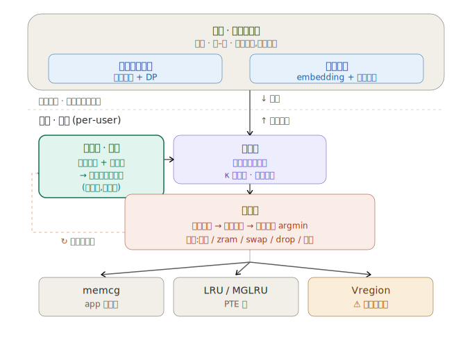
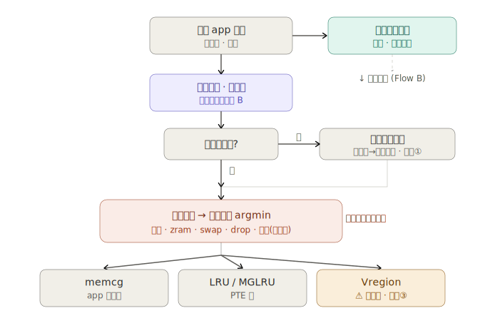
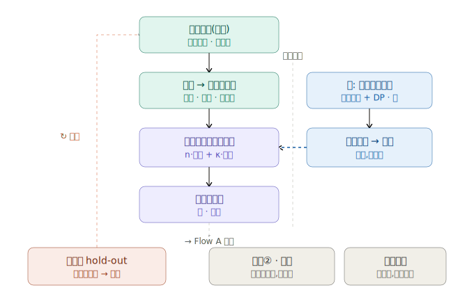

# 终端设备内存治理:端云协同的冷热感知与预测式回收

## 1. 问题来源

### 1.1 内存治理的三个领域

终端设备的内存治理,大体可以分为三个领域:

- **负载内存降低**:在应用和系统服务层面降低内存占用本身。
- **系统-负载冷热感知优化**:对多应用、多系统服务的内存进行精准的冷热判别,识别哪些内存"正在被用"、哪些"可以暂时让出来"。
- **系统内存流转加速**:加速内存在不同应用和系统服务之间的回收、压缩、换出、换入流转,降低流转的延迟和开销。

这三个领域并非完全并列的关系。冷热感知实际上是另外两个领域共同依赖的底座——负载内存降低需要冷热信号来决定"压谁/回收谁",内存流转加速需要冷热信号来决定"搬谁/什么时候搬"。冷热判别层面的误差,会同时传导到上面两层。

### 1.2 核心瓶颈:冷热判别的三重困难

"精准冷热判别"这个概念,实际上包含三个层次不同的子问题:

**测量粒度与开销的矛盾。** 硬件层面只提供 PTE accessed bit(二值、扫一次清一次),如果想要频率和 recency 信息,就需要多轮采样重建,而采样本身消耗 CPU、冲刷 TLB。MGLRU 的多代化和 DAMON 的自适应 region 都在攻这个层面,进展是稳步的。

**语义鸿沟。** 内核观测到的是"页面访问频率",但治理真正需要的是"可牺牲性",后者是应用语义层的属性。访问频率只是一个代理变量,对某些场景系统性失效:低频但延迟敏感的 UI 路径、大但可重建的解码缓存,都会被传统方法误判。

**预测性缺失。** 当前的冷热判断面向过去("这块内存最近没被访问"),但正确的回收决策需要面向未来("这块内存接下来会不会被用到")。用户两秒后切回前台,纯 recency 信号会判它该回收,但正确答案取决于对未来行为的预测。

真正的天花板在后两层,而且这两层靠内核侧更精密的被动扫描是解不掉的,因为缺的信息根本不存在于 page-access 这一层——它在应用语义和未来用户行为里。

### 1.3 冷热的多层性与兜底缺口

不同层级的冷热有不同的表现形式,也需要不同的机制去兜底:

- **应用语义层级的冷热**(这个 app 整体上还需不需要)——原则上由 memcg 层级的机制兜底。
- **PTE 层级的冷热**(某个页面最近有没有被访问)——原则上由 LRU / MGLRU 层级的机制兜底。
- **Vregion 层级的冷热**(介于两者之间的虚拟区域粒度)——目前没有明确对应的回收原语去兜底。

Vregion 层级的缺口意味着:即使我们能感知到这个粒度上的冷热,也缺乏对应的杠杆去作动。这个缺口会在后续的架构设计中反复出现。

### 1.4 为什么需要端云协同

应用级别的冷热(哪些 app 可以回收、哪些需要保持活跃)具有很强的用户个性化特征,但同时也是一个慢变量——变化粒度以天、周、月来度量。这意味着:

- 判定可以离线做,不需要实时;
- 但 per-user 的判定表在数据上是稀疏的(单个用户的 app 切换事件有限,大量的前台-后台组合缺乏足够样本);
- 跨用户的群体先验可以填补这些稀疏格子,而群体先验的计算需要舰队级的数据聚合。

这自然地引出了端云协同的架构:云侧负责计算跨用户的群体先验(解决数据稀疏),端侧负责 per-user 的个性化估计和实时决策(解决隐私和实时性)。

---

## 2. 端云协同架构

### 2.1 核心原则:沿 per-user / cross-user 切分

整个架构沿一条清晰的线切开:

- **云拥有 app 轴先验**(跨用户):每个 app 版本的典型足迹、已知的可重建缓存、群体级的驻留模式、服务的耦合特征。这些是单台设备结构上算不出来的。
- **端拥有 user 轴个性化**(per-user):这个用户的具体使用习惯、app 切换模式、个性化的回切时间分布。

这条线同时也是隐私边界:原始的 app 使用轨迹(最敏感的行为数据)永不离端,云只接触群体级的聚合参数。

### 2.2 云侧:跨用户先验

云侧的产物不是一张稠密的大表,而是**分解后的先验**:

- 给前台 app 和后台实体各学一组低维 embedding,让它们的交互去近似回切分布(低秩分解);
- 再加一层 per-app-version 的偏置项,管足迹大小、可重建缓存比例、已知泄漏等 app 版本级的情报;
- 训练路径用联邦学习:端上计算对共享模型的本地更新(梯度增量),服务端做安全聚合(可叠差分隐私噪声),群体先验就这样训出来,谁的原始轨迹都不上云。

云侧的更新节律是天到周级(慢推)。

### 2.3 端侧:个性化估计与实时决策

端侧维护一张 per-user 的后验表:行是前台 app(约 100 个),列是后台实体(约 100 个后台 app + 约 100 个系统服务)。每个格子存储该 (前台, 后台) 组合下的回切时间分布估计。

估计方法是经验贝叶斯收缩:

- 本地数据充足的格子,信任本地估计;
- 本地数据稀疏的格子,按样本量加权收缩到云下推的先验;
- 收缩强度(κ)非均质:系统服务列给大 κ(硬收缩到群体先验,因为服务行为主要由 OS/版本决定),用户 app 列给小 κ(保留个体特异性)。

本地统计量使用指数衰减,使得端上的估计能追踪个体漂移(换工作、旅行、换 app),比云的 round-trip 更快。

端侧有两个节律:

- 每晚(充电时):从当天数据聚合充分统计量,更新后验表;
- 每次前台切换(热路径):查表做即时决策。

### 2.4 隐私边界

隐私不是事后贴上去的补丁,而是架构本身的属性:

- **采集层最小化**:原始前台序列(最敏感的数据)在热路径上消费后即弃,持久化的只是 per-edge 的充分统计量,不是轨迹。
- **联邦学习**:端上只上传梯度增量(且只涉及 app 版本/footprint/耦合形状等可池化特征),经安全聚合 + 差分隐私处理。
- **最小 cohort 阈值(k-匿名)**:如果某个敏感 app 的用户极少,云上不单独为它建先验(否则先验的存在本身就泄露了这撮人),回退到品类级或通用先验。
- **本地存储加密**:端上那张 per-user 表是 app-private / 加密的,不可被其他 app 读取。
- **指数衰减**:老行为从统计量中自然衰减,结构上不存在长期档案。

### 2.5 架构框架图

下图展示了端云协同内存治理的整体架构。蓝色代表云侧/跨用户模块,青色代表数据面(加粗描边标识地基),紫色代表估计/决策面,橙色代表作动面,灰色代表回收原语层,琥珀色标注 Vregion 的回收原语缺口。虚线横线是隐私边界,只有统计量和模型更新跨线,原始轨迹不出端。



---

## 3. 数据面

### 3.1 三元信号模型

数据面的核心不是"收一堆日志",而是为后验表的每个 (F, B) 格子维护三个信号:

**信号一:时序信号(多久会回来)**

对每条 (前台 app F, 后台实体 B) 边,维护一个回切时间分布:当 F 占据前台时,B 多久之后会被重新需要。数据来源是前台焦点转移事件。持久化的不是事件流,而是每条边上的参数化分布(见第 4 节)加上右删失计数(会话结束或 B 被杀前未观测到回切)。

注意:系统服务没有"被切回前台"的概念,所以服务行的这一格为空——服务的需求由下面的耦合信号描述。

**信号二:耦合信号(现在关系紧不紧)**

后台实体 B 此刻与前台 app F 的通信强度。来源是 binder 事务的标量速率(按 caller→callee uid 归集),加上共享内存(dmabuf / ashmem)的映射关系、bound-service 连接状态。只取"调了几次 / 有没有连着",不碰 payload,不碰通信内容。

对系统服务,额外记录自治占空比:wakelock 持有时长、alarm / JobScheduler / WorkManager 触发频率、周期同步——这些描述服务脱离前台驱动后自己"活着的程度"。

**信号三:代价信号(判错了多疼)**

如果采用整入整出策略(整个 app 的工作集一次性换入/换出),代价信号大幅简化:换入代价基本正比于 footprint 大小,而 footprint 大小已经存在于 memcg 统计中,不需要额外监控。

相比之下,零入(冷启动)的代价是不可预测的(重加载 dex、重建运行时状态、重拉网络数据,不同 app 差异巨大),但整入的代价就是从 swap 区读 N 个页,高度可预测。

这意味着:在整入整出的机制下,三元信号中的第三个(代价)坍缩为一个已知量,不再需要复杂的 refault 归因。数据面的工程重心集中在前两个信号上。

### 3.2 数据获取:四个观测点

四个观测点几乎都是读 OS 已经在记的账,不需要新造监控:

| 观测点 | 数据来源 | 喂入信号 |
|--------|----------|----------|
| 前后台与进程状态 | ActivityManager / WindowManager 的前台转移事件、进程 oom_adj / 状态桶变化、LMKD kill 事件 | 时序信号 |
| Binder 事务与共享内存 | Binder 按 caller→callee uid 的事务计数(不碰 payload)、dmabuf / ashmem 映射、bound-service 连接 | 耦合信号 |
| 服务自治活动 | Wakelock 归属、alarm / Job / WorkManager 触发、周期同步表 | 耦合信号(服务自治占空比) |
| 内存统计 | per-cgroup 的 RSS / footprint | 代价信号(整入整出下简化为 footprint 查询) |

### 3.3 数据保留:折叠而非记录

采集和保留是两件不同的事。观测点是统一的,但保留形态根据消费者分叉:

**日常运行(记录)**:维护后验表本身。每次前台切换,热路径上顺手更新对应 (F, B) 格子的充分统计量(见第 4 节的数学定义),使用指数衰减,老数据自然变淡。原始事件流通过环形缓冲暂存,夜间聚合后即弃。不存日志,只存当前统计值。

**模型训练**:沿 per-user / cross-user 线分两半。云侧:端上从本地统计算出梯度增量,只涉及可池化特征(app 版本、footprint、耦合形状),经安全聚合上传。端侧:从短滚动窗口拟合本地模型追漂移,窗口短、本地、会衰减。

**规则抽取**:唯一合法需要更宽特征的消费者。因为要发现哪些特征能区分"该回收"与"不该回收",所以会开一个有界的标定期,每次决策留一个宽向量(粗时段、充电/网络态、前台驻留时长、耦合速率、近期回切率等),拟合可解释模型(浅决策树、单调 GBM 等),抽出规则后坍缩成规则、停止再留宽向量。规则是产物,宽向量是脚手架,用完即拆。

标定期有一个重要的副产品:如果发现时段、充电状态等额外特征实质性提升了区分度,说明 2D(前台身份条件化)模型该扩维;如果发现没用,就确认 2D 够用,以后连采都不用采。规则抽取是自限的——要么确认 2D,要么知情地扩。

### 3.4 App vs 服务:不同的 schema

App 和系统服务的数据面 schema 是不一样的:

| 维度 | App | 系统服务 |
|------|-----|----------|
| 时序(回切分布) | ✅ 完整的回切时间直方图 | ❌ 服务不会"切回前台" |
| 耦合(IPC 强度) | ✅ 对当前前台的 binder 速率 | ✅ 对当前前台的 binder 速率 + 自治占空比 |
| 代价(footprint) | ✅ | ✅ |
| 先验收缩强度 κ | 小(保留个体特异性) | 大(硬收缩到群体先验) |

服务列 κ 硬收缩到群体先验,不是拍脑袋的设计决策,而是数据面结构决定的:服务的 per-user 信号在结构上更薄(只有耦合和占空比两个量,没有回切直方图),本地数据撑不起独立估计,只能靠先验。

---

## 4. 数学建模与估计方法

### 4.1 候选方法分析

在选择数学模型之前,先明确建模的核心目标:对每条 (F, B) 边,估计"当 F 在前台时,B 在未来 τ 时间内被重新需要的概率 P(T ≤ τ)",并且这个估计需要支持:增量更新(每次切换事件后即时更新)、右删失处理(会话结束但未观测到回切)、贝叶斯收缩(数据稀疏时退化到先验)。

以下是各候选方法的对比分析:

| 方法 | 优势 | 局限 | 结论 |
|------|------|------|------|
| 一阶马尔可夫链 | 简单、可解释 | 只建模"下一个是谁",丢失"多久之后"这一维;预取需要时间信息 | 不够 |
| 朴素联合概率分布 | 无假设 | 维度灾难:100×200 条件表,大量格子无样本,无法泛化 | 不可行 |
| 半马尔可夫模型 | 同时建模转移概率和驻留时间 | 单独使用时缺乏收缩机制 | ✅ 核心框架 |
| 参数化生存分析(Weibull) | 天然处理右删失,共轭贝叶斯更新,参数少 | 分布形状假设可能不完全拟合 | ✅ 核心模型 |
| 经验贝叶斯 | 自然处理数据稀疏,per-user/cross-user 收缩 | 需要选择合适的先验族 | ✅ 收缩框架 |
| LSTM / RNN | 能捕捉长序列依赖 | 端侧太重,不支持增量更新,不可解释,难做贝叶斯收缩 | 不适合端侧 |
| 隐马尔可夫模型(HMM) | 能捕捉潜在用户模式(工作/休闲) | 增加复杂性,潜在状态难解释 | 未来探索 |
| Cox 比例风险模型 | 支持多协变量 | per-edge 方法已经足够,引入多协变量增加复杂性 | 可选扩展 |

### 4.2 推荐方案:半马尔可夫 + Weibull 生存分析 + 经验贝叶斯

推荐的建模框架分为四层:

```
┌─ 第四层:决策 ─────── 代价阈值策略,输出作动指令 ──────────────┐
├─ 第三层:收缩 ─────── 经验贝叶斯,融合云先验与本地估计 ────────┤
├─ 第二层:per-edge 估计 ── Weibull 生存模型,估计回切时间分布 ──┤
└─ 第一层:状态转移 ─── 半马尔可夫过程,建模 app 切换 ──────────┘
```

### 4.3 第一层:半马尔可夫状态转移

将前台 app 的切换建模为一个**半马尔可夫过程**。状态空间 S = {app₁, app₂, ..., appₙ}(约 100 个前台 app),定义:

- **转移概率** π(F→B) = P(下一个前台 = B | 当前前台 = F)
- **驻留时间分布** H_F(t) = P(在 F 停留时间 ≤ t)

半马尔可夫核:Q_{FB}(t) = π(F→B) · H_F(t)

相比纯一阶马尔可夫,半马尔可夫额外提供了"还要在当前 app 停多久"的信息,这对预取的时机决策至关重要。

转移概率的更新使用 Dirichlet-Multinomial 共轭模型:

- 先验:π_F ~ Dirichlet(α₁, α₂, ..., αₙ),其中 α 向量由云侧先验给出
- 观测:从 F 出发转移到各 app 的计数向量 (n₁, n₂, ..., nₙ)
- 后验:Dirichlet(α₁ + n₁, α₂ + n₂, ..., αₙ + nₙ)

这天然就是贝叶斯收缩:α 越大(先验越强),本地数据的影响越小;n 越大(本地样本越多),本地数据越主导。

### 4.4 第二层:Weibull 生存模型

对每条 (F, B) 边,将 B 的回切时间建模为 Weibull 分布。选择 Weibull 的理由:

- **参数少**:只有两个参数(形状 k、尺度 λ),端侧存储开销极小;
- **天然处理右删失**:生存分析的标准框架,会话结束前未观测到回切的样本也参与似然;
- **共轭贝叶斯更新**:在 k 固定的条件下,λ 的先验选 Gamma 分布可实现共轭更新;
- **灵活性**:k < 1 表示递减风险(越久越不会回来),k > 1 表示递增风险(越久越可能回来),k = 1 退化为指数分布(恒定风险)。

定义:

- 生存函数:S(t) = exp(−(t/λ)^k),表示 B 在 t 时间内不被需要的概率
- 风险函数:h(t) = (k/λ)·(t/λ)^(k−1),表示在已经等了 t 时间后、下一瞬间被需要的瞬时概率
- 回切概率:P(T ≤ τ) = 1 − S(τ),即 B 在 τ 时间内被需要的概率

**似然函数(含右删失)**:

设观测集合中,未删失样本(观测到 B 回切,回切时间为 tᵢ)有 n 个,删失样本(会话结束但 B 未回切,删失时间为 cⱼ)有 m 个:

```
L(k, λ) = Π_{i=1}^{n} f(tᵢ) · Π_{j=1}^{m} S(cⱼ)
```

其中 f(t) = (k/λ)·(t/λ)^(k−1)·exp(−(t/λ)^k) 是 Weibull 密度函数。

**充分统计量**(k 固定时):

每条 (F, B) 边只需要维护四个数:

```
n       — 未删失样本数(观测到回切的次数)
m       — 删失样本数(会话结束但未回切的次数)
Σtᵢ^k  — 未删失样本的 tᵢ^k 之和
Σcⱼ^k  — 删失样本的 cⱼ^k 之和
```

这四个数,加上衰减系数,就是每条边在数据面上持久化的全部内容。原始事件(具体的切换时间戳)在更新完统计量后即弃。

**贝叶斯更新(λ 的后验)**:

- 先验:λ^(−k) ~ Gamma(a₀, b₀),其中 (a₀, b₀) 由云侧先验给出
- 后验:Gamma(a₀ + n, b₀ + Σtᵢ^k + Σcⱼ^k)

后验均值:E[λ^(−k)] = (a₀ + n) / (b₀ + Σtᵢ^k + Σcⱼ^k)

当本地样本 n 很小时,后验由先验 (a₀, b₀) 主导(收缩到群体);当 n 足够大时,后验由本地统计量主导(个性化)。这就是经验贝叶斯收缩的自然实现。

**关于形状参数 k**:k 控制风险函数的形状(是越等越可能回来,还是越等越不会回来),这个特征在跨用户层面相对稳定(取决于 app 品类,不太取决于个人)。因此 k 由云侧的群体模型给出,per-app-version 一个值;端侧只更新 λ。这进一步减少了端侧的参数量。

### 4.5 耦合信号:指数移动平均

耦合信号不需要复杂建模,用指数移动平均(EMA)即可:

```
r_t = (1 − α) · r_{t−1} + α · (c_t / Δt)
```

其中 c_t 是当前窗口内 F→B 的 binder 事务计数,Δt 是窗口长度,α 是平滑系数。

服务的自治占空比类似:

```
d_t = (1 − β) · d_{t−1} + β · (active_time / window_time)
```

两个 EMA 值附在每条边上,热路径上实时更新,几乎无计算开销。

### 4.6 指数衰减与漂移追踪

所有充分统计量使用指数衰减来追踪个体漂移:

```
n_eff(t) = Σ_{过去事件 i} γ^(t − tᵢ)
```

其中 γ ∈ (0, 1) 是衰减因子(如 γ = 0.99,半衰期约 69 天)。

这意味着:一个月前的 app 切换模式对当前估计的贡献已经衰减到约 74%;三个月前的衰减到约 40%。用户生活模式的变化(换工作、旅行、换 app)会在几周内被追踪到。

衰减同时也是隐私的保留期上限:老行为从统计量中字面意义上衰减掉,结构上不存在长期档案。

### 4.7 云侧的低秩分解

云侧先验不是直接存一张 100×200 的表,而是做低秩分解:

```
Prior_{FB} ≈ u_F^T · v_B + bias_F + bias_B
```

其中 u_F 是前台 app F 的 embedding(d 维,d ≈ 8-16),v_B 是后台实体 B 的 embedding,bias 是 per-app-version 的偏置。

这样云侧下推给端的不是整张表,而是:

- 每个 app/服务的 embedding 向量(每个几十 bytes)
- per-app-version 的偏置(形状 k、尺度先验 a₀/b₀、足迹统计)
- cohort 归属信息(用于选择对应的群体先验)

端侧收到后,在本地重建先验表,再用本地数据做贝叶斯收缩。

---

## 5. 端侧决策机制

### 5.1 代价模型与阈值策略

在整入整出策略下,对每个后台实体 B(footprint 为 M_B),决策简化为一个阈值比较:

```
保持 B 在内存的代价:C_keep = M_B × opportunity_cost × τ
回收 B 的预期代价:  C_evict = P(T ≤ τ) × swap_in_time(M_B)
```

其中:

- opportunity_cost 是单位内存单位时间的机会成本(由当前内存压力决定)
- τ 是决策时间窗口
- P(T ≤ τ) = 1 − S_{FB}(τ) 来自 Weibull 生存模型
- swap_in_time(M_B) = M_B / read_bandwidth 来自设备 I/O 能力

**决策规则:当 C_keep > C_evict 时回收 B。**

等价地:当 S_{FB}(τ) > 1 − (M_B × opp_cost × τ) / swap_in_time(M_B) 时回收。

这个阈值随内存压力动态变化:压力越大,opportunity_cost 越高,回收门槛越低;压力越小,越倾向于保持。

### 5.2 两级流水线:预测预热 + touch down 确认

在整入整出策略下,大 footprint app 的换入需要可观的时间(500MB app 在 UFS 3.1 上约 250-330ms)。为了让用户无感切换,决策点需要比实际切换更早。

**Level 1:投机预热(模型驱动)**

后验表持续维护 top-K 最可能切回的后台 app。当某个 app 的 P(T ≤ τ_short) 超过阈值时,开始将其 swap 区数据预读到 page cache(只做读,不做映射)。这个预热是投机性的——错了也只是浪费一点 I/O 带宽。

预热优先级按热度排序:先读上次前台时最后活跃的页面(最可能立刻被碰到),再读其余部分。这样即使总量没读完,用户也感觉 app 一直活着。

**Level 2:touch down 确认(交互驱动)**

用户点击 app 图标、通知、最近任务卡片时,touch down 事件可以解析出目标 app。从 touch down 到用户看到内容,有 300-600ms 的窗口(touch up + intent 分发 + 转场动画)。

- 如果目标命中了 Level 1 已经预热的 app:预热好的页直接映射,接近零延迟;
- 如果未命中:还有 300-600ms 窗口从头整入,中小 app 够用。

**滑动手势等无法解析目标的场景**:touch down 时不知道用户要去哪,继续依赖 Level 1 的投机预热。等手势完成目标确定时,如果预热已覆盖,体感流畅;否则接受一段加载延迟。

所需预取提前量:t_lead = M_B / read_bandwidth。大 app 需要更长提前量,也是 Level 1 预热的核心价值所在。

### 5.3 作动到回收原语

作动面的输出经三路分发到不同的回收原语:

- **memcg**:兜底 app 语义级的冷热。整个 cgroup 的回收/保持决策在这一层执行。
- **LRU / MGLRU**:兜底 PTE 级的冷热。页面级的冷热排序和淘汰在这一层执行。
- **Vregion**:目前缺乏对应的回收原语。能感知到这个粒度的冷热,但无法精确作动。

### 5.4 三处兜底

三处兜底分别覆盖三条不同的轴:

**兜底①:数据充分性轴。** 当本地数据稀疏(某 (F, B) 格子样本不足)时,贝叶斯收缩自动退化到云先验;如果连云先验都没有(极稀有 app、新 app、低于 k-匿名阈值),退化到保守默认(不主动回收)。这是统计层面的 graceful degradation。

**兜底②:可用性轴。** 当设备离线、或云侧尚未下推新先验时,沿用上一次的旧先验。端侧的作动永不阻塞在云上——没有新先验就拿旧先验做收缩,连旧先验都没有就靠纯本地数据。

**兜底③:作动机制轴。** 当预测发现 Vregion 粒度上存在冷热差异,但缺乏对应的回收原语去执行时,只能走保守默认。这是作动侧的缺口,不是感知侧的问题。

---

## 6. 数据面更新流程

整个系统运行在两个不同的时钟上:同步热路径(每次切换)和异步学习回路(每晚)。

### 6.1 同步热路径 (Flow A)

每次前台 app 切换触发以下同步操作:

1. 将切换事件写入环形缓冲(定长,含右删失标记);
2. 查后验表,对每个后台实体 B 估计回切时间分布;
3. 判断本地数据是否充足——不足则收缩到云先验(兜底①);
4. 将回切分布输入代价模型,执行 argmin 选择最优动作;
5. 作动到对应的回收原语(memcg / LRU / Vregion)。



### 6.2 异步学习回路 (Flow B)

每晚(设备充电时)执行以下异步操作:

1. 从环形缓冲聚合当天数据,更新每条 (F, B) 边的充分统计量(n, m, Σt^k, Σc^k),聚合完成后清空缓冲;
2. 用最新的充分统计量 + 云侧先验,执行贝叶斯收缩,刷新后验表;
3. 如果有新的云侧先验到达(联邦学习的新一轮结果),替换旧先验后重算;
4. 反事实 hold-out:以小比例随机不执行回收动作,记录"本该被回收但被放过的实体"的后续行为,作为无偏观测回灌数据面。



### 6.3 反事实闭环

一旦系统开始按预测结果回收内存,就会改变能观测到的数据:被回收的实体如果本来会被回切,由于已被杀掉,回切事件不会发生——观测被策略污染了。如果不加处理,模型会自我证成地越压越狠("它从来不回切"→ 实际上是"我把它杀了所以它无法回切")。

解决方案:

- **反事实 hold-out**:以小比例(如 5%)的决策点上,不执行回收动作,记录完整的后续行为作为无偏样本;
- **重要性采样校正**:对在策略下观测到的样本,用 importance weight 校正估计偏差;
- **系统级评估指标**:不盯预测准确率(它会被策略污染),而盯系统级结果——回切时的 refault 率/卡顿、内存裕量、app 冷启动率。

---

## 7. 开放问题与未来方向

**Vregion 回收原语的补齐。** 当前 Vregion 层级能感知冷热但缺乏对应的作动机制,这是作动面最明显的缺口。补齐后,预测系统的价值才能完整释放。

**条件维的扩展。** 当前方案基于 2D(前台 app 身份条件化)。规则抽取阶段可能发现时段、充电状态、前台序列等额外特征有区分价值,届时需要知情地扩维——代价是状态空间指数增长、数据饥饿加剧、云侧算力优势重新变得显著。

**用户模式的隐变量建模。** HMM 可以捕捉潜在的用户模式(工作模式 vs 休闲模式 vs 通勤模式),不同模式下的 app 切换模式可能截然不同。引入隐变量可以提升预测精度,但增加了模型复杂度和端侧计算量,需要权衡。

**整入粒度的优化。** 当前假设整入整出,但实际上不同页面的回切优先级不同。按热度分级预取(先读 UI 线程工作集,再补齐其余)可以在总量未读完时就让用户感觉 app 已经活着。

**跨设备迁移。** 用户换机时,per-user 的后验表可以随账号迁移(而非从零冷启动),但需要处理新旧设备 I/O 性能差异带来的代价参数变化。
