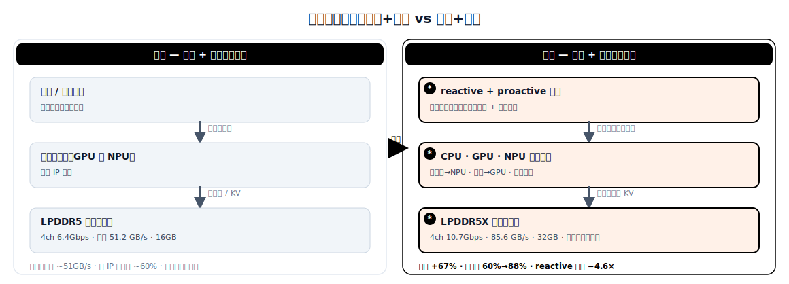

# Memory Bandwidth for On-Device AI Inference: From "Narrow Pipe + Exclusive" to "Wide Pipe + Saturated"

> This document treats the **memory-bandwidth wall** of on-device LLM inference as a single through-line connecting two complementary fronts: the **supply side** — the DRAM standard evolving from LPDDR5 (6.4 Gbps) to LPDDR5X (10.7 Gbps, 32 GB packages, load-adaptive power) widens the "pipe"; and the **utilization side** — the inference engine evolving from single-accelerator exclusivity to CPU/GPU/NPU heterogeneous co-scheduling "saturates" that wide pipe. The *original* solution = LPDDR5's narrow pipe + single-IP exclusivity (bandwidth is both insufficient and underused); the *evolved* solution = LPDDR5X's wide pipe + bandwidth-aware multi-IP co-scheduling (both widened and saturated). It covers JEDEC standards, vendor materials (Samsung, SK Hynix, Micron, Qualcomm, Intel, MediaTek), and 2023–2026 academic progress (SOSP'25, ASPLOS'25, arxiv).

## 1. Scope and method

**Domain definition.** The **memory-bandwidth** problem of LLM inference on resource-constrained terminals (phones, tablets, laptops, edge boards), with two inseparable faces:

- **Supply** — how much bandwidth, capacity, and energy efficiency low-power mobile DRAM (LPDDR5/5X) provides as the main-memory subsystem;
- **Utilization** — how a unified-memory SoC schedules across heterogeneous compute IPs (CPU, GPU, NPU) so that the shared DRAM bus's bandwidth is actually consumed in full.

Both faces share one physical bottleneck: during autoregressive decode, generating each token requires reading the model weights from DRAM once in full, so tokens/s is roughly linear in *effective* memory bandwidth — and "effective bandwidth" is bounded both by how much DRAM can deliver (supply) and by how much the compute side can extract (utilization).

**What "original" and "evolved" mean here.** The *original* is "narrow pipe + exclusive": LPDDR5 at 6.4 Gbps delivers ~51 GB/s across four channels, 16 GB max per package, fixed-step DVFS; inference runs entirely on one compute IP (GPU-only like MNN/MLC, or NPU-only like llm.npu) while the others sit idle, and a single IP can use only ~60% of the DRAM bus. The *evolved* is "wide pipe + saturated": LPDDR5X at 10.7 Gbps delivers ~85.6 GB/s across four channels, up to 32 GB per package, load-adaptive power scaling; inference is split by a bandwidth-aware scheduler that dispatches prefill (GEMM) and decode (GEMV) to NPU/GPU in parallel, sharing the KV cache zero-copy through unified physical memory, pushing bus utilization to ~88%.

**Sources.** ~20 primary sources in three families: (a) heterogeneous scheduling and on-device inference systems — HeteroInfer (SOSP'25), Agent.xpu, mllm-NPU (ASPLOS'25), PowerInfer-2, HeRo, ShadowNPU, RooflineBench; (b) memory standards and devices — JEDEC JESD209-5C, the LPDDR5X/LPDDR6 announcements from Samsung / Micron / SK Hynix, Synopsys / Semi Engineering analyses, CD-PIM; (c) platforms and status reports — Qualcomm Snapdragon, Intel Core Ultra, MediaTek Dimensity, On-Device LLM State of the Union. These span peer-reviewed systems papers, open-source runtime docs, and SoC/DRAM vendor datasheets.

## 2. Problem background

**What the system needs to do.** Run 1B–8B (and scaling toward 13B–30B) parameter LLMs locally on phones or edge SoCs with 8–32 GB shared DRAM: deliver low-latency responses to interactive (reactive) queries (fluent conversation needs >15–20 tok/s) and high throughput to background (proactive) tasks (summarization, RAG indexing, agent pipelines), while keeping the memory subsystem's power inside the battery device's thermal-design envelope (typically 3–8 W for the whole device).

**Why this domain becomes hard — the bottleneck's two faces.**

- *Insufficient supply.* On-device decode is memory-bandwidth-bound: each token requires reading the weight matrix from DRAM in full [CD-PIM]. A 7B model's INT4 weights are ~3.5 GB; at LPDDR5's ~51.2 GB/s across four channels, the theoretical ceiling is only ~14 tok/s, and ~9 tok/s after 60–70% real efficiency — below the fluent-interaction threshold. LPDDR5's 16 GB package cap leaves only 10–12 GB after OS/apps (Android ~4–6 GB), too little to hold 13B INT4 weights + KV cache + activations together. Its burst-oriented DVFS also thermally throttles under sustained high-bandwidth AI inference.

- *Underused utilization.* Even when DRAM can deliver more, a single accelerator cannot consume it. Modern SoCs (Snapdragon 8 Gen 3, Intel Core Ultra) integrate three-plus IP classes — CPU, mobile GPU, dedicated NPU — but existing engines treat them as mutually exclusive targets. LPDDR5X peaks at ~68 GB/s (measured), yet single-GPU decode uses only 40–45 GB/s (59–66%), leaving ~25 GB/s idle [HeteroInfer]. The NPU excels at fixed-shape INT8 GEMM (prefill) but degrades badly on dynamic-shape GEMV (decode); the GPU handles dynamic shapes but cannot saturate the bus alone.

**Why the original solution is no longer enough.** The two faces compound: pushing larger models into longer contexts, plus concurrent reactive/proactive agent streams, hits both the "not enough bandwidth" wall and the "bandwidth not used up" wall at once. Widening the pipe alone (LPDDR5X) still leaves a single IP using only six-tenths; improving scheduling alone still pins the physical ceiling at ~51 GB/s. The two must be attacked together.

## 3. Specific problems and bottleneck evidence

### Supply-side problems (how much DRAM can deliver)

1. **Bandwidth ceiling caps token generation rate** — At LPDDR5's 51.2 GB/s four-channel peak, a 7B INT4 model tops out at ~14 tok/s theoretically and ~9 tok/s measured, below the 15–20 tok/s fluent-interaction threshold [CD-PIM].
2. **Package capacity caps deployable model size** — LPDDR5 maxes at 16 GB per package; after OS/apps only 10–12 GB remain, limiting real deployment to 7B INT4 and excluding the much stronger 13B+ models [Samsung LPDDR5X].
3. **Power/thermal inefficiency under sustained AI load** — DVFS is designed for bursty mobile use; sustained inference keeps DRAM in a high-bandwidth state unable to drop into low-power, and after 30–60 s of continuous inference thermal throttling cuts effective bandwidth another 20–30% [Semi Engineering].
4. **Multimodal doubles bandwidth demand** — Vision-language models (e.g. LLaVA-7B) need ~2× the bandwidth of text-only when processing multimodal input, exceeding LPDDR5's effective throughput [Synopsys].

### Utilization-side problems (how much compute can extract)

5. **Single accelerator wastes bandwidth** — On Snapdragon 8 Gen 3, GPU-only decode uses only 40–45 GB/s of the 68 GB/s bus (59–66%); GPU+NPU concurrency reaches ~60 GB/s (88%), a 37% bandwidth gain [HeteroInfer].
6. **NPU cannot handle dynamic decode shapes efficiently** — The NPU systolic array is fixed at 32×32; any activation dimension below 32 incurs the same latency as 32. Batch-1 GEMV decode triggers this "staircase" floor, making NPU-only decode slower than GPU [HeteroInfer].
7. **GEMV kernels degrade under concurrency; GEMM kernels tolerate it** — Memory-bound GEMV (decode) degrades sharply when sharing the bus with another high-bandwidth kernel; compute-bound GEMM (prefill) is not bandwidth-limited and stays efficient under concurrency [Agent.xpu].
8. **No stream-level concurrency or priority** — Existing engines (llama.cpp, MNN, MLC) assume a single inference and cannot distinguish reactive from proactive; a background summarization blocks interactive queries [Agent.xpu].
9. **NPU graph compilation is too slow for dynamic inputs** — On Snapdragon 8 Gen 3 at seq_len=135, online NPU graph generation costs 408.4 ms, making naive dynamic-shape NPU inference slower than GPU-only [HeteroInfer].

### Bottleneck evidence

**Supply side (bandwidth/capacity gap, LPDDR5 baseline)**

| Scenario | Required | LPDDR5 can provide | Gap | Source |
|---|---|---|---|---|
| 7B INT4, 20 tok/s target | ~70 GB/s effective | ~35 GB/s (70% eff.) | −50% | [CD-PIM] |
| 13B INT4 + KV cache (8K ctx) | ~8.5 GB capacity | 10–12 GB usable (16 GB pkg) | razor-thin | [Samsung LPDDR5X] |
| Sustained inference 60 s | ~51 GB/s sustained | ~36 GB/s (after throttling) | −30% | [Semi Engineering] |
| Multimodal pipeline (vision+LLM) | ~80 GB/s burst | ~51 GB/s peak | −36% | [Synopsys] |
| 4 concurrent agents, 7B each | ~14 GB capacity | 10–12 GB usable | OOM at agent 3 | [On-Device LLM Survey] |

**Utilization side (single-IP vs heterogeneous, Snapdragon 8 Gen 3 / Intel Core Ultra)**

| Scenario | Metric | Single IP | Heterogeneous | Delta | Source |
|---|---|---|---|---|---|
| Decode, Llama-8B | DRAM bandwidth use | 40–45 GB/s (GPU) | ~60 GB/s (GPU+NPU) | +37% BW | [HeteroInfer] |
| Decode, Llama-8B | Throughput | 9.3 tok/s (MNN GPU) | 14.0 tok/s (HeteroInfer) | 1.50× | [HeteroInfer] |
| Prefill 256 tok, Llama-8B | Throughput | 42.4 tok/s (MNN GPU) | 247.9 tok/s (HeteroInfer) | 5.85× | [HeteroInfer] |
| Mixed agent load | Reactive latency | 1× (llama.cpp CPU) | 0.22× (Agent.xpu) | 4.6× lower | [Agent.xpu] |
| NPU online graph gen, seq=135 | Compile latency | 408.4 ms | 0 ms (offline pre-compile) | eliminated | [HeteroInfer] |

## 4. Architectures: original vs evolved



*Figure: original vs evolved architecture at a glance (the detailed ASCII version follows below).*

**Original — narrow pipe (LPDDR5) + single-accelerator exclusivity**

```
    user request
         |
         v
    +-----------+        +---------------------+
    |  runtime   |        | LPDDR5 mem subsystem |
    | (MNN/MLC/  |<------>| 4ch x16, 6.4 Gbps    |
    |  llm.npu)  | wts/   | peak 51.2 GB/s       |
    +-----------+ KV     | 16 GB max            |
         |               | fixed-step DVFS      |
         | all layers → one IP +----------------+
         v
    +-------------------+
    |  single accelerator|   other IPs idle
    |  (GPU or NPU)     |   (NPU/CPU or GPU/CPU)
    |  prefill: GEMM    |
    |  decode:  GEMV    |
    +-------------------+
    [supply: 51 GB/s physical ceiling]
    [utilization: 59-66% (single IP)]
    [no preemption, no priority; throttles under sustained load]
```

*Original: physical bandwidth pinned at ~51 GB/s, and a single IP uses only six-tenths of even that; sustained AI load is further eroded by DVFS/thermal throttling.*

**Evolved — wide pipe (LPDDR5X) + heterogeneous multi-IP co-scheduling that saturates it**

```
    user request ───────────────── background task
    (reactive, low latency)        (proactive, high throughput)
         |                                |
         v                                v
    +----------------------------------------------+
    | * stream-aware scheduler                      |
    |   - * priority queue (reactive > proactive)   |
    |   - * kernel-level preemption (<100 ms)       |
    |   - * bandwidth-pressure monitor (Pmem)       |
    +----------------------------------------------+
         |              |                 |
         v              v                 v
    +---------+   +----------+      +-----------+
    |  CPU    |   | * NPU    |      | * GPU     |
    | (outlier)|  | (prefill |      | (decode   |
    +---------+   |  GEMM)   |      |  GEMV)    |
                  +----------+      +-----------+
                       | * tensor partition / elastic bind |
                       v                                   v
    +--------------------------------------------------+
    | * LPDDR5X mem subsystem (unified phys mem, 0-copy KV) |
    |   4ch x16, 10.7 Gbps → peak 85.6 GB/s            |
    |   32 GB max; 12nm-class; DFE/pre-emphasis        |
    |   * load-adaptive DVFS / extended low-power / PASR|
    +--------------------------------------------------+
         * bandwidth-aware: low(<0.4) aggressive concurrency /
           mid(0.4-0.7) selective pairing / high(>=0.7) sequential, reactive-first
    [supply: 85.6 GB/s (+67%)]
    [utilization: ~88%; reactive latency -4.6x; power efficiency +25%]
```

*Evolved: the pipe is widened (LPDDR5X +67% bandwidth, 2× capacity, load-adaptive power) and simultaneously saturated by heterogeneous scheduling (prefill→NPU, decode→GPU, tensor partition, pressure-aware arbitration, kernel-level preemption). New/changed elements marked with `*`.*

## 5. Why the evolved solution helps, and what it still doesn't solve

### Why it helps

**Supply side (widen the pipe)**

- **Bandwidth ceiling** — LPDDR5X at 10.7 Gbps reaches 85.6 GB/s across four channels, +67% over LPDDR5; the 7B INT4 theoretical decode ceiling rises from ~14 to ~24 tok/s, comfortably past the interaction threshold. Snapdragon 8 Elite's LPDDR5X-9600 controller achieves 84.8 GB/s, and its on-die 18 MB HPM cache lifts effective bandwidth another 38% [Qualcomm Snapdragon 8 Elite].
- **Package capacity** — Samsung's 32 GB single-package LPDDR5X (8-layer stack, 12nm-class die) leaves ample room for 13B INT4 weights + OS + KV cache + activations, enabling higher-quality on-device models without a multi-chip configuration [Samsung LPDDR5X].
- **Energy efficiency** — Samsung reports 25% efficiency gains from 12nm process scaling + load-adaptive power; Micron's 1-gamma LPDDR5X achieves 20% power reduction at 10.7 Gbps (thinnest at 0.61 mm). Lower energy-per-bit means sustained high bandwidth no longer triggers thermal throttling [Micron 1-gamma LPDDR5X].
- **Signal integrity at higher rates** — DFE and TX pre-emphasis enable reliable 10.7 Gbps operation without raising I/O voltage (VDDQ stays 0.5 V), so +67% speed comes within an unchanged power envelope [Synopsys].

**Utilization side (saturate the wide pipe)**

- **Single accelerator wastes bandwidth** — GPU+NPU concurrency pushes DRAM utilization from 59–66% to ~88%, translating directly into a 1.50× Llama-8B decode speedup [HeteroInfer].
- **NPU cannot handle dynamic decode shapes** — Stage-aware scheduling routes prefill (GEMM, static) to the NPU and decode (GEMV, dynamic) to the GPU; HeteroInfer's activation-centric partition further splits a dynamic sequence into NPU-friendly fixed-length blocks + a GPU-handled remainder [HeteroInfer].
- **GEMV concurrency degradation** — Agent.xpu's three-tier bandwidth-pressure scheduling monitors Pmem in real time, going aggressive below 0.4 and sequential above 0.7, exploiting parallelism while preventing decode-GEMV degradation [Agent.xpu].
- **No stream-level concurrency** — Agent.xpu adds <100 ms kernel-level preemption (via operator chunking) + slack-aware backfill, cutting reactive latency 4.6× while lifting proactive throughput 1.6–6.8× [Agent.xpu].
- **NPU graph compilation too slow** — HeteroInfer's offline profiler-solver collaboration pre-compiles NPU graphs for all expected tensor shapes in <20 minutes, eliminating the 408.4 ms online compile cost [HeteroInfer].

### What it still doesn't solve

- **Thermal throttling under sustained dual-IP load** — Widening the pipe also raises power: GPU+NPU concurrency increases die temperature, and sustained performance under the mobile thermal envelope (skin temp <42 °C, DVFS throttling) is unmeasured, so real numbers may fall below benchmarks. Whether LPDDR5X's efficiency gains offset the higher absolute power at 10.7 Gbps is unverified in thin/foldable form factors.
- **Physical bandwidth is still low** — LPDDR5X's ~86 GB/s remains roughly an order of magnitude below desktop/discrete-GPU-class high-bandwidth memory; running 70B on-device at interactive speed stays infeasible, and the edge-friendly path is near-memory compute — CD-PIM proposes LPDDR5-based in-memory compute that could deliver 10–100× bandwidth gains [CD-PIM].
- **Cross-vendor portability** — HeteroInfer's offline profiler must be re-characterized per SoC (Snapdragon vs Dimensity vs Exynos), and Agent.xpu currently targets only Intel; no vendor-neutral heterogeneous-inference API exists. LPDDR5X also reuses LPDDR5's read/write command set, so the memory side cannot perceive AI access patterns (sequential weight streaming vs random KV access).
- **Accuracy impact of NPU INT8 quantization** — NPU paths usually require INT8 or lower precision; accuracy gap vs FP16 GPU inference is model-dependent and not systematically evaluated across diverse tasks (reasoning, code, multilingual).
- **OS-level resource arbitration** — Heterogeneous schedulers run in user space, blind to other apps contending for GPU/NPU (games, camera ISP, background ML); integration with Android NNAPI / iOS CoreML is unrealized.
- **Power savings don't stack** — When the KV cache is offloaded to flash (KVSwap, KVNAND), the DRAM savings from low-power intervals are partly offset by sustained flash I/O; dual-IP execution may also raise total energy via sync overhead and active-idle leakage. No public system-level Joules/token data exists.
- **LPDDR6 is near** — LPDDR6 (mass production expected mid-2026, ~14 Gbps/pin, ~2× LPDDR5X bandwidth, another 20% power savings) could shift smaller models' bottleneck back to compute, weakening the payoff of dual-IP bandwidth aggregation, while creating standard-coexistence procurement uncertainty for 2026–2027 devices [SK Hynix LPDDR6; Synopsys].

## 6. Comparison table

| Dimension | Original (LPDDR5 + single IP) | Evolved (LPDDR5X + heterogeneous) | Improvement | Source |
|---|---|---|---|---|
| Peak data rate (per pin) | 6.4 Gbps | 10.7 Gbps | +67% | [JEDEC JESD209-5C] |
| Four-channel peak bandwidth | 51.2 GB/s | 85.6 GB/s | +67% | [JEDEC JESD209-5C] |
| Max single-package capacity | 16 GB | 32 GB | +100% (2×) | [Samsung LPDDR5X] |
| Power efficiency (vs prev gen) | baseline | +25% (Samsung) / +20% (Micron) | −20~25% energy/bit | [Samsung; Micron 1-gamma] |
| Power management | fixed-step DVFS, deep sleep | load-adaptive DVFS, extended low-power, PASR | AI-aware power gating | [Samsung LPDDR5X] |
| DRAM bandwidth utilization (decode) | 59–66% (GPU-only, 40–45 GB/s) | ~88% (GPU+NPU, ~60 GB/s) | +37% absolute | [HeteroInfer] |
| Decode throughput (Llama-8B, SD 8 Gen 3) | 9.3 tok/s (MNN GPU) | 14.0 tok/s | 1.50× | [HeteroInfer] |
| Prefill throughput (Llama-8B, 256 tok) | 42.4 tok/s (MNN GPU) | 247.9 tok/s | 5.85× | [HeteroInfer] |
| End-to-end speedup (LongBench, prefill-heavy) | 1× (MNN-OpenCL) | 6.02× | 6.02× | [HeteroInfer] |
| Reactive latency (mixed agent load) | 1× (llama.cpp CPU) | 0.22× (Agent.xpu) | 4.6× lower | [Agent.xpu] |
| Proactive throughput (background) | 1× (llama.cpp CPU) | 1.6–6.8× (Agent.xpu) | 1.6–6.8× | [Agent.xpu] |
| 7B INT4 decode throughput (theoretical, supply only) | ~14 tok/s | ~24 tok/s | +71% | computed from bandwidth |
| NPU graph compilation | 408.4 ms online (seq=135) | 0 ms (offline pre-compile) | eliminated | [HeteroInfer] |

## 7. One-word characterization

**Saturate** (榨满) — on-device inference attacks the memory-bandwidth wall from both ends: the supply side widens the pipe (LPDDR5X +67% bandwidth, 2× capacity, +25% efficiency), and the utilization side saturates it (heterogeneous co-scheduling lifts DRAM utilization from ~60% to ~88%, cutting reactive latency 4.6×). Neither alone suffices — widen without scheduling and a single IP still uses six-tenths; schedule without widening and the physical ceiling stays at ~51 GB/s.

## 8. Open questions and caveats

- **Real AI-inference energy and thermal sustainability** — Vendor efficiency figures (20–25%) and paper benchmarks (1.5–6× speedups) are mostly burst/marketing numbers; per-token energy and sustained throughput under production-phone sustained inference and the mobile thermal envelope (skin temp <42 °C) are independently unmeasured, and DVFS throttling may erode the speedups.
- **Effective bandwidth under contention** — A flagship SoC's LPDDR5X bandwidth is shared by CPU/GPU/NPU/ISP/display; published peaks assume exclusive access, real AI-inference bandwidth after OS and display contention may be only 50–70% of peak, and its interaction with user-space heterogeneous schedulers is unmeasured.
- **Multi-model and multi-tenant scheduling** — Existing work mostly assumes a single LLM; a real agent device may run 2+ models concurrently (vision + language + speech), and cross-model heterogeneous scheduling is unexplored.
- **Capacity and cost** — 32 GB packages are in production, but most 2025 flagships still ship 12–16 GB; whether 24–32 GB becomes standard depends on whether on-device AI use cases justify the ~$15–25 BOM increase per added 8 GB. As models scale to 30B+, even 32 GB can be exhausted under multi-agent loads.
- **Generalization beyond Snapdragon/Intel** — HeteroInfer targets only Snapdragon, Agent.xpu only Intel Core Ultra; Dimensity, Exynos, and Apple Silicon have different NPU architectures (systolic-array sizes, quantization support, memory mapping), and portability is unverified.
- **Time window for architectural alternatives** — Both PIM (CD-PIM) and LPDDR6 could change the landscape before LPDDR5X's natural end of life; this document's "wide pipe + saturated" is an evolutionary refinement buying on-device AI a 2–3 year runway, not an endgame.

## 9. References

### Heterogeneous scheduling and on-device inference systems

1. **HeteroInfer** — Chen et al., 2025. "Characterizing Mobile SoC for Accelerating Heterogeneous LLM Inference." ACM SOSP 2025 / arxiv 2501.14794. URL: https://dl.acm.org/doi/10.1145/3731569.3764808
2. **Agent.xpu** — Authors, 2025. "Agent.xpu: Efficient Scheduling of Agentic LLM Workloads on Heterogeneous SoC." arxiv 2506.24045. URL: https://arxiv.org/abs/2506.24045
3. **mllm-NPU** — Xu et al., 2025. "Fast On-device LLM Inference with NPUs." ACM ASPLOS 2025. URL: https://dl.acm.org/doi/10.1145/3669940.3707239
4. **PowerInfer-2** — Authors, 2024. "PowerInfer-2: Fast Large Language Model Inference on a Smartphone." arxiv 2406.06282. URL: https://arxiv.org/abs/2406.06282
5. **HeRo** — Authors, 2026. "HeRo: Adaptive Orchestration of Agentic RAG on Heterogeneous Mobile SoC." arxiv 2603.01661. URL: https://arxiv.org/abs/2603.01661
6. **ShadowNPU** — Authors, 2025. "ShadowNPU: System and Algorithm Co-design for NPU-Centric On-Device LLM Inference." arxiv 2508.16703. URL: https://arxiv.org/abs/2508.16703
7. **RooflineBench** — Authors, 2026. "RooflineBench: A Benchmarking Framework for On-Device LLMs via Roofline Analysis." arxiv 2602.11506. URL: https://arxiv.org/abs/2602.11506

### Memory standards and devices

8. **JEDEC JESD209-5C** — JEDEC Solid State Technology Association, 2023. "Low Power Double Data Rate (LPDDR) 5/5X." URL: https://www.jedec.org/standards-documents/docs/jesd209-5c
9. **Samsung 10.7 Gbps LPDDR5X** — Samsung Semiconductor, 2024-04. "Samsung Develops Industry's Fastest 10.7Gbps LPDDR5X DRAM, Optimized for AI Applications." URL: https://semiconductor.samsung.com/news-events/news/samsung-develops-industrys-fastest-gbps--lpddr5x-dram-optimized-for-ai-applications/
10. **Samsung Thinnest LPDDR5X** — Samsung Semiconductor, 2024-08. "Samsung Begins Mass Production of Industry's Thinnest LPDDR5X DRAM Packages for On-Device AI." URL: https://semiconductor.samsung.com/news-events/news/samsung-begins-mass-production-of-industrys-thinnest-lpddr5x-dram-packages-for-on-device-ai/
11. **Samsung Automotive LPDDR5X** — Samsung Semiconductor, 2024. "Samsung's 12nm-Class Automotive LPDDR5X." URL: https://semiconductor.samsung.com/news-events/tech-blog/samsungs-12nm-class-automotive-lpddr5x-dram-for-safety-critical-centralized-automotive-systems/
12. **Samsung MediaTek Validation** — Samsung Semiconductor, 2024. "Samsung Completes Validation of Industry's Fastest LPDDR5X for Use with MediaTek's Flagship Mobile Platform." URL: https://semiconductor.samsung.com/news-events/news/samsung-completes-validation-of-industrys-fastest-lpddr5x-for-use-with-mediateks-flagship-mobile-platform/
13. **Micron 1-gamma LPDDR5X** — Micron Technology, 2025. "Micron Ships World's First 1-Gamma-Based LPDDR5X Enabling Rich On-Device AI." URL: https://www.stocktitan.net/news/MU/micron-ships-world-s-first-1-1-gamma-based-lpddr5x-enabling-rich-bdr3skeatdxp.html
14. **Micron LPDDR5X product page** — Micron Technology. "LPDDR5X: Memory performance that pushes the limits of what's possible." URL: https://www.micron.com/about/blog/memory/dram/lpddr5x-memory-performance-pushes-the-limits-of-whats-possible
15. **SK Hynix LPDDR6** — SK Hynix, 2025. "SK hynix Presents Leading AI Memory at COMPUTEX TAIPEI 2025." URL: https://news.skhynix.com/sk-hynix-showcases-hbm4-next-gen-ai-memory-at-computex-taipei-2025/
16. **CD-PIM** — Authors, 2025. "CD-PIM: A High-Bandwidth and Compute-Efficient LPDDR5-Based PIM for Low-Batch LLM Acceleration on Edge-Device." arxiv 2601.12298. URL: https://arxiv.org/pdf/2601.12298
17. **Synopsys LPDDR5X Specification** — Synopsys, 2024. "LPDDR5X Explained: Speed and Specification." URL: https://www.synopsys.com/blogs/chip-design/lpddr5x-specification-memory-design.html
18. **Synopsys LPDDR6 vs LPDDR5X** — Synopsys, 2025. "LPDDR6 vs LPDDR5X and LPDDR5: Key Differences and Benefits." URL: https://www.synopsys.com/blogs/chip-design/lpddr6-vs-lpddr5x-lpddr5-differences.html
19. **Semi Engineering LPDDR5X** — Semiconductor Engineering, 2024. "LPDDR5X: High Bandwidth, Power Efficient Performance For Mobile & Beyond." URL: https://semiengineering.com/lpddr5x-high-bandwidth-power-efficient-performance-for-mobile-beyond/

### Platforms and status reports

20. **Qualcomm Snapdragon 8 Gen 3** — Qualcomm, 2024. Product brief. URL: https://www.qualcomm.com/smartphones/products/8-series/snapdragon-8-gen-3-mobile-platform
21. **Qualcomm Snapdragon 8 Elite** — Qualcomm, 2025. "Snapdragon 8 Elite Gen 5 Product Brief." URL: https://www.qualcomm.com/content/dam/qcomm-martech/dm-assets/documents/Snapdragon-8-Elite-Gen-5-product-brief.pdf
22. **Intel Core Ultra** — Intel, 2024. "Intel Core Ultra Processors." URL: https://www.intel.com/content/www/us/en/products/details/processors/core-ultra.html
23. **On-Device LLM Survey** — V. Chandra et al., 2026. "On-Device LLMs: State of the Union." URL: https://v-chandra.github.io/on-device-llms/
