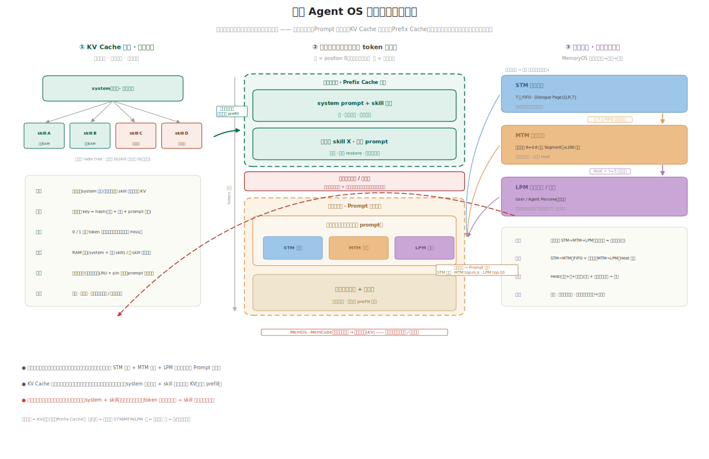
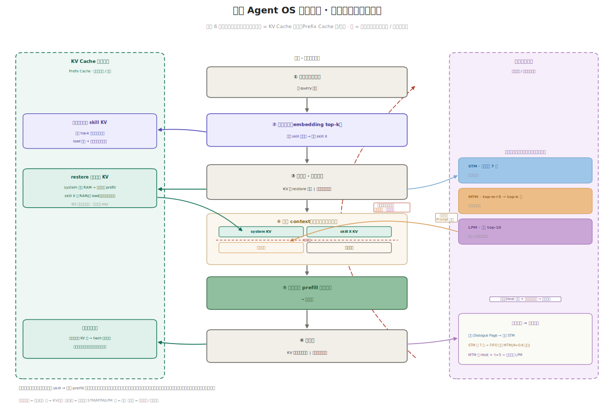

# 端侧 Agent OS 记忆系统：统合架构与使用流程

> 把本目录两篇拼成一张图。
> [on-device-agent-memory-system-CN](on-device-agent-memory-system-CN.md) 讲**明文记忆**（MemoryOS 三级 STM/MTM/LPM，外置可检索）；
> [prefix-cache-agent-notes](prefix-cache-agent-notes.md) 讲 **KV Cache 记忆**（system + skill 的前缀缓存）。
> 这里给出两者合一的**完整架构图**与**一轮对话的使用流程图**，并说明两类记忆为何组织/管理方式完全不同，却拼在同一条上下文里。

## 1. 一条主线：两类载体，两个阶段，一条上下文

记忆按**载体**分两类，组织与管理彻底不同，但最终都落到送进 LLM 的那条 token 序列上，中间隔着一条**命脉边界**：

- **KV Cache 记忆（激活载体）** → 服务 **Prefix Cache 阶段**：静态、全员共享、内容寻址，命中即**复用**前缀 KV，免去 prefill。
- **明文记忆（明文外置载体）** → 服务 **Prompt 拼装阶段**：动态、每用户每会话、检索式，命中后把文本**拼进** prompt 的动态尾巴。

| 维度 | KV Cache 记忆 | 明文记忆 |
|---|---|---|
| 载体 | 激活态 KV 张量（DRAM / flash） | 明文文本（flash / 向量库） |
| 组织 | 前缀树：system 为根 + skill 为分支 | 三级分层：STM → MTM → LPM |
| 索引 / 写入 | 内容寻址 `hash(模型+量化+prompt)`；0/1 精确前缀匹配 | LLM 抽取整合；FIFO + Heat 换页晋升 |
| 读取 | 最长前缀命中 → 零拷贝复用 | 三级召回：STM 全取 / MTM top-m,k / LPM 每类 top-10 |
| 治理 | LRU + pin；prompt 改即失效 | Heat（频率+量+新近度）提升 + 时间衰减淘汰 |
| 性质 | 静态 · 跨会话 · 全员共享（能力 / 语义记忆） | 动态 · 每用户每会话 · 运行时检索（情景 → 语义） |
| 在上下文里的位置 | **静态前缀**（position 0 起，位置固定） | **动态尾巴**（所有静态前缀之后） |
| 阶段 | Prefix Cache | Prompt 拼装 |

> 用 MemOS `MemCube` 的话讲：KV Cache 记忆 = **activation memory**，明文记忆 = **plaintext memory**，二者间还有一条「热点明文 → 注入激活」的提升桥。

## 2. 完整架构

*图. 左 = KV Cache 记忆的组织/管理（前缀树 + 内容寻址 + 两级常驻）；中 = 拼装出的上下文（静态前缀区 / 命脉边界 / 动态尾巴区）；右 = 明文记忆的三级细粒度（短/中/长期）。复现脚本：[assets/memory-system-arch.py](assets/memory-system-arch.py)。*

**左栏 · KV Cache 记忆怎么组织。** 一棵前缀树：`system prompt`（含 skill 清单）是根、全员共享，每个 skill 的完整 prompt 是在它之上的分支增量 KV。复杂度是 `O(skill 数)` 而非 `O(会话数)`。落盘 key = `hash(模型 + 量化 + prompt 文本)`，prompt 一改 hash 变、旧 KV 自动失效。两级常驻：system + 热门 skill 钉在 RAM，冷 skill 按需从盘 load，预计算后跨重启复用。

**右栏 · 明文记忆的三级细粒度。** 这是 MemoryOS 的主干，按时间尺度由近及远沉淀：

- **STM 短期记忆**：`{Q, R, T}` 的 Dialogue Page，7 页 FIFO，就是当前窗口工作集（直近上下文）。
- **MTM 中期记忆**：同话题页按 `θ=0.6` 聚成 Segment（≤200 段），是对话事件历史（情景记忆），每段算 Heat。
- **LPM 长期记忆 / 画像**：User / Agent Persona，剥离了上下文的事实（如「对花生过敏」），是语义记忆，永久驻留。
- **写入晋升**：STM 满 7 页 → FIFO 挤入 MTM；MTM 段 `Heat > τ=5` → 换页晋升 LPM。**读取召回**：STM 全取、MTM 两阶段 top-m→top-k、LPM 每类 top-10，合并后注入。

**中栏 · 两者在同一条上下文里的分工。** 上半是静态前缀区（system KV + skill KV），下半是动态尾巴区（检索到的明文记忆 + 当前对话）。

> **命脉约束**：明文记忆必须排在**所有静态前缀之后**。一旦把它（或任何按用户变的东西）塞到 skill 之前，后面所有 token 位置整体偏移，RoPE 烤进 K 的绝对位置对不上，**预算好的 skill 分支缓存全废**。这是统合两套机制时最容易踩的坑。

## 3. 使用流程：一轮对话怎么走

*图. 主轴 6 步自上而下；左泳道 = KV Cache 记忆的取/写，右泳道 = 明文记忆的召回/沉淀。复现脚本：[assets/memory-system-flow.py](assets/memory-system-flow.py)。*

1. **用户新一轮输入** —— 新 query 到达。
2. **轻量路由（embedding top-k）** —— 只读 skill 的**短描述**（不读完整 prompt）选出 skill X；同时按 top-k 异步**预取**候选 skill 的 KV，让加载耗时藏进路由的决策时间。
3. **取记忆 · 并行两路** ——
   - **KV 侧**：`system` 常驻命中、`skill X` 从 RAM/盘 restore（或预取已就绪），0/1 精确前缀匹配。
   - **明文侧**：三级召回（STM 全取 / MTM top-m,k / LPM 每类 top-10），检索式、不重放全历史。
4. **组装 context（按命脉边界拼接）** —— `[system KV] + [skill X KV]` ─命脉边界─ `[明文记忆] + [对话尾巴]`。
5. **执行** —— 只对动态尾巴做 prefill，然后生成回复。前缀那段已被缓存与预取吃掉。
6. **双写回** ——
   - **KV 侧**：本轮新算的 KV 块 hash 后写回前缀缓存，下轮命中更长前缀。
   - **明文侧**：本轮问答打包成 Dialogue Page 压入 STM，触发 `STM →(满7页 FIFO) MTM →(Heat>τ) LPM` 的沉淀晋升。

> 「先路由后取 cache」不是循环悖论：**便宜的路由**（读短描述）先定 skill，**贵的 prefill** 只发生在执行那一轮，且大半被前缀缓存/预取省掉；明文记忆只在拼装阶段注入尾巴，绝不上移。

## 4. 一句话

**两类记忆，一条边界。** 能力/语义侧（system + skill）做成**静态前缀 KV 缓存**——内容寻址、跨会话复用、命中即免 prefill；情景→语义侧（用户事实/画像）做成**外置三级明文记忆**——检索式、动态、每轮拼进尾巴。把明文记忆牢牢关在所有静态前缀的下游，两套机制才能在端侧不足 4 GB 的 RAM 预算里同时成立。
