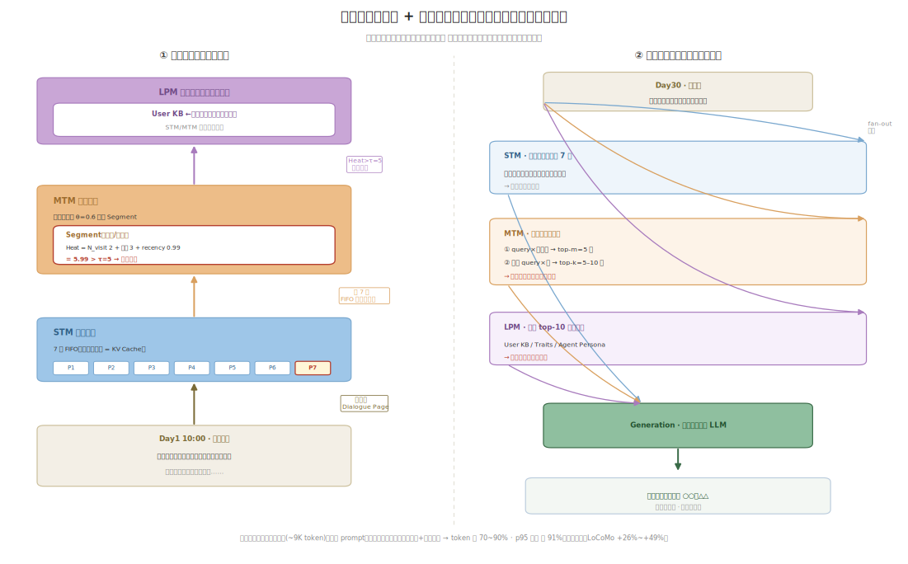

# On-Device Agent Memory Systems: From In-Context Memory to Externalized Hierarchical Memory

> This document studies how a long-horizon agent's *memory* is architected on terminal devices, one layer above raw KV-cache storage. It compares the original approach — the agent's only memory is the live context window (and its KV cache) — with the evolved approach: an externalized, hierarchical, self-managed memory system (a "memory OS") that keeps the live working set small while persisting and retrieving long-term memory on demand. Companion to [on-device-kv-cache-management](../on-device-kv-cache-management/on-device-kv-cache-management-EN.md), which covers the KV-cache storage tier below this one.

## 1. Scope and method

**Domain definition.** Memory architecture for autonomous/assistant LLM agents that run multi-session, long-horizon workloads on resource-constrained devices (smartphones, PCs, edge boards). "Memory" here means everything the agent must recall across turns and sessions: the live conversational context, episodic event history, distilled facts, and user persona. The question is *where that memory lives* and *how it is written, retrieved, and evicted* — not just how the KV tensor is stored.

**What "original" and "evolved" mean here.** The *original* solution is **in-context memory**: the agent's memory *is* the context window. History is replayed verbatim into the prompt every turn; the KV cache is the only durable state, and it is discarded at session end. The *evolved* solution is an **externalized hierarchical memory system**: a small bounded working context plus external memory tiers (short-/mid-/long-term, or episodic/semantic/persona) with LLM-driven extraction and consolidation, retrieval-on-demand, and heat/decay-based governance — exemplified by MemGPT, Mem0, MemOS, and MemoryOS, with KV-cache reuse/persistence as the bottom tier.

**Sources.** 13 primary sources: 7 academic papers (NeurIPS 2025, EMNLP 2025, arXiv 2023–2026), 2 benchmark references (LOCOMO, LongMemEval), 2 on-device status reports (Edge AI Vision 2026, On-Device LLMs State of the Union 2026), and 2 system references (CacheBlend/prompt-cache reuse, the companion KV-cache survey). Families: agent-memory systems, KV-cache reuse, on-device-constraint reports, and benchmarks.

## 2. Problem background

**What the system needs to do.** Let an on-device agent hold a coherent, personalized conversation and task history across many sessions (days to months) without forgetting, while running inside a phone's RAM and power budget.

**Why this domain becomes hard.** The context window is finite, and the KV cache that backs it grows linearly with the number of tokens kept in context. Mobile decode is memory-bandwidth-bound — mobile NPUs deliver 50–90 GB/s versus 2–3 TB/s on data-center GPUs, a 30–50× gap [Edge AI Vision 2026]. Usable RAM is often under 4 GB after OS overhead, and at long context the KV cache can exceed the model weights themselves [Edge AI Vision 2026]. So you cannot just keep the whole history in context.

**Why the original solution is no longer enough.** Agentic, multi-session use breaks the "one prompt, short context" assumption: replaying full history makes token cost and latency grow without bound, while truncating it makes the agent forget — and neither path fits a fixed RAM budget [Mem0; MemGPT].

## 3. Specific problems and bottleneck evidence

### Specific problems

1. **Finite context window caps long-horizon recall** — The agent can only "remember" what fits in the window; beyond it, truncation forgets and full retention overflows RAM, since at long context the KV cache can exceed model-weight size on a <4 GB usable-RAM phone [Edge AI Vision 2026; MemGPT].
2. **Full-context replay is expensive** — Feeding the entire history every turn costs >10× the tokens and ~11× the p95 latency of a memory-augmented agent on long sessions [Mem0].
3. **Naive KV/prefix reuse loses accuracy** — Approximate reuse such as CacheBlend is 7–18% less accurate than full prefill, and exact-match prefix caches break on minor token variation, so you cannot cheaply "paste back" old context [CacheBlend; prefix-reuse study].
4. **No cross-session consolidation** — Without an external store, agents fail multi-hop and temporal-reasoning questions over long dialogues; this is exactly where dedicated memory systems gain the most on LOCOMO [Mem0; MemoryOS].
5. **Unbounded memory growth without governance** — A naive append-only memory degrades retrieval quality as it grows; systems need heat/recency-based promotion and eviction (e.g. MemoryOS Heat threshold τ=5) to stay bounded [MemoryOS; survey].

### Bottleneck evidence

| Metric | Original (in-context / full replay) | Evolved (externalized memory) | Source |
|---|---|---|---|
| Token cost on long session | 100% (full history) | <10% (>90% saved) | [Mem0] |
| p95 latency vs full context | 1.0× | 0.09× (−91%) | [Mem0] |
| LOCOMO token consumption (MemOS) | 15.6 M | 4.4 M (−70%) | [MemOS] |
| LoCoMo answer accuracy (LLM-Judge) | OpenAI-memory baseline | +26% (Mem0) | [Mem0] |
| Mobile vs datacenter mem bandwidth | 50–90 GB/s (phone) | 2–3 TB/s (DC GPU) | [Edge AI Vision] |

The evidence point that proves the bottleneck: on long sessions the *original* path costs >10× the tokens and ~11× the p95 latency, and its KV cache can exceed model weights on a phone with <4 GB usable RAM. The fix is not a faster cache — it is moving most memory out of the live context.

## 4. Architectures: original vs evolved

**Original — In-context memory (history lives in the window)**

```
   +--------+   send full history   +-------------------+
   |  User  | --------------------> |   Agent (LLM)     |
   +--------+                       |  context window   |
       ^                            +-------------------+
       |  reply                          |   write
       |                                 v
       |                        +-----------------------+
       +----------------------- |  KV Cache (DRAM)      |
            stream tokens       |  grows O(n) w/ history|
                                +-----------------------+
                                         |
                                         | on overflow:
                                         v
                                +-----------------------+
                                | truncate (forget)     |
                                | or OOM (>RAM budget)  |
                                +-----------------------+
   (External store: absent — the window IS the memory)
```

*Original: the context window is the only memory; KV cache grows O(n) until it is truncated (forgetting) or overflows RAM.*

**Evolved — Externalized hierarchical memory (memory OS)**

```
   +--------+   query + turn        +-------------------+
   |  User  | --------------------> |   Agent (LLM)     |
   +--------+                       | * bounded working |
       ^                            |   context (small) |
       |  reply                     +-------------------+
       |                             |  write     ^  read
       |                             v            | * retrieve (top-k)
       |                    +-----------------+    |
       +------------------- | KV Cache (DRAM) |    |
            stream tokens   | * bounded set + |    |
                            | * reuse/persist |    |
                            +-----------------+    |
                                 |                 |
                    * extract /   |                 |
                      consolidate v                 |
                    +------------------------------------------+
                    | * External Memory Store (flash / vec DB) |
                    |   STM (short)  ->  MTM (mid)  -> LTM/Persona
                    |   * promote (heat/recency), * evict/decay |
                    +------------------------------------------+
```

*Evolved: a small bounded working context backed by a tiered external store; the agent writes via extract/consolidate, reads via retrieve, and governs size via heat/decay promotion and eviction. New/changed elements marked `*`.*

## 5. Why evolved helps, what it still doesn't solve

### Why the evolved solution helps

- **Finite context window caps long-horizon recall** — Externalizing memory into tiers (STM/MTM/LTM) decouples total recall from window size; MemoryOS caps the live working set at 7 dialogue pages, so the KV cache stays bounded no matter how long the history grows [MemoryOS].
- **Full-context replay is expensive** — Retrieving only relevant memories instead of replaying everything saves >90% of token cost and 91% of p95 latency [Mem0], and cuts LOCOMO token consumption 70% (15.6 M → 4.4 M) [MemOS].
- **Naive KV/prefix reuse loses accuracy** — A memory OS sidesteps brittle cache-paste by promoting hot plaintext memory into activation (KV) memory through a managed path (MemOS Next-Scene Prediction / KV-based activation injection) rather than approximate fusion [MemOS].
- **No cross-session consolidation** — LLM-driven extract→update (ADD/UPDATE/DELETE/NOOP in Mem0; FIFO + heat promotion in MemoryOS) maintains a consistent long-term store, lifting LoCoMo accuracy +26% (Mem0) and F1 +49.11% (MemoryOS) [Mem0; MemoryOS].
- **Unbounded memory growth without governance** — Heat/recency thresholds (MemoryOS τ=5 with time decay μ=1e7 s) promote and evict memories so retrieval quality does not degrade as the store grows [MemoryOS].

### What it still doesn't solve

- **Retrieval misses still cause forgetting** — If the retriever fails to surface the relevant memory, the agent forgets even though the fact is stored; retrieval quality (precision only 31.68% even after MemOS gains) is the new ceiling [MemOS].
- **Write-side overhead is extra on-device compute** — Extraction/consolidation runs additional LLM calls per turn, which is real energy and latency on a battery device — a cost the original in-context path does not pay [Mem0].
- **Embedding store and vector index cost RAM/flash** — The external memory, its embeddings, and the ANN index consume their own device storage and memory bandwidth; no published on-device footprint budget exists [survey; on-device 2026].
- **No standard on-device memory API** — MemGPT/Mem0/MemOS/MemoryOS use incompatible schemas; memories are not portable across runtimes or devices, and none is co-designed with mobile OS memory management (LMKD, zram) [survey].

## 6. Comparison table

| Dimension | Original (in-context / full replay) | Evolved (externalized memory OS) | Improvement | Source |
|---|---|---|---|---|
| Token cost per long-session query | 100% (full history) | <10% of history tokens | −90%+ | [Mem0] |
| p95 response latency | 1.0× (full context) | 0.09× | −91% | [Mem0] |
| LOCOMO token consumption | 15.6 M tokens | 4.4 M tokens | −70% | [MemOS] |
| LoCoMo accuracy (LLM-as-Judge) | OpenAI-memory baseline | +26% relative | +26% | [Mem0] |
| LoCoMo F1 (GPT-4o-mini) | baseline = 1.0× | +49.11% | +49.11% | [MemoryOS] |
| Live working-set size | grows O(n) with history | 7 dialogue pages (fixed) | bounded (no change in n) | [MemoryOS] |
| Memory retrieval precision | n/a (no store) | 31.68% (after −70% tokens) | +7.95 pts vs 23.73% | [MemOS] |
| Memory write cost | 0 extra LLM calls | +1 extract/update call per turn | −(added inference) | [Mem0] |

## 7. One-word characterization

**Externalized** (外置化) — agent memory moves out of the fixed context window into a retrieved, self-managed external store, which bounds the live working set (MemoryOS: 7 pages) and cuts long-session token cost by 70–90% while *raising* recall accuracy (+26% to +49% on LoCoMo) — the only way long-horizon agents fit a phone's <4 GB usable-RAM budget.

## 8. Open questions and caveats

- **On-device footprint is unmeasured** — All headline numbers (Mem0, MemOS, MemoryOS) come from cloud/server LLMs; nobody has published the RAM/flash/energy cost of running the extractor + embedder + vector index on a phone alongside the base model.
- **Retrieval is the new bottleneck** — Precision tops out around 31.68% even in the best system; a missed retrieval is indistinguishable from forgetting, so end-to-end task accuracy may not track the benchmark gains.
- **Benchmark drift** — LOCOMO/LoCoMo turn and token counts are reported inconsistently (≈300 turns/≈9K tokens vs ≈600 turns/≈16K tokens across sources); recheck the exact split before quoting.
- **Activation↔plaintext promotion is immature** — MemOS's KV-based activation injection is the cleanest bridge to the KV-cache tier, but on-device promotion/demotion policy, coherence, and security are unspecified.
- **Privacy of persisted memory** — Externalized persona/episodic memory on flash is long-lived personal data; encryption, secure deletion, and user-visible governance are unaddressed.
- **Recheck next year** — Whether JEDEC/OS vendors expose a standard memory-API surface, and whether on-device-native memory systems (vs ported server systems) appear.

## 9. Case study: the internal structure of MemoryOS, and its isomorphism with the KV tier

This section dissects MemoryOS (EMNLP 2025 Oral) — cited repeatedly above — layer by layer, as the most public, verifiable real implementation of an "externalized hierarchical memory system."

**Core idea.** Bring the OS's **tiered storage + paging** to agent memory. The smallest unit is not a token but one complete Q&A turn (a Dialogue Page); the time scale is per session. On LoCoMo it gains F1 **+49.11%** and BLEU-1 **+46.18%** (GPT-4o-mini) [MemoryOS].


*Figure. MemoryOS's three-tier storage spine (STM→MTM→LPM, sedimenting/promoting downward) + the four modules on the right (Storage/Updating/Retrieval/Generation) + retrieval recall and the Heat formula. Reproduction script: [assets/memoryos-arch.py](assets/memoryos-arch.py).*

### Structure, layer by layer

| Tier | Structure | Capacity / rule |
|---|---|---|
| **STM (short-term)** | FIFO queue of Dialogue Pages = `{Q, R, T, meta_chain}` | **7 pages**, oldest evicted when full |
| **MTM (mid-term)** | Same-topic pages grouped into Segments by similarity **θ=0.6** | **≤200 segments**, each scored by Heat |
| **LPM (long-term persona)** | User Persona + Agent Persona | User KB 100-entry FIFO; User Traits **90 dims** (3 categories); Agent Traits 100-entry FIFO |

### Four modules = three data flows

| Module | Responsibility | Key rule |
|---|---|---|
| **Storage** | Three-tier hierarchical organization | STM / MTM / LPM |
| **Updating** | Write + promote | STM→MTM: FIFO + topic chain; MTM→LPM: Heat>τ=5 segment paging |
| **Retrieval** | Three-tier recall | STM: all pages; MTM: two-stage (top-m=5 segments → top-k=5–10 pages); LPM: top-10 per category |
| **Generation** | Assemble the prompt | Merge three-tier recall, then feed the LLM |

### Heat promotion formula (decides which mid-term memories "page" into long-term persona)

```
Heat(segment) = α·N_visit + β·L_interaction + γ·R_recency      (α = β = γ = 1)
              = retrieval count + pages in segment + exp(-Δt / 1e7)
promote when: Heat > τ (= 5)
```

This mirrors the OS rule where "access frequency + residency + recency" decides whether a page stays resident — **hot memories sediment upward into the persona, cold ones decay over time**.

### A worked example: the life of one memory, and one retrieval hit

The tables above give the structure and the rules, but never walk the action through once. Trace one concrete fact — *"the user is allergic to peanuts"* — through both the **write path (how the mechanism runs)** and the **read path (how matching works)**.



*Figure. Left: the write path — one memory sediments bottom-up from a Q&A turn into the permanent persona. Right: the read path — a new query is recalled across three tiers, then merged and generated. Reproduction script: [assets/memory-lifecycle.py](assets/memory-lifecycle.py).*

**Write path: the life of one memory (sedimenting/promoting bottom-up)**

> Day 1, 10:00 — User: "I'm allergic to peanuts, plan next week's meals." Assistant: "Sure, peanuts excluded…"

1. **Pack into a Dialogue Page, push into STM.** The turn is packed into one page `{Q, R, T, meta_chain}` (the smallest unit is one Q&A, not a token) and pushed into STM's 7-page FIFO queue. STM *is* the live working set in the window — it maps to the KV cache, and stays capped at 7 pages no matter how many months of history accrue. Bounded.
2. **STM full → oldest page evicted into MTM.** When the 8th turn arrives, the oldest page is popped and migrates into MTM. Its vector is compared against each Segment's centroid: **cosine similarity > θ=0.6 merges it into that segment** (here, the "diet/constitution" segment); otherwise it starts a new one.
3. **Heat accrues → crosses τ=5 → paged up into LPM.** The "diet" segment reaches `Heat = N_visit 2 + pages-in-segment 3 + R_recency 0.99 ≈ 5.99 > τ=5`, triggering promotion. Note `R_recency = exp(−Δt/1e7)` only ranges over 0–1 (time constant ≈116 days), so promotion is really driven by "retrieval count + pages in segment"; recency is just a "goes cold if untouched" decay term. After promotion, "allergic to peanuts" settles into LPM's User KB and survives any churn in STM/MTM.

**Read path: one retrieval hit (three-tier recall, no full replay)**

> Day 30 — User: "Recommend a few dishes for a weekend family dinner."

The query is embedded into a vector, and each tier recalls its own way:

- **STM**: no matching — the most recent 7 pages are carried in wholesale (recent context).
- **MTM**: two stages — ① query vector × each segment centroid → top-m=5 segments; ② within those 5, query × each page → top-k=5–10 pages. Hits the page "dislikes cilantro."
- **LPM**: top-10 per category (User KB / Traits / Agent Persona) by semantic match. Hits the "allergic to peanuts" trait.

Generation merges the three-tier recall into the LLM → "(peanut-free, light on cilantro) I recommend ○○, △△." It does not replay the ~9K-token full history, only the few hit pages + a few persona lines — that is where the 70–90% token saving, 91% p95-latency cut, and *higher* accuracy come from.

**The core of "matching," and the two things not to conflate.** Both are cosine similarity at heart, but **θ=0.6 is a write-time threshold** deciding "merge this page into an existing segment or start a new one," while **top-m / top-k are read-time rankings** that narrow "segment first, then page." That is MemoryOS's "cluster by threshold, narrow by ranking."

**Contrast with Mem0 as another take on "matching."** Mem0 has no tiers / FIFO / Heat: on write an LLM extracts facts and issues ADD/UPDATE/DELETE/NOOP against existing memory (allergy info changed → UPDATE, duplicate → NOOP); on read it pulls top-k purely by semantic nearest-neighbor from a single vector store. Same externalized, retrieval-based memory, but MemoryOS is OS-style tiering + heat paging, while Mem0 is a flat vector store + LLM consolidation.

### Structural isomorphism with the underlying KV cache (joined into one layer by MemOS `MemCube`)

Overlay this memory system with the underlying KV cache management and they are **the same architecture instantiated at different layers** — the latter is dissected in the companion doc [on-device-kv-cache-management](../on-device-kv-cache-management/on-device-kv-cache-management-EN.md), Section 9 (vLLM PagedAttention):

| Dimension | PagedAttention (KV / activation layer) | MemoryOS (semantic / memory layer) |
|---|---|---|
| Object managed | Activation-state KV (attention intermediate state) | Semantic memory (facts / persona) |
| Smallest unit | KV Block (16 tokens) | Dialogue Page (one Q&A) |
| Time scale | Milliseconds / per token | Session / per turn |
| OS analogy | Virtual-memory **paging** | Tiered storage + **paging** |
| Eviction basis | LRU + reference count | Heat (frequency+volume+recency) + FIFO |
| Reuse mechanism | Prefix-block hash sharing | Topic-segment merge + persona sedimentation |

**Conclusion.** MemOS's `MemCube` formally joins these two layers — its **activation memory IS the KV-cache layer (what PagedAttention manages)** and its **plaintext memory IS the semantic-memory layer (what MemoryOS manages)**, with a defined "promote/demote" between them (hot plaintext memory → injected as KV). So "KV management" and "the memory system" are not two separate things architecturally, but the **lower layer (activation/KV)** and the **upper layer (semantic/persona)** of one memory hierarchy.

## 10. References

1. **MemGPT** — Packer et al., 2023. "MemGPT: Towards LLMs as Operating Systems." arXiv 2310.08560. URL: https://arxiv.org/abs/2310.08560
2. **Mem0** — Chhikara et al., 2025. "Mem0: Building Production-Ready AI Agents with Scalable Long-Term Memory." arXiv 2504.19413. URL: https://arxiv.org/abs/2504.19413. Local copy: [sources/mem0-2504.19413.md](sources/mem0-2504.19413.md)
3. **MemOS** — Li et al., 2025. "MemOS: A Memory OS for AI System." arXiv 2507.03724 (short version 2505.22101). URL: https://arxiv.org/abs/2507.03724. Code: https://github.com/MemTensor/MemOS. Local copy: [sources/memos-2507.03724.md](sources/memos-2507.03724.md)
4. **MemoryOS** — Kang et al., 2025. "Memory OS of AI Agent." arXiv 2506.06326, EMNLP 2025 Oral. URL: https://arxiv.org/abs/2506.06326. Code: https://github.com/BAI-LAB/MemoryOS. Local copy: [sources/memoryos-2506.06326.md](sources/memoryos-2506.06326.md)
5. **A-MEM** — Xu et al., 2025. "A-MEM: Agentic Memory for LLM Agents." arXiv 2502.12110, NeurIPS 2025. URL: https://arxiv.org/abs/2502.12110
6. **Memory in the Age of AI Agents: A Survey** — Liu et al., 2025. Paper list: https://github.com/Shichun-Liu/Agent-Memory-Paper-List
7. **Multi-Agent Memory from a Computer Architecture Perspective** — 2026. arXiv 2603.10062. URL: https://arxiv.org/pdf/2603.10062
8. **CacheBlend** — Yao et al., 2024/2025. "CacheBlend: Fast Large Language Model Serving for RAG with Cached Knowledge Fusion." arXiv 2405.16444. URL: https://arxiv.org/abs/2405.16444
9. **Prompt Cache** — Gim et al., 2024. "Prompt Cache: Modular Attention Reuse for Low-Latency Inference." MLSys 2024. URL: https://arxiv.org/abs/2311.04934
10. **KVFlow** — 2025. "KVFlow: Efficient Prefix Caching for Accelerating LLM-Based Multi-Agent Workflows." arXiv 2507.07400. URL: https://arxiv.org/html/2507.07400v1
11. **LOCOMO benchmark** — Maharana et al., 2024. "Evaluating Very Long-Term Conversational Memory of LLM Agents." URL: https://arxiv.org/abs/2402.17753
12. **On-Device LLMs in 2026** — Edge AI and Vision Alliance, 2026. URL: https://www.edge-ai-vision.com/2026/01/on-device-llms-in-2026-what-changed-what-matters-whats-next/
13. **On-Device LLMs: State of the Union, 2026** — V. Chandra, 2026. URL: https://v-chandra.github.io/on-device-llms/
14. **vLLM / PagedAttention (KV-layer counterpart)** — Kwon et al., 2023. "Efficient Memory Management for Large Language Model Serving with PagedAttention." SOSP 2023. URL: https://vllm.ai/blog/2023-06-20-vllm
