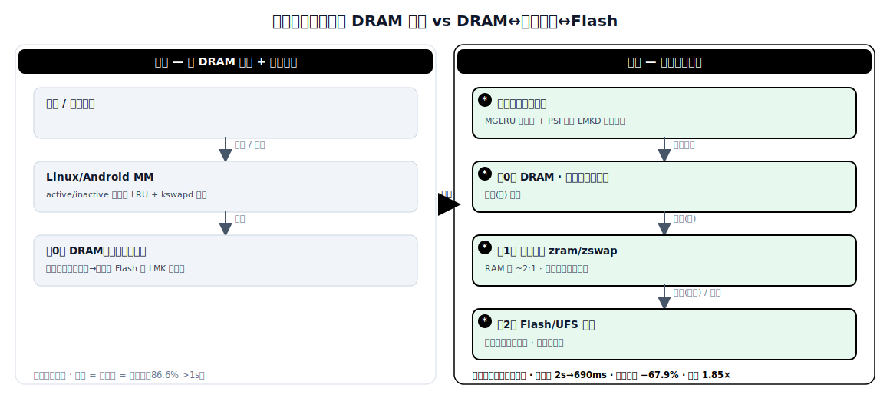

# 端侧分级内存管理：从 DRAM 单层回收到 DRAM↔压缩内存↔Flash 分级

> 本文对比端侧设备（手机、平板、PC、车机、边缘板）在有限 RAM 下的内存管理方案。原始方案是纯 DRAM 单层 + 通用全局回收 + 朴素换页，压力大了靠 OOM 杀进程；演进方案引入显式分级——DRAM ↔ 压缩内存（zram/zswap）↔ Flash/UFS 交换，用 MGLRU、降级/预取等访问感知机制做冷热放置。来源涵盖 2022–2026 内核社区（MGLRU、PSI、LMKD）、学术会议（DAC'24、ATC'25、FAST'25、MobiCom'26）和厂商实践（Apple 内存压缩、Samsung RAM Plus、华为 HyperSpace Memory）。

## 1. 范围与方法

**领域定义。** 资源受限的终端设备上，OS 如何把一块容量固定的物理 RAM 分到多个层级：DRAM（快、贵、容量小）↔ 压缩内存（zram/zswap，在 RAM 内以 ~2:1 压缩存放冷匿名页）↔ Flash/UFS 交换（慢、便宜、容量大）。核心问题：在固定 RAM 预算下，判断每个页面的冷热程度并放到对应层级——热页留 DRAM、冷页下沉到压缩或 Flash 层——在不杀进程的前提下撑住内存压力。

**"原始"与"演进"的含义。** *原始方案*：纯 DRAM 单层 + 通用全局回收。经典 active/inactive 两链表 LRU + kswapd 扫描，换页要么直接写 Flash 要么干脆不开 swap，没有分级可言。压力一上来，低内存杀进程（LMK）直接干掉后台应用，热应用被打回冷启动。*演进方案*：显式的端侧分级。DRAM ↔ 压缩内存（zram/zswap、Android RAM Plus、iOS/macOS 内存压缩器、华为 HyperSpace Memory）↔ Flash/UFS 交换，靠 MGLRU 多代际淘汰、按热度降级、预测式预取等访问感知机制，让工作集常驻 DRAM、冷页沉到压缩或 Flash 层。

**来源。** 13 个主要来源：6 篇学术论文（DAC'24、ATC'25、FAST'25/arXiv、MobiCom'26 等），4 份内核/系统资料（MGLRU 内核文档、Android LMKD、PSI、zram 文档），3 份厂商资料（Apple WKdm 内存压缩、Samsung RAM Plus、华为 HyperSpace Memory）。来源类型包括同行评审论文、内核文档和厂商工程资料，其中 3 篇已保存本地副本。

## 2. 问题背景

**系统要解决什么。** 在 4–16 GB DRAM 的设备上同时保持几十个后台应用存活（避免冷启动），同时前台拉起 GB 级大应用（端侧 LLM、相机、地图、游戏）时要能立刻腾出内存。用户的硬指标：切回后台应用要秒开，拉起大应用不能卡，后台应用不能莫名被杀。

**为什么越来越难。** 端侧 RAM 容量固定，不能像服务器那样加内存条，但应用内存需求逐年增长（端侧 LLM 单个就要 GB 级）。冷启动代价很高：进程创建占冷启动总延迟的 **94%** [Ariadne]，所以系统要尽量把应用以存活状态留在内存里。但留得越多，DRAM 越紧张，回收和换页越频繁——Flash 比 DRAM 慢两个数量级，朴素换页直接拖垮交互延迟，所以早期 Android 干脆少用 swap、多杀进程。

**原始方案为什么不够用了。** 纯 DRAM 单层 + 两链表 LRU 在压力下只有两条路：要么频繁触发 kswapd / 直接回收（direct reclaim）阻塞前台，要么靠 LMK 杀后台应用。前者在 Android 上是串行的，慢；后者把热应用打回冷启动。实测数据：**86.6%** 的 GB 级冷启动超过 1 秒 [AppFlow]；而缺少压缩内存这个层级，要么冷页白占 DRAM，要么被迫写 Flash，两个都不好。

## 3. 具体问题与瓶颈证据

1. **纯 DRAM + 两链表 LRU 冷热判别太粗，错杀后台应用** — active/inactive 只有两档，没法细粒度区分"刚用过"和"很久没用"，kswapd 既扫得多又杀得错。MGLRU 用多代际列表替换后，Google 车队上 kswapd CPU 占用降 **40%**、低内存杀进程降 **85%**（75 分位）、应用启动快 **18%**（50 分位）[MGLRU]。

2. **Android 串行回收阻塞前台响应** — 原始内核把页面收缩（shrinking）和写回（writeback）串行执行，前台拉起应用时被回收路径卡住。PMR 把二者拆成并行（PPS + SPW），应用响应时间最高改善 **43.6%** [PMR]。

3. **朴素换页：要么浪费 DRAM，要么硬写 Flash** — 不开 zram 则冷匿名页白占 DRAM；直接换到 Flash 则换入慢（解压远快于读 NAND）。zram 本身就是分级的一种，但静态的、不区分冷热的 zram 既费 CPU 又费内存。Ariadne 指出朴素 zram"不区分冷热数据、不利用不同压缩块大小"，造成频繁无谓的压缩/解压 [Ariadne]。

4. **压缩内存的 CPU/内存成本与压缩率权衡** — zram 在 RAM 内换得越多，省的 DRAM 越多，但压缩/解压烧的 CPU 也越多；lz4 快但压缩率低（~2.6:1），zstd 压缩率高（~3.4:1）但更耗 CPU [zram]。Apple WKdm 把页面压到约一半（~2:1），代价是 CPU，但比读写磁盘快 [Apple]。

5. **压力下没有提前量，只能事后杀进程** — 缺乏预测式预取/回收时，系统只能等压力到了再回收，往往来不及就触发 LMK。AppFlow 用预测式预加载 + 自适应回收 + 上下文感知杀进程，把内核直接回收降 **67.9%**、LMK 事件降 **33.7%**、后台应用常驻数提升 **1.85x** [AppFlow]。

### 瓶颈证据

| 场景 | 指标 | 原始 → 演进 | 来源 |
|---|---|---|---|
| ChromeOS/Android 回收（两链表 LRU → MGLRU） | kswapd CPU 占用 | 降 40% | [MGLRU] |
| ChromeOS（两链表 LRU → MGLRU） | 低内存杀进程（75 分位） | 降 85% | [MGLRU] |
| Android 应用启动（两链表 LRU → MGLRU） | 启动时间（50 分位） | 快 18% | [MGLRU] |
| Android 串行回收 → PMR 并行回收 | 应用响应时间 | 最高改善 43.6% | [PMR] |
| GB 级冷启动（原始 Android） | 超 1 秒占比 | 86.6% 超过 1s | [AppFlow] |
| 大应用冷启动（原始 → AppFlow） | 启动延迟 | 2s → 690ms（降 66.5%） | [AppFlow] |
| 朴素 zram → Ariadne 冷热自适应压缩 | 应用重启延迟 / 压缩 CPU | 延迟 −50% / CPU −15% | [Ariadne] |
| 友商手机 → 华为 HyperSpace Memory | 内存压缩率 / 应用保活率 | +69% / +100%（16GB≈20GB 体验） | [华为] |

## 4. 架构：原始 vs 演进



*图：原始方案与演进方案的架构对照（详细文本版见下方 ASCII 图）。*

**原始方案 — 纯 DRAM 单层 + 通用全局回收**

```
    +------------------+        +------------------+
    |  前台应用         |        |  后台应用 (多个)  |
    +------------------+        +------------------+
           |                            |
           | 分配 / 缺页                 | 闲置
           v                            v
    +------------------------------------------------+
    |        Linux/Android 内存管理器                  |
    |   (active/inactive 两链表 LRU + kswapd 扫描)     |
    +------------------------------------------------+
           |                            |
           | 回收 (扫 inactive 链表)      | 压力告急
           v                            v
    +-----------------+          +------------------+
    | 第 0 层：DRAM    |          |   LMK 杀进程      |
    | （唯一驻留层）    | -- 朴素换页 -->  Flash/UFS  |
    | 整页未压缩       |          |  (慢, 多数不开)   |
    +-----------------+          +------------------+
           |
           +--- 假设：冷热只分两档；压力 = 杀后台 = 冷启动
                [GB 级冷启动 86.6% 超 1s]
```

*原始方案：所有页面整页驻留单一 DRAM 层，两链表 LRU 冷热只分两档。内存压力下要么朴素换 Flash（慢），要么 LMK 直接杀后台应用，热应用被打回冷启动。*

**演进方案 — DRAM↔压缩内存↔Flash 显式分级**

```
    +------------------+        +------------------+
    |  前台应用         |        |  后台应用 (多个)  |
    +------------------+        +------------------+
           |                            |
           | 分配 / 缺页                 | 闲置
           v                            v
    +------------------------------------------------+
    | * 访问感知冷热引擎                                |
    |   (MGLRU 多代际 + PTE accessed-bit 批量扫描)     |
    |   * PSI 压力信号驱动 LMKD（提前回收，少杀）       |
    +------------------------------------------------+
           |              |                 |
     * 命中(热)       * 降级(温)         * 预取(预测式)
           v              v                 ^
    +-----------------+   |                 |
    | 第 0 层：DRAM    |   |                 |
    | 活跃工作集常驻   |   |                 |
    +-----------------+   |                 |
           |  * 降级       v                 |
           v        +-------------------------------+
    +----------------| 第 1 层：压缩内存 (zram/zswap)|
    | * 写时压缩      |  RAM 内 ~2:1 压缩存冷匿名页   |
    | (lz4/zstd/WKdm)|  * 冷热自适应压缩块大小       |
    +----------------+-------------------------------+
                          |  * 换出(真冷)    ^ * 预测式预取
                          v                 |
                    +-------------------------------+
                    | 第 2 层：Flash/UFS 交换         |
                    | 容量大、最慢；* 存储友好批量写回 |
                    +-------------------------------+

    [大应用冷启动 2s→690ms；直接回收 −67.9%；保活 1.85×]
```

*演进方案：三级层次（DRAM → 压缩内存 → Flash），由 MGLRU 多代际冷热判别 + PSI/LMKD 提前回收 + 冷热自适应压缩 + 预测式预取/批量写回驱动。活跃工作集常驻 DRAM，冷页逐级下沉而不是被杀。新增/变更部分以 `*` 标记。*

## 5. 演进方案的收益与未解决问题

### 演进方案为什么有效

- **冷热判别太粗导致错杀** — MGLRU 用多代际列表 + PTE accessed-bit 批量扫描替换两链表，冷热分档更细，淘汰更准。Google 车队上 kswapd CPU 降 40%、低内存杀进程降 85%（75 分位）、启动快 18%（50 分位）[MGLRU]。

- **串行回收阻塞前台** — PMR 把页面收缩与写回拆成并行（PPS），并对受害页批量解映射做存储友好写回（SPW），应用响应最高改善 43.6% [PMR]。AppFlow 的自适应回收按压力分别处理 file-backed 与匿名页回收，单这一项就贡献了 60% 的启动时间下降 [AppFlow]。

- **朴素换页浪费 DRAM 或硬写 Flash** — 压缩内存层（zram/zswap）以 ~2:1 在 RAM 内存冷页，解压远快于读 Flash。Ariadne 的冷热自适应压缩把应用重启延迟降 50%、压缩 CPU 降 15% [Ariadne]；ElasticZRAM 在 Pixel 6 上把响应时间最高改善 24.8% [ElasticZRAM]。华为 HyperSpace Memory 软硬协同把压缩率提升 69%、保活率提升 100%（"16GB≈20GB 体验"）[华为]。

- **压力下没有提前量** — AppFlow 利用文件访问的可预测性做预测式预加载（贡献 26.1%）+ 上下文感知杀进程（按净释放内存 ΔM 选受害者，杀进程少 30%），整体把 GB 级大应用冷启动从 2s 降到 690ms（−66.5%），95% 启动在 1s 内 [AppFlow]。

### 尚未解决的问题

- **压缩内存吃 CPU、抢功耗预算** — zram/zswap 把内存压力转成 CPU 压力。持续压缩/解压在电池设备上和散热、续航冲突。Apple WKdm 选 ~2:1 低比率换速度就是这个取舍，但移动 SoC 上"压多少才划算"缺乏公开的功耗数据。

- **Flash 仍比 DRAM 慢两个数量级，且有写寿命问题** — 第 2 层 UFS/eMMC 换入延迟是硬底线（解压 zram 远快于读 NAND）；持续换页还会消耗 Flash 的有限 P/E 擦写寿命，端侧的磨损均衡分析很少有公开数据。

- **预测式预取在多任务下会失准** — AppFlow 的预测依赖"每个应用文件访问模式可预测"这个假设，但重度多任务、突发负载下预测命中率会下降，错误预取反而浪费 I/O 和内存。

- **各家分级策略私有、不可移植** — Samsung RAM Plus、华为 HyperSpace Memory、Apple 内存压缩器各用私有实现和参数；同一套阈值换台设备（不同 DRAM/UFS 等级）不一定最优。

## 6. 对比表

| 维度 | 原始方案（纯 DRAM 单层 + 通用回收） | 演进方案（DRAM↔压缩内存↔Flash 分级） | 提升幅度（带符号） | 来源 |
|---|---|---|---|---|
| 回收冷热判别 | active/inactive 两链表（2 档） | MGLRU 多代际 + PTE 批量扫描 | kswapd CPU −40% | [MGLRU] |
| 低内存杀进程（ChromeOS, 75 分位） | 基线 100% | MGLRU | −85% | [MGLRU] |
| 应用启动时间（Android, 50 分位） | 基线 | MGLRU | −18%（更快） | [MGLRU] |
| 内核直接回收事件（GB 级启动） | 基线 100% | AppFlow 自适应回收 | −67.9% | [AppFlow] |
| GB 级大应用冷启动延迟 | 2,000 ms（≈86.6% 超 1s） | 690 ms（95% 落在 1s 内） | −66.5% | [AppFlow] |
| 应用响应时间（串行 vs 并行回收） | 基线（串行收缩+写回） | PMR（PPS+SPW 并行） | 最高 −43.6% | [PMR] |
| 应用重启延迟 / 压缩 CPU | 朴素 zram 基线 | Ariadne 冷热自适应压缩 | 延迟 −50% / CPU −15% | [Ariadne] |
| 压缩内存层成本（回归/取舍） | 无 zram：冷页白占 DRAM | 有 zram：省 DRAM 但 **多烧 CPU/功耗** | n/a（取舍，无公开功耗曲线） | [Apple; zram] |
| 内存压缩率 / 保活率（端侧厂商） | 友商基线 100% | 华为 HyperSpace Memory | 压缩率 +69% / 保活 +100% | [华为] |

## 7. 一词概括

**分级**（Tiered）— 端侧内存管理从"纯 DRAM 单层 + 压力即杀进程"演进为 DRAM → 压缩内存 → Flash 的显式三级层次，由访问感知冷热放置驱动：MGLRU 让 ChromeOS 低内存杀进程下降 **85%**，AppFlow 让 GB 级大应用冷启动从 **2s 降到 690ms**，活跃工作集常驻、冷页逐级下沉而非被杀。

## 8. 开放问题与注意事项

- **压缩内存的功耗预算未量化** — zram/zswap 把内存压力转成持续 CPU 开销，但移动/车机电池设备上"压缩省下的 DRAM"和"压缩多花的功耗/发热"之间的盈亏点缺乏公开实测。
- **Flash 换页的写寿命与磨损均衡** — 消费级 UFS/eMMC 擦写寿命有限，持续换页加速老化；端侧分级研究普遍只报延迟，不报磨损。
- **预测式调度在重度多任务下的鲁棒性** — AppFlow 的预加载/回收依赖访问模式可预测，突发负载下命中率和误预取代价还需更多验证。
- **冷热引擎与上层 LLM KV Cache 交换的协同** — 端侧 LLM 自己也在换 KV Cache（见姊妹篇），它运行在内核 zram/swap 之外。二者各自分级、互不感知，可能重复换页或互相干扰。
- **跨厂商/跨设备可移植性** — RAM Plus、HyperSpace Memory、iOS 压缩器参数私有，针对一款 DRAM/UFS 调的阈值换设备不一定最优，缺乏统一抽象。
- **安全与隐私** — 换出到 Flash 的匿名页可能含敏感状态；端侧 swap 文件的加密与安全擦除很少有公开工作。

## 9. 参考文献

**学术论文**

1. **[AppFlow]** X. Li, S. Liu, B. Guo, et al. "AppFlow: Memory Scheduling for Cold Launch of Large Apps on Mobile and Vehicle Systems." arXiv:2603.17259, 2026（MobiCom '26）. URL: https://arxiv.org/abs/2603.17259 ; HTML: https://arxiv.org/html/2603.17259 。本地副本：[sources/appflow-2603.17259.md](sources/appflow-2603.17259.md)
2. **[ElasticZRAM]** W. Li, D. Yu, Y. Song, L. Shi. "ElasticZRAM: Revisiting ZRAM for Swapping on Mobile Devices." 61st ACM/IEEE Design Automation Conference (DAC '24), 2024. DOI: https://dl.acm.org/doi/10.1145/3649329.3655943 。本地副本：[sources/elasticzram-dac24.md](sources/elasticzram-dac24.md)
3. **[PMR]** W. Li, L. P. Chang, Y. Mao, et al. "PMR: Fast Application Response via Parallel Memory Reclaim on Mobile Devices." USENIX ATC 2025. URL: https://www.usenix.org/conference/atc25/presentation/li-wentong
4. **[Ariadne]** Y. Liang, A. Shen, C. J. Xue, et al. "Ariadne: A Hotness-Aware and Size-Adaptive Compressed Swap Technique for Fast Application Relaunch and Reduced CPU Usage on Mobile Devices." arXiv:2502.12826, 2025（FAST '25）. 代码：CMU-SAFARI/Ariadne. URL: https://arxiv.org/abs/2502.12826 。本地副本同 [sources/elasticzram-dac24.md](sources/elasticzram-dac24.md)
5. **[IOSR]** W. Li, L. Shi, et al. "IOSR: Improving I/O Efficiency for Memory Swapping on Mobile Devices Via Scheduling and Reshaping." ACM TECS, 2023. DOI: https://dl.acm.org/doi/10.1145/3607923

**内核 / 系统资料**

6. **[MGLRU]** Y. Zhao (Google). "Multi-Gen LRU." Linux 内核文档，合入 v6.1（2022），Android 14 默认启用. URL: https://docs.kernel.org/admin-guide/mm/multigen_lru.html ；车队数字：https://www.esper.io/blog/android-dessert-bites-22-linux-memory-management-38419756 。本地副本：[sources/mglru-kernel.md](sources/mglru-kernel.md)
7. **[LMKD]** Android Open Source Project. "Low Memory Killer Daemon (lmkd)." URL: https://source.android.com/docs/core/perf/lmkd
8. **[PSI]** J. Weiner. "psi: pressure stall information / monitors." LWN, 2018–2019. URL: https://lwn.net/Articles/783520/
9. **[zram]** "zram: Compressed RAM-based block devices." Linux 内核文档. URL: https://docs.kernel.org/admin-guide/blockdev/zram.html

**业界资料**

10. **[Apple]** Apple / WKdm. "Compressed Memory in OS X Mavericks (WKdm 压缩器，~2:1)." 2013；算法实现 https://github.com/berkus/wkdm 。综述：https://en.wikipedia.org/wiki/Virtual_memory_compression
11. **[Samsung RAM Plus]** Samsung. "RAM Plus（虚拟内存扩展）." URL: https://www.samsung.com/
12. **[华为]** 华为. "HyperSpace Memory（超空间内存）技术，Mate 80 系列首发，压缩率 +69% / 保活率 +100%，'16GB 内存 20GB 体验'." IT之家 2026. URL: https://www.ithome.com/0/931/807.htm
