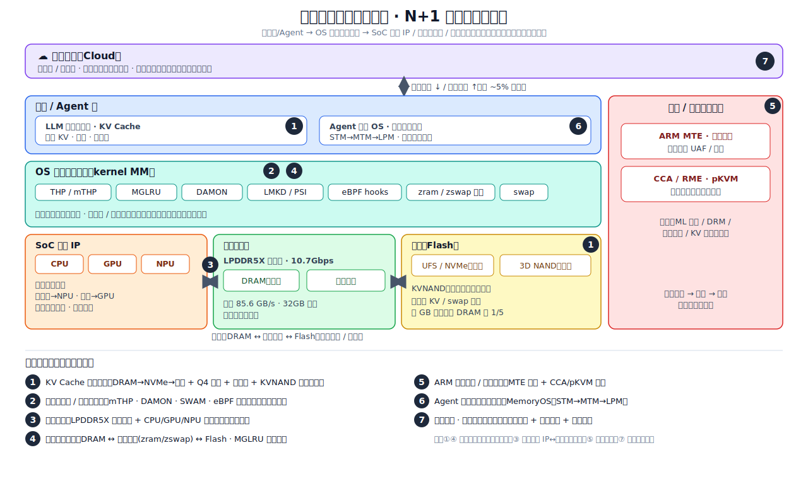
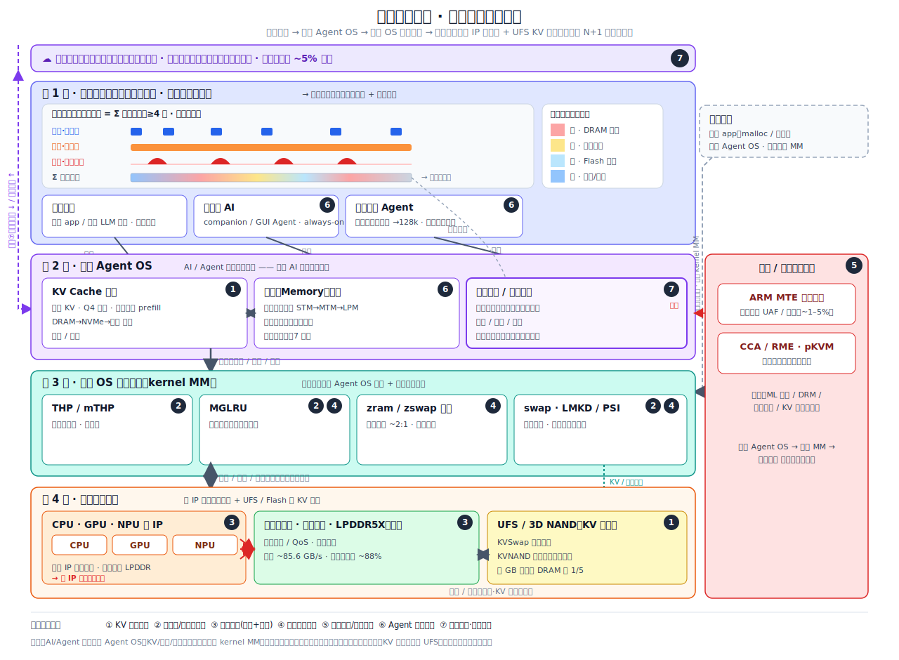

# N+1：下一代终端内存系统设计优化研究

> 调研范围：2023-2026 学界顶会 + 业界实践
> 状态：✅ 全部主题调研撰写完成

## 主题总览

| # | 主题 | 关键研究 / 出处 | 状态 |
|---|------|----------------|------|
| 1 | [端侧 LLM KV Cache 与多 Agent 记忆管理](on-device-kv-cache-management/on-device-kv-cache-management-CN.md) | KVNAND, KVSwap, Q4 Persistent Cache, Agent.xpu | ✅ 已完成 |
| 2 | [端侧可编程 / 自适应内存管理](ebpf-programmable-memory/ebpf-programmable-memory-CN.md) | Android mTHP, DAMON/DAMOS, SWAM, eBPF-mm, LMKD/PSI | ✅ 已完成 |
| 3 | [端侧推理的内存带宽：供给（LPDDR5X）与利用（异构调度）](memory-bandwidth-and-scheduling/memory-bandwidth-and-scheduling-CN.md) | LPDDR5X 10.7Gbps/JEDEC, HeteroInfer (SOSP'25), Agent.xpu, mllm-NPU | ✅ 已完成 |
| 4 | [端侧分级内存管理（DRAM↔压缩内存↔Flash）](tiered-memory-management/tiered-memory-management-CN.md) | MGLRU, zram/zswap, ElasticZRAM (DAC'24), Ariadne (FAST'25), AppFlow | ✅ 已完成 |
| 5 | [ARM 内存安全与机密计算 (CCA/MTE)](arm-memory-safety-cca-mte/arm-memory-safety-cca-mte-CN.md) | ARM CCA (arxiv 2504.08508), MTE, RME, TikTag | ✅ 已完成 |
| 6 | [终端侧 Agent 记忆系统（外置分层记忆）](on-device-agent-memory-system/on-device-agent-memory-system-CN.md) | MemGPT, Mem0, MemOS, MemoryOS (EMNLP'25), A-MEM (NeurIPS'25) | ✅ 已完成 |
| 7 | [端云协同内存管理：千人千面的场景化冷热精准识别](edge-cloud-collaborative-memory/edge-cloud-collaborative-memory-CN.md) | Walle (OSDI'22), DCCL/MetaPatch (KDD'21), LSC4Rec (KDD'25), AppFlow, LMKD | ✅ 已完成 |

> 主题 6 是主题 1（KV Cache 存储层）的上层对应：主题 1 关注 KV Cache 的存储和调度，主题 6 关注 Agent 记忆系统的设计——将记忆从上下文窗口中搬出来，做成分层、可检索、可自管理的记忆 OS；主题 7 在此基础上引入端云协同，做用户级的个性化冷热治理。
> 主题 3 将「带宽供给（LPDDR5/5X 器件标准）」和「带宽利用（CPU/GPU/NPU 异构调度）」合并为一条主线：核心叙事是从「窄管道 + 单 IP 独占」走向「宽管道 + 多 IP 榨满」。
> 「KV Cache 管理」和「记忆系统」各自的真实系统拆解（含架构图）已放入对应主题的「案例拆解」一节：主题 1 拆解 vLLM PagedAttention（[on-device-kv-cache-management/assets/pagedattention-arch.svg](on-device-kv-cache-management/assets/pagedattention-arch.svg)），主题 6 拆解 MemoryOS（[on-device-agent-memory-system/assets/memoryos-arch.svg](on-device-agent-memory-system/assets/memoryos-arch.svg)），并通过 MemOS `MemCube` 给出二者在同一记忆层级上的结构对照。

## 框架总览：端侧内存管理全景与七个洞察

下图将端侧内存管理系统的整体结构和本调研涉及的 SoC 组件画在一张图上（应用/Agent 层 → OS 内核内存管理 → SoC 计算 IP / 内存子系统 / 存储，安全横切其间，云侧在顶层做端云协同），七个洞察按编号标注在各自对应的位置。

下面逐个说明各洞察面对的问题和解法（编号与图中一致）。

**① KV Cache 分级管理**（应用层 ↔ 存储层）
- 问题：长上下文 KV Cache 随序列线性膨胀（32K 上下文单请求约 4.3 GB），超出端侧 DRAM；多 Agent 切换需要冷重算，TTFT 高达 15–172 s。
- 解法：KV Cache 三级分级（DRAM 热 → NVMe 温 → 3D NAND 冷）+ Q4 量化（压到约 28% 体积）+ 持久化跳过 prefill（172 s → 1.8 s，约 94×）+ KVNAND 闪存内注意力计算。核心思路是打破「一个上下文 = 一份 DRAM 拷贝」的假设。

**② 端侧可编程 / 自适应内存**（OS 内核内存管理）
- 问题：内核策略固定、一刀切——全有或全无的 THP 在长时间运行后碎片化严重（运行 2 h 后大页分配成功率从约 50% 降到 <10%）；固定 LMKD 阈值要么杀得太晚（卡顿）要么杀得太早（冷启动慢）。
- 解法：把策略做成可编程、可自适应——多尺寸 mTHP、DAMON 访问监控驱动主动回收（省 32% 内存 @ 约 1.9% 开销）、SWAM 自适应换页 + 杀进程（OOM kill 降约 6.5×）、eBPF 钩子让内存策略可按负载定制。

**③ 内存带宽：供给 + 利用**（SoC 计算 IP ↔ 内存子系统）
- 问题：端侧解码受内存带宽瓶颈——LPDDR5 约 51 GB/s 把 7B 模型卡在约 14 tok/s；单一加速器只能用到约 60% 的 DRAM 总线带宽。
- 解法：供给侧加宽管道（LPDDR5X +67% 带宽、2× 容量、−25% 功耗），利用侧多 IP 协同（CPU/GPU/NPU 分工——预填充走 NPU、解码走 GPU，利用率从约 60% 提到 88%，reactive 延迟降 4.6×）。

**④ 端侧分级内存**（OS 内核内存管理：压缩内存 ↔ swap）
- 问题：DRAM 有界且共享，通用 LRU 回收要么杀进程、要么卡顿；冷页白占 DRAM，GB 级 App 冷启动频发（86.6% 越过 1 s 悬崖）。
- 解法：DRAM ↔ 压缩内存（zram/zswap，约 2:1）↔ Flash 三级分级 + MGLRU 冷热分代（ChromeOS 上 kswapd CPU −40%、低内存杀进程 −85%）+ AppFlow 预测式预取/回收（冷启动 2 s → 690 ms）。

**⑤ ARM 内存安全 / 机密计算**（横切全栈数据面）
- 问题：端侧内存型漏洞（UAF / 越界）频发，纯软件防护开销大；端侧 ML 模型、KV 与记忆数据、生物识别等敏感负载需要硬件级隔离。
- 解法：ARM MTE 硬件内存标签（低开销实时检测内存错误）+ CCA/RME 与 pKVM 机密计算，给端侧敏感负载（ML 推理 / DRM / 生物识别）提供从应用到内核到内存的硬件隔离。

**⑥ Agent 外置分层记忆系统**（应用 / Agent 层）
- 问题：上下文窗口有限，每轮重放全历史导致 token 量 >10×、p95 延迟约 11×；截断历史又会让 Agent 丢失记忆。
- 解法：将记忆外置为分层记忆 OS（STM→MTM→LPM），活跃工作集封顶（MemoryOS 仅 7 页），用按需检索替代全量重放（token −70~90%，LoCoMo 精度 +26~49%）。

**⑦ 端云协同 · 千人千面冷热识别**（云侧 ↔ 端侧全栈）
- 问题：设备本地的通用冷热策略对不同用户/场景预测不准（86.6% 的 GB 级冷启动越过 1 s 悬崖）；端侧学习器数据量、算力、标签都不够，单靠本地训练不出足够好的个性化预测器。
- 解法：端侧「小脑」（个性化场景冷热预测器）+ 云侧「大脑」（聚合全量设备数据、训练并下发个性化策略）+ 请求门控（仅约 5% 请求走云端，其余本地处理），实现用户级的冷热识别。

### 自顶向下分层视图（耦合负载 → Agent OS → OS 内存管理 → 片上互联）

上面的全景图按"层次 + 编号"标出各洞察的位置；下图换一个角度，用自顶向下的分层架构展示数据面的对接关系：

*图：自顶向下四层——① 未来「前台应用 + 伴随态 AI + 后台长程 Agent」耦合运行，冷热判断更复杂（三类负载波形叠加，传统二分法失效）；② AI/Agent 负载先进入独立 **Agent OS**（KV 管理 / 记忆管理 / 冷热治理）；③ 下沉到**传统 OS 内存管理**（同时对接 Agent OS 和传统应用——传统应用直接连内核）；④ 落到**片上互联**（CPU/GPU/NPU 多 IP 竞争内存带宽 + UFS 做 KV 卸载）。安全⑤ 横切、端云⑦ 在顶。*

## 关键源列表

### 学术论文
- **MGLRU 多代 LRU（端侧分级回收）** — Linux v6.1 / Android 14 默认；ChromeOS kswapd CPU −40%、低内存杀进程 −85%
- **AppFlow: 大 App 冷启动内存调度** — arxiv 2603.17259（2s→690ms）
- **Ariadne: 冷热分离压缩交换（端侧）** — arxiv 2502.12826（FAST'25，Pixel 7 重启延迟 −50%）
- **KVNAND: DRAM-free In-Flash KV Cache** — arxiv 2512.03608
- **eBPF-mm: Programmable Huge Page Policy** — arxiv 2409.11220
- **Q4 Persistent KV Cache for Multi-Agent** — arxiv 2603.04428
- **KVSwap: Edge KV Cache Offloading** — arxiv 2511.11907
- **Agent.xpu: Heterogeneous SoC Scheduling** — arxiv 2506.24045
- **ARM CCA for On-Device ML Protection** — arxiv 2504.08508
- **端云协同 ML（千人千面）** — Walle (OSDI'22) / DCCL (KDD'21) / LSC4Rec (KDD'25)

### 业界资料
- **Samsung LPDDR5X 10.7Gbps** — Samsung Semiconductor Press
- **ARM MTE Whitepaper** — ARM Developer
- **Android Memory Management (Esper Blog)** — LSFMMBPF 2025 回顾
- **LWN LSFMMBPF 2025** — https://lwn.net/Articles/lsfmmbpf2025/
