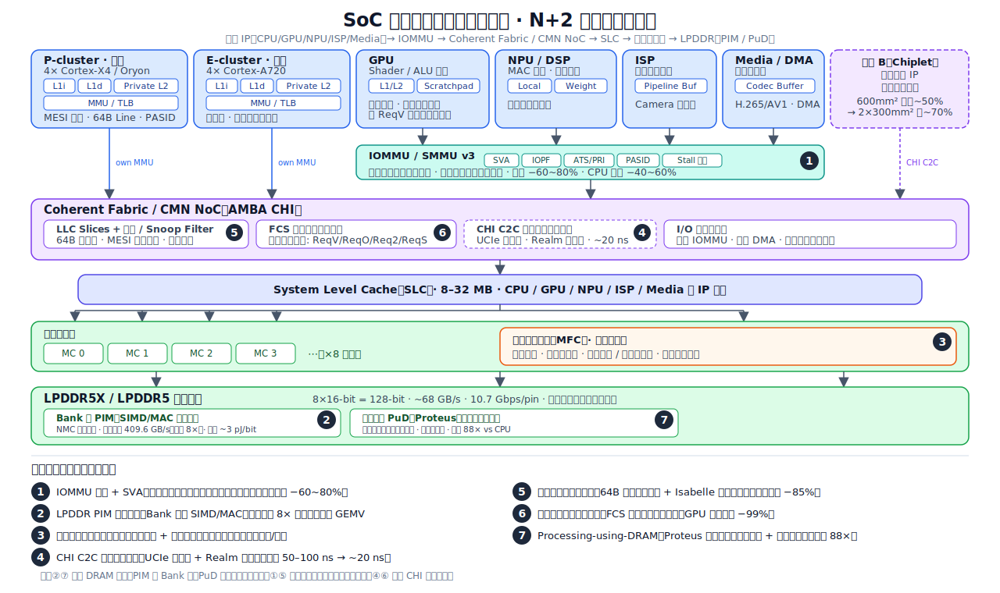

# N+2：内存系统-片上互联-多IP一致性协同优化设计研究

> 调研范围：2023-2026 学界顶会 + 业界标准/实践
> 状态：✅ 全部主题调研撰写完成

## 主题总览

| # | 主题 | 关键研究 / 出处 | 状态 |
|---|------|----------------|------|
| 1 | [IOMMU 缺页处理与 SVA 统一地址空间](iommu-page-fault-sva/iommu-page-fault-sva-CN.md) | IOMMUFD (LWN), SMMU v3, PASID, ATS/PRI | ✅ 已完成 |
| 2 | [LPDDR PIM 近存计算架构](lpddr-pim-architecture/lpddr-pim-architecture-CN.md) | LP-Spec, CD-PIM, PIM-AI, Samsung PIM (HC'23) | ✅ 已完成 |
| 3 | [CXL 近数据处理与内存压缩](cxl-ndp-compression/cxl-ndp-compression-CN.md) | CXL-NDP, IBEX, ZeroPoint DenseMem | ✅ 已完成 |
| 4 | [AMBA CHI C2C 与片上互联演进](amba-chi-c2c-interconnect/amba-chi-c2c-interconnect-CN.md) | ARM CHI C2C, NoC S3, UCIe 2.0, CHI Issue G | ✅ 已完成 |
| 5 | [CXL 缓存一致性协议验证与优化](cxl-cache-coherence/cxl-cache-coherence-CN.md) | CXL.cache Isabelle (ASPLOS'25), Cohet, vCXLGen | ✅ 已完成 |
| 6 | [细粒度异构一致性特化](fine-grain-coherence/fine-grain-coherence-CN.md) | FCS/Spandex (ACM TACO'22), DeNovo, HeteroGen | ✅ 已完成 |
| 7 | [Processing-using-DRAM 延迟优化](processing-using-dram/processing-using-dram-CN.md) | Proteus (ICS'25), Ambit, SIMDRAM | ✅ 已完成 |

## 框架总览：SoC 片上互联与多级缓存全景与七个洞察

下图将 SoC 片上互联与多级缓存系统的整体结构画在一张图上（计算 IP → CMN/NoC 一致性网格 → IOMMU / 内存控制器 / CXL → LPDDR DRAM / PIM / PuD），七个洞察按编号标注在各自对应的位置。

下面逐个说明各洞察面对的问题和解法（编号与图中一致）。

**① IOMMU 缺页处理与 SVA 统一地址**（IOMMU / SMMU v3）
- 问题：传统 DMA 需全程锁定设备缓冲区的物理页——单个移动端 GPU/NPU 就能锁住 2–6 GB，严重压缩系统可用内存；同时 CPU 与设备间需 bounce buffer 显式拷贝，带宽翻倍浪费。
- 解法：ARM SMMU v3 引入 stall 模型 + IOPF 框架，配合 PCIe ATS/PRI 与 PASID，设备与进程共享虚拟地址空间、按需调页，彻底消除锁页与 bounce buffer（锁页 −60~80%、CPU 拷贝 −40~60%）。

**② LPDDR 近存计算（PIM）**（DRAM Bank 内部 / 通道侧）
- 问题：LLM 解码受冯诺依曼瓶颈制约——7B INT8 模型每 token 需读 ~7 GB 权重，LPDDR5 外部带宽 51.2 GB/s 只能做到 ~137 ms/token；片外数据搬运能耗 ~20 pJ/bit 主导总功耗。
- 解法：在 DRAM Bank 内/旁嵌入 SIMD/MAC 计算单元，利用内部全 Bank 带宽（409.6 GB/s，外部的 8×），GEMV 运算就地执行，NMC 动态分配 PIM/传统 Bank（片内能耗降至 ~3 pJ/bit，降 6.7×）。

**③ CXL 近数据处理与内存压缩**（CXL Type-3 设备控制器）
- 问题：CXL 容量可扩展但带宽是瓶颈——PCIe 5.0 x16 峰值仅 ~64 GB/s；LLM 大规模 KV 缓存在 64k+ token 后打满链路，朴素 BF16 权重直接压缩收益极低（仅 0–23%）。
- 解法：在 CXL Type-3 设备端引入 NDP 控制器，通过位平面重组（同一位聚合存储）大幅提升可压缩性，数据跨越链路前完成压缩/选择性读取，透明带宽放大。

**④ AMBA CHI C2C 与片上互联演进**（CMN 一致性网格 / 跨芯粒互联）
- 问题：单片 SoC 受光刻掩模版面积硬上限（858 mm²）约束，良率随面积超线性下降；传统协议桥（CHI→CXL）每跳增加 50–100 ns 延迟，且无法跨裸片传播安全 Realm。
- 解法：CHI C2C 将 CHI 一致性协议包化后用 UCIe 物理层跨裸片延伸，引入 NoC S3 异构背板和 Realm 感知消息编码，跨芯粒一致性延迟从 50–100 ns 降至 ~20 ns（降 2.5–5×）。

**⑤ CXL 缓存一致性协议验证与优化**（CXL.cache 协议栈）
- 问题：PCIe DMA 在主机-设备边界无硬件一致性——设备修改内存不通知 CPU 缓存层次，软件须显式 clflush；粒度不匹配（DMA 最小 4 KB vs 加速器需 64 B 缓存行），且 CXL.cache 规范以英文散文写成含歧义。
- 解法：CXL.cache 以 64 B 缓存行粒度实现硬件一致性，设备持有 MESI 状态并接受主机 snoop；协议正确性经 Isabelle 证明助手形式化验证（描述符延迟比 PCIe 降 85%，远程原子操作加速最高 40.2×）。

**⑥ 细粒度异构一致性特化（FCS）**（LLC / L2 目录 ↔ 各 IP L1 缓存控制器）
- 问题：统一 MESI/MOESI 为同构 CPU 设计，强制 GPU/DSP/加速器使用写方发起无效化——GPU 数千线程写不相交区域时产生 O(N) 冗余消息（高达 99% 网络流量为冗余一致性消息）。
- 解法：Spandex + FCS 在每条访存请求粒度独立选择最优一致性请求类型（ReqV/ReqO/Req2/ReqS），按运行时数据共享模式动态匹配，消除冗余无效化（设备粒度 Spandex 减 16% 执行时间，叠加 FCS 再减 13%）。

**⑦ Processing-using-DRAM（Proteus）**（DRAM Bank 内子阵列 / 位线）
- 问题：现有 PuD 机制（Ambit、SIMDRAM）对 N 位操作数固定执行 N 个串行周期，不考虑实际有效精度；单阵列执行也未利用 DRAM 多阵列并行性。
- 解法：Proteus 在运行时检测操作数有效精度（前导零/一），动态压缩计算位宽并跨多阵列并发执行，自适应选择数据表示与算法，延迟从与位宽线性相关变为与有效精度相关（基线 SIMDRAM 16 bank 下 CPU 吞吐 88×）。

## 关键源列表

### 学术论文
- **IOMMUFD IO Page Fault** — LWN: https://lwn.net/Articles/980399/
- **LP-Spec: LPDDR5 PIM for LLM Speculative Inference** — arxiv 2508.07227
- **CXL-NDP: Near-Data Processing in CXL** — arxiv 2509.03377
- **IBEX: Block-Level CXL Compression** — arxiv 2603.26131
- **Proteus: Data-Aware PIM Framework** — arxiv 2501.17466
- **CXL.cache Formal Verification (Isabelle)** — ACM DL: https://dl.acm.org/doi/10.1145/3676641.3715999
- **Cohet: CPU-XPU Coherent Data Sharing** — arxiv 2511.23011
- **Fine-Grain Coherence Specialization** — ACM DL: https://dl.acm.org/doi/10.1145/3530819

### 业界标准与白皮书
- **AMBA CHI C2C Specification** — ARM: https://newsroom.arm.com/blog/amba-chi-c2c-specification
- **ARM NoC S3** — https://www.arm.com/products/silicon-ip-system/interconnect/noc-s3
- **CXL 4.0 Specification** — CXL Consortium (2025-11)
- **JEDEC LPDDR6** — https://www.jedec.org/news/pressreleases/jedec-releases-new-lpddr6-standard
- **Samsung PIM at Hot Chips 2023** — ServeTheHome
- **Qualcomm Oryon at Hot Chips 2024** — Chips and Cheese
