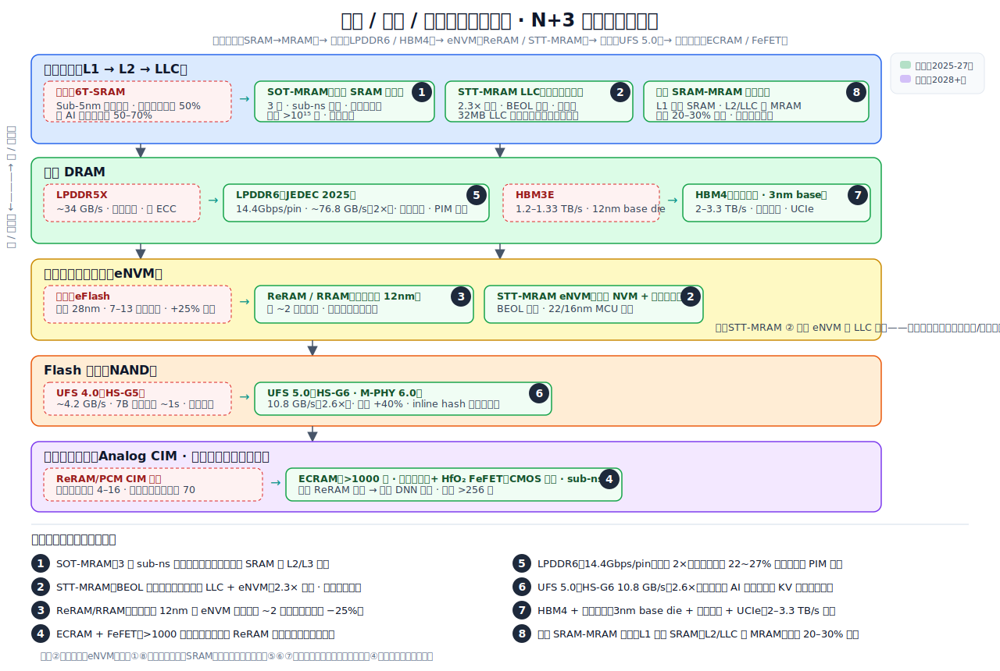

# N+3：远期存储/内存/缓存介质创新与架构变革研究

> 调研范围：2023-2026+ 学界前沿 + 业界路线图
> 状态：✅ 全部主题调研撰写完成

## 主题总览

| # | 主题 | 关键研究 / 出处 | 状态 |
|---|------|----------------|------|
| 1 | [SOT-MRAM：下一代缓存 SRAM 替代](sot-mram-cache-replacement/sot-mram-cache-replacement-CN.md) | Nature Electronics, imec IEDM'23, VGSOT, npj Spintronics | ✅ 已完成 |
| 2 | [STT-MRAM 嵌入式商用化与 LLC 应用](stt-mram-embedded-llc/stt-mram-embedded-llc-CN.md) | IBM/Samsung VLSI'24, IEDM'24, NXP/TSMC 16nm, Renesas ISSCC'24 | ✅ 已完成 |
| 3 | [新型嵌入式 NVM 生态 (ReRAM/RRAM)](emerging-envm-rram/emerging-envm-rram-CN.md) | TSMC 22/12nm ReRAM, Weebit ICCAD'24, Nordic/Infineon | ✅ 已完成 |
| 4 | [ECRAM 与 HfO2 铁电存储器件](ecram-fefet-ferroelectric/ecram-fefet-ferroelectric-CN.md) | ACS Chem Rev, Adv Materials, HfO2 FeFET | ✅ 已完成 |
| 5 | [LPDDR6 标准与移动 DRAM 演进](lpddr6-standard-evolution/lpddr6-standard-evolution-CN.md) | JEDEC JESD209-6, SK Hynix ISSCC'26, Samsung LPDDR6X | ✅ 已完成 |
| 6 | [UFS 5.0 与计算存储](ufs5-computational-storage/ufs5-computational-storage-CN.md) | JEDEC JESD220H, Samsung UFS 5.0, M-PHY 6.0 | ✅ 已完成 |
| 7 | [HBM4/先进封装与 3D 集成](hbm4-advanced-packaging/hbm4-advanced-packaging-CN.md) | TSMC SoIC (IEDM'24), HBM4E 3nm base, UCIe 3.0 | ✅ 已完成 |
| 8 | [混合 SRAM-MRAM 缓存层次架构](hybrid-sram-mram-cache/hybrid-sram-mram-cache-CN.md) | AIP Advances, imec SOT-MRAM, EADP 分析 | ✅ 已完成 |

## 框架总览：存储 / 内存 / 缓存介质创新全景与八个洞察

下图将存储-内存-缓存介质的完整层次画在一张图上（片上缓存 → 主存 DRAM → eNVM → Flash 存储 → 模拟存算一体），每一层展示当前技术的瓶颈（红色虚线框）和演进方案（绿色实线框），八个洞察按编号标注在各自对应的位置。

下面逐个说明各洞察面对的问题和解法（编号与图中一致）。

**① SOT-MRAM：下一代缓存 SRAM 替代**（片上缓存 L2/L3/LLC · 远期）
- 问题：6T-SRAM 在 sub-5nm 节点面积停滞缩放——漏电可达总处理器功耗 50%，占 AI 处理器面积 50–70%，三重约束（面积/功耗/成本）限制更大缓存。
- 解法：SOT-MRAM 三端自旋器件，sub-ns 切换、零待机漏电（非易失）、耐久 >10¹⁵ 次、更小比特单元面积——从根本上打破 SRAM 的漏电-面积困局。

**② STT-MRAM 嵌入式商用化与 LLC 应用**（eNVM + LLC · 近期）
- 问题：eFlash 无法缩放到 28nm 以下（厚隧穿氧化层和 10–20 V 编程电压不兼容 FinFET），额外 7–13 层掩膜增加 20–30% 晶圆成本；同时 32 MB SRAM LLC 漏电可超过计算核动态功耗。
- 解法：STT-MRAM 在 BEOL 集成（无额外 FEOL 掩膜），统一 NVM 代码存储和工作内存为一种技术，2.3× 密度、零待机漏电，已在 NXP/TSMC、Renesas 22–28nm MCU 节点量产。

**③ 新型嵌入式 NVM（ReRAM/RRAM）**（eNVM · 近期）
- 问题：eFlash 卡死 28nm，7–10 额外掩膜导致 >25% 晶圆成本溢价；边缘 AI 还需要能参与存算一体的存储介质，eFlash 做不到。
- 解法：ReRAM 是二端金属氧化物器件，可缩放至 12nm 及以下，仅需 ~2 额外掩膜，且支持模拟 MAC 运算实现边缘 AI 存算一体（Weebit Nano / Infineon AURIX TC4x / TSMC IP 平台，2025–2027 量产）。

**④ ECRAM 与 HfO₂ FeFET 铁电器件**（模拟存算一体 · 远期）
- 问题：ReRAM/PCM 的随机丝状开关限制可靠模拟态仅 4–16 级，非对称写入系数高达 70（理想值 ~1），导致 DNN 训练精度比软件基线低 5–15%。
- 解法：ECRAM（三端 · 离子嵌入 · >1000 确定性电导态 · 对称线性写入）和 HfO₂ FeFET（CMOS 原生 · sub-ns 铁电切换 · 多级），提供片上训练所需的对称、线性、低噪声权重更新。

**⑤ LPDDR6 标准与移动 DRAM 演进**（主存 DRAM · 近期）
- 问题：LPDDR5X 峰值 ~34 GB/s 不足以支撑端侧 7B+ LLM 推理（14 GB FP16 模型 prefill 需 ~400 ms）；单轨供电在高频下功耗浪费；无 ECC/RAS 不适用于汽车/数据中心。
- 解法：LPDDR6 通过 14.4 Gbps/pin + x24 通道宽度将带宽翻倍至 ~76.8 GB/s，新增双轨供电（读功耗降至 73%、写功耗降至 78%）、强制 ECC/RAS、PIM 接口——从纯移动扩展到 AI 加速器市场。

**⑥ UFS 5.0 与计算存储**（Flash 存储 · 近期）
- 问题：UFS 4.0 峰值 ~4.2 GB/s 顺序读，7B 模型加载需 ~1 s 且无余量并行 RAG/cache I/O；AI 工作负载产生持续顺序流量是 UFS 4.0 设计之外的场景；无 inline 数据完整性校验。
- 解法：UFS 5.0（HS-G6、M-PHY 6.0）将单通道速率翻倍至 46.6 Gbps → 10.8 GB/s 顺序读写（2.6×），新增强制链路均衡、多电压域、inline hash 数据完整性（功效 +40%）。

**⑦ HBM4 与先进封装**（高带宽内存 · 近期至中期）
- 问题：HBM3E 的 12nm 固定功能 base die 浪费 ~80 mm² 硅面积在被动 PHY/路由上，无法定制；微凸块互联（25–40 µm pitch）限制 TSV 密度并在 12+ 层堆叠时导致 15–20% 良率损失；CoWoS-S 光罩限制（~1700 mm²）装不下下一代 GPU 封装。
- 解法：HBM4 使用 3nm 逻辑增强 base die（可定制 CIM 加速器、ECC、电源管理），过渡到混合键合（10 µm pitch，热阻 −47%），集成 UCIe 芯粒接口，支持 2048-bit 接口和 12–16 层 DRAM（带宽 2–3.3 TB/s）。

**⑧ 混合 SRAM-MRAM 缓存层次架构**（片上缓存全层 · 远期）
- 问题：Sub-5nm 节点 SRAM 单元面积基本停止缩放（TSMC N3E vs N5 = 0% 收缩），4 种并发漏电机制使 64 MB SRAM LLC 在 3nm 空闲时漏 2–5 W；SRAM 易失性意味着任何掉电都清除全部缓存状态。
- 解法：仅保留 SRAM 做延迟关键的 L1；L2/L3/LLC 换用 STT-MRAM（2.3× 密度 · 零待机漏电 · 非易失）或 SOT-MRAM（sub-1ns 写 · >10¹⁵ 耐久），实现 instant-on / 断电免 checkpoint / 释放 20–30% 面积用于计算或更大缓存。

## 关键源列表

### 学术论文
- **SOT-MRAM 64-kb Array (1ns switching)** — Nature Electronics: https://www.nature.com/articles/s41928-025-01434-x
- **SOT-MRAM Roadmap & Scaling** — Nature Reviews Electrical Engineering: https://www.nature.com/articles/s44306-024-00044-1
- **STT-MRAM Status & Beyond-STT** — Nature Reviews Materials: https://www.nature.com/articles/s44287-024-00111-z
- **eNVM Technology Landscape** — MRS Bulletin: https://link.springer.com/article/10.1557/s43579-024-00660-2
- **ECRAM for Neuromorphic Computing** — ACS Chem Rev: https://pubs.acs.org/doi/10.1021/acs.chemrev.4c00512
- **HfO2 Ferroelectric Memory** — Adv Materials: https://advanced.onlinelibrary.wiley.com/doi/10.1002/adma.202509525
- **Hybrid SRAM-MRAM Cache** — AIP Advances: https://pubs.aip.org/aip/adv/article/13/2/025111/2877240/

### 业界资料
- **ReRAM at TSMC (Weebit ICCAD 2024)** — https://www.weebit-nano.com/wp-content/uploads/2024/12/Weebit-ICCAD-2024...
- **JEDEC LPDDR6** — https://www.jedec.org/news/pressreleases/jedec-releases-new-lpddr6-standard
- **JEDEC UFS 5.0** — https://www.jedec.org/news/pressreleases/ufs-50-coming
- **SK Hynix LPDDR6 14.4Gbps** — VideoCardz
- **HBM4/HBM4E (TSMC/GUC)** — Tom's Hardware
- **TSMC SoIC (IEDM 2024)** — Latitude Design Solutions
- **Imec SOT-MRAM Scaling** — https://www.imec-int.com/en/press/imecs-extremely-scaled-sot-mram-devices...
- **ISSCC 2026 Preview** — SemiAnalysis
