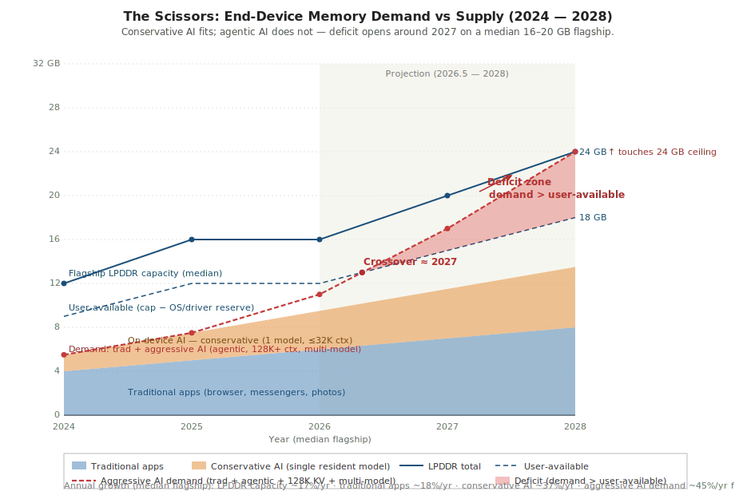
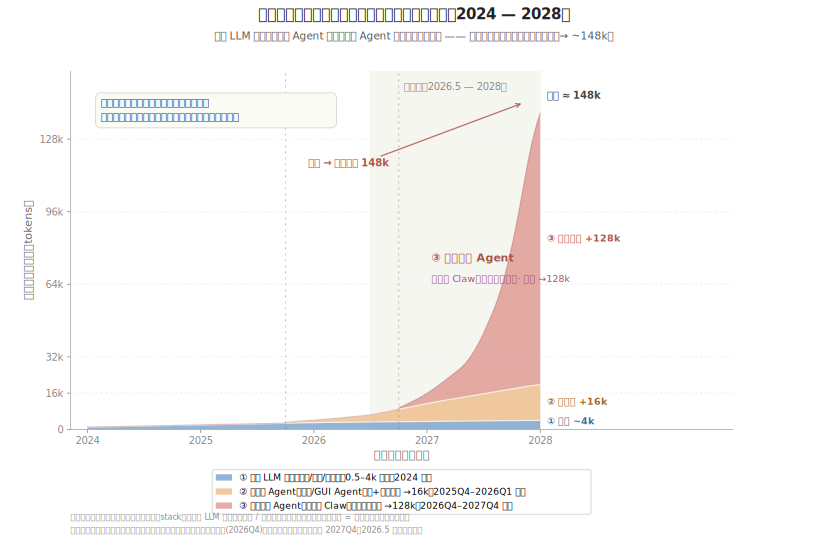

# Agent 时代的内存负载:趋势调研(v2)

> 这份调研用「负载趋势」的角度,讲 AI agent **当下(2024–2026)** 在如何改变端侧设备的内存使用方式,以及 **下一步(2026–2028)** 大概率会怎么走。内容把 [A16 family](../advanced/A16-前沿-Agent时代内存负载.md) 加上当年(2024–2026)的一手数据,凝练为一张矛盾图、四条趋势、一张挑战表、四条应对方向,以及一段六条的「带立场的预测」。预测部分是有立场的,不是中庸综述;末尾的「开放问题」一节则给出可能推翻预测的反例。

## 1. 范围与方法

**调研对象。** 「内存负载」指数据如何被创建、保留在内存里、被访问、又如何被回收。基准设定是 2024–2028 年的旗舰智能手机,同时运行传统前后台 app 加上端侧 LLM 推理、多模态编码器、agent 循环、检索这一类 AI 负载。云端推理只作对照偶尔提及。

**观察窗口:2024 年至 2026 年中。** 苹果智能(Apple Intelligence)于 2024 年下半年随 8 GB RAM 门槛上线;Gemini Nano 2024 年初先后落到 Pixel 8 Pro 和 Pixel 8 / 8a;LPDDR6(JESD209-6)2025 年 7 月发布,首批样品 2025 年底交付。这两年正好是「端侧 AI 默认开启」时代的全部。比这更早的事属于背景,不属于数据。

**外推窗口:2026 年中至 2028 年。** 大约两到三个产品周期。够远——能看到 LPDDR6 量产、agentic OS 框架落地、下一轮 NPU / Tensor 芯片到用户手上;又够近——底层物理(LPDDR 每封装密度、NAND 带宽、NPU TOPS 扩张曲线)不会有根本变化。

**资料来源。** 第 8 节列出 12 条来源:6 条标 `[now]`(过去 18 个月内已出货产品与已发布标准),3 条标 `[projection]`(路线图与前瞻研究),3 条标 `[background]`(更早的 PagedAttention 锚点与本项目 A15c 等老文章)。其中至少有 3 条直接为图 1 提供硬数字。

**这份调研不是什么。** 不是产品对比,不是厂商跑分,也不是中性综述——它会站队。

## 2. 矛盾一图看清

*图 1. 剪刀差。横轴:年份,以同年代旗舰中位机型为基准。纵轴:GB。下方堆积色块是 **保守口径** 的负载:传统 app(蓝)+ 一个常驻端侧模型、上下文 ≤32K(橙)。蓝色实线:旗舰 LPDDR 总容量(12 → 24 GB)。蓝色虚线:扣除 OS / 驱动 / 系统钉住缓冲后的「用户可用内存」(≈ 总容量 − 3 至 −6 GB)。红色虚线:**激进口径** 的需求——传统 app + agentic 栈(一个 assistant + 一个任务模型 + 一个感知模型,128K+ 上下文,持久 KV)。红色阴影楔形:激进需求超过用户可用内存的部分;交叉点约在 2027 年。右侧浅色背景标记的是外推区间(2026 年中起)。来源:Apple 2024、Google 2024–2025、Samsung 2025、JEDEC 2025–2026、Micron 2025、SK hynix 2026;详见第 8 节。*

这张图想说的事,大白话讲清楚:

1. **容量线和保守口径需求堆从不相交。** 一个常驻端侧模型加上有限上下文,在 2026 年的旗舰能塞下,在 2028 年的旗舰也能塞下。没有 hype 的基线是没问题的。
2. **激进需求线和容量线会相交——大约在 2027 年。** 一旦你跑的是 agentic 栈(多个常驻模型、128K+ 上下文、持久 KV),16–20 GB 的中位旗舰会先撞到「用户可用内存」的天花板,而不是「LPDDR 总容量」的天花板。
3. **LPDDR6 有用,但补不上这个缺口。** 它已经体现在图上(2027–2028 容量线抬升到 20–24 GB),但缺口照样开。内存的年增速约 17%,而 2026 年起激进 AI 需求年增速约 45%。
4. **真正的卡点不是 LPDDR 总容量,而是「用户可用内存」线。** OS、驱动、系统服务、设备钉住缓冲,会在 app 看到内存之前先扣掉一块。而扣掉的那一块本身越来越多是 AI 数据(dma-buf 里钉住的 KV),所以这条虚线会比实线**下落得更快**——这是这张图存在的全部目的:把这个架构层面的拐点画出来。

*图 2. 三类端侧推理任务的上下文叠加。横轴:年份;纵轴:累计上下文长度(tokens)。以 **传统 LLM 任务**(蓝,文字润色 / 改写 / 祝福语,单点小颗粒,0.5–4k,2024 起)打底,**伴随态 Agent**(橙,小艺伴随态 AI / GUI Agent,输入图 + 文,增量 →16k,2025Q4–2026Q1 起)与 **后台长程 Agent**(红,手机端 Claw,复杂多模态,增量 →128k,2026Q4–2027Q4 起)作为增量逐层叠加;总高度 = 同时常驻的上下文之和。要凸显两个负载特征:**异构**——三类任务不是替代而是并存、各占一层;**增长**——越晚出现的任务越重,把总上下文一路推高到 ~148k。这正是图 1 那条「激进需求」线为何在 2026 年后陡升的微观来源:推高它的不是单一任务变大,而是更重的新任务类别不断叠进来。*

## 3. 趋势(4 条)

- **增长** — 端侧 AI 内存占用(权重 + KV + 激活)在两年里(2024 → 2026)大致涨了 3 倍;如果 agentic 负载在 2028 年成为默认配置,还会再涨 4–5 倍。
- **堆叠** — 端侧 AI 正在从「常驻一个模型」走向「常驻多个模型」(助手 + 语音 + 视觉 + 任务专用),每加一个模型多花 1–3 GB,而且现在权重之间不能共享。
- **常驻** — Agent 循环让 AI 内存在后台持续保持活跃,经典回收依赖的「前台热、后台冷」启发式与真实访问模式对不上。
- **钉住** — 越来越大一块 LPDDR 落在设备侧驻留、被钉住的缓冲里(KV cache、dma-buf、NPU scratch),这些区域在普通 LRU 与回收路径之外。

## 4. 挑战

| 趋势 | 产业层面 | 技术层面 | 系统治理层面 | 架构/形态层面 |
|---|---|---|---|---|
| **增长** | 把旗舰内存推到 16–24 GB 以上,BOM 成本陡增;中端机型在能力上越落越远 | 单算法无损压缩(zram 一类)压不动 AI 需求曲线;KV 需要有损、按类型设计的专门压缩 | 操作系统回收不掉被钉住的 KV;一上 AI 负载,lmkd / jetsam 就被提前触发 | LPDDR6 能拓宽带宽,但每封装容量增速跟不上 AI 需求;新介质(HBF、MRAM、PIM)成为必需 |
| **堆叠** | 厂商在「AI 人设」功能上竞争,每个功能塞一个新模型常驻,没有动机去共享 | 多模型权重去重在端侧没解决;LoRA / adapter 共享停留在论文阶段,没大规模生产 | 进程隔离的 AI 服务在内存里各留各的权重副本,IPC 共享难以安全落地 | NPU 共享 scratch 与权重缓存需要跨多个模型上下文 |
| **常驻** | 「后台 app」的 UX 假设被打破;always-on 推理冲击电量与散热预算 | 为前后台调优的回收启发式与 agent 模式对不上 | 必须从被动 LRU 转向主动扫描(DAMON、MGLRU aging),不然热数据保护不住 | — |
| **钉住** | 厂商把 AI 内存包装成「AI 预留」来甩 OOM 锅,这又压低了用户可用内存 | dma-buf 与设备缓冲绕过 page cache 与 LRU;钉住占比持续上涨 | MGLRU、DAMON 看不见设备侧驻留页;回收对一半负载是瞎的 | IOMMU/SVA 必须延伸到设备缺页路径,让设备侧内存变得可治理 |

## 5. 应对方向

- **增长** → **有损结构化压缩**:针对 KV 做按类型的量化与淘汰(KIVI 2-bit、H2O / StreamingLLM 淘汰、KV-Compress 按头压缩比),用专门为这类负载设计的工具,去打负载特有的增长轴。
- **堆叠** → **分页权重加载**:只把当前任务需要的层 / 专家 / adapter 加载进来,在常驻 agent 之间共享一个 base 权重,把模型权重当成虚拟内存里的代码页来管。
- **常驻** → **可编程主动回收**:把 DAMON 式的主动区域扫描与 eBPF 策略钩子组合起来,让回收决策由数据类别和 PSI 反馈来驱动,而不是由前后台状态决定。
- **钉住** → **统一内存治理**:延伸 IOMMU / SVA,让设备侧驻留页加入缺页处理与 LRU 路径,成为回收里平等的一员,而不是一块封死的独立池。

## 6. 带立场的预测(未来 2–5 年)

- **到 2027 年,任何一个默认的 agentic 负载——只要它在 7B 量级模型上用 ≥ 64K 上下文、再常驻一个 assistant——都会把 16 GB 中位旗舰的「用户可用内存」吃光。** —— *依据:* KV cache 随上下文线性增长——7B 模型在 64K 上下文下,光 KV 就大约 4–5 GB;再加 Q4 权重 ~4 GB、assistant ~1.5 GB、传统 app ~6 GB,在扣 OS / 驱动预留前总和已经 15–17 GB。*置信度:high。*
- **到 2028 年,「AI 预留内存」会在 {Android、HarmonyOS、iOS} 的至少两个平台上成为显式的 OS 概念。** —— *依据:* lmkd / jetsam 一类杀进程机制在 AI 负载下已经误杀;两条修法,要么让 AI 页参与回收(难),要么干脆显式声明 AI 预留并做预算(易)。苹果智能已经隐式预留 ~1.5 GB,这件事会被正式化、对外暴露。*置信度:medium。*
- **到 2027 年,Android 上的有损 KV 压缩(2-bit 量化、top-k / 流式淘汰)会成为出厂默认。** —— *依据:* KV 增长是最大的需求向量;KIVI / H2O 一类已经在指令跟随和大部分 agent 工具调用任务上做到可接受质量。厂商会先上这个再上更大的内存,因为这个便宜。*置信度:medium。*
- **LPDDR6 在外推窗口内补不上缺口。** —— *依据:* 相比 LPDDR5X,LPDDR6 每封装容量在 2027 年前后只涨 ~25–30%(Micron 16 Gb 样品 2025 年底、SK hynix 1c 级 2026 下半年量产),而激进 AI 需求在同窗口大约涨 3 倍。带宽倍增到 ~14.4 GT/s,容量没翻倍。*置信度:high。*
- **到 2028 年,至少有一家主流安卓 OEM 会推出「内存分层」一类的用户可见特性,背后是 HBF 级闪存加分页 KV offload。** —— *依据:* 一旦图 1 上的缺口变成对外可见的 OOM 率,公关压力会逼厂商找剩下唯一的「泄压口」——闪存——然后给它换一个营销名。技术上就是 [A16f / A16i](../advanced/A16f-端侧KV-Cache管理方案.md) 那套分页 KV offload。*置信度:low。*
- **2026–2028 全程,端侧 LLM 的能力上限受内存制约,而不是受算力制约。** —— *依据:* NPU TOPS 大致按 Moore 一类的速率翻倍(Apple Neural Engine、Tensor G5+、MediaTek APU);LPDDR 容量走的是慢得多的曲线。今天端侧每一道 quality-vs-cost 的取舍——Q4 还是 Q8、上下文截多长、KV 要不要 offload——已经全是内存问题。*置信度:high。*

## 7. 开放问题与说明

- **激进口径取决于「采纳率」。** 如果端侧上下文长期停在 8K–32K 而不是上 64K+,图 1 那条红色虚线就会贴着橙色色块走,缺口根本不出现。第 6 节第 1 条预测,完全建立在「默认 agentic 上下文长度策略」上。
- **有损 KV 压缩还有质量风险没收口。** 长 agent 轨迹下的精度漂移、小模型上的推理能力退化、2-bit 量化下的工具调用失败——这些都没有完整刻画过。「增长」对应的应对方向「方向上成立」,但还不是已经定型的配方。
- **基于 IOMMU 的统一内存加设备缺页,在 Android / iOS 上目前还只是学术讨论。**「钉住」对应的应对方向是设计方向,不是已经出货的特性。厂商 SVA 支持是部分的、看硅片的。
- **HBF 的容量、延迟、出货时间表都来自厂商声明,尚未经过现场验证。** 2027 年及之后的 HBF 数字,都应当当作有不小误差的预测看。
- **「中位旗舰」这个口径完全掩盖了中端机型。** 2026 年一台 8 GB 中端机会比旗舰早 2 年、更猛地撞上缺口。如果换成「全机队」而不是「旗舰机队」,时间表会提前 12–18 个月。
- **多 agent 并存(多个 agent 同时驻留)目前没有公开数据集能刻画。**「堆叠」这条趋势的依据是产品路线图和定性行为观察,不是已经测出来的驻留分布。

## 8. 参考资料

1. Apple (2024). *Introducing Apple Intelligence for iPhone, iPad, and Mac*. [https://www.apple.com/newsroom/2024/06/introducing-apple-intelligence-for-iphone-ipad-and-mac/](https://www.apple.com/newsroom/2024/06/introducing-apple-intelligence-for-iphone-ipad-and-mac/) —— 8 GB RAM 门槛;~1.5 GB 端侧 LLM 预留。`[now]`
2. Dataconomy (2024). *Apple Clarifies How Much RAM Does Your iPhone Need To Run Apple Intelligence*. [https://dataconomy.com/2024/09/16/apple-clarifies-how-much-ram-does-your-iphone-need-to-run-apple-intelligence/](https://dataconomy.com/2024/09/16/apple-clarifies-how-much-ram-does-your-iphone-need-to-run-apple-intelligence/) —— Srouji 对 RAM 门槛的官方说明。`[now]`
3. Google Developers Blog (2024). *Blazing fast on-device GenAI with LiteRT-LM*. [https://developers.googleblog.com/blazing-fast-on-device-genai-with-litert-lm/](https://developers.googleblog.com/blazing-fast-on-device-genai-with-litert-lm/) —— Gemini Nano / Gemma 4 端侧:~0.8 GB 权重 + ~1.12 GB embedding。`[now]`
4. Samsung Semiconductor (2025). *Galaxy S26 Ultra 规格与 24 GB LPDDR5X 封装*. [https://semiconductor.samsung.com/news-events/news/](https://semiconductor.samsung.com/news-events/news/) —— 24 GB 旗舰 RAM 配置。`[now]`
5. JEDEC (2025). *JEDEC Releases New LPDDR6 Standard to Enhance Mobile and AI Memory Performance*. [https://www.jedec.org/news/pressreleases/jedec%C2%AE-releases-new-lpddr6-standard-enhance-mobile-and-ai-memory-performance](https://www.jedec.org/news/pressreleases/jedec%C2%AE-releases-new-lpddr6-standard-enhance-mobile-and-ai-memory-performance) —— JESD209-6 于 2025 年 7 月发布,10.7–14.4 GT/s。`[now]`
6. JEDEC (2026). *JEDEC Previews LPDDR6 Roadmap Expanding LPDDR into Data Centers and Processing-in-Memory*. [https://www.jedec.org/news/pressreleases/jedec%C2%AE-previews-lpddr6-roadmap-expanding-lpddr-data-centers-and-processing-memory](https://www.jedec.org/news/pressreleases/jedec%C2%AE-previews-lpddr6-roadmap-expanding-lpddr-data-centers-and-processing-memory) —— 更窄的 x6 sub-channel,通向 512 GB / stack 容量级。`[projection]`
7. Heisener (2026). *JEDEC Releases LPDDR6 Roadmap*. [https://www.heisener.com/IndustryTrend/JEDEC-Releases-LPDDR6-Roadmap](https://www.heisener.com/IndustryTrend/JEDEC-Releases-LPDDR6-Roadmap) —— Micron 16 Gb LPDDR6 样品 2025 年 12 月;SK hynix 1c LPDDR6 2026 下半年量产。`[projection]`
8. Belcak, P. & Heinrich, G. (NVIDIA, 2025). *Small Language Models are the Future of Agentic AI*. arXiv:2506.02153. [https://arxiv.org/abs/2506.02153](https://arxiv.org/abs/2506.02153) —— 立场论文:边缘驻留 SLM 在 agentic 任务上替代云端 LLM。`[projection]`
9. KVSWAP (2025). *KVSwap: Disk-aware KV Cache Offloading for Long-Context On-device Inference*. arXiv:2511.11907. [https://arxiv.org/abs/2511.11907](https://arxiv.org/abs/2511.11907) —— 端侧 KV offload 的带宽墙分析。`[now]`
10. Octomil (2025). *On-Device LLM Inference: The Definitive 2025–2026 Guide*. [https://docs.octomil.com/blog/on-device-llm-inference-2025-2026/](https://docs.octomil.com/blog/on-device-llm-inference-2025-2026/) —— 端侧分页 KV、GQA 带来 ~4× KV 缩减。`[now]`
11. Kwon, W. 等 (2023). *Efficient Memory Management for Large Language Model Serving with PagedAttention*. SOSP 2023, arXiv:2309.06180. [https://arxiv.org/abs/2309.06180](https://arxiv.org/abs/2309.06180) —— Paged KV cache;A16f 引用。`[background]`
12. 本项目 A16 family. [Agent 时代内存负载总论](../advanced/A16-前沿-Agent时代内存负载.md),以及子篇 [A16a](../advanced/A16a-LRU主动扫描.md)、[A16b](../advanced/A16b-eBPF可编程回收策略-Android.md)、[A16c](../advanced/A16c-异构压缩CDSD.md)、[A16d](../advanced/A16d-压缩IP边际建模.md)、[A16e](../advanced/A16e-IOMMU统一内存与异构PF-LRU.md)、[A16f](../advanced/A16f-端侧KV-Cache管理方案.md)、[A16g](../advanced/A16g-DRAM-PIM异构协同管理.md)、[A16h](../advanced/A16h-STT-SOT-MRAM多级缓存方案.md)、[A16i](../advanced/A16i-端侧UFS-HBF增强.md) —— 每条趋势、挑战、应对方向、预测在本项目里的主要锚点。`[background]`
