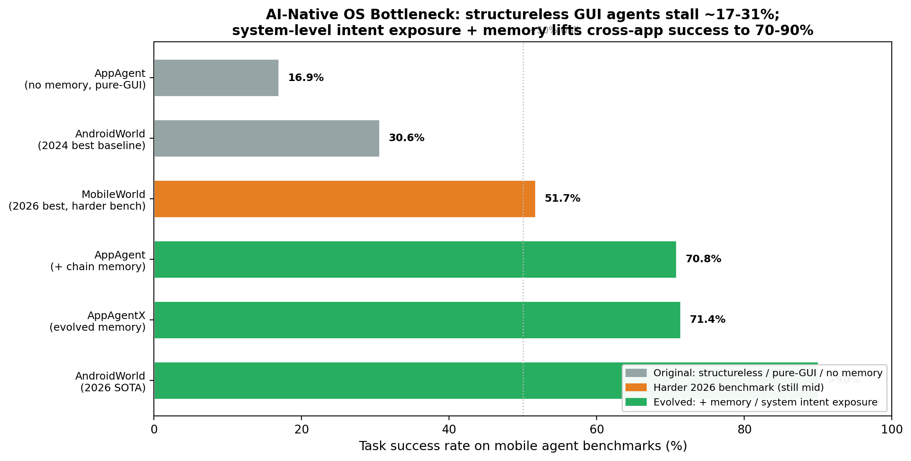
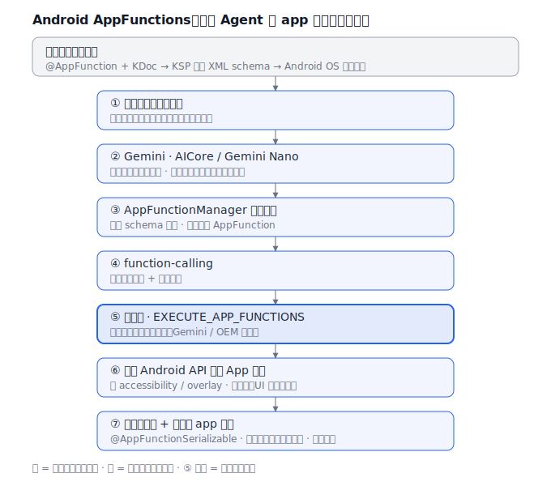
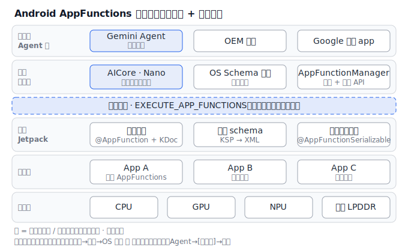

# 从「应用中心 OS」到「AI 原生 / 智能体 OS」：终端设备面向未来 AI OS 的方案演进

> 本文调研终端设备（手机 / PC）操作系统从**原始方案**——应用中心 OS（app-centric：用户逐个手动启动 app、AI 只是单 app 内的功能、助手是规则 / 检索式）——向**演进方案**——AI 原生 / 智能体 OS（agentic：系统级端侧基础模型 + 意图 / Agent 运行时把用户目标解析并跨 app 编排）——的转变。横向对比 **Apple（iOS/macOS）、Google（Android）、Huawei（HarmonyOS NEXT）** 三家的落地路线。本文是对内存方向「[A16 Agent 时代内存负载](../advanced/A16-前沿-Agent时代内存负载.md)」立论的 OS 侧伴随调研：解释「为什么端上会冒出一个常驻的系统级模型与 Agent 运行时」，其内存代价的量化分析见姊妹篇《[端侧大模型推理与内存/算力子系统](on-device-llm-memory-CN.md)》。

## 1. 范围与方法

**领域定义。** 本研究覆盖运行在终端设备上的操作系统中，「用户表达意图—系统完成任务」这条主路径的架构演进：助手 / Agent 运行时、端侧基础模型、app 向系统暴露能力的意图框架、以及支撑 Agent 的个人语境 / 记忆。不含云端大模型服务本身，也不含纯应用层 AI 功能。

**「原始」与「演进」的含义。** *原始方案*指**应用中心 OS**：用户通过手动点选 app 完成任务，AI 以单 app 内功能形态存在，系统助手（旧 Siri / Google Assistant / 旧小艺）是关键词匹配 + 槽位填充 + 检索，跨 app 协作靠 deep link / share sheet 由用户手动串联。*演进方案*指 **AI 原生 / 智能体 OS**：系统内常驻一个端侧基础模型与一个 Agent 运行时（规划器），把用户的自然语言目标拆解为多步动作，跨多个 app 编排执行；app 通过**声明式意图 / 函数 schema** 把可执行动作与实体语义暴露给系统级 Agent；系统持有跨 app 的语义索引 / 个人记忆。

**资料来源。** 共 18 个独立来源，含厂商一手文档 / 博客（Apple ML Research、Android Developers、华为开发者）、学术论文（AIOS、AndroidWorld、AppAgentX、Personal LLM Agents、Apple/Gemini 技术报告）与行业报道（9to5Google、TechRadar、深圳湾）。其中 ≥ 6 个含可引用硬数字；Apple 与 Google 各 ≥ 2 个一手来源，已下载 14 份本地副本于 `sources/ai-native-os-agent/`。**诚实优先**：华为端侧模型参数未公开、部分能力指标为发布会自报，正文逐处标注「待核实 / 华为自报」。

## 2. 问题背景

**系统需要做什么。** 让用户用一句自然语言表达目标（"把这次出差的酒店发票整理给财务""明天下雨提醒我带伞并改约今晚的羽毛球"），由系统跨多个 app 自动完成，而不是用户自己逐个打开 app、手动搬运信息。

**为什么这个领域变难。** 三个约束同时压上来：（1）**端侧资源**——隐私与延迟要求模型跑在端上，但手机只有 8–16 GB 内存与受限算力，模型必须压到 3B 级、量化到 2–4 bit 才放得下（容量与带宽的量化代价见姊妹篇）；（2）**app 孤岛**——系统不懂各 app 内部的可执行动作与实体语义，没有标准让 app 把"能做什么"结构化地交给系统；（3）**可靠性与权限**——Agent 替用户跨 app 执行动作，错一步代价高，且需要强权限模型防止滥用。

**为什么原始方案不再够用。** 旧助手是命令式槽位填充，只能触发单 app 单步动作，无法把一个目标拆成跨 app 的多步计划；而绕过系统、直接用大模型"看截图点屏幕"的纯 GUI Agent 又慢、脆、依赖云端——早期在 AndroidWorld 基准上最佳成功率仅 30.6% [ref 15]，远不足以托付真实任务。

## 3. 具体问题与瓶颈证据

### 具体问题

1. **旧助手不能跨 app 多步编排** — 关键词→单一意图→槽位填充的范式只能驱动单个 app 的单步动作，无法理解"先查日历再改约再通知对方"这类需要规划的目标。早期移动 GUI Agent 在 AndroidWorld（116 任务 / 20 app）上最佳仅 30.6%。[ref 15]
2. **app 能力对系统不可见** — 系统只看得到 app 的图标与 deep link，看不到 app 内"可执行的动作 + 操作的实体"。没有声明式 schema，Agent 只能去"猜屏幕"。[ref 5, ref 9]
3. **纯 GUI Agent（截屏点击）慢且脆** — 不依赖系统能力暴露、靠视觉理解逐步点击的 Agent，无记忆时成功率仅 16.9%，且每步都要调用大模型、延迟高、隐私差。[ref 17]
4. **个人语境 / 记忆缺位** — 系统不持有跨 app 的个人语义（"我说的那个航班 / 那个人 / 上次那张发票"），Agent 无法把模糊指代解析到具体实体，规划无从落地。[ref 5, ref 18]
5. **端侧模型资源紧张且易重复** — 3B 级模型要常驻内存；若每个 app 各带一份模型，内存占用随 app 数线性膨胀，手机放不下——这把问题推给了系统级共享（详见姊妹篇）。[ref 7, ref 8]

### 瓶颈证据



上图汇总移动 GUI / Agent 基准的任务成功率，证据指向同一个瓶颈：**只靠"看屏幕点击"、没有系统级意图暴露与记忆的 Agent，成功率卡在 17–31% 的天花板**——AppAgent 无记忆 16.9% [ref 17]、AndroidWorld 2024 最佳基线 30.6% [ref 15]。一旦补上**记忆**与**结构化能力调用**，成功率跃升到 70–90%：AppAgent 加链式记忆 70.8%、AppAgentX 71.4% [ref 17]，AndroidWorld 2026 SOTA 已 > 90% [ref 15]。而当基准刻意加难（MobileWorld，专为对抗 AndroidWorld 饱和而设计），最佳 agentic 框架仍只有 51.7% [ref 16]——说明演进有效，但远未"解决"。这正是演进方案要做的事：**把能力暴露与记忆从"Agent 自己硬扛"下沉为"OS 提供的系统能力"。**

**关键数据：**
- AppAgent：无记忆 16.9% → 链式记忆 70.8% → AppAgentX 71.4%（×4.2）[ref 17]
- AndroidWorld（116 任务 / 20 app）：2024 最佳 30.6% → 2026 SOTA > 90%（×2.9）[ref 15]
- MobileWorld（更难基准）：最佳 agentic 框架 51.7% [ref 16]
- AIOS（LLM 作 OS 内核 + Agent 调度器）：执行加速 2.1× [ref 14]

## 4. 架构：原始 vs 演进

两图使用**同一组组件**（用户 / 助手或 Agent 运行时 / 端侧模型 / 系统索引或记忆 / App / OS）。演进图中新增或变更的部分以 `*` 标记，差异本身就是结论。

**原始 — 应用中心 OS（app-centric）**

```
   +--------+   手动点选(tap)        +--------------------+
   |  用户   | --------------------->  |  App A / B / C      |
   +--------+                         +--------------------+
       |                                      ^
       | 语音命令(speak)                       | deep link / share
       v                                      | (单 app, 单步)
   +-------------------+   关键词->单意图        |
   |  旧助手            | -----------------------+
   | (规则/槽位/检索)    |
   +-------------------+
       |  查询(query)
       v
   +-------------------+
   |  系统索引          |  (Spotlight / 全局搜索, 仅元数据)
   +-------------------+

   特征: 无端侧模型 | 助手不规划 | app 能力对系统不可见 | 跨 app 靠用户手动串联
```

*原始：用户手动点选 app，或对旧助手说命令、由其匹配出单一意图后 deep link 启动单个 app；系统索引只索引元数据，不参与跨 app 规划。*

**演进 — AI 原生 / 智能体 OS（agentic）**

```
   +--------+   自然语言目标(goal)     +----------------------------+
   |  用户   | ----------------------> | * Agent 运行时 (规划器)       |
   +--------+ <--- 结果/追问(reply) -- |   - 分解(plan) / 多步编排      |
                                       +----------------------------+
                          * 调用(infer) |       * 查语义(recall) |   * 发现能力(discover)
                                       v                       v                    v
                            +----------------+      +----------------+    +--------------------+
                            | * 端侧基础模型   |      | * 语义索引/记忆  |    |  App A / B / C      |
                            | (3B, 量化常驻)   |      | (个人语境)       |    | * intent/function   |
                            +----------------+      +----------------+    |   schema 声明        |
                                                                          +--------------------+
                                       * 跨 app 多步动作编排(execute) ^_______________|
   * 新增/变更: 端侧模型 | Agent 规划器 | 语义索引+记忆 | app 用 schema 声明式暴露动作
```

*演进：用户给出自然语言目标 → Agent 运行时调用常驻的端侧模型解析并规划 → 查语义索引 / 个人记忆解析指代 → 发现各 app 声明的 intent/function → 跨 app 多步编排执行并回报。能力暴露与记忆成为 OS 的系统能力，而非 Agent 自带。*

### 三家 OS 的演进落地横向对比

| 维度 | Apple（iOS/macOS） | Google（Android） | Huawei（HarmonyOS NEXT） |
|---|---|---|---|
| 端侧基础模型 | AFM ~3B dense（3.7→3.5 bpw；第 3 代 2-bit QAT）+ 20B 稀疏（激活 1–4B）[ref 1,2,3] | Gemini Nano-1 1.8B / Nano-2 3.25B（int4）[ref 8] | 盘古端侧（规模未公开）[ref 13, 待核实] |
| 模型部署 / 载体 | 系统级 Apple Intelligence；共享基座 + 多个 LoRA 按需加载 [ref 1] | **AICore 系统服务，全系统加载一份、跨 app 共享** [ref 7] | 小艺 / 盘古系统级；MindSpore Lite 内置引擎（待核实） |
| 第三方调端侧模型 | Foundation Models 框架（WWDC25，guided generation + tool calling）[ref 4] | ML Kit GenAI / AICore API（摘要 / 改写 / 校对）[ref 11] | HiAI DDK / MindSpore Lite SDK（待核实） |
| 意图 / 动作框架 | App Intents（entity/intent schema → Spotlight 语义索引；→ App Intents 2.0）[ref 5] | App Functions（`@AppFunction`，Android 16+，承自 App Actions）[ref 9,10] | Intents Kit 意图框架（注册业务意图 → 小艺分发）[ref 12] |
| 系统级 Agent | agentic Siri（个性化语境版**推迟到 2026**）[ref 6] | Gemini 取代 Google Assistant 作系统助手 [ref 7] | 小艺升级为**系统级智能体** [ref 13] |
| 个人语境 / 记忆 | 语义索引 / personal context [ref 5] | App Functions + Gemini 上下文 [ref 9] | 23 种记忆类型（华为自报）[ref 13] |
| 隐私模型 | 端侧 + Private Cloud Compute（可验证）[ref 1] | 端侧 AICore [ref 7] | 端侧（细节待核实） |

> 一句话：**三家走的是同一条演进路线——「系统级端侧模型 + 声明式意图框架 + 系统级 Agent + 个人记忆」**，差异在命名与成熟度（Apple 意图框架最早、agentic Siri 却最晚；Google 共享模型机制最清晰；华为框架齐备但端侧硬数字最不透明）。

### 案例拆解 · Android AppFunctions：端侧 Agent 跨 app 编排（流程图 + 架构图）

把上面的演进落到一个可核的工程实例：Android 的 **AppFunctions**（Android 16 平台特性 + Jetpack 库），让 app 充当**端侧 MCP server**、把功能贡献为 tools，供 Gemini 等系统级 Agent 发现并执行 [ref 9, ref 10]。方案分**编译期声明 + 运行期调用**两段。

**组件与职责：**

| 阶段 | 组件 | 做什么 |
|---|---|---|
| 编译期 | `@AppFunction` + KDoc | 在 Kotlin 函数上标注，声明可暴露动作 + 自然语言语义 |
| 编译期 | KSP（Kotlin Symbol Processing） | 读注解 + KDoc → 生成 XML schema（函数名 / 参数 / 返回 / 描述） |
| 编译期 | `@AppFunctionSerializable` | 声明返回 / 数据类的序列化 |
| 运行期 | Android OS 索引 | 系统在**端侧**索引全部已声明的 AppFunction schema |
| 运行期 | AICore + Gemini Nano | 系统级**共享**端侧模型，做意图解析 + function-calling |
| 运行期 | `AppFunctionManager` | 系统级 API：发现（list）+ 执行（invoke）函数 |
| 运行期 | `EXECUTE_APP_FUNCTIONS` 权限 | **限系统级可信调用方**（Gemini / OEM 助手 / Google 授权 app） |

**三个关键设计决策：**①**声明式 schema 而非截屏点击**——直接 Android API 调用、app UI 改版不失效，把纯 GUI Agent 的脆弱执行（无记忆 16.9%，[ref 17]）换成结构化调用；②**端侧执行 + 端侧 schema 查找**——低延迟、隐私，类比 MCP 但 tools 在设备本地、仅限 Android；③**系统级权限闸**——只有可信系统级调用方能调用别的 app 的能力，是 agentic OS 的安全底座（也因此第三方 Agent 当前被严格限制）。**谱系与状态**：App Actions / App Shortcuts（`shortcuts.xml` 静态意图映射）→ AppFunctions（动态 agent 工具调用）；2024 末启动 → 2025-05 Jetpack alpha → Android 16 / API 36 入框架 → 2026-02 公开细节；截至 2026-05 与 Gemini 集成仍为 private preview [ref 9, ref 10]。

**流程图（按步骤发生）：**

```
编译期（开发者）：
  @AppFunction + KDoc  ──KSP 生成──▶  XML schema  ──OS 索引──▶  端侧 schema 索引

运行期（设备端）：
  ① 用户：自然语言目标（goal）
        │
        ▼   parse（系统级共享模型解析意图，复杂时升级云端）
  ② Gemini · AICore / Gemini Nano
        │
        ▼   discover（端侧 schema 检索，匹配可用函数）
  ③ AppFunctionManager 发现函数
        │
        ▼   call（模型选定函数 + 填充参数）
  ④ function-calling
        │
        ▼   gate（仅系统级可信调用方）
  ⑤【权限闸】EXECUTE_APP_FUNCTIONS
        │
        ▼   invoke（直接 Android API，非 accessibility / overlay）
  ⑥ 调入目标 App 执行
        │
        ▼   reply（@AppFunctionSerializable 结构化返回，上一步结果喂下一函数）
  ⑦ 多步跨 app 编排 → 回报用户
```

**架构图（按层次 + 信任边界）：**

```
┌─ 调用方 / Agent 层 ───────────────────────────────────────
│   Gemini Agent*   ·   OEM 助手   ·   Google 授权 app
├─ 系统服务层 ──────────────────────────────────────────────
│   AICore · Gemini Nano*（系统级共享模型） · OS Schema 索引 · AppFunctionManager
╞═ 信任边界：EXECUTE_APP_FUNCTIONS（仅系统级可信调用方）═════════
├─ 框架 / Jetpack ──────────────────────────────────────────
│   注解声明 @AppFunction+KDoc · KSP→XML schema · 数据类序列化
├─ 应用层 ──────────────────────────────────────────────────
│   App A · App B · App C  （各自用 @AppFunction 暴露动作）
├─ 硬件层 ──────────────────────────────────────────────────
│   CPU · GPU · NPU · 共享 LPDDR
└───────────────────────────────────────────────────────────
  * = 系统级共享 / 受信任组件（共享模型 · 权限闸）
  声明索引（编译期）：应用 → 框架 → OS 索引
  发现执行（运行期）：Agent → [权限闸] → 应用
```

> SVG 版（独立可渲染）：流程图见 [`assets/ai-native-os-agent-appfunctions-flow.svg`](assets/ai-native-os-agent-appfunctions-flow.svg)，架构图见 [`assets/ai-native-os-agent-appfunctions-arch.svg`](assets/ai-native-os-agent-appfunctions-arch.svg)。





## 5. 演进方案为何有效，以及尚未解决什么

### 为何有效

- **旧助手不能跨 app 编排** — Agent 运行时 + 端侧模型把目标拆成多步计划，调度多个 app 的意图 / 函数（App Functions / App Intents / Intents Kit）。AndroidWorld 成功率从 30.6% 升到 > 90%。[ref 15]
- **app 能力对系统不可见** — `@AppFunction` / App Intents 的 entity-intent schema / Intents Kit 让 app **声明式**地把动作与实体交给系统，Agent 可发现并直接调用（端侧的 MCP 等价物），不必再"猜屏幕"。[ref 9, ref 5, ref 12]
- **纯 GUI Agent 慢且脆** — 结构化函数调用 + 记忆把成功率从 16.9% 抬到 71.4%（AppAgentX），且动作走声明式接口而非视觉点击，更快更稳。[ref 17]
- **个人语境缺位** — Apple 语义索引 / personal context、华为 23 种记忆，让 Agent 把"我的那个航班"解析到具体实体；这是规划能落地的前提。[ref 5, ref 13]
- **端侧模型资源紧张 / 重复** — 系统级共享模型（AICore 一份 Gemini Nano 全系统共享；Apple 共享基座 + 轻量 LoRA）把"每 app 各带一份"的 O(N) 占用降为 O(1)，端侧延迟也低（Apple 端侧首 token 0.6 ms、30 tok/s）。[ref 7, ref 1]（量化代价详见姊妹篇）

### 仍未解决

- **可靠性与长尾** — MobileWorld 上最佳 agentic 框架仅 51.7%，复杂真实任务仍过半失败；Agent 跨 app 执行一旦错步，副作用（误发消息、误付款）代价高，缺乏可靠的回滚 / 确认机制。[ref 16]
- **工程落地延期** — Apple 基于个性化语境的新 Siri 从 2024 宣布推迟到 2026，印证"系统级 Agent 可靠化"远比 demo 难。[ref 6]
- **生态覆盖依赖 app 主动接入** — 意图 / 函数框架要海量 app 主动声明 schema 才有用；长尾 app 不接入，Agent 就只能退回脆弱的 GUI 点击。这是平台冷启动难题，非模型能力问题。[ref 9]
- **可比性与透明度** — 华为 90% 任务规划成功率等为发布会自报口径，端侧模型规模未公开；三家缺乏统一可比基准，跨厂商横评困难。[ref 13]
- **权限与安全** — Agent 跨 app 执行需要强权限模型（Android `EXECUTE_APP_FUNCTIONS` 限系统级调用方），第三方 Agent 能做什么被严格限制；个人记忆与语义索引的端侧隔离、越权防护仍是开放问题。[ref 9, ref 18]

## 6. 数字对比表

| 维度 | 原始（应用中心 OS） | 演进（AI 原生 / 智能体 OS） | 改进 |
|---|---|---|---|
| 助手交互范式 | 命令式 / 槽位填充 / 检索 | 端侧模型 + Agent 多步规划 | 质变（命令→目标）[ref 14] |
| 跨 app 任务成功率（AndroidWorld，116 任务） | 30.6% [ref 15] | > 90%（2026 SOTA）[ref 15] | +59pp / ×2.9 |
| GUI Agent 成功率（有无记忆 / 结构） | 16.9%（无记忆纯 GUI）[ref 17] | 71.4%（AppAgentX）[ref 17] | +54.5pp / ×4.2 |
| 端侧基础模型规模 | 0（或云端）| ~3B（Apple）/ 3.25B（Nano-2）[ref 1, ref 8] | 0 → 3B |
| 模型部署方式 | 每 app 各带 / 云调用 | 系统级共享一份（AICore）[ref 7] | O(N) → O(1) |
| 能力暴露机制 | deep link / share sheet | intent / function schema [ref 5, ref 9, ref 12] | 质变（隐式→声明式） |
| 端侧首 token 延迟 | n/a（云 RTT 数百 ms）| 0.6 ms/token，30 tok/s（iPhone 15 Pro）[ref 1] | 端侧化，RTT 消除 |
| 落地成熟度（**权衡 / 倒退**）| 成熟稳定、行为可预期 | agentic Siri 推迟到 2026；复杂任务 MobileWorld 仅 51.7% [ref 6, ref 16] | − 倒退（未成熟） |

> 末行诚实标注**倒退**：演进方案在能力上质变，但在"成熟度 / 可预期性"上不如打磨多年的应用中心范式——这是该演进当前最大的现实代价。

## 7. 一词定性

**Agentic（智能体化）** — 操作系统从"用户逐个点 app"转为"端侧 Agent 解析目标并跨 app 编排动作"；正是这一转变把跨 app 任务成功率从 AndroidWorld 的 30.6% 推到 2026 SOTA 的 > 90%（[ref 15]）。该词在中英文都成立：英文 `agentic`，中文「智能体化」。

## 8. 开放问题与告诫

- **基准会饱和、数字会过时。** AndroidWorld 一年内从 30.6% 涨到 > 90% 并被 MobileWorld 取代；本文的成功率数字应每年复核，不可外推到"真实手机上的可靠度"。
- **华为端侧硬数字缺失。** 盘古端侧参数量、footprint 未公开，90% / 23 场景 / 300+ 服务为发布会自报；与 Apple / Google 不可同口径对比，引用须注明出处层级。
- **"系统级 Agent"与"GUI Agent"是两条技术路线。** 本文主线是声明式意图框架（厂商主推）；学术界仍大量做视觉 GUI Agent。二者会长期并存（长尾 app 只能 GUI 点击），勿混为一谈。
- **隐私与权限模型尚未定型。** 个人语义索引 / 记忆放在端侧，但跨 app 执行的授权边界、第三方 Agent 的能力上限、误操作回滚，都还在演化，可能反过来限制 Agent 能力。
- **与内存子系统强耦合。** 系统级常驻模型 + 增长的 KV-cache / 记忆，会与传统 app 抢同一块 LPDDR——这是本文与姊妹篇《[端侧大模型推理与内存/算力子系统](on-device-llm-memory-CN.md)》的交汇点，也是本仓 [A16](../advanced/A16-前沿-Agent时代内存负载.md) 的核心立论。
- **明年要复查的点。** Apple agentic Siri 是否如期 2026 交付；Android App Functions 生态接入规模；华为是否公开端侧盘古规格；是否出现跨厂商统一的 Agent 任务基准。

## 9. 参考文献

1. Apple Machine Learning Research（2024）. *Introducing Apple's On-Device and Server Foundation Models.* https://machinelearning.apple.com/research/introducing-apple-foundation-models （本地副本：`sources/ai-native-os-agent/apple-on-device-server-foundation-models.md`）
2. Apple（2025）. *Apple Intelligence Foundation Language Models — Tech Report 2025.* arXiv:2507.13575. https://arxiv.org/abs/2507.13575 （本地副本：`sources/ai-native-os-agent/apple-foundation-models-tech-report-2025.md`）
3. Apple Machine Learning Research（2026）. *Introducing the Third Generation of Apple's Foundation Models.* https://machinelearning.apple.com/research/introducing-third-generation-of-apple-foundation-models （本地副本：`sources/ai-native-os-agent/apple-third-generation-foundation-models-2026.md`）
4. Apple Developer（2025）. *Meet the Foundation Models framework — WWDC25, Session 286.* https://developer.apple.com/videos/play/wwdc2025/286/
5. Apple Developer. *App Intents — Documentation.* https://developer.apple.com/documentation/appintents （本地副本：`sources/ai-native-os-agent/apple-app-intents-siri-personal-context.md`）
6. TechRadar（2025）. *This is what really happened with Siri and Apple Intelligence, according to Apple.* https://www.techradar.com/computing/artificial-intelligence/this-is-what-really-happened-with-siri-and-apple-intelligence-according-to-apple
7. Android Developers. *Gemini Nano.* https://developer.android.com/ai/gemini-nano （本地副本：`sources/ai-native-os-agent/android-aicore-gemini-nano.md`）
8. Gemini Team, Google DeepMind（2023）. *Gemini: A Family of Highly Capable Multimodal Models.* arXiv:2312.11805. https://arxiv.org/abs/2312.11805 （Nano-1 1.8B / Nano-2 3.25B / int4）
9. Android Developers（2026）. *Overview of AppFunctions.* https://developer.android.com/ai/appfunctions （本地副本：`sources/ai-native-os-agent/android-appfunctions-agent-framework.md`）
10. 9to5Google（2026-02-25）. *Google details MCP-like 'AppFunctions' for Android.* https://9to5google.com/2026/02/25/android-appfunctions-gemini/ （本地副本：`sources/ai-native-os-agent/android-app-functions-vs-app-actions-lineage.md`）
11. Android Developers Blog（2025-05）. *On-device GenAI APIs as part of ML Kit (Gemini Nano).* https://android-developers.googleblog.com/2025/05/on-device-gen-ai-apis-ml-kit-gemini-nano.html （本地副本：`sources/ai-native-os-agent/android-mlkit-genai-apis-third-party.md`）
12. 华为开发者联盟. *Intents Kit（意图框架服务）简介.* https://developer.huawei.com/consumer/cn/doc/harmonyos-guides/intents-kit-intro （本地副本：`sources/ai-native-os-agent/harmonyos-intents-kit-framework.md`，正文取自二手综述，已标注）
13. 深圳湾（2024-06）. *纯血鸿蒙 HarmonyOS NEXT 发布（HDC 2024，集成盘古 5.0，小艺升级为系统级智能体）.* https://www.shenzhenware.com/articles/16424 （本地副本：`sources/ai-native-os-agent/harmonyos-next-pangu-xiaoyi-agent.md`，含华为自报指标）
14. Kai Mei, et al.（Rutgers, 2024）. *AIOS: LLM Agent Operating System.* arXiv:2403.16971. https://arxiv.org/abs/2403.16971 （执行加速 2.1×；本地副本：`sources/ai-native-os-agent/aios-llm-agent-operating-system-arxiv.md`）
15. Christopher Rawles, et al.（Google, 2024）. *AndroidWorld: A Dynamic Benchmarking Environment for Autonomous Agents.* arXiv:2405.14573. https://arxiv.org/abs/2405.14573 （116 任务 / 20 app；本地副本：`sources/ai-native-os-agent/androidworld-mobile-agent-benchmark.md`）
16. *MobileWorld*（2026-01）. arXiv:2512.19432. https://arxiv.org/abs/2512.19432 （最佳 agentic 框架 51.7%；本地副本：`sources/ai-native-os-agent/mobile-gui-agent-benchmarks-success-rates.md`）
17. *AppAgentX: Evolving GUI Agents for Smartphone Operation*（2025）. arXiv:2503.02268. https://arxiv.org/abs/2503.02268 （无记忆 16.9% → 71.4%；本地副本：`sources/ai-native-os-agent/mobile-gui-agent-benchmarks-success-rates.md`）
18. Yuanchun Li, et al.（2024）. *Personal LLM Agents: Insights and Survey about the Capability, Efficiency and Security.* arXiv:2401.05459. https://arxiv.org/abs/2401.05459 （本地副本：`sources/ai-native-os-agent/personal-llm-agents-survey-arxiv.md`）
