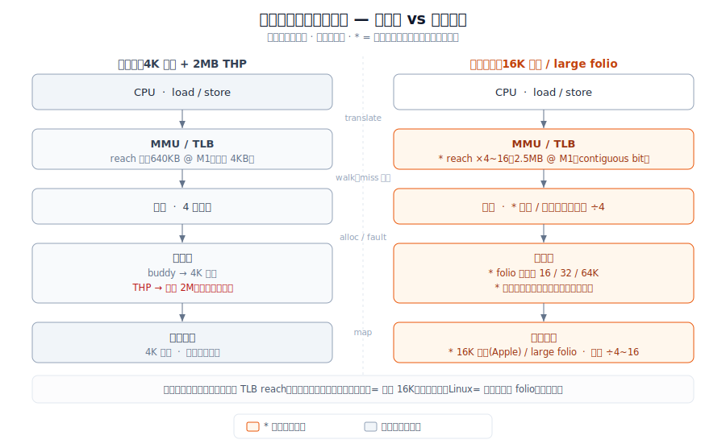
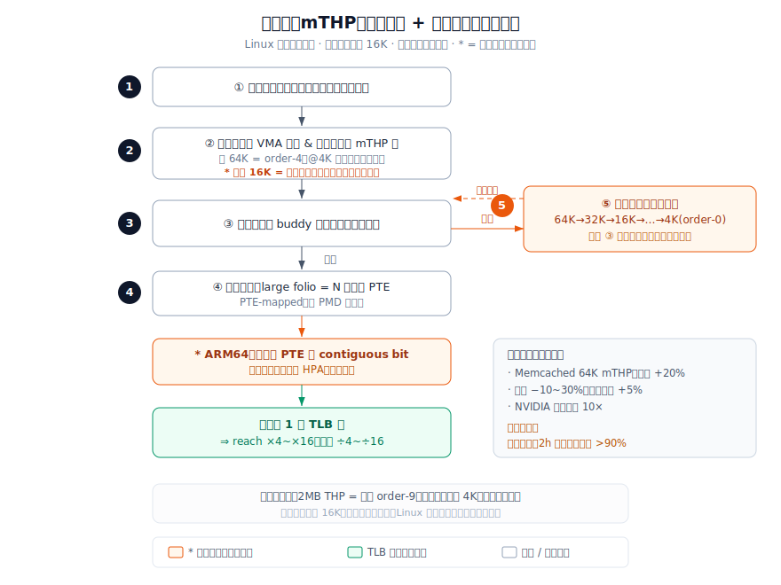

# 放大内存分配粒度：从 4K 基页到 16K 大页与多尺寸 folio（含苹果 16K 深挖）

> 一份「演进前 vs 演进后」的对照调研，聚焦内核**物理内存分配/映射的粒度**这件事。原方案是用了几十年的「4KB 基页 + buddy 分配器 + 整段 2MB 透明大页（THP，全有或全无）」；演进方案是把分配单元**放大**——苹果在 iOS / Apple Silicon 上全面采用 **16KB 固定基页**，安卓 15 起提供 **16KB 页**支持，Linux 6.x 则用 **多尺寸 large folio / mTHP** 在 16K～64K 之间灵活取页。本文把两套方案放在一起：原方案卡在哪、放大粒度带来多少收益、代价是什么。**用户特别关心的「苹果为什么上 16K、能快多少」在 §3 与 §5 单独深挖。** 术语与锚点对齐仓库基础文章 [foundations/A12 — 大页与页粒度](../../foundations/A12-大页与页粒度.md) 和 [foundations/A03 — 物理页分配](../../foundations/A03-物理页分配.md)。

## 1. 范围与方法

**调研对象。** 这里说的「分配粒度」专指**操作系统给应用映射内存时，一次性管理多大一块连续物理内存**。4KB 是 x86 几十年的固定基页；ARM64 架构允许 4KB / 16KB / 64KB 三种基页粒度（[Ampere 调优指南](https://amperecomputing.com/tuning-guides/understanding-memory-page-sizes-on-arm64)）。粒度直接决定三件事：一个 TLB 项覆盖多少内存（TLB reach）、内核要维护多少页表项与逐页元数据、以及一次缺页搬入多大一块。

**原方案。** 4KB 基页 + buddy 分配器，外加整段 2MB 的透明大页（THP）。THP 是「全有或全无」：要么凑齐 2MB 连续物理页一次提升（promote），要么退回 4KB 逐页。它的两个老毛病是延迟尖峰（一次缺页要清零并搬 2MB）和长时间运行后凑不齐连续 2MB（[Linux mTHP 文档](https://docs.kernel.org/admin-guide/mm/transhuge.html)）。

**演进方案。** 放大粒度，两条腿：（1）**固定 16KB 基页**——苹果 iOS 自 64 位转型（iOS 8，2014，A7/A8）起暴露 16KB 页，A9（2015）起原生 16KB 物理页，Apple Silicon Mac 全面 16KB（[Apple AboutMemory 文档](https://developer.apple.com/library/archive/documentation/Performance/Conceptual/ManagingMemory/Articles/AboutMemory.html)）；安卓 15（API 35）起支持 16KB 页（[Android 16KB 文档](https://developer.android.com/guide/practices/page-sizes)）。（2）**多尺寸 large folio / mTHP**——Linux 6.x folio 化后可分配 16K/32K/64K 等「比基页大、比 2MB 小」的中间块，PTE 映射、平滑回退（[mTHP 文档](https://docs.kernel.org/admin-guide/mm/transhuge.html)）。

**资料来源。** 7 条来源，覆盖：苹果官方文档（页大小口径）、第三方 M1 微架构实测（[7-cpu](https://www.7-cpu.com/cpu/Apple_M1.html)，TLB 条目数）、安卓官方文档与博客（16KB 实测基准）、Linux 内核 mTHP 文档、LWN 的 LSFMM 会议报道（mTHP 实测吞吐）、Ampere 调优指南（TLB reach 与内部碎片公式）。下文每个头条数字都能在 §9 对到来源；信封背面的推算（如 M1 的 reach = 条目数 × 页大小）正文已注明。

## 2. 问题背景

**系统要干的事是什么。** 在内存越来越大（手机 12–24GB、PC 16–128GB）、工作集越来越大（浏览器、端侧模型、IDE）的设备上，让 CPU 访存别老在地址翻译上卡壳，让分配和缺页别太频繁。

**为什么这件事会变难。** 四个约束撞在一起：（1）**TLB reach 有限**——TLB 项数是定死的硬件资源，4KB 基页下每项只覆盖 4KB，大工作集频繁 miss；（2）**页表遍历开销**——miss 后要逐级走 4 级页表，每级一次访存；（3）**逐页记账规模**——页越小，页表项与每页 `struct page` 元数据越多；（4）**整段 2MB THP 全有或全无**——粒度跳得太狠，带来延迟尖峰，且长跑后凑不齐连续 2MB。

**为什么原方案不够用了。** 4KB 是 1980 年代为几 MB 内存定的。今天单设备内存涨了上千倍，TLB 项数却只是缓慢增加，4KB 基页让 TLB 只能覆盖几百 KB——相对工作集小到可以忽略。ARM64 生态（苹果、安卓、Ampere 服务器）有了选 16KB/64KB 的自由，于是开始集体放大粒度。

## 3. 具体问题与瓶颈证据

### 具体问题

1. **TLB reach 太小。** 4KB 基页下，Apple M1 大核的 L1 数据 TLB（160 项）只覆盖 640KB、L2 TLB（3072 项）只覆盖 12MB；Ampere Altra 的 L2 TLB 在 4KB 下只覆盖 5MB（[7-cpu M1](https://www.7-cpu.com/cpu/Apple_M1.html)；[Ampere](https://amperecomputing.com/tuning-guides/understanding-memory-page-sizes-on-arm64)）。工作集一旦超过这个范围，访存就持续撞 TLB miss。
2. **逐页记账成本高。** 页大小变 4 倍，页表项与逐页元数据减到约 1/4——Google 的原话是「4 倍大的页 = 1/4 的记账」（[Android 博客 2024](https://android-developers.googleblog.com/2024/08/adding-16-kb-page-size-to-android.html)）。反过来说，4KB 基页把这部分开销放大了 4 倍。
3. **缺页过于频繁。** 4KB 下每触及一页就一次缺页；mTHP 文档明确，放大到 16K/32K/64K 后缺页次数按 4/8/16 倍下降（[mTHP 文档](https://docs.kernel.org/admin-guide/mm/transhuge.html)）。原方案在这一项是基准的 4～16 倍。
4. **2MB THP 全有或全无，长跑会失效。** 经典 THP 每 2MB 一次缺页、有明显延迟尖峰；实测运行 2 小时后，因物理内存碎片，2MB 级分配失败率 >90%（[LWN 2024，Barry Song/Oppo](https://lwn.net/Articles/974826/)）。

### 瓶颈证据（每行都有出处）

| 指标 | 4KB 基页 + 2MB THP（原） | 放大粒度后 | 来源 |
|---|---|---|---|
| L1 DTLB 覆盖（Apple M1，160 项） | 640 KB | **2.5 MB**（16KB 页，4×） | 7-cpu [ref 6] |
| L2 TLB 覆盖（Ampere Altra，1280 项） | 5 MB | **80 MB**（64KB 页，16×） | Ampere [ref 5] |
| 逐页记账量 | 1×（基准） | **约 1/4**（16KB 页） | Google 博客 [ref 2] |
| 缺页次数（mTHP） | 1×（基准） | **1/4 ~ 1/16** | mTHP 文档 [ref 3] |
| 2MB THP 长跑分配成功率（2h 后） | **<10%**（碎片致失败 >90%） | 50%+（加 TAO 补丁，order-4 折中） | LWN [ref 4] |

**读图。** 瓶颈在地址翻译与逐页记账：同样数量的 TLB 项，16KB 把覆盖范围抬高 4 倍（M1：640KB→2.5MB），64KB 抬高 16 倍（Altra L2：5MB→80MB）；记账与缺页同步降到 1/4 量级。这正是苹果选 16KB 的物理动因——不是软件偏好，是硬件账。

## 4. 架构：原方案 vs 演进方案

两张图用同一套组件（CPU、MMU/TLB、页表、分配器、物理页、缺页路径），只看差异在哪。

**原方案 — 4KB 基页 + 整段 2MB THP**

```
        +-------+   translate   +-----------+   walk(4级)  +----------+
        |  CPU  | ------------> | MMU / TLB | -----------> | 4级页表  |
        +-------+               +-----------+               +----------+
            |  load/store           | reach=640KB(M1)            |
            v                       | (每项覆盖 4KB)             | index
        +-------+    fault(每页)    |                           v
        | 缺页  | <-----------------+                     +-----------+
        | 处理  |                                          | buddy 分配|
        +-------+ --- alloc 4KB ------------------------>  +-----------+
            |                                                   |
            |  promote(整段, 全有或全无)                        | map
            v                                                   v
        +-----------+                                     +-----------+
        | 2MB THP   | <--- 凑齐连续 2MB 才成立 -------->  | 物理 RAM  |
        +-----------+                                     +-----------+
```
*原方案：4KB 基页 + buddy，TLB 只覆盖几百 KB，缺页逐页触发；想要大页只能整段 2MB 提升，凑不齐就退回 4KB。*

**演进方案 — 16KB 基页 / 多尺寸 large folio（`*` 为改动处）**

```
        +-------+   translate   +-----------+ * walk(更浅) +----------+
        |  CPU  | ------------> | MMU / TLB | -----------> | 页表     |
        +-------+               +-----------+               +----------+
            |  load/store      * | reach=2.5MB(M1,4×)         |
            v                     | (每项覆盖 16KB)           | index
        +-------+ * fault(1/4~1/16次)|                        v
        | 缺页  | <-----------------+                   +-------------+
        | 处理  |                                        | *folio 分配 |
        +-------+ - alloc 16KB ------------------------> | (16/32/64K) |
            |                                            +-------------+
            |  * coalesce/split(平滑回退, 非全有或全无)         |
            v                                                  | map(连续)
        +-------------+                                  +-----------+
        | *large folio| <-- 取中间尺寸, 凑不齐降一档 ---> | 物理 RAM  |
        +-------------+                                  +-----------+
```
*演进方案：基页放大到 16KB（TLB reach ×4、记账与缺页降到 1/4 量级），大页改成 16/32/64K 多尺寸 folio，凑不齐就降一档而不是退回 4KB。*

一眼差异：`translate` 路径不变，但 TLB **reach 从 640KB 变 2.5MB**；`fault` 从「每页」变「1/4～1/16 次」；分配从「buddy 给 4KB / THP 给整段 2MB」变成「folio 给 16/32/64K 并平滑回退」。

下面是同一对照的 SVG 渲染版（左原方案、右演进方案，分层架构图）：



*与上方两张 ASCII 架构图同义：ASCII 便于文本编辑/diff，SVG 便于贴 PPT 或网页。橙色块为 `*` 标的演进新增结构（TLB reach、页表深度、folio 多尺寸 + 回退、16K/large folio 基页）。*

## 5. 演进为何有用 / 仍未解决

### 演进为何有用

- **TLB reach 太小** —— 基页放大到 16KB，让同样数量的 TLB 项覆盖 4 倍内存（Apple M1：L1 reach 640KB→2.5MB、L2 12MB→48MB；[7-cpu](https://www.7-cpu.com/cpu/Apple_M1.html)），大工作集的 TLB miss 显著减少。
- **逐页记账成本高** —— 16KB 页把页表项与逐页元数据降到约 1/4，把 CPU 周期从内存管理腾给应用（Google 实测整体性能 +5～10%；[Android 博客](https://android-developers.googleblog.com/2024/08/adding-16-kb-page-size-to-android.html)）。
- **缺页过于频繁** —— 放大粒度让缺页次数按 4/8/16 倍下降；安卓官方实测：内存压力下应用启动平均快 3.16%（部分应用最高 30%）、系统启动快 8%（约 950ms）、相机冷启动快 6.60%（[Android 16KB 文档](https://developer.android.com/guide/practices/page-sizes)）。
- **2MB THP 全有或全无** —— mTHP 用 16/32/64K 中间尺寸替代整段 2MB，凑不齐就降一档而非退回 4KB，既拿到大页收益又削掉延迟尖峰；Memcached 实测 64KB mTHP 吞吐 +20%、延迟降 10～30%（[LWN 2024](https://lwn.net/Articles/974826/)）。

**▶ 苹果为什么上 16K、能快多少（重点）。** 苹果不是跟风，是被自家硬件账推着走，公开可考的三条动因：（1）**TLB reach**——M1 大核 16KB 让 L1 DTLB 覆盖从 640KB 抬到 2.5MB、L2 从 12MB 抬到 48MB，正好 4 倍，对大工作集直接少撞 miss（[7-cpu](https://www.7-cpu.com/cpu/Apple_M1.html)）。（2）**页表更浅、记账更省**——4KB 顶层页表要在 512 项里选一项，16KB 能省下一层查找与对应的 TLB 槽位，逐页记账降到约 1/4（[Android 博客](https://android-developers.googleblog.com/2024/08/adding-16-kb-page-size-to-android.html) 给出同口径的「4× less bookkeeping」）。（3）**硬件下限对齐**——M1 的 DART（苹果 IOMMU）最小页就是 16KB，全系统统一用 16KB 比混用更省；同时 16KB 让 L1 数据缓存能做到 128KB、8 路而不破坏 VIPT 索引（[Hacker News 技术讨论](https://news.ycombinator.com/item?id=34476480)，社区考据）。**能快多少？** 苹果**没有公开过自家 16KB 的量化收益**——这是诚实的空白；可引的最接近代理是安卓在**同一改动（4KB→16KB）**上的官方实测：整体 +5～10%、应用启动 +3.16%（最高 30%）、系统启动 +8%/约 950ms、相机冷启动 +6.60%、功耗 −4.56%（[Android 文档](https://developer.android.com/guide/practices/page-sizes)、[博客](https://android-developers.googleblog.com/2024/08/adding-16-kb-page-size-to-android.html)）。把这组数字当苹果的量级参考是合理的，但口径要标清楚是安卓测的。

### 仍未解决

- **内部碎片 / 内存膨胀。** 放大粒度的硬代价：安卓官方实测 16KB 配置平均多用约 9% 内存；Ampere 给的极端例子是「7KB 数据在 64KB 页上效率只有 11%」（[Android 博客](https://android-developers.googleblog.com/2024/08/adding-16-kb-page-size-to-android.html)、[Ampere](https://amperecomputing.com/tuning-guides/understanding-memory-page-sizes-on-arm64)）。小对象多的负载，16KB 不是免费午餐。
- **兼容性与生态迁移成本。** 所有含原生代码的 app 必须按 16KB 对齐重新编译，x86 假设 4KB 的软件（含 Rosetta 2 跑的 x86 程序）会踩坑，Chrome 早年就因此修过 bug（[Android 文档](https://developer.android.com/guide/practices/page-sizes)；[HN 讨论](https://news.ycombinator.com/item?id=34476480)）。苹果靠全栈控制硬扛过去，安卓要到 2025-11 才强制新 app 支持。
- **mTHP 的长跑碎片与策略不成熟。** Linux 多尺寸 folio 在长时间运行后仍受物理碎片制约（2h 后 64KB 分配失败率 >90%，靠 TAO 补丁勉强稳在 50%），且每尺寸开关默认关闭、要 sysfs 手调，跨负载的自动策略还没定型（[LWN 2024](https://lwn.net/Articles/974826/)、[mTHP 文档](https://docs.kernel.org/admin-guide/mm/transhuge.html)）。
- **苹果侧缺乏公开量化数据。** 苹果官方文档只从换页 I/O 角度谈页大小，不给 TLB / 性能数字（[Apple 文档](https://developer.apple.com/library/archive/documentation/Performance/Conceptual/ManagingMemory/Articles/AboutMemory.html)），本文的苹果收益量级是借安卓同改动的实测推断，非苹果实测。

## 6. 对比表

| 维度 | 原方案（4KB 基页 + 2MB THP） | 演进方案（16KB 基页 / large folio） | Improvement |
|---|---|---|---|
| L1 DTLB 覆盖（Apple M1，160 项） | 640 KB | 2.5 MB | ×4 [ref 6] |
| L2 TLB 覆盖（Ampere Altra，1280 项） | 5 MB | 80 MB | ×16（64KB）[ref 5] |
| 逐页记账量 | 1×（基准） | 约 0.25× | −75% [ref 2] |
| 应用启动时延（内存压力，Android） | 1×（基准） | 0.9684×（平均） | −3.16%（最高 −30%）[ref 1] |
| 系统启动时间（Android） | 1×（基准） | 0.92×（约 −950ms） | −8% [ref 1] |
| 吞吐（Memcached 64KB mTHP，Altra） | 1×（基准） | 1.20× ops/s | +20% [ref 4] |
| 内存占用（Android 16KB 配置） | 1×（基准） | 约 1.09× | +9%（回退）[ref 2] |
| 最小分配浪费（7KB 数据，64KB 页） | 12.5% 浪费（4KB） | 89% 浪费（64KB） | +76.5pt（回退）[ref 5] |

注：苹果未公开自家 16KB 的启动/吞吐量化数字，上表「应用/系统启动」「吞吐」用同一改动（4KB→16KB / large folio）下安卓与 ARM 服务器的官方实测作量级代理，口径已在 §5 标清。

## 7. 一词定性

**Coarse-grained（粗粒度化）** —— 把内存的分配/映射单元从 4KB 放大到 16KB 乃至多尺寸 folio，直接把「TLB reach 太小」这个瓶颈拉开 4 倍（Apple M1：640KB→2.5MB），换来安卓官方实测的整体 +5～10% 与系统启动 −8%（约 950ms），代价是约 +9% 内存。

## 8. 开放问题与注意事项

- **苹果数字是代理，不是实测。** 本文苹果侧收益借安卓「同改动」的官方数推断；若哪天苹果或第三方公布 iOS/macOS 16KB 的直接基准，应替换并复核量级是否一致。
- **代理可迁移性存疑。** 安卓在 ARM 手机上的 16KB 收益，未必线性搬到 Apple Silicon Mac 或 x86 PC——缓存层级、TLB 项数、负载结构都不同。
- **x86 PC 仍卡在 4KB。** x86-64 基页固定 4KB（大页是 2MB/1GB），桌面 Windows/Linux 拿不到「16KB 基页」这条腿，只能走 THP/folio；本文「PC」侧的放大粒度收益主要落在 Apple Silicon Mac 与 ARM 服务器，x86 PC 受限要写明。
- **mTHP 策略仍在动。** Linux 多尺寸 folio 的默认开关、自动选尺寸、长跑抗碎片都在演进，明年的实测数字（尤其分配成功率）可能明显不同，需复查 LWN/内核文档。
- **内部碎片随负载摆动。** +9% 内存是安卓的平均值；小对象密集的负载会更糟（最差可到 Ampere 给的 89% 浪费），评估具体产品时要按真实分配尺寸分布重测。

## 9. 参考来源

1. Google / Android Developers，2024–2025，《Support 16 KB page sizes》，<https://developer.android.com/guide/practices/page-sizes>（本地副本：`surveys/sources/large-folio-16k/android-16kb-page-sizes-developer.md`）—— 官方 16KB 实测：应用启动 −3.16%（最高 −30%）、系统启动 −8%/950ms、相机冷启动 −6.60%、功耗 −4.56%、内存 +9%。
2. Google / Android Developers Blog，2024，《Adding 16 KB Page Size to Android》，<https://android-developers.googleblog.com/2024/08/adding-16-kb-page-size-to-android.html>（本地副本：`surveys/sources/large-folio-16k/android-16kb-google-blog.md`）—— 整体 +5～10%、内存 +9%、「4× 大页 = 1/4 记账」。
3. Linux 内核项目，《Transparent Hugepage Support / mTHP》，<https://docs.kernel.org/admin-guide/mm/transhuge.html>（本地副本：`surveys/sources/large-folio-16k/linux-transhuge-mthp-kerneldoc.md`）—— mTHP 支持 16/32/64K、缺页降 4/8/16 倍、平滑回退、内部碎片说明。
4. LWN.net（报道 2024 LSFMM+BPF），2024，《Two talks on multi-size transparent huge page performance》，<https://lwn.net/Articles/974826/>（本地副本：`surveys/sources/large-folio-16k/lwn-mthp-performance-talks.md`）—— Memcached 64KB mTHP +20% ops/s、延迟 −10～30%；内核编译 +5%；2h 后 64KB 分配失败率 >90%、TAO 补丁稳在 50%；NVIDIA 个别负载 10×。
5. Ampere Computing，《Understanding Memory Page Sizes on Arm64》，<https://amperecomputing.com/tuning-guides/understanding-memory-page-sizes-on-arm64>（本地副本：`surveys/sources/large-folio-16k/arm64-page-sizes-ampere.md`）—— ARM64 支持 4/16/64K；Altra L2 TLB reach 5MB(4K)→80MB(64K)；7KB 数据效率 87.5%(4K) vs 11%(64K)。
6. 7-cpu.com，《Apple M1》，<https://www.7-cpu.com/cpu/Apple_M1.html>（本地副本：`surveys/sources/large-folio-16k/apple-m1-tlb-7cpu.md`）—— Firestorm 大核 16KB 模式：L1 DTLB 160 项、L2 TLB 3072 项（推算 reach 2.5MB / 48MB）。
7. Apple Inc.，《About the Virtual Memory System》，<https://developer.apple.com/library/archive/documentation/Performance/Conceptual/ManagingMemory/Articles/AboutMemory.html>（本地副本：`surveys/sources/large-folio-16k/apple-aboutmemory-pagesize.md`）—— 官方口径：OS X/早期 iOS 为 4KB；A7/A8 暴露 16KB（4KB 物理背书）；A9 起原生 16KB。
8. LWN.net（报道 Ryan Roberts / ARM 的 mTHP 补丁系列），2023，《Large anonymous folios》cover letter，<https://lwn.net/Articles/954094/>（本地副本：`surveys/sources/large-folio-16k/lwn-large-anon-folios-954094.md`）—— 缺页选阶 + 回退到 costly order/0、large folio 为 PTE-mapped（非 PMD）、ARM64 contiguous bit + HPA 合并 TLB 项、NVIDIA 个别负载 10×。
9. 补充（弱引用，社区考据）：Hacker News 技术讨论《macOS on Apple Silicon and iOS use 16kiB pages…》，<https://news.ycombinator.com/item?id=34476480> —— M1 DART IOMMU 最小页 16KB、16KB 支撑 128KB/8 路 VIPT L1 缓存、Rosetta 2 处理 x86 4KB 假设的复杂性。

---

## 附录 · 详细案例与方案图：mTHP 大 folio「按需放大 + 平滑回退」分配路径

**为什么挑这个案例，以及它和苹果 16K 的关系。** 苹果 16K 是**静态放大**——整机固定 16K 基页，硬件（含 DART IOMMU 最小页 16K）兜底，永不回退、也不存在「凑不齐」，代价是固定的内部碎片。Linux 的 mTHP（多尺寸透明大页，Ryan Roberts/ARM 主导）走的是**动态放大**——缺页时按需挑一个中间尺寸（16/32/64K…），凑不齐就降一档、最差退回 4K（[LWN 954094](https://lwn.net/Articles/954094/)；[mTHP 文档](https://docs.kernel.org/admin-guide/mm/transhuge.html)）。两者是同一目标（放大粒度、抬 TLB reach、降缺页）的两种实现：**苹果用确定性换灵活性，Linux 用灵活性换（长跑会恶化的）碎片鲁棒性**。这里拆 Linux 的动态路径，因为它的「方法」在内核文档/LWN 里公开可考、能画出可复现的流程图；苹果侧的内部实现没有同等公开细节。

**机制五步（编号对应下方方案图）：**

1. **匿名缺页** —— 进程触到一段尚未映射的匿名内存。
2. **选阶** —— 内核挑「该 VMA 允许、且地址对齐」的最大 mTHP 阶，优先大阶（如 64K = order-4 @4K 基页）；苹果 16K 是固定单一粒度，没有这一步、也没有回退。
3. **试分配** —— 向 buddy 要这一阶的连续物理块。
4. **批量映射（成功）** —— 一个 large folio 用**多个连续 PTE** 映射（PTE-mapped，不是 PMD）；ARM64 给这串连续 PTE 打上 **contiguous bit**（架构机制）或经 **HPA**（微架构），让它们**合并成一个 TLB 项**——这正是 reach 抬 4～16 倍、缺页降 4～16 倍的来源（[LWN 954094](https://lwn.net/Articles/954094/)；[mTHP 文档](https://docs.kernel.org/admin-guide/mm/transhuge.html)）。
5. **降一档（失败）** —— 凑不齐就退到下一个更小阶（64K→32K→16K→…→4K，order-0）重试，**绝不「全有或全无」**。

```
方案图：mTHP「按需放大 + 平滑回退」分配路径（编号对应正文五步）

  [1] 匿名缺页 -- app 触到一段未映射的匿名内存
        |
        v
  [2] 选阶 -- 挑「该 VMA 允许 & 地址对齐」的最大 mTHP 阶
        |      例: 64K = order-4 (@4K 基页)
        |      (* 苹果 16K = 固定单一粒度, 无此步、也无回退)
        v
  [3] 试分配 -- 向 buddy 要这一阶的连续物理块
        |
        |---------------- 失败 -----------------+
        |                                        v
        |                       [5] 降一档 (平滑回退):
        |                       64K -> 32K -> 16K -> ... -> 4K(order-0)
        |                       回到 [3] 重试, 绝不「全有或全无」
        v 成功
  [4] 批量映射 -- large folio = N 个连续 PTE (PTE-mapped, 非 PMD)
        |
        v
  * ARM64: 给连续 PTE 打 contiguous bit(架构) 或经 HPA(微架构)
        |
        v
  合并成 1 个 TLB 项  ==>  reach x4~x16、缺页 /4~/16

  对照原方案: 2MB THP = 整段 order-9, 凑不齐直接退 4K (全有或全无)
  legend: order-k = 2^k 个基页;  * = 放大粒度的关键新增机制
```



*上图为 SVG 渲染版，与前面的 ASCII 方案图同义：ASCII 便于在文本里编辑/diff，SVG 便于贴进 PPT 或网页。*

**怎么读这张图。** 与原方案的差别就在 [5] 这条回退路：经典 2MB THP 是「整段 order-9，凑不齐直接退 4K」（全有或全无，长跑后 2h 失败率 >90%，§3）；mTHP 在中间多了 32K/16K 几档，降级而非崩盘。真正把粒度收益变现的是 [4] 的 `* ARM64 contiguous bit`——没有它，N 个连续 PTE 仍占 N 个 TLB 项，放大就白做。**实测收益**：Memcached 64K mTHP 吞吐 +20%、延迟 −10～30%，内核编译 +5%，NVIDIA 个别负载 10×（[LWN 974826](https://lwn.net/Articles/974826/)、[954094](https://lwn.net/Articles/954094/)）。**遗留代价**：长跑碎片让大阶分配成功率掉到 50% 以下（靠 TAO 补丁勉强稳住），且每尺寸默认关闭、要 sysfs 手调——这正是苹果用「固定 16K」绕开、而 Linux 用「灵活多尺寸」换来的那笔账。
