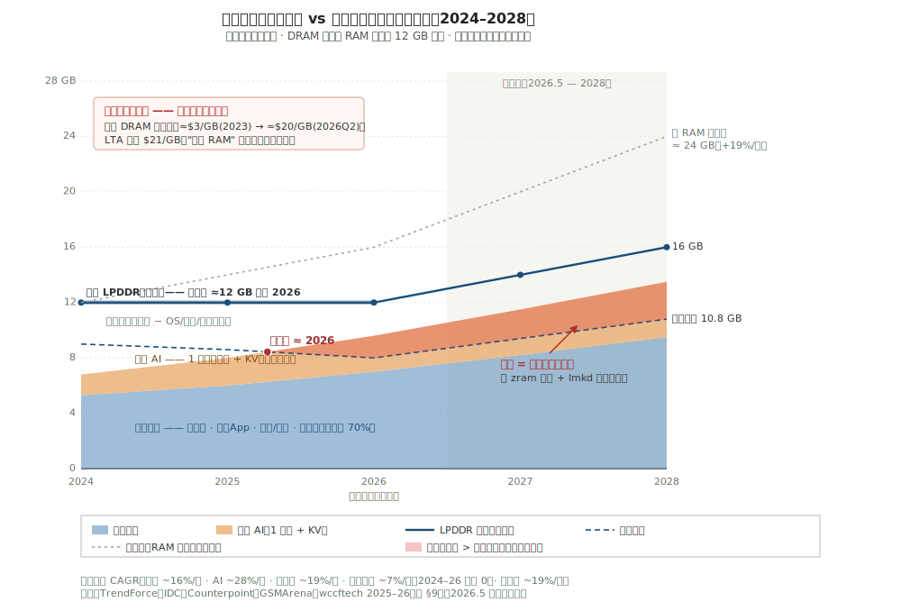
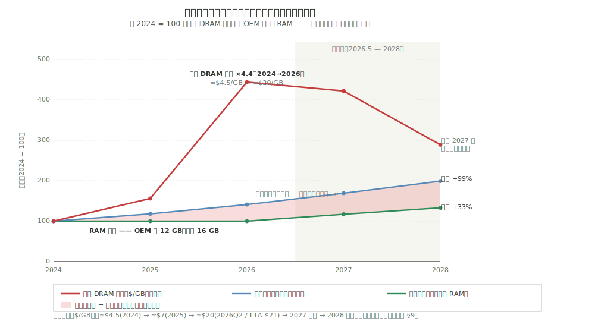
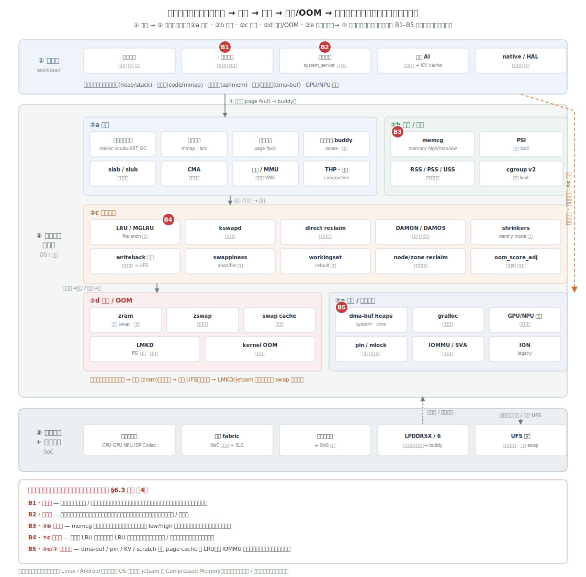
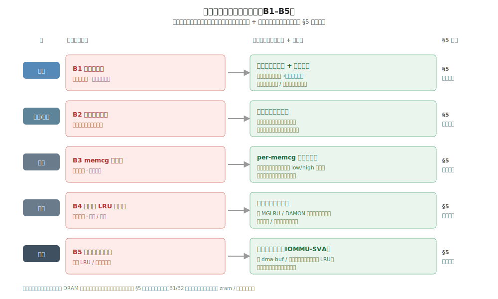

# 内存负载与容量之争：2024–2026 的挤压与 2027–2028 的破裂点

> 这是一份关于手机内存的负载趋势调研，刻意采用**传统应用优先**的视角。浏览器、超级 App、相机/视频、游戏、后台服务——这些普通应用才是内存需求的主驱动力，端侧大模型是真实存在但权重次要的增量。报告聚焦一个在 **2024–2026** 集中爆发、并将在 **2027–2028** 持续恶化的三方矛盾：其一，内存**需求持续增长**；其二，最直接的解决办法——多加 DRAM——被价格堵死，容量因此**被冻结**；其三，剩下唯一还能动的杠杆——**软件层面的内存治理**（压缩加杀进程）——如今被迫去填一个它从设计之初就没有准备填的缺口。预测部分会明确站队，开放问题部分则给出可能推翻预测的反例。

## 1. 范围与方法

**调研对象。** 所谓"内存负载"，指的是数据在手机上如何被创建、如何留驻内存、如何被访问、又如何被回收。基准场景设定为 2024–2028 年的中位旗舰 Android 机型，同时运行多个前后台应用，外加少量端侧 AI（一个常驻的助手或感知模型）。数据中心内存只在一个角色下出场：它是那只在幕后把 DRAM 产能抢走的手。

**观察窗口：2024 年至 2026 年中。** 这段时期由两件事定义。第一，普通应用对内存的预期在持续抬升：新 Android 手机的平均 RAM 从 2023 年的约 6 GB 涨到 2025 年的约 8 GB，Android 16 将完整版系统的最低门槛提高到 6 GB，彻底告别 4 GB。第二，也是这两年真正的头条——**移动 DRAM 从便宜变得稀缺**：合约价在 2026 年 Q1 环比上涨约 58–63%，Q2 又几乎翻了一倍，达到约 $20/GB，长期协议（LTA）甚至签到了 $21/GB。2024 年之前的历史只作为背景参考，不作为分析数据。

**外推窗口：2026 年中至 2028 年。** 大约两个产品周期。这个跨度足够长，能看清价格尖峰是否回落、厂商是否解冻内存规格；又足够短，底层物理约束（DRAM 位供给增速、移动端不支持闪存 swap、LPDDR 密度曲线）不会发生根本性变化。

**资料来源。** 第 9 节列出 17 条来源：10 条标记 `[now]`（已出货产品、已发布标准、2025–2026 年的真实价格数据），5 条标记 `[projection]`（分析机构预测与供给路线图），2 条标记 `[background]`（本项目 A16 系列及其 AI 视角的姊妹篇）。其中至少 6 条包含直接用于两张图表的硬数字。

**这份调研不是什么。** 不是产品对比，不是厂商跑分，也不是中性综述。它有明确立场：2026–2028 年手机内存真正的瓶颈在于**经济意义上的容量上限**，而软件治理买到的是时间，不是容量。

## 2. 矛盾一图看清

*图 1. 挤压全貌。横轴为年份（中位旗舰），纵轴为 GB。堆积色块表示需求：蓝色为传统应用（约占总量 70%），橙色为一个常驻端侧 AI 模型及其 KV cache。深色实线是旗舰 LPDDR 的实际容量——注意它在 2026 年之前一直贴着 12 GB 不动，这就是所谓"冻结"。浅色虚线是反事实假设：如果 RAM 维持便宜、保持历史上约 19%/年的增速，容量到 2028 年本应达到约 24 GB。深色虚线是用户可用内存（总容量减去 OS、驱动、被钉住的预留——而这部分预留本身也在增长）。红色楔形区域代表缺口，即工作集中塞不进用户可用 DRAM、必须靠回收机制（zram 压缩加 lmkd 杀进程）来消化的部分。这道缺口大约在 2026 年前后出现，并持续扩大。2026 年中之后为外推区间。来源：TrendForce、IDC、Counterpoint、GSMArena、wccftech 2025–2026（见第 9 节）。*

*图 2. 因果链拆解。以 2024 年为基准（= 100）做指数化。红线是移动 DRAM 价格（$/GB）：从 2024 到 2026 合约峰值涨了约 4.4 倍。绿线是中位旗舰的实际容量：先走平（厂商守住 12 GB，没有升级到 16 GB），到 2028 年缓慢爬升至 +33%。蓝线是需求（工作集）：稳步增长，到 2028 年累计 +99%。需求与容量之间的阴影带即为结构性缺口，而红色价格线正是绿色容量线走平的根本原因。价格要到 2027 年供给缓解后才可能回落。*

两张图合在一起，讲的是四件事：

1. **需求在涨，主力是普通应用。** 传统工作集以约 16%/年的速度增长，来源包括更重的富媒体内容、更多后台服务、webview 与超级 App 的持续膨胀，以及不断抬高的系统底座。端侧 AI 是一个增速更快但体量更小的叠加项。**即使没有 AI 的故事，需求一样在涨。**
2. **容量冻结的原因是经济性，不是物理极限。** 移动 DRAM 价格翻了三倍多，厂商选择把旗舰内存按在 12 GB 不动，而不是升级到 16 GB。图 1 中容量线恰好在它历史上本该"上台阶"的位置走平了。
3. **过去二十年最省事的出路被堵死了。** 长期以来，应用需要更多内存的解法一直是"多塞 DRAM"。图 2 清楚地展示这根杠杆已经失效：价格涨了 4.4 倍，容量增长为零。过去靠容量冗余自然消化的缺口，现在彻底暴露出来。
4. **治理机制被迫接管这道缺口。** 图中的红色楔形并不是在预测系统崩溃，而是在描述回收机制当下每天都在干的事：zram 压得更狠，lmkd 杀得更早。与此同时，越来越大一块内存被钉住、无法被回收。这是矛盾的第三条边，而它正在逼近极限。

## 3. 趋势（4 条）

- **增长** — 传统应用的内存占用（浏览器、超级 App、相机/视频、游戏、后台服务）以约 16%/年持续上涨，端侧 AI 在此基础上叠加一个体量更小但增速更快的增量。
- **冻结** — 中位旗舰 RAM 在 2024–2026 年间一直停留在 12 GB 附近，原因是移动 DRAM 价格大致翻了三倍，打断了厂商历史上"每一代多塞点内存"的惯性。
- **饱和** — 当前的治理手段（zram 压缩、lmkd/jetsam 杀进程，且移动端没有闪存 swap）被迫吸收一个不断扩大的需求与容量之间的缺口，已经进入边际递减区间。
- **钉住** — 越来越大一块 RAM 被锁定在回收机制看不见的缓冲区中（dma-buf、KV cache、GPU/NPU 与相机/视频 scratch），使得治理真正能调度的可用池持续缩小。

## 4. 挑战

| 趋势 | 产业层面 | 技术层面 | 系统治理层面 | 架构/形态层面 |
|---|---|---|---|---|
| **增长** | 每一代 OS 和应用都在抬高 RAM 底线（Android 16 淘汰 4 GB 机型；新机平均内存两年内从 6 GB 涨到 8 GB），持续推高 BOM 成本。 | 应用工作集因富媒体加重、后台服务增多、webview 和超级 App 膨胀而增长，增速超过任何单一压缩算法的回收能力。 | 内存余量收窄，回收触发频率升高；后台应用被更早杀死，损害热启动和多任务体验。 | 更高分辨率的相机/视频管线、更多协处理器各自占用专属缓冲，抬高了常驻内存的底线。 |
| **冻结** | 移动 DRAM 价格翻三倍（约 $3 → $20/GB），旗舰守住 12 GB 不升级 16 GB，整机售价上涨约 $150–200。 | 每封装容量年增速仅约 10–16%，而需求增速约 19%/年，密度提升无法弥合缺口。 | 没有新增 DRAM 注入，OS 只能用同样大小的内存做更多的事——每一个 GB 都要靠回收来争取，而不是靠采购来获得。 | 位供给增速被压制在约 10–16%/年，HBM 吃掉约 23% 的晶圆产能；CXL 内存、MRAM、近存计算等新介质从可选项变为必选项。 |
| **饱和** | "AI 就绪内存"的营销话术遭遇冻结的硬件规格现实；中端机型在可用内存上与旗舰的差距越拉越大。 | 单一算法的无损压缩（zram/LZ4）边际递减；AI 数据需要有损的、按数据类型设计的专门压缩方案，但主线内核尚未支持。 | lmkd/jetsam 在持续内存压力下触发更频繁、杀进程更激进；PSI 调参有优化空间，但不能凭空创造容量。 | 移动端没有闪存 swap（受限于寿命和延迟），仅剩的两个泄压口——压缩和杀进程——都只能在片上 DRAM 内解决。 |
| **钉住** | 部分厂商将被钉住的 AI 缓冲包装为"AI 预留"以转嫁 OOM 责任，进一步压缩用户可用内存。 | dma-buf、KV cache、GPU/NPU scratch 绕过 page cache 和 LRU 机制；被钉住内存的占比持续上升。 | MGLRU/DAMON 无法感知设备驻留页，回收对越来越大一块负载完全不可见。 | IOMMU/SVA 必须延伸到设备缺页路径，才能让设备侧内存纳入统一治理；目前的支持是局部的，取决于具体芯片。 |

## 5. 应对方向

- **增长** → **分层内存（tiered memory）**：将冷页沿 DRAM → 压缩层 → 闪存后端的层级逐级下沉，让热数据的常驻集合能够装进固定的 DRAM 预算。
- **冻结** → **主动回收（proactive reclaim）**：从被动等水线触发，转向基于 DAMON/MGLRU 老化追踪与 PSI 反馈的主动回收，在同等容量下维持更多应用常驻。
- **饱和** → **异构压缩（heterogeneous compression）**：按数据类型（匿名页/文件页/KV cache）分别采用不同压缩策略；对 zram 无损压缩无能为力的 AI 数据，采用有损的专用方案（KV 2-bit 量化、token 淘汰）。
- **钉住** → **统一内存治理（unified memory governance）**：扩展 IOMMU/SVA 能力，让设备驻留的被钉住页也加入缺页和 LRU 路径，从一块封闭的独占池变为可被系统回收的统一资源。

## 6. 内存治理体系与负载瓶颈

第 4、5 节从趋势层面给出了挑战与应对方向。本节把视角下沉到工程实现：沿"内存负载 → 内存管理系统 → 片上互联架构"三层，画出当前手机内存治理体系的组成，标注当前负载对它提出的 5 个关键瓶颈（B1–B5），并对每条瓶颈给出对应的治理手段。可以把本节看作第 5 节四个方向的具体落地——把策略落到 memcg、文件页 LRU、整入整出、IOMMU/SVA 等真实组件上。

### 6.1 三层治理架构与瓶颈位置

*图 3. 手机内存管理全貌，以及瓶颈在全貌中的位置。① 负载层是内存需求的来源（前台/后台应用、常驻系统服务、端侧 AI、native/HAL），以及它们产生的匿名页、文件页、共享与设备缓冲。② 内存管理系统层是 OS/内核的完整治理栈，分五个子系统：**②a 分配**（用户态分配器、缺页、伙伴系统、slab、CMA、页表/MMU）、**②b 记账**（memcg、PSI、RSS/PSS）、**②c 回收**（LRU/MGLRU、kswapd/direct、DAMON、shrinker、writeback、swappiness 等）、**②d 交换与 OOM**（zram/zswap、swap cache、LMKD、kernel OOM）、**②e 设备/共享内存**（dma-buf、gralloc、GPU/NPU 显存、pin/mlock、IOMMU/SVA）。③ 片上互联层是物理基底（计算客户端、互联 fabric + SLC、内存控制器、LPDDR 固定容量、UFS 存储）。红色 B1–B5 标出当前负载对这套体系提出的关键瓶颈在全貌中的位置；橙色虚线是设备/钉住内存绕过 ②c 回收的路径。注意片上唯一的两个泄压口只有压缩（zram）和杀（LMKD）——文件页可回写 UFS，但移动端不 swap 到闪存。*

这套体系的设计前提是"DRAM 还能加"：当应用需要更多内存，过去靠多塞 DRAM 解决，治理只需在水线附近做些被动回收。如今容量被冻结（见第 2 节），治理被迫从"锦上添花"变成"独自填缺口"，于是它在三层上各自暴露出短板。

### 6.2 五个关键瓶颈

- **B1 · 负载层 —— 场景化冗余。** 许多应用与系统服务在不同场景下会用到不同的内存区域，但跨场景来看，整体内存利用率偏低，且存在大量跨场景冗余的常驻工作集。这类冗余可以通过回栈（调用栈归因）定位到具体场景与代码路径。
- **B2 · 负载/系统边界 —— 系统服务常驻冗余。** 系统服务通常是常驻的，但很多前台场景并不需要全部系统服务同时在内存里。当前缺少一套按场景把系统服务内存整体换入/换出的机制。
- **B3 · 系统层（②b 记账）—— memcg 缺乏水线管理。** 当前 memcg 的分组回收缺乏精细化、自适应的水线（low/high）：触发粗放，无法按组、按实时压力调节，结果要么回收不足、要么过度回收。
- **B4 · 系统层（②c 回收）—— 整机文件页 LRU 场景盲。** 全局文件页 LRU 在做冷热判定时缺乏场景化信息与特征，导致较多假阳性（误回收其实还热的页）与假阴性（留滞已经冷的页），回收的准头不够。
- **B5 · 设备内存（②e ↔ ③）—— 设备钉住内存不可见。** dma-buf、KV cache、GPU/NPU 与相机/视频 scratch 绕过 page cache 与 LRU，经 IOMMU 直连设备，被钉住、回收看不见——这是第 3 节"钉住"趋势在架构层的落点，也是治理可回收池持续缩小的根源。

### 6.3 每条瓶颈的治理手段

*图 4. 瓶颈与治理手段一一对应。左侧红色为瓶颈，右侧绿色为对应治理手段（技术领域 + 具体做法），最右标注其归属的第 5 节应对方向。四类手段的共同点是：在不增加 DRAM 的前提下提高有效容量。*

| 瓶颈 | 所在层 | 根因 | 治理手段（技术领域） | 对应 §5 方向 |
|---|---|---|---|---|
| **B1 场景化冗余** | 负载 | 跨场景驻留不同内存区，整体利用率低 | **场景化内存画像 + 整入整出**：以回栈归因建立"场景 → 内存区域"映射，按场景把冗余工作集整体换入/换出。 | 分层内存 |
| **B2 系统服务常驻** | 负载/系统 | 常驻服务在多数前台场景并非全需 | **系统服务按需驻留**：识别前台场景实际依赖的服务集合，把非必需的常驻服务内存整体换出。 | 主动回收 |
| **B3 memcg 缺水线** | 系统 | 分组回收触发粗放、门限静态 | **per-memcg 自适应水线**：为每个 memcg 配置随压力自适应的 low/high 水线，按组、按实时压力触发回收。 | 主动回收 |
| **B4 文件页 LRU 场景盲** | 系统 | 冷热判定缺场景特征，假阳/假阴多 | **场景特征冷热识别**：在 MGLRU/DAMON 之上引入场景特征（前后台、场景标签、访问模式），降低误判。 | 主动回收 |
| **B5 设备钉住不可见** | 互联 | 设备页绕过 page cache 与 LRU | **统一内存治理（IOMMU-SVA）**：让 dma-buf 与设备驻留页进入缺页与 LRU 路径，使钉住内存可观测、可回收。 | 统一内存治理 |

四条治理手段都指向同一个目标：**在买不到更多 DRAM 的约束下，把现有的每一个字节用得更满。** 其中 B1/B2 的"整入整出"本质是场景粒度的换入换出，它的下沉目标——压缩层（zram）或异构压缩——正对应第 5 节的"异构压缩"方向；B3/B4 把第 5 节的"主动回收"从全局细化到按组、按场景；B5 则与第 5 节"统一内存治理"完全对应。需要说明的是，B5 所依赖的 IOMMU/SVA 设备缺页回收目前在手机上仍偏路线图与研究（见第 8 节说明），应作为技术方向而非已出货特性看待。

## 7. 带立场的预测（2027–2028）

- **到 2027 年，中位旗舰仍然只配 ≤16 GB，中端机型守在 8 GB。** *依据：*移动 DRAM 合约价在整个 2027 年维持高位（美光与 TrendForce 均指出短缺将延续，长期协议锁定了价格下限），而厂商在 2026 年已经做出了冻结规格的选择，不愿吞下每台约 $150–200 的额外成本。*置信度：high。*
- **整个 2028 年，手机新功能的真正瓶颈是内存容量，不是算力。** *依据：*NPU 的 TOPS 仍在逐代翻倍，而 DRAM 的字节数几乎不动。这意味着每一个现实中的取舍——能同时常驻几个应用、上下文窗口能开多长、相机缓冲能分配多少——都是内存问题，而非算力问题。*置信度：high。*
- **到 2028 年，Android、HarmonyOS、iOS 三大平台中至少两家，将"激进的默认压缩加主动回收"作为头号内存优化卖点。** *依据：*容量被冻结之后，治理是唯一不增加硬件成本的杠杆。PSI 驱动的 lmkd 和 MGLRU 老化机制已经在走上游化的路径。买不到的容量，厂商就会把治理能力包装成产品特性来营销。*置信度：high。*
- **到 2028 年，一台旗舰的 RAM/存储配置对 BOM 的贡献，将超过整颗 SoC。** *依据：*2026 年 Q1，16 GB LPDDR5X + 1 TB UFS 4.1 的成本已经越过约 $280/台，超过了骁龙 8 至尊版 Gen 5。随着差距拉大，内存配置将成为手机定价的第一杠杆。*置信度：medium。*
- **2027 年会出现部分 DRAM 价格缓解，但回不到 2023 年的水平；LPDDR 单价仍将维持在 2024 年水平的 2 倍以上。** *依据：*分析机构的基准情景是从 2026 年 Q3 起，随着产能爬坡价格逐步回落。但 HBM 持续消耗晶圆产能、新增 CapEx 对位供给的拉动有限，决定了缓解幅度有天花板。*置信度：medium。*
- **到 2028 年，至少一家主流 OEM 推出面向用户的"内存扩展 / RAM Plus"式闪存 offload 功能，以虚拟容量的名义对外宣传。** *依据：*DRAM 冻结之下 OOM 问题日益暴露在用户面前，闪存成为最后一个可用的泄压通道。类似 swap-to-storage 的特性已有先例，将被加大力度并重新包装为"扩容"。*置信度：low。*

## 8. 开放问题与说明

- **价格路径是整套分析的承重假设。** 如果 2027 年出现一次快速的供过于求修正（某分析机构给"2027 年底 DDR5/DDR6 跌幅超 50%"的情景约 20% 概率），厂商可能随之解冻内存规格，缺口收窄，上述预测的强度都会下降。需要每季度重新核查 DRAM 合约价走势。
- **"中位旗舰"这个基准掩盖了中端机的困境。** 一台 2026 年的 8 GB 中端手机，会比图 1 中的旗舰更早、更剧烈地撞上这道缺口。如果将分析对象从旗舰扩展到全机队，矛盾激化的时间表要提前 12–18 个月。
- **传统需求的增长斜率是估算值。** 约 16%/年的增速锚定在 6 → 8 GB 的平均内存变化和定性的应用膨胀证据上，并非基于逐 App 实测的工作集普查。如果开发者在内存压力下主动收紧资源占用，实际增速可能低于此值。
- **治理的缓冲余量比图上画的更大，但要拿体验来换。** 压缩压得更狠、进程杀得更早，能消化的缺口确实比图中所示更大——代价是热启动变慢、多任务体验变差、功耗上升。图中的楔形代表的是"回收机制必须承担的额外负荷"，不是"系统即将崩溃"。
- **统一内存治理在手机上目前仍偏学术。** IOMMU/SVA 设备缺页回收和闪存分层都来自路线图与研究文献，尚非已出货的成熟特性。"钉住"趋势对应的应对方向，以及 2028 年闪存 offload 那条预测，都应作为技术方向而非产品承诺来理解。
- **端侧 AI 未必一直是"次要角色"。** 本篇按调研要求刻意将 AI 视为较小的增量。一旦 always-on、多模型的 agentic 负载成为默认配置，图 1 中橙色的 AI 色块将大幅扩张，需求与容量的交叉点会显著左移。详见以 AI 为主视角的姊妹篇。

## 9. 参考资料

1. TrendForce (2026). *Memory Makers Prioritize Server Applications, Driving Across-the-Board Price Increases in 1Q26*. [https://www.trendforce.com/presscenter/news/20260105-12860.html](https://www.trendforce.com/presscenter/news/20260105-12860.html) —— DRAM 合约价 2026 年 Q1 环比 +58–63%。`[now]`
2. TrendForce (2025). *Memory Price Surge to Persist in 1Q26; Smartphone and Notebook Brands Begin Raising Prices and Downgrading Specs*. [https://www.trendforce.com/presscenter/news/20251211-12831.html](https://www.trendforce.com/presscenter/news/20251211-12831.html) —— 厂商涨价并下调内存规格。`[now]`
3. TrendForce (2025). *AI Reportedly to Consume 20% of Global DRAM Wafer Capacity in 2026, HBM and GDDR7 Lead Demand*. [https://www.trendforce.com/news/2025/12/26/news-ai-reportedly-to-consume-20-of-global-dram-wafer-capacity-in-2026-hbm-gddr7-lead-demand/](https://www.trendforce.com/news/2025/12/26/news-ai-reportedly-to-consume-20-of-global-dram-wafer-capacity-in-2026-hbm-gddr7-lead-demand/) —— AI 约占 DRAM 晶圆 20%；1 GB HBM = 4x 标准 DRAM，GDDR7 = 1.7x。`[now]`
4. wccftech (2026). *Mobile DRAM Prices Expected To Increase By ~100% QoQ, As Long-Term Agreements Now Getting Signed At Prices As High As $21/GB*. [https://wccftech.com/mobile-dram-prices-expected-to-increase-by-100-quarter-over-quarter-as-long-term-agreements-now-getting-signed-at-prices-as-high-as-21-gb/](https://wccftech.com/mobile-dram-prices-expected-to-increase-by-100-quarter-over-quarter-as-long-term-agreements-now-getting-signed-at-prices-as-high-as-21-gb/) —— Q2 2026 LPDDR5 约 $19.3–19.8/GB；LTA 高至 $21/GB。`[now]`
5. CNBC (2026). *AI memory is sold out, causing an unprecedented surge in prices*. [https://www.cnbc.com/2026/01/10/micron-ai-memory-shortage-hbm-nvidia-samsung.html](https://www.cnbc.com/2026/01/10/micron-ai-memory-shortage-hbm-nvidia-samsung.html) —— 内存厂将大部分产能转向 AI 用 HBM。`[now]`
6. The Register (2026). *DRAM prices expected to nearly double in Q1*. [https://www.theregister.com/2026/02/02/dram_prices_expected_to_double/](https://www.theregister.com/2026/02/02/dram_prices_expected_to_double/) —— DRAM 合约价近乎翻倍。`[now]`
7. GSMArena (2025). *Here are Google's new minimum RAM and storage requirements for Android phones*. [https://www.gsmarena.com/here_are_googles_new_minimum_ram_and_storage_requirements_for_android_phones-news-67387.php](https://www.gsmarena.com/here_are_googles_new_minimum_ram_and_storage_requirements_for_android_phones-news-67387.php) —— Android 16 将完整版系统最低内存提至 6 GB。`[now]`
8. Android Authority (2025). *How much RAM does your phone need in 2025?* [https://www.androidauthority.com/how-much-ram-do-i-need-phone-3086661/](https://www.androidauthority.com/how-much-ram-do-i-need-phone-3086661/) —— 新 Android 手机平均内存 6 GB (2023) → 8 GB (2025)；Pixel 9 较上代 +50%。`[now]`
9. Gizmochina (2025). *How Much RAM Do You Really Need in a Smartphone in 2026?* [https://www.gizmochina.com/2025/12/19/how-much-ram-do-you-really-need-in-a-smartphone-in-2026/](https://www.gizmochina.com/2025/12/19/how-much-ram-do-you-really-need-in-a-smartphone-in-2026/) —— 2026 旗舰大概率维持 12 GB 而非升级至 16 GB。`[now]`
10. Android Developers. *Memory allocation among processes*. [https://developer.android.com/topic/performance/memory-management](https://developer.android.com/topic/performance/memory-management) —— LMKD/PFRA/zram 机制；手机 swap 到 zram，不 swap 到闪存。`[now]`
11. IDC (2026). *Global Memory Shortage Crisis: Market Analysis and the Potential Impact on the Smartphone and PC Markets in 2026*. [https://www.idc.com/resource-center/blog/global-memory-shortage-crisis-market-analysis-and-the-potential-impact-on-the-smartphone-and-pc-markets-in-2026/](https://www.idc.com/resource-center/blog/global-memory-shortage-crisis-market-analysis-and-the-potential-impact-on-the-smartphone-and-pc-markets-in-2026/) —— 2026 年 DRAM 供给增速约 16% YoY，低于 20–30% 的历史常态。`[projection]`
12. TrendForce (2026). *AI Server Demand to Drive Memory Contract Price Increases in 2Q26 as CSPs Secure Supply via Long-Term Agreements*. [https://www.trendforce.com/presscenter/news/20260331-12995.html](https://www.trendforce.com/presscenter/news/20260331-12995.html) —— Q2 2026 移动 DRAM 环比约 +100%；压力延续至 2027。`[projection]`
13. wccftech (2026). *Memory Shortages To Last Till At Least Q4 2027, Higher Prices Expected Throughout 2026–2027*. [https://wccftech.com/memory-ddr5-ddr4-shortages-last-till-q4-2027-higher-prices-throughout-2026/](https://wccftech.com/memory-ddr5-ddr4-shortages-last-till-q4-2027-higher-prices-throughout-2026/) —— 短缺与高价延续至 2027。`[projection]`
14. TrendForce (2025). *Memory Industry to Maintain Cautious CapEx in 2026, with Limited Impact on Bit Supply Growth*. [https://www.trendforce.com/presscenter/news/20251113-12780.html](https://www.trendforce.com/presscenter/news/20251113-12780.html) —— 新增 CapEx 对 2026 位供给影响极小。`[projection]`
15. Luminix (2026). *DRAM Cycle Analysis 2026: Boom-Bust Pricing, Inventory Levels, Peak Timing Indicators*. [https://www.useluminix.com/reports/industry-analysis/dram-cycle-position-analysis-peak-timing-indicators](https://www.useluminix.com/reports/industry-analysis/dram-cycle-position-analysis-peak-timing-indicators) —— 2027 修正情景；价格急跌的怀疑论观点。`[projection]`
16. Tom's Hardware (2026). *Server memory prices to double year-over-year in 2026, LPDDR5X prices could follow — 'seismic shift' means even smartphone-class memory isn't safe*. [https://www.tomshardware.com/pc-components/dram/nvidias-demand-for-lpddr5x-could-double-smartphone-and-server-memory-prices-in-2026-seismic-shift-means-even-smartphone-class-memory-isnt-safe-from-ai-induced-crunch](https://www.tomshardware.com/pc-components/dram/nvidias-demand-for-lpddr5x-could-double-smartphone-and-server-memory-prices-in-2026-seismic-shift-means-even-smartphone-class-memory-isnt-safe-from-ai-induced-crunch) —— 数据中心 LPDDR5X 需求外溢至手机级内存。`[projection]`
17. 本项目 —— A16 系列（*Agent 时代内存负载*）与 AI 视角姊妹篇 *agent-era-memory-workload*。[../advanced/A16-前沿-Agent时代内存负载.md](../advanced/A16-前沿-Agent时代内存负载.md)、[agent-era-memory-workload-CN.md](agent-era-memory-workload-CN.md) —— 治理机制（主动回收、异构压缩、统一内存治理）与 AI 负载对照视角的主要参考。`[background]`
