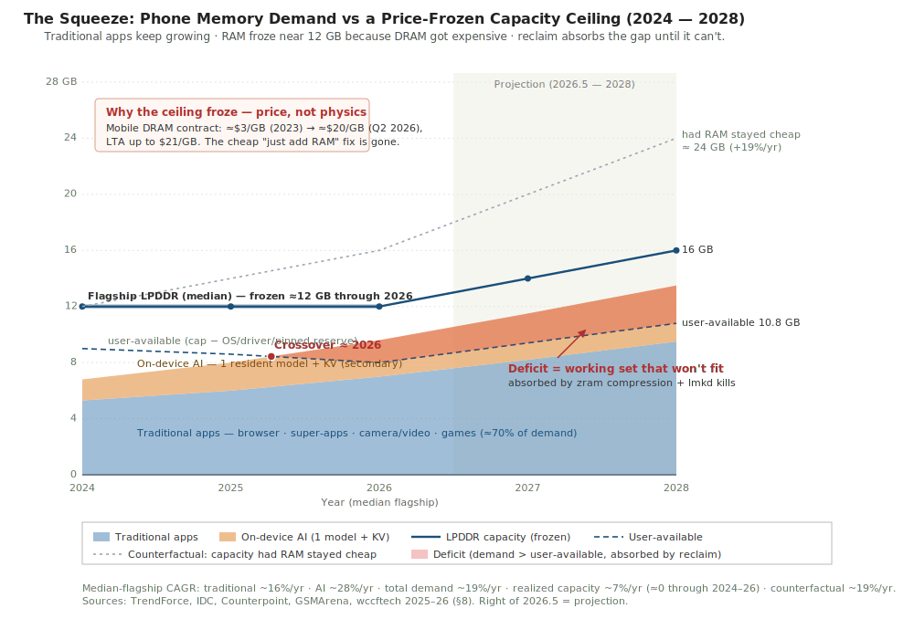
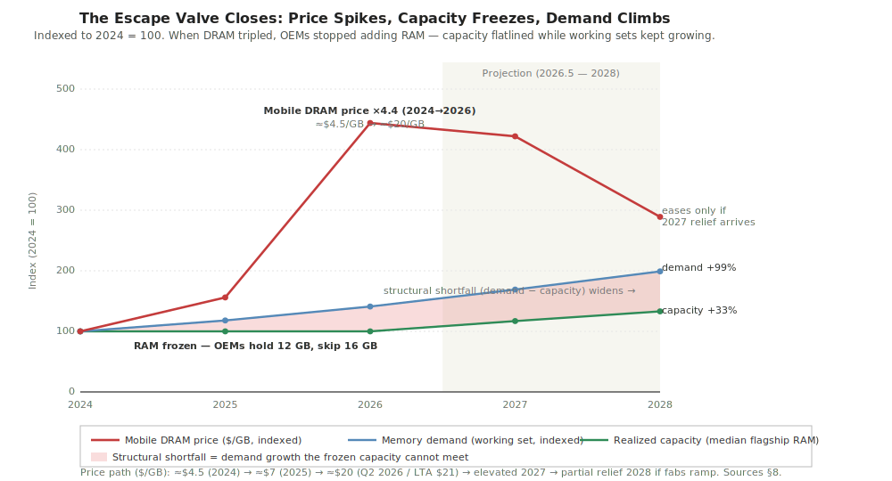

# Memory Workload vs Capacity: The 2024–2026 Squeeze and Where It Breaks (2027–2028)

> This is a workload-trend study of phone memory. It takes a deliberately **traditional-app-first** view — ordinary apps (browser, super-apps, camera/video, games, background services) are the main demand driver; on-device AI is a real but secondary increment. The point of the document is a three-way conflict that came to a head in **2024–2026** and gets worse in **2027–2028**: (1) memory **demand keeps growing**; (2) the cheapest answer — **buy more DRAM** — got priced out, so capacity **froze**; (3) the only remaining lever, **software memory governance** (compression and process-killing), is now asked to bridge a gap it was never sized for. The forecast section takes a side; the open-questions section says what would prove it wrong.

## 1. Scope and method

**Domain.** "Memory workload" means how data gets created, kept resident, accessed, and reclaimed on a phone. The baseline is the median flagship Android-class smartphone from 2024 through 2028, running ordinary foreground and background apps plus a modest amount of on-device AI (one resident assistant/perception model). Datacenter memory appears only as the off-screen force that is bidding away the DRAM supply.

**Observation window: 2024 to mid-2026.** Two things define it. First, ordinary RAM expectations climbed: the average new Android phone went from ~6 GB (2023) to ~8 GB (2025), and Android 16 retired 4 GB for full Android. Second, and the headline of these two years, **mobile DRAM went from cheap to scarce**: contract prices rose ~58–63% in Q1 2026 and roughly doubled again into Q2 2026, reaching ~$20/GB with long-term agreements signed as high as $21/GB. Anything before 2024 is background, not data.

**Projection window: mid-2026 to 2028.** About two product cycles — far enough to see whether the price spike eases and whether OEMs unfreeze RAM, near enough that the physics (DRAM bit-supply growth, no flash swap on mobile, LPDDR density curves) does not fundamentally change.

**Sources.** Section 8 lists 17 sources: 10 tagged `[now]` (shipped products, published standards, and 2025–2026 price prints), 5 tagged `[projection]` (analyst forecasts and supply roadmaps), and 2 tagged `[background]` (this project's A16 family and its AI-centric companion survey). At least six carry a hard number that feeds the two figures.

**What this is not.** Not a product comparison, not a vendor benchmark, not a neutral survey. It takes a position: the binding limit on phone memory in 2026–2028 is **economic capacity**, and software governance buys time, not capacity.

## 2. The conflict at a glance

*Figure 1. The squeeze. X-axis: year (median flagship). Y-axis: GB. The stacked areas are demand: traditional apps (blue, ~70% of the total) plus one resident on-device AI model with its KV cache (orange). The solid dark line is realized flagship LPDDR capacity — note it sits flat near 12 GB through 2026, the "freeze." The faint dashed line is the counterfactual: where capacity would have gone (~24 GB by 2028) had RAM stayed cheap and kept its historical ~19%/yr growth. The dark dashed line is user-available memory (capacity minus the OS/driver/pinned reserve, which itself grows). The red wedge is the deficit — the part of the working set that does not fit in user-available DRAM and must be absorbed by reclaim (zram compression and lmkd process-kills); it opens around 2026 and widens. Right of mid-2026 is projection. Sources: TrendForce, IDC, Counterpoint, GSMArena, wccftech 2025–2026 (§8).*

*Figure 2. The mechanism, indexed to 2024 = 100. The red line is the mobile DRAM price ($/GB): up ~4.4× from 2024 to the 2026 contract peak. The green line is realized median-flagship capacity: flat (OEMs held 12 GB rather than move to 16 GB), then a crawl to +33% by 2028. The blue line is demand (working set): a steady climb to +99% by 2028. The shaded band between demand and capacity is the structural shortfall, and the red price line is the reason the green capacity line went flat. Price eases late only if 2027 supply relief arrives.*

Read plainly, the two figures say four things:

1. **Demand grows, and it is mostly ordinary apps.** Traditional working sets climb ~16%/yr from richer media, more background services, webview/super-app bloat, and a rising OS floor. On-device AI adds a faster but smaller increment. You do not need an agentic-AI story for demand to keep rising.
2. **Capacity froze for an economic reason, not a physical one.** Mobile DRAM tripled, so OEMs held flagship RAM at 12 GB instead of moving to 16 GB and raised prices instead. The capacity line in Figure 1 goes flat exactly when it historically would have stepped up.
3. **The cheap escape valve is gone.** For two decades the fix for "apps need more memory" was "ship more DRAM." Figure 2 shows that lever snapping: price ×4.4, capacity ×1.0. The gap that capacity used to close now stays open.
4. **Governance inherits the gap.** The deficit wedge is not a forecast of crashes — it is the work that reclaim now has to do every day. zram compresses harder, lmkd kills sooner, and an increasing share of memory is pinned where reclaim cannot reach it. That is the third corner of the conflict, and it is saturating.

## 3. Trends

- **Growth** — Traditional app memory (browser, super-apps, camera/video, games, background services) keeps rising ~16%/yr, with on-device AI adding a smaller, faster-growing increment on top.
- **Freeze** — Median flagship RAM stalled near 12 GB across 2024–2026 because mobile DRAM prices roughly tripled, breaking the historical "just add more RAM" response.
- **Saturation** — Current governance (zram compression, lmkd/jetsam killing, no flash swap) is being pushed to absorb a widening demand-minus-capacity deficit and is hitting diminishing returns.
- **Pinning** — A growing share of RAM sits in pinned, reclaim-invisible buffers (dma-buf, KV cache, GPU/NPU and camera/video scratch), shrinking the pool that governance can actually reclaim.

## 4. Challenges

| Trend | Industry | Technology | System governance | Architecture / form factor |
|---|---|---|---|---|
| **Growth** | Each OS/app generation lifts the RAM floor (Android 16 ends 4 GB; average new-phone RAM went 6→8 GB in two years), pulling BOM up. | App working sets grow from richer media, more background services, and webview/super-app bloat faster than any single compressor can reclaim. | Reclaim runs more often as headroom shrinks; background apps are killed sooner, hurting warm-start and multitasking. | Higher-resolution camera/video pipelines and more co-processors each stake out dedicated buffers, raising the resident floor. |
| **Freeze** | Mobile DRAM tripled (~$3→~$20/GB); flagships hold 12 GB instead of 16 GB and MSRPs rise ~$150–200/device. | Capacity per package grows only ~10–16%/yr while demand grows ~19%/yr, so density alone cannot close the gap. | With no extra DRAM arriving, the OS must do more with the same bytes — every GB is earned by reclaim, not bought. | Bit-supply growth is capped ~10–16%/yr and HBM takes ~23% of wafers; new media (HBF, MRAM, PIM) move from optional to necessary. |
| **Saturation** | "AI-ready memory" marketing collides with frozen specs; mid-range devices fall further behind on usable RAM. | Single-algorithm lossless compression (zram/LZ4) has diminishing returns; AI data needs lossy, type-specific compression the mainline lacks. | lmkd/jetsam triggers earlier and over-kills under sustained pressure; PSI tuning helps but cannot create capacity. | No flash swap on mobile (endurance, latency), so the only pressure valves — compress or kill — both live on-die. |
| **Pinning** | Vendors brand pinned AI buffers as "AI reserve" to deflect OOM blame, which lowers user-available memory. | dma-buf, KV cache, and GPU/NPU scratch bypass the page cache and LRU; the pinned share keeps rising. | MGLRU/DAMON cannot see device-resident pages, so reclaim is blind to a growing fraction of the footprint. | IOMMU/SVA must reach device fault paths to make device memory governable; support today is partial and silicon-dependent. |

## 5. Response directions

- **Growth** → **memory tiering**: demote cold traditional pages across a DRAM → compressed → flash-backed hierarchy so the hot resident set fits a fixed DRAM budget.
- **Freeze** → **proactive reclaim**: move from waiting on watermarks to DAMON/MGLRU-aging plus PSI-feedback reclaim, keeping more apps resident in the same capacity.
- **Saturation** → **heterogeneous compression**: compress by data class (anonymous / file / KV), including lossy, type-aware schemes (2-bit KV quantization, token eviction) for the AI data that lossless zram cannot touch.
- **Pinning** → **unified memory governance**: extend IOMMU/SVA so device-resident, pinned pages join the fault and LRU paths and become reclaimable rather than a walled-off pool.

## 6. Opinionated forecast (2027–2028)

- **Through 2027 the median flagship still ships ≤16 GB and the mid-range holds at 8 GB.** — *Why:* mobile DRAM contract prices stay elevated through 2027 (Micron and TrendForce both say the shortage persists, and long-term agreements lock in price floors); OEMs already chose in 2026 to freeze specs rather than absorb a ~$150–200/device hit. *Confidence: high.*
- **Through 2028, the binding limit on adding phone features is memory capacity, not compute.** — *Why:* NPU TOPS keep doubling while DRAM bytes stay flat, so every real tradeoff — how many apps stay resident, how long context can be, how big camera buffers get — is a memory decision, not a compute one. *Confidence: high.*
- **By 2028 at least two of {Android, HarmonyOS, iOS} make aggressive on-by-default compression plus proactive reclaim the headline "memory optimization" feature.** — *Why:* with capacity frozen, governance is the only free lever, and PSI-driven lmkd and MGLRU aging are already upstreaming; vendors will productize and market what they cannot buy. *Confidence: high.*
- **By 2028 a flagship's RAM/storage tier costs more to the BOM than a full SoC-class jump.** — *Why:* in Q1 2026, 16 GB LPDDR5X + 1 TB UFS 4.1 already crossed ~$280/device, more than the Snapdragon 8 Elite Gen 5; as the gap widens, memory config becomes the dominant pricing lever. *Confidence: medium.*
- **2027 brings partial DRAM price relief but not a return to 2023 levels; LPDDR stays ≥2× its 2024 $/GB.** — *Why:* the base-case analyst view sees declines from Q3 2026 into 2027 as fabs ramp, but HBM keeps eating wafers and added CapEx has limited impact on bit supply, so relief is capped. *Confidence: medium.*
- **By 2028 at least one major OEM ships a user-visible "memory extension / RAM Plus"-style flash-offload tier marketed as added GB, backed by UFS- or HBF-class paging.** — *Why:* with DRAM frozen and OOM visible to users, flash is the last remaining pressure valve; swap-to-storage features already exist and will be pushed harder and rebranded as capacity. *Confidence: low.*

## 7. Open questions and caveats

- **The price path is the load-bearing assumption.** If 2027 brings a fast oversupply correction (one analyst scenario puts a 50%+ DDR5/DDR6 drop late 2027 at ~20% probability), OEMs could unfreeze RAM and the deficit narrows — the whole forecast softens. Recheck DRAM contract prints each quarter.
- **"Median flagship" hides the mid-range.** An 8 GB mid-range phone in 2026 hits the deficit 1–2 years earlier and harder than the flagship in Figure 1. On a whole-fleet basis the timeline pulls in 12–18 months.
- **The traditional-demand slope is an estimate.** ~16%/yr is anchored to the 6→8 GB average-RAM move and qualitative app-bloat evidence, not a measured per-app working-set census; if app developers tighten under pressure, demand grows slower.
- **Governance has more headroom than the figure implies, at a UX cost.** Harder compression and more killing can absorb more deficit than drawn — but warm-starts, multitasking, and battery pay for it. The wedge is "work reclaim must do," not "instant failure."
- **Unified memory governance is still mostly academic on phones.** IOMMU/SVA device-fault reclaim and HBF-class flash tiers come from roadmaps and research, not shipping features; treat the "Pinning" response and the 2028 flash-tier forecast as directions, not products.
- **On-device AI could break out of "secondary."** This study deliberately keeps AI as a smaller increment per the brief. If agentic, always-on, multi-model workloads become default, the AI band in Figure 1 grows much faster and the crossover pulls left — see the companion AI-centric survey.

## 8. References

1. TrendForce (2026). *Memory Makers Prioritize Server Applications, Driving Across-the-Board Price Increases in 1Q26*. [https://www.trendforce.com/presscenter/news/20260105-12860.html](https://www.trendforce.com/presscenter/news/20260105-12860.html) — DRAM contract prices +58–63% QoQ in Q1 2026. `[now]`
2. TrendForce (2025). *Memory Price Surge to Persist in 1Q26; Smartphone and Notebook Brands Begin Raising Prices and Downgrading Specs*. [https://www.trendforce.com/presscenter/news/20251211-12831.html](https://www.trendforce.com/presscenter/news/20251211-12831.html) — OEMs raising prices and downgrading memory specs. `[now]`
3. TrendForce (2025). *AI Reportedly to Consume 20% of Global DRAM Wafer Capacity in 2026, HBM and GDDR7 Lead Demand*. [https://www.trendforce.com/news/2025/12/26/news-ai-reportedly-to-consume-20-of-global-dram-wafer-capacity-in-2026-hbm-gddr7-lead-demand/](https://www.trendforce.com/news/2025/12/26/news-ai-reportedly-to-consume-20-of-global-dram-wafer-capacity-in-2026-hbm-gddr7-lead-demand/) — AI ~20% of DRAM wafers; 1 GB HBM = 4× standard DRAM, GDDR7 = 1.7×. `[now]`
4. wccftech (2026). *Mobile DRAM Prices Expected To Increase By ~100% QoQ, As Long-Term Agreements Now Getting Signed At Prices As High As $21/GB*. [https://wccftech.com/mobile-dram-prices-expected-to-increase-by-100-quarter-over-quarter-as-long-term-agreements-now-getting-signed-at-prices-as-high-as-21-gb/](https://wccftech.com/mobile-dram-prices-expected-to-increase-by-100-quarter-over-quarter-as-long-term-agreements-now-getting-signed-at-prices-as-high-as-21-gb/) — LPDDR5 ~$19.3–19.8/GB in Q2 2026; LTA up to $21/GB. `[now]`
5. CNBC (2026). *AI memory is sold out, causing an unprecedented surge in prices*. [https://www.cnbc.com/2026/01/10/micron-ai-memory-shortage-hbm-nvidia-samsung.html](https://www.cnbc.com/2026/01/10/micron-ai-memory-shortage-hbm-nvidia-samsung.html) — memory makers shifting the bulk of output to HBM for AI. `[now]`
6. The Register (2026). *DRAM prices expected to nearly double in Q1*. [https://www.theregister.com/2026/02/02/dram_prices_expected_to_double/](https://www.theregister.com/2026/02/02/dram_prices_expected_to_double/) — near-doubling of DRAM contract prices. `[now]`
7. GSMArena (2025). *Here are Google's new minimum RAM and storage requirements for Android phones*. [https://www.gsmarena.com/here_are_googles_new_minimum_ram_and_storage_requirements_for_android_phones-news-67387.php](https://www.gsmarena.com/here_are_googles_new_minimum_ram_and_storage_requirements_for_android_phones-news-67387.php) — Android 16 retires 4 GB for full Android (6 GB minimum). `[now]`
8. Android Authority (2025). *How much RAM does your phone need in 2025?* [https://www.androidauthority.com/how-much-ram-do-i-need-phone-3086661/](https://www.androidauthority.com/how-much-ram-do-i-need-phone-3086661/) — average new-Android RAM 6 GB (2023) → 8 GB (2025); Pixel 9 +50% vs predecessor. `[now]`
9. Gizmochina (2025). *How Much RAM Do You Really Need in a Smartphone in 2026?* [https://www.gizmochina.com/2025/12/19/how-much-ram-do-you-really-need-in-a-smartphone-in-2026/](https://www.gizmochina.com/2025/12/19/how-much-ram-do-you-really-need-in-a-smartphone-in-2026/) — 2026 flagships likely hold 12 GB instead of moving to 16 GB. `[now]`
10. Android Developers. *Memory allocation among processes*. [https://developer.android.com/topic/performance/memory-management](https://developer.android.com/topic/performance/memory-management) — LMKD/PFRA/zram; phones swap to zram, not flash. `[now]`
11. IDC (2026). *Global Memory Shortage Crisis: Market Analysis and the Potential Impact on the Smartphone and PC Markets in 2026*. [https://www.idc.com/resource-center/blog/global-memory-shortage-crisis-market-analysis-and-the-potential-impact-on-the-smartphone-and-pc-markets-in-2026/](https://www.idc.com/resource-center/blog/global-memory-shortage-crisis-market-analysis-and-the-potential-impact-on-the-smartphone-and-pc-markets-in-2026/) — 2026 DRAM supply growth ~16% YoY, below the 20–30% norm. `[projection]`
12. TrendForce (2026). *AI Server Demand to Drive Memory Contract Price Increases in 2Q26 as CSPs Secure Supply via Long-Term Agreements*. [https://www.trendforce.com/presscenter/news/20260331-12995.html](https://www.trendforce.com/presscenter/news/20260331-12995.html) — ~100% QoQ mobile DRAM rise in Q2 2026; pressure extends into 2027. `[projection]`
13. wccftech (2026). *Memory Shortages To Last Till At Least Q4 2027, Higher Prices Expected Throughout 2026–2027*. [https://wccftech.com/memory-ddr5-ddr4-shortages-last-till-q4-2027-higher-prices-throughout-2026/](https://wccftech.com/memory-ddr5-ddr4-shortages-last-till-q4-2027-higher-prices-throughout-2026/) — shortage and elevated prices through 2027. `[projection]`
14. TrendForce (2025). *Memory Industry to Maintain Cautious CapEx in 2026, with Limited Impact on Bit Supply Growth*. [https://www.trendforce.com/presscenter/news/20251113-12780.html](https://www.trendforce.com/presscenter/news/20251113-12780.html) — added CapEx has minimal impact on 2026 bit supply. `[projection]`
15. Luminix (2026). *DRAM Cycle Analysis 2026: Boom-Bust Pricing, Inventory Levels, Peak Timing Indicators*. [https://www.useluminix.com/reports/industry-analysis/dram-cycle-position-analysis-peak-timing-indicators](https://www.useluminix.com/reports/industry-analysis/dram-cycle-position-analysis-peak-timing-indicators) — 2027 correction scenarios; the skeptic case for a sharp price fall. `[projection]`
16. Tom's Hardware (2026). *Server memory prices to double year-over-year in 2026, LPDDR5X prices could follow — 'seismic shift' means even smartphone-class memory isn't safe*. [https://www.tomshardware.com/pc-components/dram/nvidias-demand-for-lpddr5x-could-double-smartphone-and-server-memory-prices-in-2026-seismic-shift-means-even-smartphone-class-memory-isnt-safe-from-ai-induced-crunch](https://www.tomshardware.com/pc-components/dram/nvidias-demand-for-lpddr5x-could-double-smartphone-and-server-memory-prices-in-2026-seismic-shift-means-even-smartphone-class-memory-isnt-safe-from-ai-induced-crunch) — datacenter LPDDR5X demand spilling into smartphone-class memory. `[projection]`
17. This project — A16 family (*Agent-era memory workload*) and the AI-centric companion survey *agent-era-memory-workload*. [../advanced/A16-前沿-Agent时代内存负载.md](../advanced/A16-前沿-Agent时代内存负载.md), [agent-era-memory-workload-EN.md](agent-era-memory-workload-EN.md) — primary anchors for the governance mechanisms (proactive reclaim, heterogeneous compression, unified memory governance) and the AI-load counter-view. `[background]`
