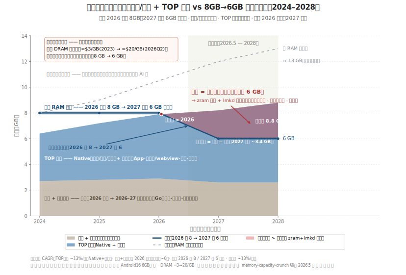
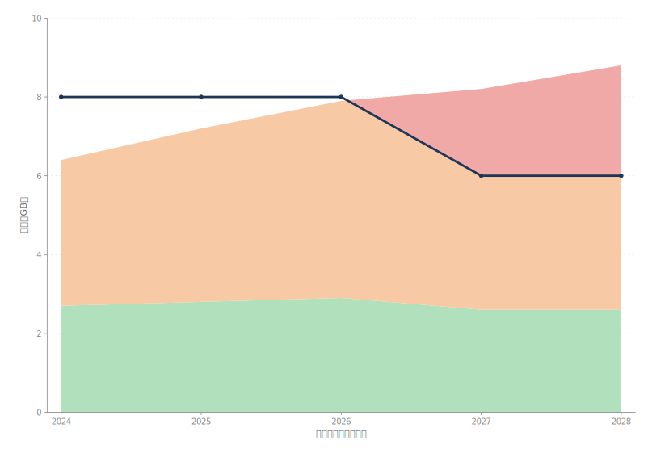

# Low-End Phone Memory: Holding 8 GB in 2026, Falling Back to 6 GB in 2027 — Where the Gap Tears Open Earlier Than on Flagships

> This is the **low-end companion** to the [flagship study](memory-capacity-crunch-EN.md), seen from a more price-sensitive vantage point that hits the wall sooner. Bottom line first: a low-end phone's memory workload has just two parts — an **incompressible "kernel + system-services" floor**, and **"TOP apps"** that can be compressed or killed (native camera/gallery/video + third-party super-apps/browser/social/games). On-device LLMs are essentially absent here. The three-way conflict is sharper than on flagships: demand still grows; the cheap fix — "buy more DRAM" — is priced out, so capacity does not freeze, it **falls back** (8 GB → 6 GB); and the only remaining lever, software governance (compress + kill), must bridge a larger gap with *less* headroom than a flagship has. The forecast takes a side; the open questions say what would prove it wrong.

## 1. Scope and method

**Domain.** The baseline is the **median low-end / entry Android phone** of 2024–2028 (roughly the 6–8 GB tier, entry to lower-mid price band). It runs the *same* apps as a flagship — the same super-apps, the same camera/short-video, the same social feeds — but essentially **does not run a resident on-device LLM**. That is the key difference from the flagship study: the orange "on-device AI" increment there is removed here.

**Observation window: 2024 to mid-2026.** Two things define it. First, entry-tier RAM expectations had already reached 8 GB before the price spike: average new-Android RAM went ~6 GB (2023) → ~8 GB (2025), and Android 16 lifted the full-Android floor to 6 GB, retiring 4 GB. Second, the headline: **mobile DRAM went from cheap to scarce** — contract prices rose ~58–63% QoQ in Q1 2026 and nearly doubled again into Q2 to ~$20/GB, with long-term agreements (LTAs) signed as high as $21/GB. Low-end is the **most price-sensitive** tier in the lineup, so it takes the hit most directly.

**Projection window: mid-2026 to 2028.** About two product cycles — enough to see whether capacity falls back from 8 GB to 6 GB and pins there, and whether OEMs hold the line via "system slimming."

**On the numbers.** Capacity and working-set median lines are **low-end-perspective engineering estimates (to be verified)**, anchored to the hard data verified in §9 of the flagship study (Android 16's 6 GB floor, DRAM ≈$3/GB→≈$20/GB, OEMs "downgrading specs"). A per-app working-set census is out of scope.

**What this is not.** Not a buyer's guide, not a benchmark. It takes a position: the binding limit for low-end phones in 2026–2028 is that **a rolled-back 6 GB cannot hold ordinary apps that keep growing**. Governance buys *less* time here, because the usable pool is smaller and the pressure valves fewer.

## 2. The conflict at a glance

*Figure 1. The low-end squeeze. X-axis: year (median low-end). Y-axis: GB. Demand is stacked bottom-up in two layers: the lighter **kernel + system-services floor**, and the **TOP apps** above it (native camera/gallery/video + third-party super-apps/browser/social/games, merged into one layer). The solid dark line is **capacity** — note it holds 8 GB through 2026, then is forced back to 6 GB in 2027 and pinned. The sum of the two layers is total demand; the part above the capacity line is the **deficit (red wedge)**: the working set that does not fit and must be absorbed by reclaim (zram compression + lmkd kills). The crossover lands around 2026 — exactly when the rollback starts — and tears open in 2027. The gray dashed line is the counterfactual: had RAM stayed cheap, low-end would have climbed to ~13 GB. Right of mid-2026 is projection. Numbers are low-end estimates (§8).*

*Figure 2. The same data as plain color blocks, for the gestalt: light green is kernel + system-services, light orange is TOP apps, the navy line is capacity (8→6 rollback), light red is the deficit. The green floor stays roughly flat (and is even shaved a bit by OEMs in 2027), the orange app layer keeps rising, but the navy capacity line drops a step in 2027 — the orange punching above navy, turned red, is the gap low-end absorbs every day.*

Together the figures say four things:

1. **Demand grows, mostly ordinary apps, with no AI subplot.** Low-end runs the same super-apps and camera/video; the TOP-app working set climbs ~13%/yr. **Even with zero on-device LLM, demand keeps rising.**
2. **Capacity does not freeze — it rolls back.** Flagships "held 12 GB instead of moving to 16"; low-end "had reached 8 GB and is forced back to 6." Demand goes up while capacity goes down — the two lines move in **opposite directions**.
3. **The system floor is held up by OEM slimming.** The floor would normally rise as Android gets heavier, but at the 8→6 moment OEMs are forced to slim it (Go-style trims, fewer preloads, lighter skins) and push it back down — a move flagships don't need to make.
4. **The gap is earlier, steeper, with less governance headroom.** The crossover is ~2026 (six months to a year earlier than flagships) and tears open as capacity drops to 6 GB in 2027. With no spare headroom, the deficit turns directly into perceptible UX degradation.

## 3. Workload characteristics (distilled)

The low-end memory workload compresses to five characteristics — the heart of this study:

- **① Two layers, no AI layer.** The workload is just two blocks: a resident, near-unreclaimable **kernel + system-services floor**, and **TOP apps** that can be compressed or killed. The flagship's on-device-LLM increment is absent — the biggest structural difference, but it does *not* make low-end easier (see next).
- **② High floor share, low usable ratio.** On 6–8 GB, the ~2.6–2.9 GB system floor already eats ⅓–½; after the 2027 fall to 6 GB, the budget left for **all** apps is only ~3.4 GB. Low-end doesn't have a *smaller* workload — it has a **higher floor and a lower ceiling**, so the effective usable ratio is far below a flagship's.
- **③ Apps keep growing, native dominates.** Camera/gallery/video native buffers rise with sensor resolution and bitrate; third-party super-apps/webview keep bloating. Developers rarely slim specifically for low-end, so the *same* app's working set is not much smaller here than on a flagship.
- **④ Capacity moves backward — falls, not rises.** Demand slopes up while capacity slopes down (8→6). Because they move in opposite directions, the crossover arrives **earlier and the gap is steeper** than on a flagship whose capacity merely went flat — the rollback itself is the cut that opens the gap.
- **⑤ The only valves left are "kill" and "compress," at a direct cost.** No flash swap on mobile, an incompressible floor, and an already-small usable pool mean the gap can only be pushed onto zram (compressing harder) and lmkd (killing earlier and more aggressively). On low-end this shows up directly as slow warm-starts, reload-on-return, and dropped frames — not the cushioned headroom a flagship still has.

In one line: **the low-end memory workload is not simpler than a flagship's — it just drops the AI layer while adding three disadvantages: a high floor share, a capacity that is retreating, and no safety cushion.**

## 4. Challenges (by layer)

| Trend | Industry | Technology | System governance | Architecture / form factor |
|---|---|---|---|---|
| **Growth (apps)** | The same super-apps/camera run on low-end, but BOM is more price-sensitive; Android 16 retires 4 GB, lifting the entry floor to 6 GB. | Camera/video native buffers and webview/super-app bloat outpace any single compressor's reclaim. | Headroom is already thin, so reclaim runs more often and background is killed sooner — warm-start and multitasking degrade first. | Sensors/codecs trickle down and stake out dedicated buffers, raising the resident floor on thermally/bandwidth-tighter silicon. |
| **Rollback (capacity)** | Under DRAM inflation, low-end "downgrades" first: 8 GB back to 6 GB, cutting memory to hold the price point. | Per-package density grows slowly and can't keep up; low-end can't afford pricier LPDDR to compensate. | No new DRAM arrives, so the OS does the same work in a smaller pool — every GB is earned by reclaim. | Bit supply is crowded out by HBM; low-end gets the diverted, lower-spec capacity. |
| **Slimming (floor)** | OEMs treat "save memory / lightweight OS" as a *survival* move for low-end, not a feature upgrade. | Resident system-services redundancy needs scene-grained swap-in/out; the mainline lacks a mature mechanism. | Floor slimming has a floor of its own — cut too far and you break features/compatibility; the room shrinks each year. | Go-style/lightweight skins fragment across many low-end models, raising maintenance cost. |
| **Saturation (governance)** | "AI-ready memory" marketing collides with reality; low-end falls further behind flagships on usable RAM. | zram lossless compression has diminishing returns; low-end SoC compression throughput is limited — harder compression costs power and latency. | lmkd kills more aggressively under sustained pressure; PSI tuning helps triggering but cannot create capacity. | No flash swap, so the only valves — compress or kill — both live in a smaller on-die DRAM. |

## 5. Response directions

- **Growth → memory tiering:** demote cold pages across DRAM → compressed (zram) → flash-backed tiers so the hot resident set fits a fixed budget. Low-end depends on this most, but must respect its SoC's compression-throughput ceiling.
- **Rollback → proactive reclaim + scene-grained swap-in/out:** move from watermark-waiting to DAMON/MGLRU-aging + PSI-feedback reclaim, and swap redundant working sets in/out by scene to keep more resident in a smaller pool.
- **Slimming → system-floor engineering:** make "kernel + system-services" slimming a *sustainable* discipline — identify the service set a foreground scene actually needs and swap the rest out wholesale, rather than a one-time preload cull. This is low-end's unique lever.
- **Saturation → smarter hot/cold detection:** with no AI data (mostly anonymous/file pages), the priority is **scene-feature-driven hot/cold judgment** to cut false kills and false reclaim, packing every byte fuller — not lossy compression.

All four aim at one goal: **with DRAM neither buyable nor affordable, use the rolled-back 6 GB to its limit.**

## 6. Opinionated forecast (2027–2028)

- **By 2027, entry mainstream rolls back to 6 GB as the new normal; 4 GB survives only on Go editions.** — *Why:* DRAM stays expensive through 2027 and low-end cuts memory first to hold price; the 2026 "downgrade" has already begun. *Confidence: high.*
- **8 GB shifts from "standard" to a "premium" upsell on low-end, at a markup.** — *Why:* with the same cost increase, low-end has the highest price elasticity, so 8 GB becomes a premium tier. *Confidence: high.*
- **Low-end hits the wall 12–18 months before flagships; "background kills / reloads / dropped frames" become a complaint hotspot.** — *Why:* high floor share, low usable ratio, no cushion — the gap is visible by 2026–2027. *Confidence: high.*
- **At least one major OEM makes "lightweight OS / memory saving" an explicit selling point for its low-end line.** — *Why:* capacity can't be bought, so governance and slimming are the only no-hardware-cost lever and will be productized. *Confidence: medium.*
- **Low-end ships "memory extension / RAM Plus"-style flash offload at scale before flagships do.** — *Why:* low-end is the most starved and the most pained; swap-to-storage already exists and will be pushed and rebranded as "added capacity." *Confidence: medium.*
- **On-device LLMs stay absent on low-end, or run cloud-only / as tiny models.** — *Why:* the memory bill of a resident model + KV is simply unaffordable on low-end's usable budget. *Confidence: medium–high.*

## 7. Open questions and caveats

- **The price path is still the load-bearing assumption.** If 2027 brings a fast oversupply correction, OEMs may stop rolling back — even restore 8 GB — and the gap narrows; the forecast softens. Recheck DRAM contract prints each quarter.
- **"Median low-end" hides the entry tier.** A true 4–6 GB entry phone hits the gap earlier and harder than Figure 1; widening to the whole entry fleet pulls the timeline in further.
- **The growth slope is an estimate.** ~13%/yr is anchored to the 6→8 GB average move and qualitative bloat evidence, not a measured per-app census; if developers tighten for low-end, demand grows slower.
- **Floor slimming has a lower bound.** The 2026→2027 dip in the floor is the "still-trimmable" part; cut too far and you break features/compatibility — this line cannot fall forever.
- **AI absence is an assumption, not a verdict.** This study sets on-device LLMs as absent per low-end reality; once ultra-cheap small models + system-level reuse mature, an AI increment mixes into the orange app layer and the crossover pulls further left. See the [Agent-era memory workload](agent-era-memory-workload-EN.md) companion.

## 8. References

The low-end study shares one set of hard data with the [flagship study](memory-capacity-crunch-EN.md) (full list of 17 in §8 there). Below are the sources most directly tied to the low-end figures; capacity and working-set median lines are low-end-perspective estimates.

1. GSMArena (2025). *Here are Google's new minimum RAM and storage requirements for Android phones*. [link](https://www.gsmarena.com/here_are_googles_new_minimum_ram_and_storage_requirements_for_android_phones-news-67387.php) — Android 16 lifts the full-Android floor to 6 GB, retiring 4 GB. `[now]`
2. Android Authority (2025). *How much RAM does your phone need in 2025?* [link](https://www.androidauthority.com/how-much-ram-do-i-need-phone-3086661/) — average new-Android RAM 6 GB (2023) → 8 GB (2025). `[now]`
3. TrendForce (2025). *Memory Price Surge to Persist in 1Q26; Smartphone and Notebook Brands Begin Raising Prices and Downgrading Specs*. [link](https://www.trendforce.com/presscenter/news/20251211-12831.html) — OEMs raising prices and **downgrading memory specs** (the direct basis for low-end "downgrades"). `[now]`
4. wccftech (2026). *Mobile DRAM Prices Expected To Increase By ~100% QoQ … as high as $21/GB*. [link](https://wccftech.com/mobile-dram-prices-expected-to-increase-by-100-quarter-over-quarter-as-long-term-agreements-now-getting-signed-at-prices-as-high-as-21-gb/) — LPDDR5 ~$19.3–19.8/GB in Q2 2026; LTA up to $21/GB. `[now]`
5. Android Developers. *Memory allocation among processes*. [link](https://developer.android.com/topic/performance/memory-management) — LMKD/PFRA/zram; phones swap to zram, not flash (basis for "only compress and kill"). `[now]`
6. Gizmochina (2025). *How Much RAM Do You Really Need in a Smartphone in 2026?* [link](https://www.gizmochina.com/2025/12/19/how-much-ram-do-you-really-need-in-a-smartphone-in-2026/) — 2026 RAM tiering; usable-RAM gap between mid/low-end and flagship. `[now]`
7. IDC (2026). *Global Memory Shortage Crisis …*. [link](https://www.idc.com/resource-center/blog/global-memory-shortage-crisis-market-analysis-and-the-potential-impact-on-the-smartphone-and-pc-markets-in-2026/) — 2026 DRAM supply growth ~16% YoY, below the historical norm. `[projection]`
8. This project — [flagship study memory-capacity-crunch-EN](memory-capacity-crunch-EN.md) (shared hard data, full references, governance architecture), [Agent-era memory workload](agent-era-memory-workload-EN.md) (AI counter-view). `[background]`
