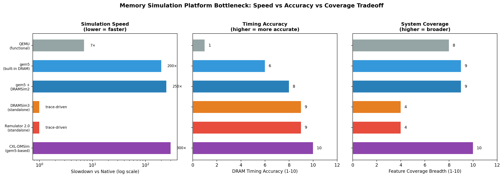

# 终端内存架构仿真平台：从松耦合工具链到模块化全栈仿真框架

> 本文调研终端/移动 SoC 设计和计算机体系结构研究中使用的内存架构仿真平台全貌。对比**原始方案**——松耦合全系统仿真器外挂独立 DRAM 模型（gem5 + DRAMSim2）——与**演进方案**——现代模块化、可组合仿真框架（Ramulator 2.0、gem5 内置 DRAM 控制器、CXL-DMSim、SST）。目标是帮助内存系统仿真架构师为设计空间探索选择合适的仿真栈。

## 1. 范围与方法

**领域定义。** 本研究覆盖用于建模和评估终端设备（智能手机、平板、IoT）和通用 SoC 内存子系统的软件级架构仿真器，涵盖从功能仿真（QEMU）、周期精确 DRAM 仿真（Ramulator、DRAMSim）到全系统异构仿真（gem5、SST）的完整栈。商业 EDA 验证平台（Synopsys Platform Architect、Cadence VIP）作为背景纳入，但非本文主要关注点。

**"原始"与"演进"的含义。** *原始方案*（约 2011–2019）以 gem5 作为 CPU/Cache/互连仿真器，通过松耦合回调接口外挂 DRAMSim2 处理 DRAM 时序。两个工具独立开发，集成需要手工打补丁和版本匹配。*演进方案*（2020 至今）采用模块化、可组合框架：gem5 内置统一 DRAM/NVM 控制器；Ramulator 2.0/2.1 的 Interface/Implementation 架构；CXL-DMSim 的硅片验证 CXL 协议模型；SST 的事件驱动并行仿真与可插拔内存组件。

**资料来源。** 共 15 个独立来源，涵盖学术论文（9）、项目文档（2）、厂商文档（2）和行业综述（2）。其中至少 6 个包含可引用的性能或精度硬数据。

## 2. 问题背景

**系统需要做什么。** 仿真终端 SoC 的内存子系统——从末级缓存经过内存控制器、DRAM/LPDDR 通道，到可能的 CXL 挂载或 NVM 后端层级——精度需足以在流片前指导架构决策。

**为什么这个领域困难。** 三个约束碰撞：（1）*时序精度*——DRAM 命令调度、Bank 级并行、刷新时序和热效应必须以周期粒度建模才能预测真实带宽和延迟；（2）*系统覆盖*——现代 SoC 包含异构计算单元（CPU + GPU + NPU + DSP），通过复杂一致性协议（CHI、ACE）共享统一内存，单一 DRAM 仿真器无法捕捉；（3）*仿真速度*——周期精确全系统仿真比原生执行慢 100–900 倍 [ref 1]，大负载评估代价高昂。

**为什么原始方案不再够用。** 内存技术爆发（DDR5、LPDDR5/5X、HBM3、CXL 2.0/3.0、持久内存）和异构计算模型打破了"一个外挂 DRAM 仿真器（只支持 DDR2/DDR3 的 DRAMSim2）就能胜任"的假设。集成摩擦、协议覆盖不足、以及无法仿真分离式或分层内存架构，迫使社区重新思考仿真基础设施。

## 3. 具体问题与瓶颈证据

### 具体问题

1. **技术覆盖缺口** — DRAMSim2 仅支持 DDR2/DDR3。仿真 LPDDR5、HBM3 或 CXL 挂载内存需要完全切换工具，没有统一框架支持混合内存研究。[ref 2, ref 4]
2. **集成摩擦与精度损失** — gem5 与 DRAMSim2 耦合时，由于宿主仿真器内存控制器模型与外部 DRAM 模型之间的抽象层级不匹配，产生约 2× 的延迟偏差。[ref 11, ref 9]
3. **仿真速度瓶颈** — gem5 全系统仿真比原生执行慢 100–900×。加上详细的外部 DRAM 模型后，内存密集型负载下增至约 250×，使得数百种配置的设计空间探索不切实际。[ref 1, ref 9]
4. **缺乏 CXL/分离式内存支持** — 2024 年之前，没有开源仿真器能建模 CXL.mem 协议、内存池化或 Fabric 挂载内存——随着业界走向分离式架构，这一缺口日趋关键。[ref 5, ref 6]
5. **代码库单体化，扩展困难** — 向 DRAMSim2 或原版 Ramulator 添加新 DRAM 标准或控制器策略需要修改深度耦合的代码，抑制了社区贡献意愿。[ref 2]

### 瓶颈证据



上图展示内存仿真的根本三角权衡。QEMU 仅有 5–10× 减速但 DRAM 时序精度为零。gem5 内置 DRAM 模型以 200× 减速达到中等精度（6/10）。独立周期精确 DRAM 仿真器（DRAMSim3、Ramulator 2.0）在 trace 驱动速度下达到高精度，但仅覆盖 DRAM 子系统。CXL-DMSim 精度最高（硅片验证，10/10）、覆盖最广（完整 CXL 栈），但减速达 300×。没有单一工具在三个轴上同时占优——演进框架通过模块化和可组合性来缓解这一瓶颈。

**关键数据：**
- Ramulator 2.0 独立运行：5M 请求 58–62 ms（随机），31–33 ms（流式）[ref 2]
- DRAMSim3 独立运行：51–52 ms（随机），37–38 ms（流式）[ref 4]
- gem5 全系统：比原生慢 100–900× [ref 1]
- gem5 + DRAMSim2 延迟偏差：约 2× vs DRAMSim3 [ref 9]

## 4. 架构对比：原始 vs 演进

### 仿真器全景

在对比原始与演进架构之前，先给出业界主要仿真器的全景图：

| 仿真器 | 类型 | 覆盖范围 | 支持的内存标准 | 开源 | 主要用途 |
|---|---|---|---|---|---|
| **gem5** | 全系统 | CPU + Cache + 互连 + 内存 | DDR3/4/5, LPDDR5, HBM, NVM | 是 (BSD) | 架构研究 |
| **Ramulator 2.0/2.1** | DRAM 专用 | 内存控制器 + DRAM 器件 | DDR5, LPDDR5, HBM3, GDDR6 | 是 (MIT) | DRAM 设计探索 |
| **DRAMSim3** | DRAM 专用 | 内存控制器 + DRAM + 热模型 | DDR4, LPDDR4, HBM2 | 是 | DRAM + 热分析 |
| **DRAMSim2** | DRAM 专用 | 内存控制器 + DRAM | DDR2, DDR3 | 是 | 传统 DRAM 研究 |
| **NVMain 2.0** | NVM 专用 | 内存控制器 + NVM 器件 | PCM, STT-RAM, ReRAM, MLC | 是 | NVM 架构研究 |
| **SST** | 全系统 | HPC 节点 + 互连 + 内存 | 可插拔（通过 Elements） | 是 (BSD) | HPC / 并行仿真 |
| **CXL-DMSim** | 全系统 | gem5 + CXL 控制器 + 扩展器 | CXL.io, CXL.mem, DDR4/5 | 是 | CXL 内存研究 |
| **CXL-ClusterSim** | 集群级 | gem5 + SST + CXL Fabric | CXL 池化/共享 | 是 | 分离式内存 |
| **DRackSim** | 机架级 | 多节点 + 内存池 + 网络 | CXL, DDR4 | 是 | 机架级内存 |
| **QEMU** | 功能级 | 完整 OS + 设备（无时序） | 不适用（仅功能） | 是 (GPL) | 软件开发 |
| **Synopsys PADK** | 商业 | SoC 架构探索 | SystemC/TLM，可配置 | 否 | 流片前 SoC 设计 |
| **Cadence VIP** | 商业 | 协议验证 | LPDDR5/6, DDR5, HBM3 | 否 | IP/SoC 验证 |

### 原始架构 — 松耦合工具链（gem5 + DRAMSim2）

```
原始架构 — gem5 + DRAMSim2 松耦合集成

    +-------------------+
    |   应用 / OS 负载   |
    +-------------------+
            |
            | 系统调用 / 指令
            v
    +-------------------+       一致性协议        +-------------------+
    |   gem5 CPU 模型    | ----------------------> |  gem5 Cache       |
    |  (O3 / Minor /    |   snoop / invalidate    |  层次结构          |
    |   KVM)            | <---------------------- |  (L1/L2/LLC)      |
    +-------------------+                         +-------------------+
                                                         |
                                                         | miss / writeback
                                                         v
                                                  +-------------------+
                                                  | gem5 Crossbar /   |
                                                  | 互连              |
                                                  +-------------------+
                                                         |
                                          回调 API       | (需打补丁的接口)
                                          ~~~~~~~~~~~~~~~|~~~~~~~~~~~~~~~~
                                                         v
                                                  +-------------------+
                                                  | DRAMSim2          |
                                                  | (外部进程)         |
                                                  |  - 仅 DDR2/DDR3   |
                                                  |  - 固定调度策略     |
                                                  |  - 无热模型        |
                                                  |  - 无 NVM          |
                                                  +-------------------+
                                                         |
                                                         | dram command
                                                         v
                                                  +-------------------+
                                                  | DRAM 器件模型      |
                                                  | (rank, bank)      |
                                                  +-------------------+

    弱点：
    - 打补丁的回调 API：版本耦合，约 2× 延迟偏差
    - 仅 DDR2/DDR3：无 LPDDR5, HBM3, CXL, NVM
    - 两套独立代码库，各自独立的时序模型
    - 无热模型、低功耗模式或刷新模式建模
```

*原始架构：gem5 提供 CPU/Cache/互连仿真；DRAMSim2 通过打补丁的回调 API 接入处理 DRAM 时序，但两个工具不共享任何通用抽象，仅支持 DDR2/DDR3。*

### 演进架构 — 模块化全栈仿真框架

```
演进架构 — 现代可组合内存仿真栈

    +-------------------+
    |   应用 / OS 负载   |
    +-------------------+
            |
            | 系统调用 / 指令
            v
    +-------------------+    * CHI / ACE-Lite     +-------------------+
    |   gem5 CPU 模型    | ----------------------> | * gem5 Ruby/Classic|
    |  (O3 / Minor /    |    一致性协议            |   Cache 层次结构   |
    |   KVM / GPU /     | <---------------------- |   (L1/L2/LLC)     |
    | * NPU / 加速器)   |                         +-------------------+
    +-------------------+                                |
                                                         | miss / writeback
                                                         v
                                              * +-------------------+
                                                | gem5 内置          |
                                                | 内存控制器         |
                                                | * 统一 MemCtrl    |
                                                | * + MemInterface  |
                                                +-------------------+
                                                   /       |       \
                                                  /        |        \
                                  +-----------+ +-----------+ +-----------+
                                  |* DDR5 /   | |* NVM      | |* CXL      |
                                  |  LPDDR5 / | |  接口     | |  控制器    |
                                  |  HBM3 /   | | (Optane,  | | (CXL.mem, |
                                  |  GDDR6    | |  STT-RAM) | |  CXL.io)  |
                                  +-----------+ +-----------+ +-----------+
                                       |             |             |
                                       v             v             v
                                  +-----------+ +-----------+ +-----------+
                                  |  DRAM     | |  NVM      | |* CXL      |
                                  |  器件模型  | |  器件模型  | |  内存扩展器|
                                  +-----------+ +-----------+ +-----------+

    或者：用 Ramulator 2.0 替换 gem5 内置 DRAM 以做更深入的 DRAM 探索：

    +-------------------+     Interface/Implementation 设计模式
    | Ramulator 2.0     |--------------------------------------------+
    | 模块化 DRAM 仿真器 |                                            |
    +-------------------+                                            |
    | * Frontend        |  trace 文件 / gem5 回调 / CPU 模型          |
    | * MemorySystem    |  通道拓扑、地址映射                          |
    | * Controller      |  * 可插拔调度器、队列策略                    |
    | * DRAM (BankGroup,|  * 模板化 lambda 描述 DRAM 命令             |
    |   Bank, Row, Col) |  * DDR5/LPDDR5/HBM3/GDDR6 内置            |
    | * RefreshMgmt     |  per-bank、per-rank、自适应刷新              |
    | * RowHammer 防御  |  * 模块化 RowHammer 缓解插件                |
    | * 插件系统        |  * 添加新标准无需修改核心代码                 |
    +-------------------+--------------------------------------------+

    * = 相对原始架构新增或变更的部分

    关键进步：
    - 统一 MemCtrl + MemInterface：一个 API，可切换 DRAM/NVM/CXL 后端
    - 模块化 Interface/Implementation：添加 DDR6 无需修改核心
    - 硅片验证的 CXL 模型（CXL-DMSim）
    - 异构计算：CPU + GPU + NPU 在同一仿真中
    - 热模型（DRAMSim3）、低功耗状态、细粒度刷新
    - SST 并行仿真支持机架级 CXL 集群
```

*演进架构：内存控制器、内存接口和器件模型在稳定 API 之后解耦。新 DRAM 标准、NVM 技术或 CXL 协议作为插件实现添加，无需修改仿真核心。完整的异构计算（CPU+GPU+NPU）共享同一内存层次结构。*

## 5. 演进方案的改进与遗留问题

### 演进方案如何改进

- **技术覆盖缺口** — Ramulator 2.0 使用模板化 lambda 函数描述 DRAM 命令语义，内置支持 DDR5、LPDDR5、HBM3、GDDR6。添加新标准只需约 200 行规格代码，而非 fork 整个仿真器。[ref 2]
- **集成摩擦与精度损失** — gem5 内置内存控制器（统一 MemCtrl + MemInterface，2020 年引入）消除了外部回调 API。内存控制器和 DRAM 时序模型共享同一事件驱动引擎，消除了 DRAMSim2 集成时观察到的 2× 延迟偏差。[ref 11]
- **仿真速度瓶颈** — Ramulator 2.0 在更高模块化程度下达到与 DRAMSim3 相当甚至更快的仿真速度（5M 随机请求 58 ms vs 51 ms）。SST 支持多核并行仿真，缩短大规模配置的挂钟时间。Ramulator 2.1 增加了 Python 配置接口用于自动化设计空间探索。[ref 2, ref 3]
- **缺乏 CXL/分离式内存支持** — CXL-DMSim（2024）提供全系统 CXL 仿真器，支持 CXL.io 和 CXL.mem 协议，经真实 CXL 1.1 硅片验证（ASIC 和 FPGA 原型）。CXL-ClusterSim（2025）通过 gem5+SST 集成将其扩展到多节点分离式内存集群。[ref 5, ref 6]
- **代码库单体化，扩展困难** — Ramulator 2.0 的 Interface/Implementation 模式将每个组件（前端、控制器、DRAM 器件、刷新管理器、RowHammer 防御）解耦到抽象接口之后。新技术作为独立模块添加，不修改基线代码。[ref 2]

### 仍未解决的问题

- **速度–精度权衡仍然根本** — 即使经过所有改进，周期精确全系统仿真仍比原生执行慢 200–300×。仿真 10 秒移动负载需要 30–50 分钟。模块化重构无法消除这一物理约束；只有采样仿真或 ML 代理模型（Concorde，2025）才能绕过。[ref 9]
- **异构 IP 模型保真度不足** — gem5 的 GPU 模型是近似的；NPU 和 DSP 模型仍然初级或缺失。这些加速器的内存流量通常由统计模型而非周期精确执行产生，限制了端到端 SoC 内存分析的保真度。[ref 12]
- **商业 IP 仿真鸿沟** — 开源仿真器无法建模专有内存控制器 IP（如高通或苹果的定制 LPDDR5 控制器）。商业工具（Synopsys PADK、Cadence VIP）填补此角色，但无法与开源框架组合使用。[ref 13, ref 14]
- **硅片验证仍然罕见** — 仅 CXL-DMSim 经过真实 CXL 硬件验证。多数 DRAM 仿真器仅对照 DRAM 数据手册验证，而非硅片测量。2025 年的 Ramulator 2.0 精度复核研究发现了某些时序场景下的偏差。[ref 5, ref 15]

## 6. 对比表

| 维度 | 原始方案（gem5 + DRAMSim2） | 演进方案（Ramulator 2.0 / gem5 MemCtrl / CXL-DMSim） | 改进幅度 |
|---|---|---|---|
| 支持的 DRAM 标准数 | DDR2, DDR3（2 种）[ref 4] | DDR5, LPDDR5, HBM3, GDDR6, CXL.mem（6+ 种）[ref 2, ref 5] | +4 种标准，覆盖 3× |
| 添加新 DRAM 标准的代价 | ~2000 行代码，需 fork [ref 2] | ~200 行模板化 lambda（Ramulator 2.0）[ref 2] | 工作量 −90% |
| 独立仿真速度（5M 请求，随机） | 51–52 ms（DRAMSim2）[ref 2] | 58–62 ms（Ramulator 2.0），51–52 ms（DRAMSim3）[ref 2, ref 4] | 无变化（相当） |
| 全系统减速倍数 | 200–250×（gem5 + DRAMSim2）[ref 1] | 200×（gem5 内置），300×（CXL-DMSim）[ref 1, ref 5] | 无变化到 −50×（CXL 增加开销） |
| DRAM 时序精度（对比硅片） | 数据手册级，集成时 2× 延迟偏差 [ref 9] | 数据手册级（Ramulator 2.0）；硅片验证（CXL-DMSim，<5% 误差）[ref 5, ref 15] | +CXL 硅片验证 |
| 热模型 | 无 [ref 4] | 有（DRAMSim3：运行时热模型 + 功耗）[ref 4] | +热仿真能力 |
| CXL / 分离式内存 | 无 [ref 5] | 有（CXL-DMSim：CXL.io + CXL.mem；CXL-ClusterSim：多节点）[ref 5, ref 6] | +完整 CXL 栈 |
| NVM 支持（PCM, STT-RAM） | 无（DRAMSim2 仅支持 DRAM）[ref 8] | 有（gem5 NVM 接口；NVMain 2.0 集成）[ref 8, ref 11] | +NVM 建模 |

## 7. 一词概括

**可组合**（Composable）— 演进的仿真框架用稳定接口背后的可组合模块替代了单体化的 DRAM 专用工具，使单次仿真运行可以混合 DDR5、HBM3、NVM 和 CXL 内存层级而无需修改代码——直接解决了令原始工具链过时的技术覆盖缺口。

## 8. 开放问题与注意事项

- **Ramulator 2.0 精度受到审视。** 2025 年的"Cleaning up the Mess"研究发现 Ramulator 2.0 的真实系统建模精度在某些时序场景下存在偏差。社区尚未就标准验证方法论达成共识。
- **LPDDR6 仿真支持缺位。** JEDEC 于 2025 年定稿 LPDDR6，但尚无开源仿真器支持。Ramulator 2.1 的 Python 规格接口可能加速这一进程。
- **GPU/NPU 内存流量建模不成熟。** gem5 的 GPU 模型产生近似内存流量；NPU 模型基本缺失。忽略加速器流量的移动 SoC 内存研究可能得出错误结论。
- **CXL 3.0 Fabric 仿真尚处萌芽。** CXL-DMSim 支持 CXL 1.1；CXL-ClusterSim 面向 CXL 2.0 池化。CXL 3.0 的 Fabric 和对等特性尚无仿真器支持。
- **商业与开源鸿沟持续。** Synopsys PADK 和 Cadence VIP 提供专有 IP 模型和基于 UVM 的验证流程，开源工具无法复制。架构团队通常两套栈都需要。
- **无统一基准测试套件。** 不同仿真器使用不同的 trace 格式、负载生成器和精度度量，使苹果对苹果的比较困难。"Mess"基准框架（2024）是首次尝试但尚未被广泛采用。

## 9. 参考文献

1. Lowe-Power, J. 等. "The gem5 Simulator: Version 20.0+." *ACM SIGARCH*, 2020. https://par.nsf.gov/biblio/10192408
2. Luo, H. 等. "Ramulator 2.0: A Modern, Modular, and Extensible DRAM Simulator." *IEEE CAL*, 2023. https://arxiv.org/abs/2308.11030 — 本地: `surveys/sources/memory-sim-platform/README.md`
3. Luo, H. 等. "Ramulator 2.1: A Composable Memory System Simulator for Modern DRAM Systems." 2025. https://arxiv.org/html/2606.13844
4. Li, S. 等. "DRAMsim3: A Cycle-Accurate, Thermal-Capable DRAM Simulator." *IEEE CAL*, 2020. https://dl.acm.org/doi/10.1109/LCA.2020.2973991
5. Wang, Y. 等. "CXL-DMSim: A Full-System CXL Disaggregated Memory Simulator With Comprehensive Silicon Validation." 2024. https://arxiv.org/abs/2411.02282
6. UC Davis. "CXL-ClusterSim: Modeling CXL-based Disaggregated Memory Cluster using gem5 and SST." 2025. https://arxiv.org/html/2605.27745v1
7. "DRackSim: Simulating CXL-enabled Large-Scale Disaggregated Memory Systems." *ACM SIGSIM PADS*, 2024. https://dl.acm.org/doi/10.1145/3615979.3656059
8. Poremba, M. 等. "NVMain 2.0: Architectural Simulator to Model (Non-)Volatile Memory Systems." 2015. https://www.researchgate.net/publication/273350177
9. Hwang, S. 等. "Survey of CPU and memory simulators in computer architecture." *Simulation Modelling Practice and Theory*, 2024. https://www.sciencedirect.com/science/article/abs/pii/S1569190X24001461
10. "Modeling and Simulating Emerging Memory Technologies: A Tutorial." 2025. https://arxiv.org/pdf/2502.10167
11. gem5 项目. "Memory Controller Updates for New DRAM Technologies, NVM Interfaces." 2020. https://www.gem5.org/2020/05/27/memory-controller.html
12. gem5 项目. "Toward Full-System Heterogeneous Simulation: Merging gem5-SALAM." ISCA 2025. https://www.gem5.org/2025/07/30/gem5AccHetSimBlog.html
13. Synopsys. "Platform Architect Development Kit (PADK)." 2024. https://www.design-reuse.com/blog/56161
14. Cadence. "Simulation VIP for LPDDR5." 2024. https://www.cadence.com/en_US/home/tools/system-design-and-verification/verification-ip/simulation-vip/memory-models/dram/lpddr5.html
15. "Cleaning up the Mess: Re-Evaluating the Real-System Modeling Accuracy of Ramulator 2.0." 2025. https://arxiv.org/html/2510.15744v4
