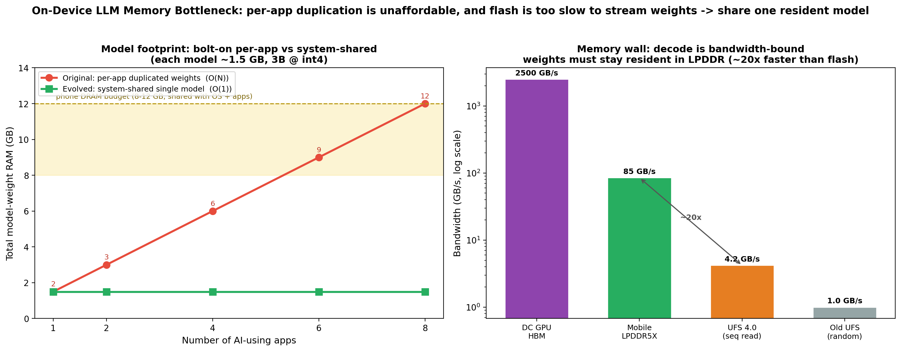
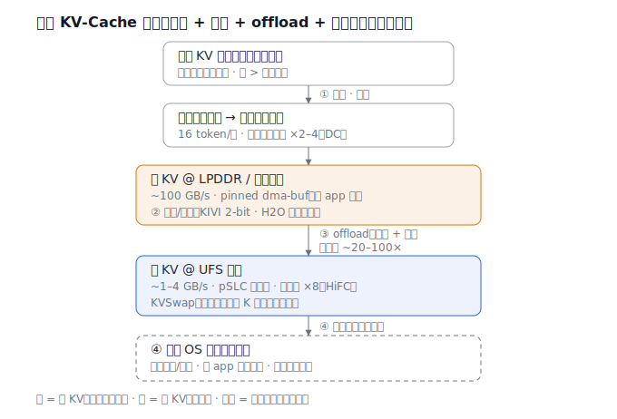
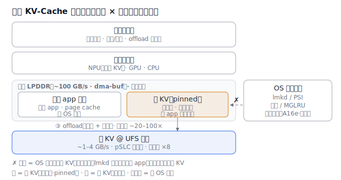

# 端侧大模型推理与内存/算力子系统：从「外挂加速器」到「系统级共享模型服务」

> 本文调研终端设备（手机 / PC）上承载 AI 的内存 / 算力子系统，从**原始方案**——外挂式端侧 ML 加速（NPU 作外挂加速器跑单 app 的小模型、权重静态 pinned、全部由推理框架内部管理、对 OS 内存治理不可见、每 app 各带一份）——向**演进方案**——系统级共享模型服务（系统级共享一份基础模型 + 统一内存 + mmap 按需加载 + KV-cache 分页/量化/offload + NPU 感知的异构调度 + OS 可见可治理）——的转变。横向对比 **Android、iOS、HarmonyOS NEXT**。本文是姊妹篇《[从应用中心 OS 到 AI 原生/智能体 OS](ai-native-os-agent-CN.md)》的「内存账」：上一篇讲"系统为什么要常驻一个模型与 Agent"，本篇量化"这要付多大内存/带宽代价、业界怎么省"。深度机制见本仓 [A16f 端侧 KV-Cache](../advanced/A16f-端侧KV-Cache管理方案.md)、[A16e 统一内存与异构 PF/LRU](../advanced/A16e-IOMMU统一内存与异构PF-LRU.md)、[异构 SoC 推理调度](../insight/N+1/heterogeneous-soc-inference-CN.md)。

## 1. 范围与方法

**领域定义。** 在 8–16 GB 共享 LPDDR 的终端 SoC 上常驻并服务一个 1–3B（乃至更大）的基础模型时，模型权重、KV-cache、激活值如何在内存层级（LPDDR / 设备内存 / 闪存）中放置、共享、回收、offload，以及推理如何在 CPU / GPU / NPU 间调度。不含云端推理，也不含训练。

**「原始」与「演进」的含义。** *原始方案*：NPU 作为外挂加速器，跑单 app 的小模型（人脸、降噪、相册分类），权重在框架内静态 pinned，整套推理在单一 IP 上完成，对 OS 内存治理（[lmkd](../foundations/A08-压力与低内存终止.md) / 回收 / [dma-buf 计量](../foundations/A09-设备内存全景.md)）不可见；每个 app 各带各的模型与框架。*演进方案*：系统提供一个常驻的**共享基础模型服务**（Android AICore、Apple Foundation Models、华为 HiAI / MindSpore Lite），全系统加载一份；权重 mmap 按需加载；KV-cache 走分页 / 量化 / offload；推理在 CPU/GPU/NPU 间做带宽感知的异构调度；模型占用对 OS 可见、并向"纳入统一内存治理"演进。

**资料来源。** 共 15 个独立来源，含厂商一手规格（Apple ML Research、Android Developers、Qualcomm Product Brief、Samsung、Micron、JEDEC LPDDR6）、系统论文（PagedAttention SOSP'23、llm.npu ASPLOS'25、HeteroInfer SOSP'25、KVSwap）与行业综述（On-Device LLMs State of the Union 2026），并交叉引用本仓 A16 系列内部调研。其中 ≥ 8 个含可引用硬数字，已下载 9 份本地副本于 `sources/on-device-llm-memory/`。**诚实优先**：高通 / 联发科 NPU 多只公布相对提升%、华为端侧盘古规格未公开，正文逐处标「待核实 / 厂商未公布 / 推算」；"把 KV 纳入 OS 统一治理"在业界尚未落地，标「设想」。

## 2. 问题背景

**系统需要做什么。** 在电池供电、整机功耗 3–8 W 的手机上常驻一个基础模型，为前台交互（reactive）提供低延迟（< 100 ms/token）响应、为后台 Agent 任务（proactive：摘要、RAG 索引、长程规划）提供高吞吐，同时**不饿死**微信 / 相机这些传统 app。

**为什么这个领域变难。** 四个约束碰撞：（1）**带宽受限**——decode 阶段每生成一个 token 都要把整套权重从 DRAM 读一遍，tokens/s ≈ 内存带宽 / 模型字节数；移动内存带宽 50–90 GB/s，比数据中心 GPU 的 2–3 TB/s 差 30–50×（[ref 5]）。（2）**容量受限**——权重 + KV-cache + OS + app 抢同一块 8–16 GB LPDDR。（3）**KV-cache 增长且异构**——随上下文线性膨胀、常驻 NPU 可访问的设备内存、pinned 不走普通 LRU（[A16f](../advanced/A16f-端侧KV-Cache管理方案.md)）。（4）**算力异构**——CPU / GPU / NPU 各有所长，却被现有引擎当互斥目标，单 IP 打不满共享总线。

**为什么原始方案不再够用。** 外挂加速器范式假设"小模型、单 app、框架自管、静态 pinned、单 IP"。LLM 把这些假设全打破：模型大到必须**系统级共享**（每 app 各带放不下）、KV 大到必须**分页 / offload**、负载并发到必须**跨 IP 调度**、占用大到 **OS 必须看得见**才能在 KV 与传统 app 间做预算分配。

## 3. 具体问题与瓶颈证据

### 具体问题

1. **每 app 各带模型，内存 O(N) 膨胀** — 3B 模型 int4 量化约 1.5 GB；若 N 个 app 各打包一份，占用 ≈ N × 1.5 GB，在 8–12 GB 手机上几个 app 就爆。[ref 1, ref 2]
2. **decode 撞带宽墙** — tokens/s ≈ 带宽 / 模型字节。7B INT4（约 3.5 GB 权重）在 LPDDR5 四通道 51.2 GB/s 下理论上限约 14 tok/s、实测约 9 tok/s，低于流畅对话所需的 15–20 tok/s。[ref 5；lpddr5x 内部调研]
3. **单 IP 打不满总线** — 骁龙 8 Gen 3 上 GPU-only 解码仅利用 68 GB/s 总线的 40–45 GB/s（59–66%）；NPU 脉动阵列固定 32×32，对自回归解码的动态小形状 GEMV 严重退化。[ref 15]
4. **KV-cache 增长且不受 OS 治理** — KV 随上下文线性膨胀、常驻 dma-buf pinned、对 lmkd 不透明，与前后台 app 在同一块 LPDDR 上零和抢占——可能"杀了前台 app 却动不了臃肿的 KV"。[A16f]
5. **闪存太慢，权重无法按需流式** — UFS 4.0 顺序读约 4.2 GB/s，而片上 LPDDR5X 约 85 GB/s，差约 20×（对随机读 / 旧 UFS 差 2–3 个数量级）；权重若每次从闪存读，decode 直接卡死，必须常驻高带宽 LPDDR。[ref 9, ref 8；A16f]

### 瓶颈证据



证据分两半，指向同一个结论。**左图（容量）**：若每个用 AI 的 app 各带一份约 1.5 GB 的 3B int4 模型，权重内存随 app 数线性增长，到第 6–8 个 app 就冲破 8–12 GB 手机的 DRAM 预算；系统级共享单副本则恒为约 1.5 GB（O(N) → O(1)）。**右图（带宽）**：你也无法靠"用时再从闪存读权重"来回避——内存层级跨约 3 个数量级（数据中心 HBM ~2500 GB/s、移动 LPDDR5X ~85 GB/s、UFS 4.0 顺序读 ~4.2 GB/s、旧 UFS 随机 ~1 GB/s），而 decode 是带宽受限的，权重必须常驻 LPDDR。两半合起来：**权重既不能每 app 复制（容量爆），又不能从闪存流式（带宽爆）→ 唯一出路是系统级共享、常驻、量化、可治理。**

**关键数据：**
- 3B int4 ≈ 1.5 GB；N=8 app 各带 ≈ 12 GB vs 共享 1.5 GB（÷8）。[ref 1, ref 2]
- 带宽层级：HBM 2–3 TB/s ≫ LPDDR5X ~85 GB/s ≫ UFS 4.0 4.2 GB/s；移动 vs DC 差 30–50×。[ref 5, ref 9]
- 量化 16-bit → 4-bit：每 token 内存流量降 4× ⇒ 吞吐约 4×。[ref 5]
- 异构调度：解码带宽利用 40–45 → ~60 GB/s（88%，+37%），吞吐 9.3 → 14.0 tok/s。[ref 15]

## 4. 架构：原始 vs 演进

两图使用**同一组组件**（app / 推理路径 / 模型权重 / KV-cache / 加速器 / 内存层级 / OS 治理）。演进图中新增或变更处以 `*` 标记。

**原始 — 外挂加速器（per-app bolt-on）**

```
   App A          App B          App C
     |              |              |
     v              v              v
  +--------+     +--------+     +--------+
  |推理框架A|     |推理框架B|     |推理框架C|   (各自一套, 各带权重)
  +--------+     +--------+     +--------+
       \             |             /
        \  各 pinned 一份权重       /
         v           v            v
  +------------------------------------+
  | 模型权重 ×N + KV-cache (DRAM)        |  <- pinned, OS 看不见(不可回收)
  +------------------------------------+
                |  全压在单一加速器
                v
        +-------------+      其余 IP 闲置
        | NPU 或 GPU   |      (CPU/GPU/NPU 未协同)
        +-------------+
                |  用时才从闪存(load)
                v
            +--------+
            | UFS 闪存 |
            +--------+

  特征: 每app各带模型 | 权重静态pinned | 框架自管,OS不可见 | 单IP,带宽利用~60%
```

*原始：每个 app 各带一套推理框架与一份权重，pinned 在 DRAM、OS 不可见；整套推理压在单一 IP，其余加速器闲置，共享总线带宽利用仅约 60%。*

**演进 — 系统级共享模型服务（system-level shared service）**

```
   App A        App B        App C
      \           |           /
       \          |          /   * 统一 API (AICore / Foundation Models / HiAI)
        v         v         v
  +------------------------------------+
  | * 系统级模型服务 (共享单副本)         |
  |   - * mmap / 按需加载权重             |
  |   - * KV 分页 / 量化 / offload        |
  +------------------------------------+
        |             |             |
   * NPU(prefill)  * GPU(decode)  * CPU(outlier)   <- * 带宽感知异构调度
        |             |             |
        v             v             v
  +------------------------------------+        +-------------------+
  | * 统一内存 / dma-buf (零拷贝 KV)     | <----> | * OS 内存治理       |
  +------------------------------------+        |  (可见/可回收, 设想) |
        |  * 冷 KV offload (预测+预取)            +-------------------+
        v
    +--------+
    | UFS 闪存 |  (* 顺序写 pSLC, 护寿命)
    +--------+

  * 新增/变更: 共享单副本 | mmap按需加载 | KV分页/量化/offload | 异构调度 | OS可治理
```

*演进：app 经统一 API 共享同一份常驻模型；权重 mmap 按需加载；KV-cache 分页 / 量化 / 冷项 offload；推理在 NPU（预填充 GEMM）/ GPU（解码 GEMV）/ CPU（离群值）间带宽感知调度；KV 落统一内存 / dma-buf，并向 OS 可见可治理演进（业界尚未落地，标设想）。*

### 三家 SoC / OS 的演进落地横向对比

| 维度 | Android | iOS | HarmonyOS NEXT |
|---|---|---|---|
| 端侧基础模型 | Gemini Nano-1 1.8B / Nano-2 3.25B（int4）[ref 1,2] | AFM ~3B（3.7→3.5 bpw；2-bit QAT）[ref 3,4] | 盘古端侧（规模未公开）[ref 12, 待核实] |
| 系统级共享 | **AICore 全系统加载一份共享** [ref 1] | 共享基座 + 多个 LoRA 按需 [ref 3] | 系统级（MindSpore Lite 内置引擎，待核实）[ref 12] |
| 统一内存 | LPDDR 共享 + dma-buf | Apple Silicon 统一内存（CPU/GPU/NE 共享）[ref 3] | HarmonyOS 6 异构算力编排（待核实）[ref 12] |
| NPU 算力 | Hexagon（8 Elite Gen5 比上代 +37%，绝对 TOPS 厂商未公布）[ref 10] | 16-core Neural Engine 35 TOPS INT8（A18 Pro）[ref 11] | Kirin NPU + HiAI DDK [ref 12] |
| KV-cache 管理 | 框架层（llama.cpp / MLC / 厂商 NPU 栈），与 OS 两张皮 [A16f] | 框架层（Core ML / MLX，KV 用 8-bit）[ref 4] | 待核实 [A16f] |
| 与 OS 内存治理协调 | 基本缺位（KV 对 lmkd 不透明）[A16f] | 不公开 | 待核实 |

> 一句话：**三家都在走「系统级共享端侧模型 + 统一内存 + 异构 NPU」**，但 KV-cache 仍普遍停在推理框架层、与 OS 内存治理两张皮——这是三家共同的未竟工程（[A16f §6](../advanced/A16f-端侧KV-Cache管理方案.md)）。

### 案例拆解 · 端侧 KV-Cache 管理：分页 + 量化 + offload + 统一治理（流程图 + 架构图）

上层 Agent 一旦常驻，KV-cache 就是端侧推理里**增长最快、最异构**的一块内存——随上下文线性增长（长程 agent 能吃数 GB，常比权重还大）、常驻 NPU 可访问的设备内存且 pinned、还和微信 / 相机抢同一块 LPDDR。方案脱胎于数据中心 PagedAttention，但端侧约束完全不同、不能照搬（[A16f](../advanced/A16f-端侧KV-Cache管理方案.md)）。

**四条路（典型方案是 ①②③ 叠加，理想终局再加 ④）：**

| 路 | 机制 | 代价 / 数字 |
|---|---|---|
| ① 分页 | PagedAttention 式块表：KV 切固定块（16 token/块），逻辑块 → 非连续物理块 | 省碎片、提并发，数据中心吞吐 ×2–4；省碎片不省总量 [ref 13] |
| ② 量化 / 淘汰（有损） | KIVI **2-bit** 量化；H2O / StreamingLLM 按**注意力稀疏**淘汰非关键 token（重击者 / 注意力汇） | 降精度 / 丢 token，可能掉质量 [A16c] |
| ③ offload 到闪存 | 冷 KV 换到 UFS；撞**带宽墙**（内存 ~100 GB/s vs 闪存 ~1–4 GB/s）必须**预测关键项 + 提前预取**；KVSwap 内存只留紧凑 K 表示做预测；HiFC 把 KV 页放 NVMe **pSLC**、顺序写、**写寿命 ×8** | 预取失准即卡顿 [ref 14] |
| ④ 纳入统一内存治理（**设想**） | 让 KV 在统一内存被冷热迁移 / 回收而非 pinned，与 app 共享内存预算 | 需 A16e 设备缺页 / 迁移底座；**业界尚未落地** [A16e] |

**为什么端侧不能照搬数据中心 PagedAttention（核心设计约束）：**

| 维度 | 数据中心（vLLM） | 端侧 |
|---|---|---|
| KV 放哪 | 独占 GPU HBM，带宽极高 | **共享 LPDDR / dma-buf，与 app 抢** |
| 谁管 | 框架软件分页器，整机伺候 | 框架 + **OS 必须协调**（不能饿死前台 app） |
| offload 后端 | NVMe，带宽充裕 | UFS，**差 2–3 个量级**，还要护闪存寿命 |
| 治理 | pinned 在 HBM 即可 | pinned 会挤可回收池、提前触发 lmkd |
| 目标 | 最大化吞吐 | **不毁传统体验前提下**塞下 KV |

**一个回环**：KV 管理在用户态把操作系统的内存管理重新发明了一遍——块表 = 页表、量化 = zram、offload = swap；端侧的新意是这一切都要在「和传统负载共存、带宽受限」的约束下重做。**最大开放工程**：KV 的冷热由注意力稀疏决定（比 LRU 精细），但今天它对 OS 的 lmkd 完全不透明——能否把「注意力冷热」透给系统、由系统在 KV 与 app 间做预算分配，仍是空白（[A16f §6](../advanced/A16f-端侧KV-Cache管理方案.md)）。

**流程图（按处理顺序）：**

```
逻辑 KV 序列（随上下文线性增长，常 > 模型权重）
      │
      ▼  ① 分页（PagedAttention 块表，16 token/块）
块表：逻辑块 → 非连续物理块（消碎片，吞吐 ×2–4 @ 数据中心）
      │
      ▼  放置到高带宽内存
热 KV @ LPDDR / 设备内存（~100 GB/s，pinned dma-buf，与 app 抢）
      │   ② 量化 / 淘汰（有损）：KIVI 2-bit · H2O 注意力稀疏
      │
      ▼  ③ offload（预测 + 预取）↓ 带宽墙 ~20–100×
冷 KV @ UFS 闪存（~1–4 GB/s，pSLC 顺序写，写寿命 ×8；KVSwap 预取）
      │
      ▼  ④ 纳入治理（设想，业界尚未落地）
纳入 OS 统一内存治理：冷热迁移 / 回收，与 app 共享内存预算
```

**架构图（数据面 × 控制面 / 两张皮）：**

```
   数据面（data plane）                          控制面（control plane）

┌─ 推理框架层 ───────────────────────────┐
│  分页块表 · 量化/淘汰 · offload 预取器    │
└──────────────┬─────────────────────────┘
               ▼
┌─ 异构计算层 ───────────────────────────┐
│  NPU（消费 KV） · GPU · CPU             │
└──────────────┬─────────────────────────┘
               ▼
┌─ 共享 LPDDR（~100 GB/s）· 零和共享 ─────┐       ┌─ OS 内存治理 ───────┐
│  [ 传统 app 内存 ]     [ 热 KV(pinned) ] │◀─✗──│  lmkd / PSI · 回收     │
│   前台app·page cache    框架管·不可回收  │ 不透明│  统一治理(A16e·设想)  │
│   （受 OS 治理）        （与 app 抢同池）│       └─────────────────────┘
└──────────────┬─────────────────────────┘
               ▼  ③ offload（预测 + 预取）· 带宽墙 ~20–100×
┌─ 冷 KV @ UFS 闪存（~1–4 GB/s · pSLC 顺序写 · 写寿命 ×8）┐
└────────────────────────────────────────────────────────┘

  ✗ = OS 治理看不见 KV（两张皮）：可能杀掉前台 app，却动不了臃肿的 KV
```

> SVG 版（独立可渲染）：流程图见 [`assets/on-device-llm-memory-kvcache-flow.svg`](assets/on-device-llm-memory-kvcache-flow.svg)，架构图见 [`assets/on-device-llm-memory-kvcache-arch.svg`](assets/on-device-llm-memory-kvcache-arch.svg)。





## 5. 演进方案为何有效，以及尚未解决什么

### 为何有效

- **每 app 各带模型 O(N) 膨胀** — 系统级共享单副本（AICore 全系统一份；Apple 共享基座 + 轻量 LoRA，adapter 仅数十 MB）把权重占用从 O(N) 降为 O(1)：N=8 时从 ~12 GB 降到 ~1.5 GB。[ref 1, ref 3]
- **decode 带宽墙** — 量化把每 token 内存流量从 16-bit 降到 4-bit（约 4× 更少流量 ⇒ 约 4× 吞吐）；权重常驻高带宽 LPDDR 而非从闪存流式。[ref 5]
- **单 IP 打不满总线** — 带宽感知异构调度让 GPU + NPU 并发，带宽利用 40–45 → ~60 GB/s（88%，+37%），解码吞吐 9.3 → 14.0 tok/s（×1.5）、预填充 42.4 → 247.9 tok/s（×5.85）；llm.npu 把预填充卸到 NPU，prefill 加速 22.4×、能耗省 30.7×。[ref 15, ref 6]
- **KV-cache 增长** — PagedAttention 式分页消除碎片、吞吐 ×2–4；KIVI 2-bit / H2O 淘汰压缩；冷 KV offload 到闪存（KVSwap 预测预取、HiFC pSLC 顺序写把写寿命提升约 8×）。[ref 13, ref 14；A16f]
- **闪存太慢** — offload 不"用时才取"，靠预测关键项 + 提前预取规避带宽墙；KV 落统一内存 / dma-buf，向 OS 可治理演进。[ref 14；A16e]

### 仍未解决

- **带宽墙是物理的** — 量化 / 调度只是缓解，移动内存带宽仍比数据中心差 30–50×，大模型 decode 在端侧本质上慢；这是硬约束，非软件可消除。[ref 5]
- **KV 与 OS 仍两张皮** — 业界（Android / iOS / HarmonyOS）目前**并未**把 KV 纳入系统内存治理，仍在推理框架层；系统看不见 KV 冷热、管不了它。"纳入统一治理"在端侧仍是设想。[A16f, A16e]
- **厂商绝对数字不透明** — 高通 / 联发科 NPU 只公布相对提升%（绝对 TOPS 第三方推算）；华为端侧盘古参数 / footprint 未公开。跨厂商同口径横评困难。[ref 10, ref 12]
- **offload 预取失准即卡顿** — 带宽墙下，一旦关键 KV 项预测错，就是直接的取数停顿；预取准确率是端侧 offload 的命门。[A16f §3.3, ref 14]
- **量化是有损的** — 2-bit / 淘汰式压缩降精度、丢 token，可能掉质量；这是用内存换质量的权衡，非免费午餐。[ref 4；A16c]

## 6. 数字对比表

| 维度 | 原始（外挂加速器） | 演进（系统级共享模型服务） | 改进 |
|---|---|---|---|
| 模型部署方式 | 每 app 各带一份（O(N)）| 系统级共享一份（O(1)）[ref 1] | O(N) → O(1) |
| N=8 app 权重内存（3B int4）| ~12 GB | ~1.5 GB [ref 1, ref 2] | −87.5% / ÷8 |
| 权重加载 | 静态全量 pinned | mmap / 按需加载 [ref 3] | 质变（静态→按需） |
| DRAM 带宽利用（解码，骁龙 8 Gen3）| 40–45 GB/s（单 IP，59–66%）| ~60 GB/s（GPU+NPU，88%）[ref 15] | +37% |
| 解码吞吐（Llama-8B，骁龙 8 Gen3）| 9.3 tok/s（GPU-only）| 14.0 tok/s（异构）[ref 15] | ×1.5 |
| 预填充吞吐（Llama-8B，骁龙 8 Gen3）| 42.4 tok/s（GPU）| 247.9 tok/s（异构）[ref 15] | ×5.85 |
| 预填充加速（llm.npu vs 基线）| 1×（基线）| 22.4×（NPU 卸载）[ref 6] | ×22.4 |
| KV-cache 管理 | 连续大块、pinned | 分页 + 量化 + offload [ref 13] | PagedAttention ×2–4 |
| OS 对模型/KV 可见性 | 不可见（框架自管）| 可见 / 向统一治理演进 [A16f] | no → 部分 yes（设想） |
| 量化精度代价（**权衡 / 倒退**）| 高精度（FP16 / INT8）| 2–4 bit 有损 [ref 4] | − 掉精度（换内存） |

> 末行诚实标注**倒退**：演进靠激进量化（2–4 bit）省内存与带宽，代价是精度与生成质量下降——这是该演进绕不开的成本。

## 7. 一词定性

**Shared（共享化）** — 子系统从"每个 app 各带一份 pinned 模型、框架自管"转为"OS 托管的单一常驻基础模型、全系统共享"；正是这一转变把 8 个 app 各带 3B int4 模型的约 12 GB 权重占用降到约 1.5 GB（÷8，[ref 1]），并让权重得以常驻高带宽 LPDDR、被统一调度与（逐步）纳入治理。该词中英文都成立：英文 `shared`，中文「共享化」。

## 8. 开放问题与告诫

- **绝对 TOPS / footprint 多为推算。** 仅 Apple A18 Pro 的 35 TOPS、Samsung UFS 4.0 的 4.2 GB/s、JEDEC LPDDR6 速率为厂商一手硬数字；高通 / 联发科 NPU、单个 Gemini Nano 变体的 RAM GB、华为盘古规格均为相对值或第三方推算，引用须标注层级。
- **KV 纳入 OS 治理仍是设想。** 本文演进图中"OS 可治理"一格在业界尚未落地（[A16f](../advanced/A16f-端侧KV-Cache管理方案.md) 立场）；这是设计探讨与可行性分析，不是现状描述。
- **数字随 SoC / 模型代际变化快。** LPDDR5X→LPDDR6、骁龙 8 Gen3→8 Elite Gen5、Gemini Nano→Gemma 端侧，带宽 / TOPS / footprint 每年刷新，本文数字应定期复核。
- **HarmonyOS 列大量待核实。** 华为端侧盘古的参数、量化、KV 策略、统一内存细节均未公开；与 Android / iOS 不可同口径对比。
- **与上层 Agent 强耦合。** 系统级共享模型 + 增长的 KV / 记忆，正是姊妹篇《[AI 原生/智能体 OS](ai-native-os-agent-CN.md)》中"常驻 Agent"的内存账；二者是同一演进的两面。
- **明年要复查的点。** 是否出现把 KV 冷热透给 OS、由系统在 KV 与 app 间做预算分配的产品级方案；LPDDR6 量产对端侧大模型容量 / 带宽的实际松绑；华为是否公开端侧盘古规格。

## 9. 参考文献

1. Android Developers. *Gemini Nano（运行于 AICore 系统服务，全系统加载一份共享）.* https://developer.android.com/ai/gemini-nano （本地副本：`sources/on-device-llm-memory/gemini-nano-aicore-shared-model.md`）
2. Gemini Team, Google DeepMind（2023）. *Gemini: A Family of Highly Capable Multimodal Models.* arXiv:2312.11805. https://arxiv.org/abs/2312.11805 （Nano-1 1.8B / Nano-2 3.25B / int4）
3. Apple Machine Learning Research（2024）. *Introducing Apple's On-Device and Server Foundation Models.* https://machinelearning.apple.com/research/introducing-apple-foundation-models （~3B、平均 3.7 bpw→3.5、LoRA 数十 MB、TTFT 0.6 ms、30 tok/s；本地副本：`sources/on-device-llm-memory/apple-on-device-foundation-model-official.md`）
4. Apple（2025）. *Apple Intelligence Foundation Language Models — Tech Report 2025.* arXiv:2507.13575. https://arxiv.org/abs/2507.13575 （2-bit QAT、KV-cache 8-bit、KV-cache sharing 减内存/prefill 37.5%）
5. Vikas Chandra & Raghuraman Krishnamoorthi（2026）. *On-Device LLMs: State of the Union.* https://v-chandra.github.io/on-device-llms/ （移动 50–90 GB/s vs DC 2–3 TB/s、decode 带宽受限、16→4bit ≈4× 吞吐；本地副本：`sources/on-device-llm-memory/on-device-llms-state-of-union-2026.md`）
6. Daliang Xu, Hao Zhang, …, Mengwei Xu, Xuanzhe Liu（2025）. *Fast On-device LLM Inference with NPUs（llm.npu）.* ASPLOS '25, DOI:10.1145/3669940.3707239；arXiv:2407.05858. https://xumengwei.github.io/files/ASPLOS25-NPU.pdf （prefill 22.4×、能耗 30.7×、e2e 至 32.8×；本地副本：`sources/on-device-llm-memory/asplos25-fast-ondevice-llm-npu.md`）
7. JEDEC（2025-07）. *JESD209-6: LPDDR6 Standard（10,667–14,400 MT/s）.* https://www.jedec.org/news/pressreleases/jedec%C2%AE-releases-new-lpddr6-standard-enhance-mobile-and-ai-memory-performance （本地副本：`sources/on-device-llm-memory/lpddr5x-lpddr6-bandwidth-specs.md`）
8. Micron. *LPDDR5X Components（10.7 Gbps/pin）.* https://www.micron.com/products/memory/lpddr-components/lpddr5x （本地副本同 ref 7）
9. Samsung Semiconductor. *Samsung Develops First UFS 4.0 Storage（顺序读 4,200 MB/s）.* https://semiconductor.samsung.com/news-events/tech-blog/samsung-develops-first-ufs-4-0-storage-solution-compliant-with-new-industry-standard/ （本地副本：`sources/on-device-llm-memory/samsung-ufs-4-0-official.md`）
10. Qualcomm. *Snapdragon 8 Elite Gen 5 — Product Brief（LPDDR5X-5300、最大 24 GB、Hexagon NPU +37%）.* https://www.qualcomm.com/content/dam/qcomm-martech/dm-assets/documents/Snapdragon-8-Elite-Gen-5-product-brief.pdf （本地副本：`sources/on-device-llm-memory/snapdragon-8-elite-gen5-official-brief.md`）
11. Notebookcheck. *Apple A18 Pro — Benchmarks and Specs（16-core Neural Engine, 35 TOPS INT8）.* https://www.notebookcheck.net/Apple-A18-Pro-Processor-Benchmarks-and-Specs.891556.0.html （本地副本：`sources/on-device-llm-memory/npu-tops-by-soc.md`）
12. MindSpore / 华为. *MindSpore Lite NPU 集成（HarmonyOS 内置轻量 AI 引擎，Kirin NPU + HiAI DDK）.* https://www.mindspore.cn/lite/docs/en/r2.0/use/npu_info.html （本地副本：`sources/on-device-llm-memory/harmonyos-ondevice-ai-engine.md`，盘古端侧规格待核实）
13. Woosuk Kwon, et al.（2023）. *Efficient Memory Management for LLM Serving with PagedAttention.* SOSP 2023；arXiv:2309.06180. https://arxiv.org/abs/2309.06180 （块表分页、吞吐 ×2–4；详见 [A16f](../advanced/A16f-端侧KV-Cache管理方案.md)）
14. *KVSwap: Disk-aware KV Cache Offloading for Long-Context On-device Inference*（2025）. arXiv:2511.11907. https://arxiv.org/abs/2511.11907 （端侧统一内存 + 受限存储下的预测预取；详见 A16f）
15. HeteroInfer（SOSP 2025）. 异构多 IP 协同调度（骁龙 8 Gen3 带宽 40–45→60 GB/s、9.3→14.0 tok/s、预填充 42.4→247.9 tok/s、NPU 32×32、在线图生成 408.4 ms）. 转引并详见本仓内部调研《[异构 SoC 端侧 AI 推理调度与带宽管理](../insight/N+1/heterogeneous-soc-inference-CN.md)》。

> 内部交叉引用：[A16f 端侧 KV-Cache 管理](../advanced/A16f-端侧KV-Cache管理方案.md)、[A16e IOMMU 统一内存与异构 PF/LRU](../advanced/A16e-IOMMU统一内存与异构PF-LRU.md)、[A16i 端侧 UFS-HBF 增强](../advanced/A16i-端侧UFS-HBF增强.md)、[LPDDR5X 带宽与能效](../insight/N+1/lpddr5x-bandwidth-efficiency-CN.md)、[A16c 异构压缩 CDSD](../advanced/A16c-异构压缩CDSD.md)。
