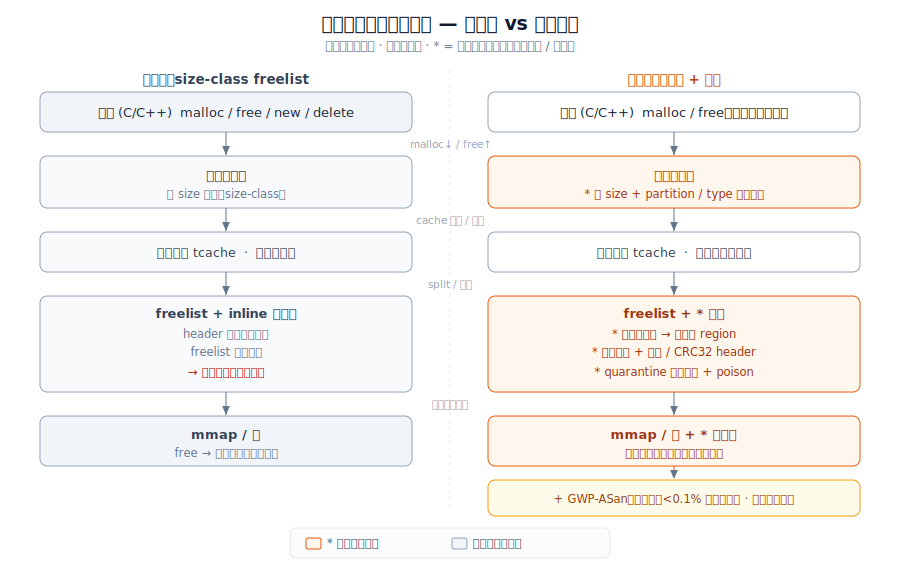
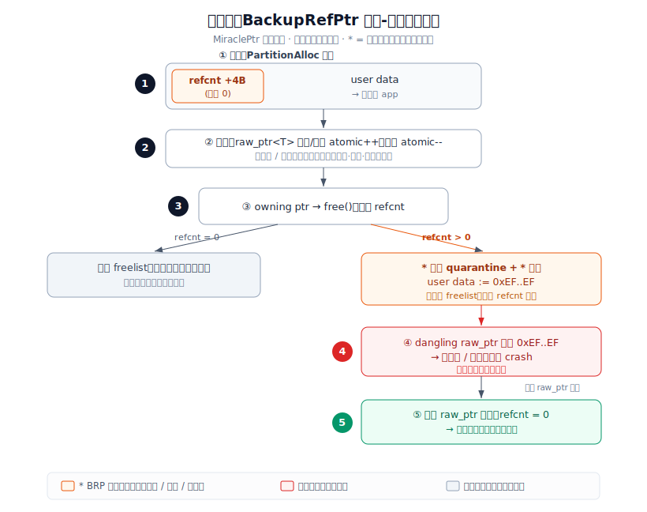

# 用户态内存分配器加固：从 size-class freelist 到「分区隔离 + 安全加固」

> 一份「演进前 vs 演进后」的对照调研，聚焦**用户态（user-space）的 `malloc`/`free` 分配器**该怎么被改造，才能在不大改应用代码的前提下削掉堆漏洞的**可利用性**。原方案是经典的 size-class + thread-cache freelist 分配器（dlmalloc / ptmalloc(glibc) / jemalloc / tcmalloc），核心是按大小分桶、用紧贴每块内存的 inline 元数据串成 freelist、线程本地缓存提速——快、省，但元数据和指针都暴露在攻击者写得到的地方。演进方案是**安全加固 + 分区化分配器**：Scudo（Android 11 起的默认 libc 分配器）、PartitionAlloc + MiraclePtr/BackupRefPtr（Chromium，跨 Windows/macOS/Linux/Android）、Windows Segment Heap，辅以 GWP-ASan 抽样探测。统一思路是把元数据搬出带内、按类型/分区隔离、加随机化 + 守护页 + freelist 完整性校验，并用 quarantine 延迟复用堵 UAF。**这套已经在出货的浏览器和移动 OS 里默认开启了，不是设想；但它消的是「可利用性」，不是「漏洞」本身——纯逻辑漏洞、type confusion 它管不了，也不替代 MTE 这类硬件能力。**

## 1. 范围与方法

**调研对象。** 这里说的「用户态内存分配器」就是 C/C++ 程序里 `malloc`/`free`/`new`/`delete` 背后那个库——它向内核要大段虚拟内存（`mmap`/`sbrk`），再切成小块发给应用。它不管内核页、不管 GC，只管「进程内的堆」。「加固」特指：在**不换语言、不改应用源码**（或只做机械化改写）的前提下，把分配器本身改造成能抵抗堆漏洞利用的样子。

**原方案。** 经典 size-class + thread-cache freelist。代表是 dlmalloc、glibc 的 ptmalloc、jemalloc（Jason Evans，FreeBSD/Meta）、tcmalloc（Google）。三件事是它们的共同骨架：(1) **按大小分桶（size class / bin）**，请求向上取整到预定义大小，减少碎片、便于 slab 式复用；(2) **inline 元数据 + freelist**，每块内存前面紧贴一个 header（size、状态、前后块指针），空闲块用这些 inline 字段串成链；(3) **线程本地缓存（tcache / thread cache）**，每个线程缓存一小批各 size-class 的对象，避开锁争用——jemalloc 文档称这能把同步事件减少 10–100×。设计目标是**吞吐和碎片**，安全不在考虑范围内。

**演进方案。** 安全加固 + 分区化分配器，四个动作叠起来：(1) **元数据外移（out-of-line metadata）**——PartitionAlloc 把元数据放进独立的、被守护页包住的 region，线性溢出腐蚀不到它；(2) **按类型/分区隔离（type/partition isolation）**——不同分区落在不同地址空间，且一段地址只复用给同一分区/同一 bucket，跨类型的 UAF 复用被切断；(3) **随机化 + 守护页 + freelist 校验**——Scudo 给 header 加 CRC32 checksum、随机化 Primary 布局，PartitionAlloc 给 freelist 指针做字节序反转 + 影子指针；(4) **quarantine 延迟复用 + 抽样探测**——Scudo/MiraclePtr 把 free 掉的内存扣留一段时间（投毒），GWP-ASan 以 <0.1% 抽样率给少量分配套守护页，在生产里捞 bug。

**资料来源。** 11 条来源，覆盖：原方案设计（jemalloc Meta 工程博客、tcmalloc Temeraire OSDI '21），演进方案规格（LLVM Scudo 文档、Chromium PartitionAlloc.md、raw_ptr.md/MiraclePtr 博客、Android Scudo 文档、Windows Segment Heap BlackHat '16、GWP-ASan ICSE '24 / LLVM 文档），权威内存安全占比（Chrome memory-safety 页、Microsoft MSRC/BlueHat '19）。下表里的硬数字 §9 都能一一对到来源；其中 4 条下载到了 [`../sources/userspace-allocator-hardening/`](../sources/userspace-allocator-hardening/)。

## 2. 问题背景

**系统要干的事是什么。** 给一个用 C/C++ 写的大型程序（浏览器、OS libc、引擎）提供 `malloc`/`free`，要**快**（每秒上百万次分配在热路径上）、要**省**（碎片别把 RSS 撑爆）、还要**别成为攻击者的跳板**。前两件经典分配器做得很好，第三件它们压根没设计。

**为什么这件事变难。** 三个约束撞一起：(1) **可利用性**——经典分配器把 size、freelist 指针这些元数据**紧贴**在用户数据旁边（inline），一个堆溢出改写相邻 header 就能劫持 freelist、把后续 `malloc` 骗到任意地址；(2) **碎片 vs 安全的张力**——加固手段（quarantine 延迟复用、守护页、分区隔离）天然要么多占内存要么放慢分配，和「省、快」直接对撞；(3) **跨线程争用**——加固不能破坏 thread-cache 那套免锁快路径，否则吞吐崩掉。

**为什么原方案不够用了。** 攻击面在涨：Chrome 自报**约 70% 的高危安全 bug 是内存安全问题，其中一半是 use-after-free**（[chromium.org memory-safety](https://www.chromium.org/Home/chromium-security/memory-safety/)，样本 912 个高危/严重 bug，2015 起）；Microsoft 在 2019 BlueHat 也给出**过去约 12 年约 70% 的 CVE 是内存安全**（[MSRC, 2019](https://www.microsoft.com/en-us/msrc/blog/2019/07/a-proactive-approach-to-more-secure-code)）。换语言（Rust）是终极答案但改不动几千万行存量 C++，于是「在分配器层面把可利用性削掉」成了**能立刻部署**的中间路线。

## 3. 具体问题与瓶颈证据

### 具体问题

1. **inline 元数据被改写即可劫持 freelist。** 经典分配器把 header（size、freelist 指针）紧贴在每块内存前面，**一个线性堆溢出**就能改写相邻块的元数据，把 freelist 指到攻击者控制的地址，下一次 `malloc` 就返回那里（[Windows Segment Heap, BlackHat '16](https://blackhat.com/docs/us-16/materials/us-16-Yason-Windows-10-Segment-Heap-Internals.pdf) 里 LFH 的 FirstAllocationOffset/BlockStride 腐蚀就是这一类）。
2. **UAF 占可利用漏洞的一半。** Chrome 统计里内存安全占高危 bug **约 70%，其中一半（约 35% 高危）是 use-after-free**（[chromium.org](https://www.chromium.org/Home/chromium-security/memory-safety/)）。经典分配器 free 完立刻把块放回 freelist，攻击者可以马上用同 size-class 的新对象**复用**那块内存，让 dangling 指针读到/写到新对象。
3. **同一 size-class 的内存被无差别复用，跨类型可控。** 经典分配器只按**大小**分桶，不按**类型**。一个 64 字节的字符串 free 掉后，下一个 64 字节的、完全不同类型的对象就可能拿到同一块内存——这正是 UAF / type confusion 利用要的「可预测复用」。
4. **生产环境里这些 bug 看不见。** ASan 能抓全，但开销 2–4×，没法常驻生产（[GWP-ASan, LLVM 文档](https://llvm.org/docs/GwpAsan.html)）。经典分配器不带任何**生产级**探测，bug 只能等崩溃报告里慢慢拼。

### 证据表

下面这张表说明「为什么用户态分配器值得为安全付代价」。每个数字 §9 有出处。

| 信号 | 数值 | 含义 | 来源 |
|---|---|---|---|
| Chrome 高危安全 bug 中内存安全占比 | **约 70%** | 样本 912 个高危/严重 bug（2015 起，Stable）。 | [chromium.org memory-safety](https://www.chromium.org/Home/chromium-security/memory-safety/) |
| 其中 use-after-free 占内存安全的比例 | **约 50%（约一半）** | 即约 35% 的高危 bug 是 UAF——问题 2/3 直指它。 | 同上 |
| Microsoft 已分配 CVE 中内存安全占比 | **约 70%（过去约 12 年）** | 另一套独立统计（BlueHat '19），口径与 Chrome 不同。 | [MSRC, 2019](https://www.microsoft.com/en-us/msrc/blog/2019/07/a-proactive-approach-to-more-secure-code) |
| MiraclePtr 预期阻止的 UAF（不可利用化） | **约 50%** | 对应问题 2：把约一半 UAF 削成不可利用。 | [MiraclePtr 博客, 2022](https://security.googleblog.com/2022/09/use-after-freedom-miracleptr.html) |
| MiraclePtr 浏览器进程内存开销（Windows / Android） | **+4.5–6.5% / +3.5–5%** | 对应问题 1/3 的代价：每次分配多挖 4 字节存 ref-count。 | 同上 |
| GWP-ASan 抽样率 / ASan 对比开销 | **<0.1% 抽样，ASan 为 2–4×** | 对应问题 4：把生产级探测做到近零开销。 | [GWP-ASan, LLVM 文档](https://llvm.org/docs/GwpAsan.html) |
| Scudo chunk header 大小 | **8 字节（含 16-bit CRC32 checksum）** | 对应问题 1：给 inline header 加完整性校验的固定成本。 | [Scudo, LLVM 文档](https://llvm.org/docs/ScudoHardenedAllocator.html) |

**怎么看这张表。** 上三行是**瓶颈论证**：Chrome 和 Microsoft 两套独立统计都把约 70% 的安全 bug 钉在内存安全上，而其中 UAF 占一半——这就是问题 1/2/3 的实证。下四行是**代价**：MiraclePtr 用 +3.5–6.5% 内存换约一半 UAF 不可利用，GWP-ASan 用 <0.1% 抽样换近零开销的生产探测，Scudo 用固定 8 字节 header 换 checksum 保护。安全不是白给的，但这个价位在浏览器/移动 OS 上已被认为划算并默认出货。

## 4. 架构：原方案 vs 演进方案

两张图用**同一套组件、同一布局**画：应用 → 分配器前端（size-class / bucket）→ freelist / 元数据 → 线程缓存 → 底层 mmap/页。演进图里**新增/改动**的部分用前导 `*` 标出。

**原方案——经典 size-class + thread-cache freelist（dlmalloc / ptmalloc / jemalloc / tcmalloc）**

```
   +-----------+   malloc(n)   +------------------+
   |   App     | ------------> |  分配器前端       |
   | (C/C++)   | <------------ |  按 size 取整到   |
   +-----------+   free(p)     |  size-class/bin   |
        ^                      +--------+----------+
        |                               | alloc / free
        | 返回的指针前面就是 header      v
        |                      +------------------+
        |                      | Thread cache     |  cache: 各 size-class
        |                      | (tcache, 免锁)    |  缓存一小批对象
        |                      +--------+----------+
        |                               | 不命中就 split / 回填
        |                               v
   +----+------------------------------------------+
   | freelist（inline 元数据）                       |
   |  [hdr|user data][hdr|user data][hdr|...]       |  <-- header 紧贴用户
   |   ^size,next 指针就埋在用户数据旁边              |      数据，溢出即可
   +----+------------------------------------------+      改写 next、劫持
        | 不够就向底层要                                    freelist
        v
   +------------------+
   |  mmap / sbrk 页   |  free 完立刻放回同 size-class
   +------------------+  freelist，可被任意类型即时复用
```

*原方案：按 size 分桶、inline 元数据串 freelist、tcache 提速。header 和 freelist 指针就埋在用户数据旁边，一个堆溢出即可改写、劫持下一次 `malloc`；free 即刻复用、不分类型——快和省，但毫无加固。*

**演进方案——安全加固 + 分区化（Scudo / PartitionAlloc + MiraclePtr / GWP-ASan）**

```
   +-----------+   malloc(n)   +------------------+
   |   App     | ------------> | * 分配器前端      |
   | (C/C++)   | <------------ |   按 size + 按    |  * partition: 不同
   +-----------+   free(p)     |   partition/type  |    类型落不同分区
        ^                      |   双重分桶         |    地址空间隔离
        |                      +--------+----------+
        | 返回指针，元数据已不在旁边     | alloc / free
        |                               v
        |                      +------------------+
        |                      | Thread cache     |  cache: 快路径保留，
        |                      | (保留免锁快路径)  |  加固不破坏吞吐
        |                      +--------+----------+
        |                               | split / 回填
        |                               v
   +----+------------------------------------------+
   | freelist + * 校验                              |
   |  [user data][user data][...]                  |  * metadata 外移到
   |  * freelist 指针: 字节序反转 + 影子指针         |    独立 region(守护页)
   |  * Scudo: 8B header + CRC32 checksum           |  * randomize 布局
   +----+------------------------------------------+
        |                               ^
        | * quarantine: free 后扣留 +    | * GWP-ASan: <0.1% 抽样
        |   poison(0xEF) 延迟复用         |   分配套守护页, 越界/UAF
        v                               |   立即 crash, 生产可常驻
   +------------------+   * guard       |
   |  mmap / 页        |   守护页包住    +--- notify (崩溃即上报)
   |  * 独立 metadata  |   分区边界
   |    region(守护页) |
   +------------------+
```

*演进方案：同一套前端/tcache/页骨架不动，叠四样东西——`*` 标的全是新增。元数据从 inline 外移到带守护页的独立 region（PartitionAlloc），freelist 指针做字节序反转 + 影子指针校验、Scudo header 加 CRC32；前端从「只按 size」变成「按 size + 按 partition/type」隔离；free 后走 quarantine 延迟复用 + poison；再加 GWP-ASan <0.1% 抽样守护页做生产探测。读者不读正文也能看出三处差异：**带内元数据→外移、无隔离→按类型分区、无 quarantine→延迟复用 + 守护页。***

下面是同一对照的 SVG 渲染版（左原方案、右演进方案，分层架构图）：



*与上方两张 ASCII 架构图同义：ASCII 便于文本编辑/diff，SVG 便于贴 PPT 或网页。橙色块为 `*` 标的演进新增结构（前端分区、元数据外移、freelist 校验、quarantine、GWP-ASan 旁路）。*

## 5. 演进为何有用 / 仍未解决

### 为何有用（与 §3 问题一一对应，同序）

1. **「inline 元数据被改写即可劫持 freelist」** → PartitionAlloc 把元数据**外移到独立 region 并用守护页包住**，"Linear overflows/underflows cannot corrupt the allocation metadata"（线性溢出腐蚀不了元数据，[PartitionAlloc.md](https://chromium.googlesource.com/chromium/src/+/main/base/allocator/partition_allocator/PartitionAlloc.md)）；对仍是 inline 的 Scudo，则给 8 字节 header 加 **CRC32 checksum**（输入 = 全局 secret + chunk 指针 + 清零 checksum 后的 header），访问时校验，改写即被发现（[Scudo, LLVM](https://llvm.org/docs/ScudoHardenedAllocator.html)）。freelist 指针再加**字节序反转 + 影子指针**，部分覆写直接 fault。
2. **「UAF 占可利用漏洞一半」** → MiraclePtr/BackupRefPtr 通过 PartitionAlloc 的 ref-count **quarantine** 被引用的释放内存并 poison（`0xEF`），让 dangling 解引用更可能 crash 而非被利用，**预期把约 50% 的 UAF 削成不可利用**（[MiraclePtr 博客, 2022](https://security.googleblog.com/2022/09/use-after-freedom-miracleptr.html)）；Scudo 的 quarantine 延迟复用同理堵即时复用。
3. **「同 size-class 跨类型即时复用」** → **partition/type 隔离**：不同分区落不同地址空间，且"PartitionAlloc will only reuse an address space region for the same partition"（一段地址只复用给同一分区，[PartitionAlloc.md](https://chromium.googlesource.com/chromium/src/+/main/base/allocator/partition_allocator/PartitionAlloc.md)），跨类型的可控复用被切断。
4. **「生产里看不见」** → **GWP-ASan** 以 **<0.1% 抽样**给少量分配套守护页 + free 即 unmap，越界/UAF 立即 crash 并上报，**近零开销**、可常驻生产（对比 ASan 的 **2–4×**，[GWP-ASan, LLVM](https://llvm.org/docs/GwpAsan.html)），已在 Chrome（Windows/macOS）和 Android（Scudo 内置）默认开启。

### 仍未解决（诚实的开放缺口）

- **有真实的 CPU/内存开销。** MiraclePtr 让浏览器进程内存涨 **+4.5–6.5%（Windows）/ +3.5–5%（Android）**，每次分配多挖 4 字节（[MiraclePtr 博客, 2022](https://security.googleblog.com/2022/09/use-after-freedom-miracleptr.html)）；Scudo 的 quarantine 越大越安全也越占内存，文档明说要在"memory usage"和"effectiveness"间权衡（[Android Scudo](https://source.android.com/docs/security/test/scudo)）。在低端机上这笔账不一定划算——Android 至今仍在**低内存设备上保留 jemalloc**、不上 Scudo（[Android Scudo](https://source.android.com/docs/security/test/scudo)）。
- **对纯逻辑漏洞和 type confusion 无效。** 这套消的是「内存安全 bug 的可利用性」。V8 里的 type confusion 用的是**合法 tag、正确分区**的内存、只是按错类型解释字节——MiraclePtr、MTE 都拦不住（[V8 blog](https://v8.dev/blog/retrofitting-temporal-memory-safety-on-c++) / [raw_ptr.md](https://chromium.googlesource.com/chromium/src/+/main/base/memory/raw_ptr.md)）。
- **不是确定性保护，也不替代 MTE/硬件。** MiraclePtr 文档自己写"dereferencing a dangling pointer remains an Undefined Behavior"——它降低**概率**，不给确定性。MTE 只有 4 bit tag，约 16 次重分配 tag 就会撞上，同样非确定性（[raw_ptr.md](https://chromium.googlesource.com/chromium/src/+/main/base/memory/raw_ptr.md)）。两者是互补、不是替代。
- **覆盖有盲区。** MiraclePtr **排除 Renderer 进程**（性能原因）、iOS、32 位，也不保护栈/V8/Oilpan/TLS 指针（[raw_ptr.md](https://chromium.googlesource.com/chromium/src/+/main/base/memory/raw_ptr.md)）。而 Renderer 恰恰是浏览器最大攻击面之一——加固在它最该在的地方暂时缺席。

## 6. 对比表

每格要么是带单位的数字、要么 yes/no、要么 `n/a（原因）`；每行有来源；「改善」列带符号。**至少一行诚实展示代价**——内存开销变大。

| 维度 | 原方案：size-class freelist | 演进方案：分区 + 加固 | 改善 | 来源 |
|---|---|---|---|---|
| 元数据位置 | inline（紧贴用户数据） | out-of-line（独立 region + 守护页）/ Scudo 仍 inline 但加 CRC32 | 定性：暴露→外移/校验 | [PartitionAlloc.md](https://chromium.googlesource.com/chromium/src/+/main/base/allocator/partition_allocator/PartitionAlloc.md); [Scudo](https://llvm.org/docs/ScudoHardenedAllocator.html) |
| freelist 指针完整性校验 | no（裸指针） | yes（字节序反转 + 影子指针 / CRC32 header） | 新能力 | [PartitionAlloc.md](https://chromium.googlesource.com/chromium/src/+/main/base/allocator/partition_allocator/PartitionAlloc.md) |
| 释放后即时复用（UAF 窗口） | yes（free 即回 freelist） | no（quarantine + poison 延迟复用） | 定性：即时→延迟 | [Scudo](https://llvm.org/docs/ScudoHardenedAllocator.html); [MiraclePtr 博客](https://security.googleblog.com/2022/09/use-after-freedom-miracleptr.html) |
| UAF 不可利用化比例 | 0%（无机制） | 约 50%（MiraclePtr 预期） | **+约 50%** | [MiraclePtr 博客, 2022](https://security.googleblog.com/2022/09/use-after-freedom-miracleptr.html) |
| 按类型/分区隔离复用 | no（只按 size 分桶） | yes（地址空间只复用给同分区） | 新能力 | [PartitionAlloc.md](https://chromium.googlesource.com/chromium/src/+/main/base/allocator/partition_allocator/PartitionAlloc.md) |
| 生产级探测开销 | n/a（无探测） / ASan 2–4× 仅测试 | GWP-ASan <0.1% 抽样、近零开销 | 新能力（生产可常驻） | [GWP-ASan, LLVM](https://llvm.org/docs/GwpAsan.html) |
| 进程内存开销（加固代价） | 基线（仅 inline header） | **+4.5–6.5%（Win）/ +3.5–5%（Android）** | **−**（已确认的代价） | [MiraclePtr 博客, 2022](https://security.googleblog.com/2022/09/use-after-freedom-miracleptr.html) |
| 低内存设备出货状态 | yes（jemalloc 至今保留） | no（低内存机不上 Scudo） | **−1**（部署回退） | [Android Scudo](https://source.android.com/docs/security/test/scudo) |

## 7. 一词定性

**Partitioned / hardened（分区化、加固）** —— 演进方案的根本变化是：分配不再只按**大小**分桶，而是把元数据搬出带内、按**分区/类型**隔离地址空间、给 freelist 加完整性校验、free 后走 quarantine 延迟复用——目标是消灭问题 3 的「同 size-class 跨类型即时复用」这条 UAF 利用通路，代价是 §6 里 MiraclePtr 实测的 **+4.5–6.5%（Windows）内存开销**（[MiraclePtr 博客, 2022](https://security.googleblog.com/2022/09/use-after-freedom-miracleptr.html)），换来约 50% 的 UAF 不可利用化。中文对应词：**分区隔离 / 安全加固**。

## 8. 开放问题与注意事项

- **两个「70%」口径不同，别混。** Chrome 的 70% 是 912 个高危/严重 bug（2015 起、Stable channel）里的内存安全占比；Microsoft 的 70% 是过去约 12 年所有已分配 CVE 的安全更新里的占比（BlueHat '19）。数值接近纯属巧合，统计对象完全不同，引用时务必标清是谁的口径。
- **MiraclePtr 的「约 50%」是初始预期，部署后实测更高。** 「约 50%」是上线前基于漏洞模式分析的估计；Google 部署后的口径是在**特权进程**里实际把 **57%** 的 UAF 削成不可利用，略超预期（[SecurityWeek 对 Google 数据的转述, 2022](https://www.securityweek.com/google-improves-chrome-protections-against-use-after-free-bug-exploitation/)）。本文表格保守取「约 50%」的设计预期值。
- **Scudo 没有公开基准。** LLVM 和 Android 文档都**不给** Scudo 的吞吐/内存开销数字，只说"more of a mitigation than a detector"、要在 quarantine 大小上权衡。「Scudo 比 jemalloc 慢/快多少」目前 n/a（未找到公开数据），低端机保留 jemalloc 这一事实是唯一的间接信号。
- **明年要复查：Renderer 加固进展。** MiraclePtr 现在排除 Renderer（最大攻击面之一）。Chrome 在推 `*ScanStack`、V8 sandbox、以及把更多进程纳入保护——明年这条排除是否还在、Renderer 是否上了别的方案（如 MTE、堆隔离），是判断这套演进成色的关键。
- **MTE 落地会改写结论。** 一旦 ARM MTE 在移动端大规模铺开，软件 quarantine 的性价比可能被硬件 tag 取代或互补。但 MTE 4-bit tag 的非确定性（约 16 次重分配撞 tag）意味着短期内它和软件加固是叠加关系，不是替代。这是最可能在 2–3 年内推翻「软件加固划算」论断的变量。
- **本地源镜像。** [`../sources/userspace-allocator-hardening/`](../sources/userspace-allocator-hardening/) 下存了 4 份 WebFetch 抽取的 Markdown（非原始 HTML，模型抽取后产物）：`scudo-llvm-doc.md`、`partitionalloc-design.md`、`miracleptr-raw-ptr.md`、`chromium-memory-safety.md`。其中 MiraclePtr 安全博客原页 WebFetch 只返回了导航壳，正文数字（4.5–6.5% 等）以原 URL 为准、已与本地 `raw_ptr.md` 的 4 字节/Renderer 排除等描述交叉印证。每条引用**以原 URL 为准**最稳。

## 9. 参考来源

1. Chromium 项目. *Memory safety*. [chromium.org/Home/chromium-security/memory-safety](https://www.chromium.org/Home/chromium-security/memory-safety/). 本地副本：[`../sources/userspace-allocator-hardening/chromium-memory-safety.md`](../sources/userspace-allocator-hardening/chromium-memory-safety.md). —— 约 70% 高危 bug 是内存安全、其中一半 UAF；样本 912 个高危/严重 bug（2015 起）。【演进动机】
2. Miller, M. / Microsoft MSRC. (2019). *A proactive approach to more secure code*（基于 2019 BlueHat IL 演讲）. [www.microsoft.com/en-us/msrc/blog/2019/07/a-proactive-approach-to-more-secure-code](https://www.microsoft.com/en-us/msrc/blog/2019/07/a-proactive-approach-to-more-secure-code). —— 过去约 12 年约 70% 的 CVE 是内存安全（独立于 Chrome 的口径）。【演进动机】
3. LLVM 项目. *Scudo Hardened Allocator*. [llvm.org/docs/ScudoHardenedAllocator.html](https://llvm.org/docs/ScudoHardenedAllocator.html). 本地副本：[`../sources/userspace-allocator-hardening/scudo-llvm-doc.md`](../sources/userspace-allocator-hardening/scudo-llvm-doc.md). —— 8 字节 header + CRC32 checksum（全局 secret + chunk 指针 + 清零 header）、quarantine、Primary 随机化、Secondary 守护页。【演进方案】
4. Android 开源项目. *Scudo*. [source.android.com/docs/security/test/scudo](https://source.android.com/docs/security/test/scudo). —— Android 11 起 Scudo 为默认 native 分配器、低内存设备仍用 jemalloc；防 heap overflow/UAF/double-free；quarantine 需在内存与效果间权衡。【演进方案 / 厂商文档】
5. Chromium 项目. *PartitionAlloc Design*. [chromium.googlesource.com/.../PartitionAlloc.md](https://chromium.googlesource.com/chromium/src/+/main/base/allocator/partition_allocator/PartitionAlloc.md). 本地副本：[`../sources/userspace-allocator-hardening/partitionalloc-design.md`](../sources/userspace-allocator-hardening/partitionalloc-design.md). —— 分区隔离、out-of-line 元数据 + 守护页、freelist 字节序反转 + 影子指针、2 MiB super page。【演进方案】
6. Chromium 项目. *raw_ptr<T> (MiraclePtr / BackupRefPtr)*. [chromium.googlesource.com/.../base/memory/raw_ptr.md](https://chromium.googlesource.com/chromium/src/+/main/base/memory/raw_ptr.md). 本地副本：[`../sources/userspace-allocator-hardening/miracleptr-raw-ptr.md`](../sources/userspace-allocator-hardening/miracleptr-raw-ptr.md). —— ref-count quarantine + 0xEF poison；每分配 +4 字节；排除 Renderer/iOS/32 位；对 type confusion 无效。【演进方案】
7. Adkins, B. 等 / Google Security Blog. (2022). *Use-after-freedom: MiraclePtr*. [security.googleblog.com/2022/09/use-after-freedom-miracleptr.html](https://security.googleblog.com/2022/09/use-after-freedom-miracleptr.html). —— 内存开销 Windows +4.5–6.5% / Android +3.5–5%；预期约 50% UAF 不可利用化。【演进方案 / 硬数字】
8. LLVM 项目. *GWP-ASan*. [llvm.org/docs/GwpAsan.html](https://llvm.org/docs/GwpAsan.html). —— <0.1% 抽样、守护页、free 即 unmap、近零开销；对比 ASan 2–4×。【演进方案 / 硬数字】
9. Yason, M. V. / IBM X-Force. (2016). *Windows 10 Segment Heap Internals*. BlackHat US '16. [blackhat.com/docs/us-16/materials/us-16-Yason-Windows-10-Segment-Heap-Internals.pdf](https://blackhat.com/docs/us-16/materials/us-16-Yason-Windows-10-Segment-Heap-Internals.pdf). —— Segment Heap/LFH 元数据编码、链表/树节点校验、守护页 + 随机化。【演进方案 / 厂商文档】
10. Evans, J. / Engineering at Meta. (2011). *Scalable memory allocation using jemalloc*. [engineering.fb.com/2011/01/03/core-infra/scalable-memory-allocation-using-jemalloc](https://engineering.fb.com/2011/01/03/core-infra/scalable-memory-allocation-using-jemalloc/). —— size-class/bin + arena + tcache 设计；tcache 把同步事件减少 10–100×。【原方案】
11. Hunter, A. 等 / Google. (2021). *Beyond malloc efficiency to fleet efficiency: a hugepage-aware memory allocator (Temeraire/tcmalloc)*. OSDI '21. [usenix.org/system/files/osdi21-hunter.pdf](https://www.usenix.org/system/files/osdi21-hunter.pdf). —— tcmalloc 设计与生产数字：RPS +7.7%、RAM −2.4%、碎片浪费 −26%。【原方案 / 硬数字】

---

## 附录 · 详细案例与方案图：BackupRefPtr（MiraclePtr）的释放-隔离生命周期

**为什么挑这个案例。** 在所有加固手段里，BackupRefPtr（BRP，即 MiraclePtr 落地用的算法）最适合做「方法级」拆解：它不换语言、不改对象内存布局，只在 PartitionAlloc 的每个分配槽里**多挖 4 字节**存一个引用计数，再靠 `raw_ptr<T>` 智能指针在构造/拷贝/析构时**原子增减**这个计数，就把「释放后立即复用」这条 use-after-free 利用通路掐断（[raw_ptr.md](https://chromium.googlesource.com/chromium/src/+/main/base/memory/raw_ptr.md)）。它现在在 Chrome 的 Windows/macOS/Linux/ChromeOS/Android **非 Renderer 进程**默认开启，部署后实测在**特权进程**里把 **57%** 的 UAF 削成不可利用（上线前预期约 50%，[SecurityWeek 转述 Google 数据, 2022](https://www.securityweek.com/google-improves-chrome-protections-against-use-after-free-bug-exploitation/)）。

**机制五步（编号对应下方方案图）：**

1. **分配** —— PartitionAlloc 在用户数据前多挖 4 字节作 ref-count（初始 0），把 user 指针返回给应用。
2. **引用** —— 每个指向它的 `raw_ptr<T>` 在构造/拷贝时 `atomic ++`，析构时 `atomic --`；解引用与取指针**零开销**，只有初始化/析构/赋值有成本（[raw_ptr.md](https://chromium.googlesource.com/chromium/src/+/main/base/memory/raw_ptr.md)）。
3. **释放** —— owning 指针调 `free()`，BRP 先看 ref-count：若为 0，正常归还 freelist；若 >0（仍有 dangling `raw_ptr`），**不归还**，把这块内存转入 quarantine 并用 `0xEF..EF` 投毒。
4. **悬垂解引用** —— 攻击者的 dangling `raw_ptr` 读到的是 `0xEF..EF` 毒区：解引用本身不一定崩，但把它当指针/长度再用一步极易崩溃——**利用失败，而非得手**。
5. **真正释放** —— 当最后一个 `raw_ptr` 析构、ref-count 归 0，内存才真正回收、可被复用。

```
方案图：BackupRefPtr 释放-隔离生命周期（编号对应正文五步）

  [1] 分配 (PartitionAlloc slot, refcnt 初始 0)
        +--------+-----------------------------+
        | refcnt |  user data (-> 返回给 app)  |   * 每分配多挖 4 字节
        | (+4B)  |                             |
        +--------+-----------------------------+
              ^              ^
  [2] 引用    |              |  raw_ptr<T> 构造/拷贝: atomic ++
        +-----------+   +-----------+              (析构: atomic --)
        | owning ptr|   | raw_ptr<T>| --refs--> 同一 slot, refcnt = 1
        +-----------+   +-----------+

  [3] 释放 -- owning ptr -> free(), 检查 refcnt:
        +------------------+        +-------------------------------+
        | refcnt == 0      |        | refcnt > 0 (仍有 dangling)    |
        | -> 归还 freelist |        | -> * quarantine + poison      |
        +------------------+        |    user data := 0xEF..EF      |
                                    |    * 不归还 freelist           |
                                    +---------------+---------------+
                                                    |
  [4] 悬垂解引用 -- dangling raw_ptr 读到 0xEF..EF  |
        +------------------------------------+      |
        | deref 不一定崩, 但当指针/长度再用  | <----+
        | -> * crash (利用失败, 非得手)      |
        +------------------------------------+
                                                    |
  [5] 真正释放 -- 最后一个 raw_ptr 析构, refcnt = 0 v
        +------------------------------------+
        | 内存真正回收 -> 可被复用           |
        +------------------------------------+

  legend: refcnt = 每分配 +4B 引用计数;  * = BRP 相对经典分配器的新增动作
          quarantine = 隔离扣留;  poison = 填 0xEF..EF
```



*上图为 SVG 渲染版，与前面的 ASCII 方案图同义：ASCII 便于在文本里编辑/diff，SVG 便于贴进 PPT 或网页。*

**怎么读这张图。** 关键差异全在 `*` 标的三处：经典分配器 `free()` 即把块放回 freelist（[3] 左路），BRP 在还有引用时改走右路——隔离 + 投毒（[3] 右路），让 [4] 的悬垂访问崩在毒区而不是落进攻击者可控的新对象。代价是 [1] 的每分配 +4 字节、以及进程级 **+4.5–6.5%（Win）/ +3.5–5%（Android）** 内存（§6）；收益是约一半（实测 57%）UAF 不可利用化。**两条已知盲区**：Renderer 进程因性能被永久排除（[raw_ptr.md](https://chromium.googlesource.com/chromium/src/+/main/base/memory/raw_ptr.md)），而它恰是浏览器最大攻击面之一；对 type confusion 这类「分区合法、只是按错类型解释字节」的漏洞，本机制不触及。
